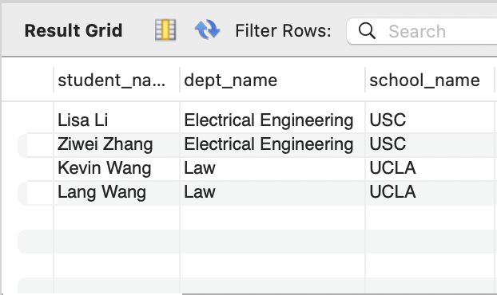
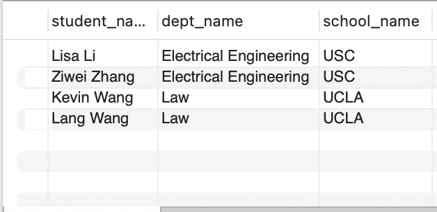
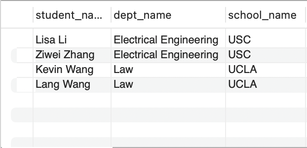
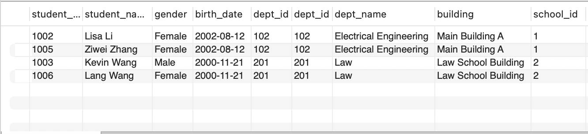
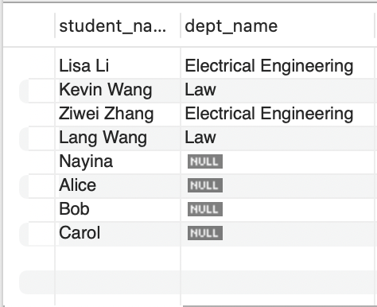
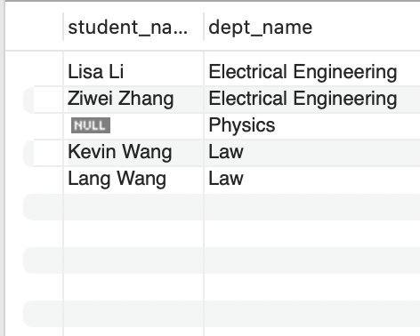
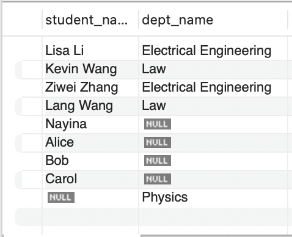

1. Manual 'JOIN'



2. Join
   

Both 1 and 2 return the same results, but the code from 2 is modern and easy to read

3. The query return 48 rows, which is the Cartesian Product of
8 students, 3 departments, 2 schools

4.
```
SELECT 
    s.student_name,
    d.dept_name,
    sc.school_name
FROM student s
JOIN department d ON s.dept_id = d.dept_id
JOIN school sc ON d.school_id = sc.school_id;
```
Gives the following result


5. Inner Join Result
```
   SELECT *
   FROM student s
   JOIN department d ON s.dept_id = d.dept_id;
```


6. Left Join
The result is selecting two columns, student_name and dept_name

This returns: all students, even if they don’t belong to any department.
If a student has no dept_id (or an invalid one), then dept_name will be NULL.

7. Right Join
The result is selecting two columns, student_name and dept_name

This returns:
All departments, even if no student is enrolled in them.
If a department has no students, then student_name will be NULL.

8. Full join
It combines:
All students (even if they don’t have a department) — from the LEFT JOIN
All departments (even if they don’t have any students) — from the RIGHT JOIN
