# Ryan Ma HW8 Answers Screenshots

# Referential integrity
## 1. No default database or selected database

- Create Student schema
```sql
drop database if exists student_management;
create database student_management;
use student_management;
```

## 2. Foreign key constraint creation fails if referenced table does not exist

- Create the student table after creating the department table.
- the right sequence should be
```sql
-- Create School Schema --
CREATE TABLE school (
                      school_id INT PRIMARY KEY,
                      school_name VARCHAR(100) NOT NULL,
                      city VARCHAR(50),
                      established_year INT
);

-- Create Department Schema --
CREATE TABLE department (
                          dept_id INT PRIMARY KEY,
                          dept_name VARCHAR(100) NOT NULL,
                          building VARCHAR(50),
                          school_id INT,
                          FOREIGN KEY (school_id) REFERENCES school(school_id)
);

-- Create Student Schema --
CREATE TABLE student (
                       student_id INT PRIMARY KEY,
                       student_name VARCHAR(100) NOT NULL,
                       gender ENUM('Male', 'Female') NOT NULL,
                       birth_date DATE,
                       dept_id INT,
                       FOREIGN KEY (dept_id) REFERENCES department(dept_id)
);
```

## 3. Data insertion into the child table fails if the referenced data in the parent table does not exist.
- Insert School. department and then student.
```sql
-- Insert data to school table --
INSERT INTO school (school_id, school_name, city, established_year)
VALUES
(1, 'QH', 'Beijing', 1901),
(2, 'BD', 'Beijing', 1901);

-- Insert data to department table --
INSERT INTO department (dept_id, dept_name, building, school_id)
VALUES 
(101, 'Computer Science', 'Information Hall', 1),
(102, 'Electrical Engineering', 'Main Building A', 1),
(201, 'Law', 'Law School Building', 2),
  (666, 'Music', 'Music Building', 2);

-- Insert Student Records --
INSERT INTO student (student_id, student_name, gender, birth_date, dept_id)
VALUES 
(1001, 'John Zhang', 'Male', '2001-05-01', 101),
(1002, 'Lisa Li', 'Female', '2002-08-12', 102),
(1003, 'Kevin Wang', 'Male', '2000-11-21', 201);
```

## 4. Insertion fails if there are duplicated values with the same primary key.
-  Use a unique, unused student ID to avoid the primary key conflict.
```sql
-- Insert data to student table --
INSERT INTO student (student_id, student_name, gender, birth_date, dept_id)
VALUES 
(1004, 'Dawen Wei', 'Male', '2001-05-01', 101),
(1005, 'Ziwei Zhang', 'Female', '2002-08-12', 102),
(1006, 'Lang Wang', 'Female', '2000-11-21', 201),
(1007, 'Tyler A.', 'Female', '2002-08-12', 666);
```

## 5. Insert statements must provide values for all columns that are defined as NOT NULL and have no default value.
```sql
INSERT INTO department VALUES (102, 'Physics', 888, 2);
```

## 6. Delete fails if the record is referenced by a foreign key in another table.


# SQL JOIN
## 1 Explain why we need join keyword
- We need the JOIN keyword to combine rows from two or more tables based on related columns, allowing meaningful data retrieval while controlling how tables are connected
- If no JOIN keyword is used, a Cartesian join is performed, combining every row from the left table with every row from the right table.

## 2. inner join
- Returns only the rows with matching values in both tables
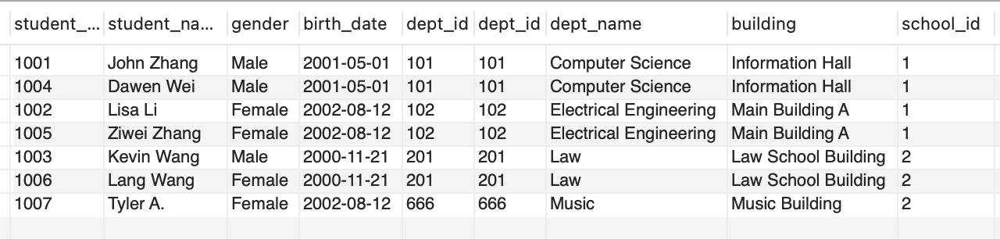

## 3. left join
- Returns all rows from the left table and the matching rows from the right table; if no match, NULLs are returned for right table columns.
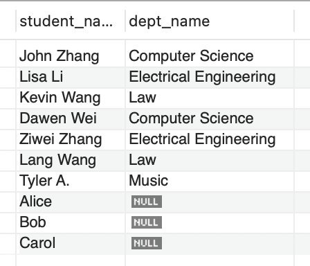

## 4. right join
- Returns all rows from the right table and the matching rows from the left table; if no match, NULLs are returned for left table columns.
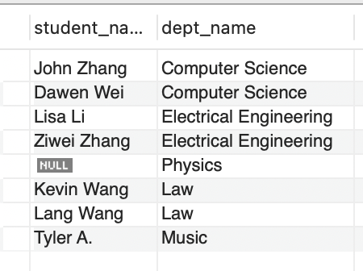

## 5. full join
- Returns all rows from both tables; if there is no match, NULLs are returned for the missing side.

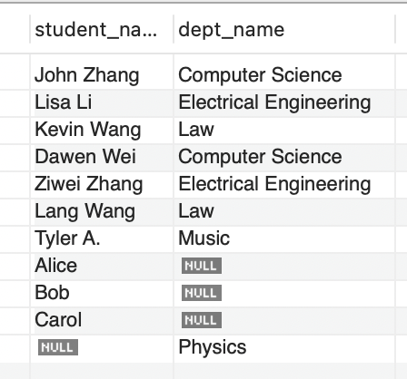


# Redbook application
## 1. clone redbook repository and import to IntelliJ (as a maven project)
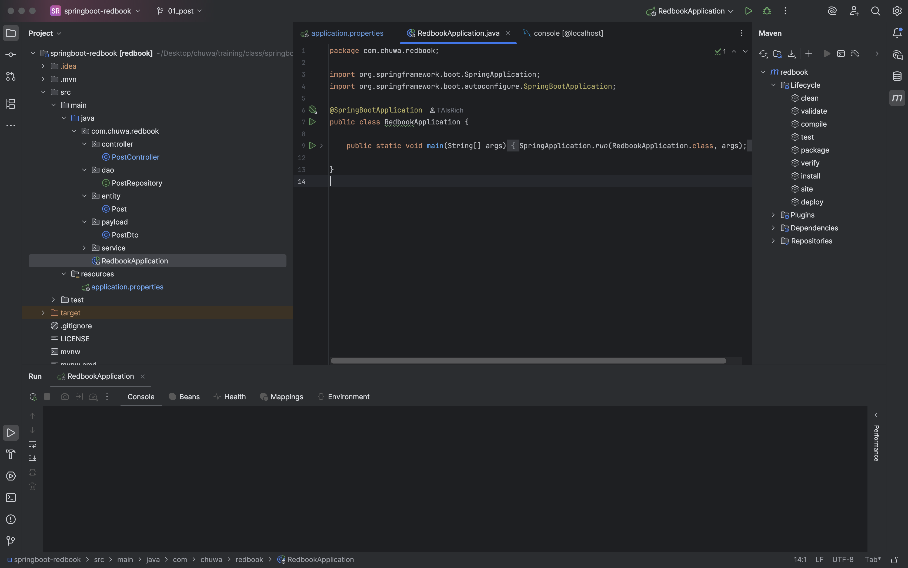

## 2. modify your application.property file.
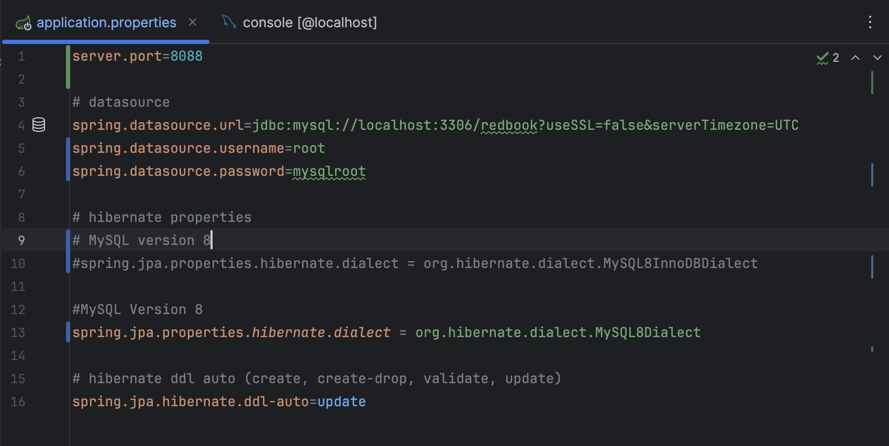

## 3. maven clean and compile.
- Maven Clean
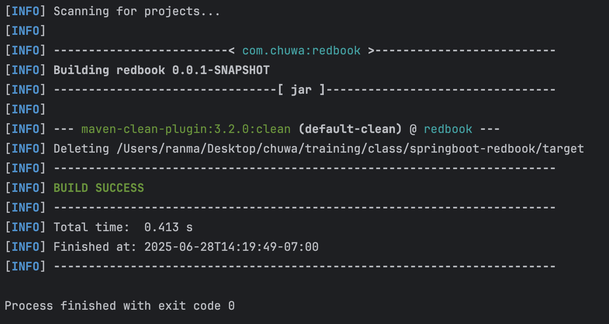
- Maven Compile
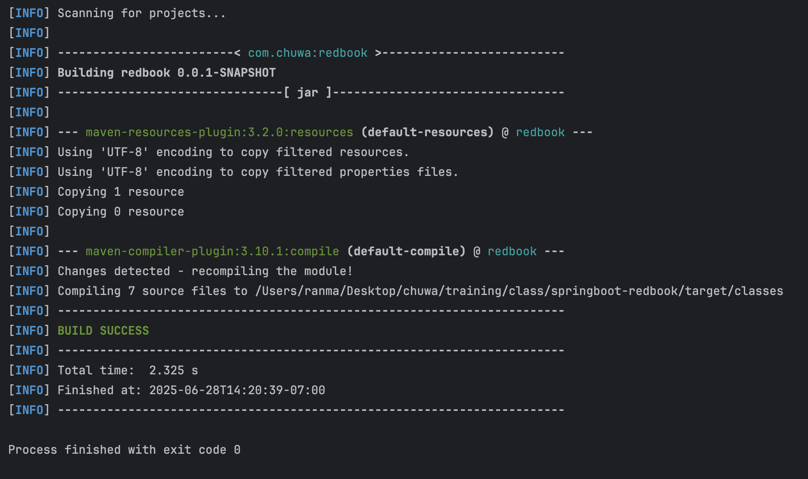

## 4. run the application.
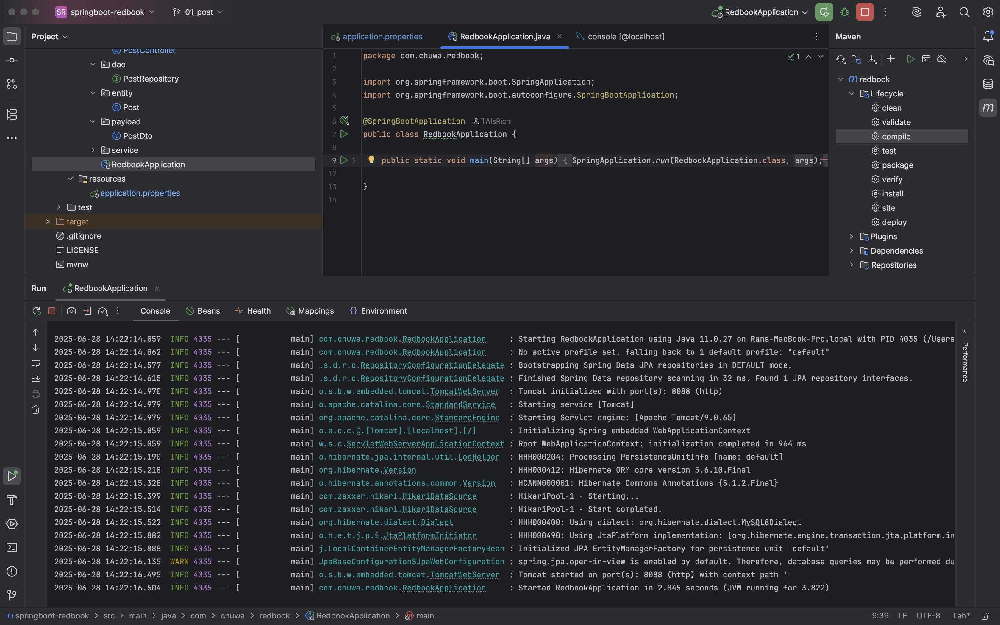

## 5. create a postman request to generate a record in database
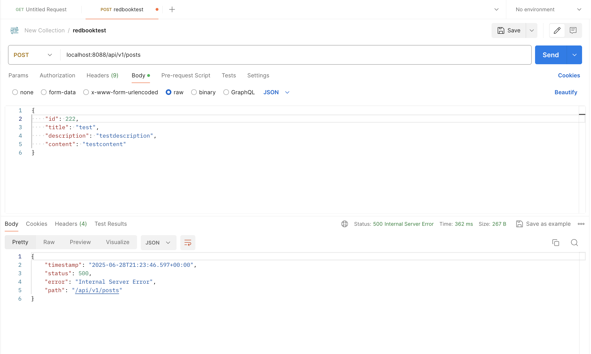
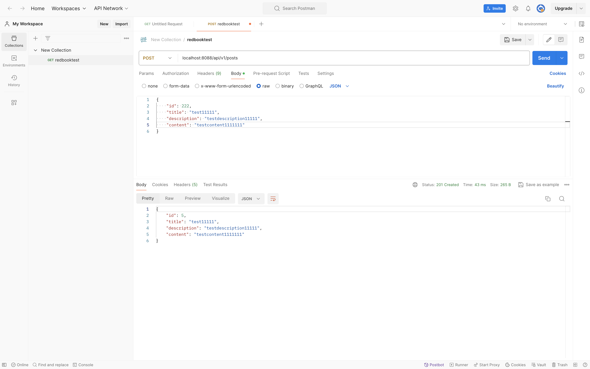
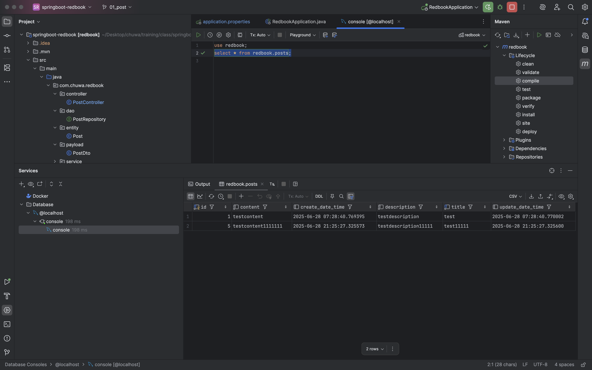

## 6. Did you create the table POSTS in the database? if not, who did it for you? Can I change this behavior? (Hint: look at the application.properties file)
- No, It was created automatically by Spring Boot JPA/Hibernate.
- Yes, I can change this behavior by editing following code
```
# hibernate ddl auto (create, create-drop, validate, update)
spring.jpa.hibernate.ddl-auto=update
```

## 7. Is your id in the database same as what you set in your request? why does this happen? (Hint: search the annotations used in your code)
- No, they are different.
- In Entity/post file:
  - @Id: mark id as the primary key of the entity
  - @GeneratedValue: JPA annotation used with @Id to indicate that the value of the primary key should be automatically generated when inserting a new entity into the database.
  - "GenerationType.IDENTITY": Uses the database’s auto-increment feature
```java
    @Id
    @GeneratedValue(strategy = GenerationType.IDENTITY)
    private Long id;
```