part1:

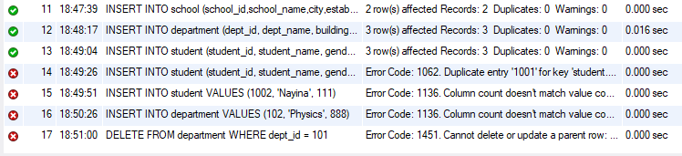

The provided sql file does not contain INSERT INTO school related sql, make the insertation in the table student and department no reference. After add

INSERT INTO school (school_id,school_name,city,established_year)
values
(1,'school1','city1',2001),
(2,'school2','city2',2002);

The first insert department and student statement could execute in order (#11-13)

The second Insert into student could not execute for all student id is 1001-1003, which is duplicated primary id(#14)

INSERT INTO department VALUES (102, 'Physics', 888);
INSERT INTO student VALUES (1002, 'Nayina', 111);

This two sql could not execute for the column count is not satisfy with the column count inside database table(15,16)

DELETE FROM department WHERE dept_id = 101;

The delete statement could not execute for there is student(1001,John Zhang) whose have department id 101 as foreign key.(17)

The join 3 table query could execute as below:

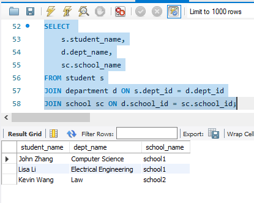

part2:

manual join

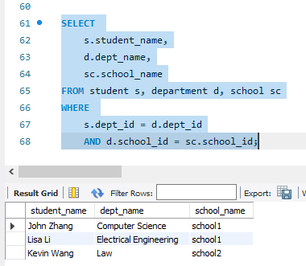

join

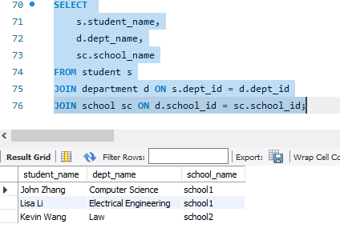


insert more student with null department

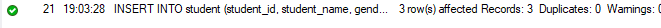

manual join:

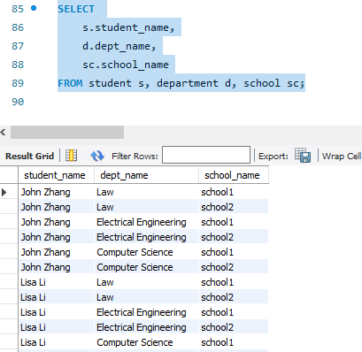

each of student have 6 records, for all possible dept_name and school exist inside db.

join


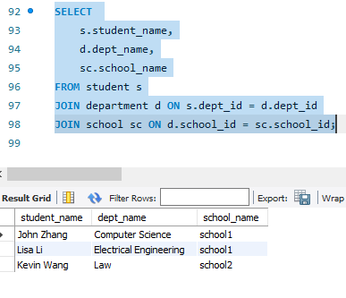

Just the initial three students and their correct record appears, the student which have no valid department not appear.

Inner join:

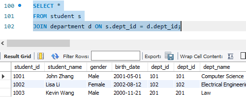

just three student with valid dept record appears.

Left Join

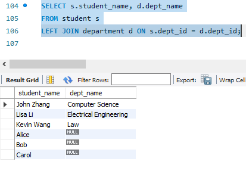

The student with and without valid dept appears in the result.

Right Join:

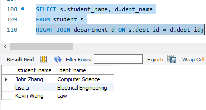

result similar to inner join, for no record which student field is NULL but dept field exist.

Full join:

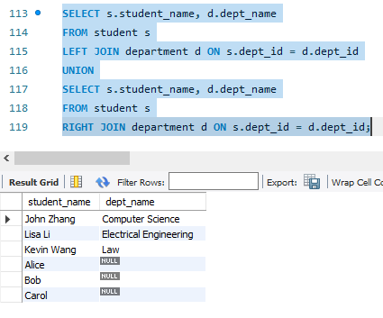

result similar to left join, for no record which student field is NULL but dept field exist.

The join keyword help us to make the join logic more clear compares to manual join. It could reduce invalid records to speed up the query. It also could help to specify join type.

Inner Join: only return rows that key of left table and right table both exist.

Left Join: return all rows from left table, no matter if the key from right table exist or null.

Right join:  return all rows from right table, no matter if the key from left table exist or null.

Full Join: Union of Left Join and Right Join, if key exist in left table or right table, the record appears in query.

part3:

HandsOn:

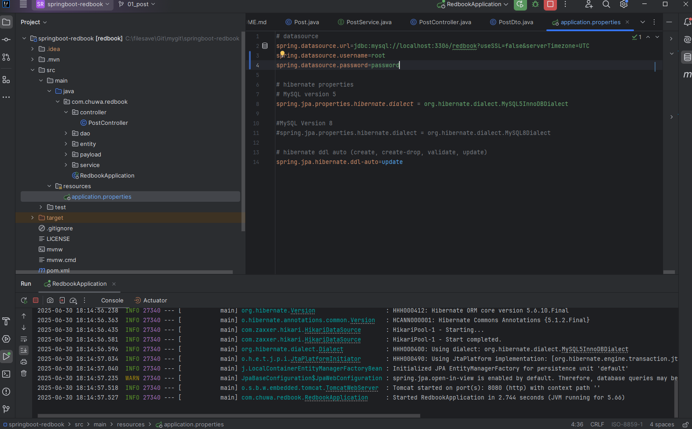

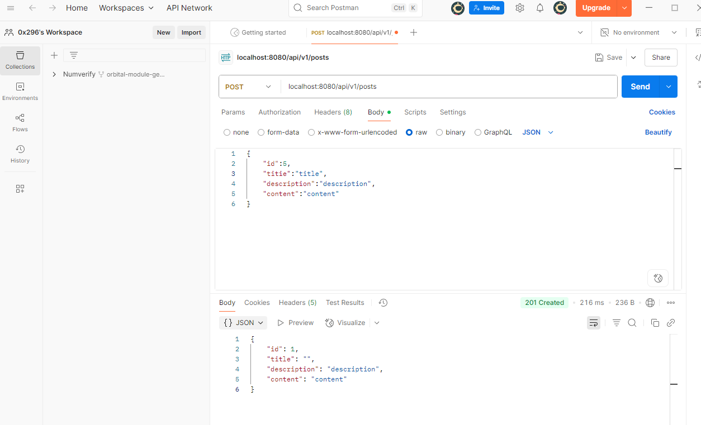

Questions:

1.Yes,The table posts is automatically created after the request. The jpa created it, using config spring.jpa.hibernate.ddl-auto=update. The behavior could change by changing this config (like set value to none)

2.The id is not same. The id in the request is 5, but in responce and database it is 1. 

This is because the id field is declared as below in Post.java

```java
@Id
@GeneratedValue(strategy = GenerationType.IDENTITY)
private Long id;
```

It make the id a identity primary key field generated by database.