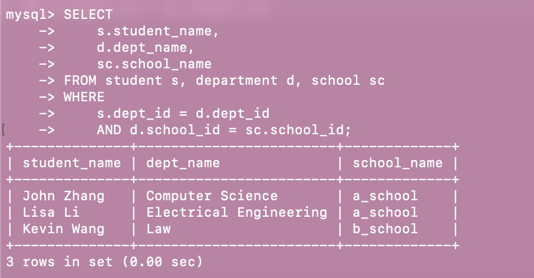
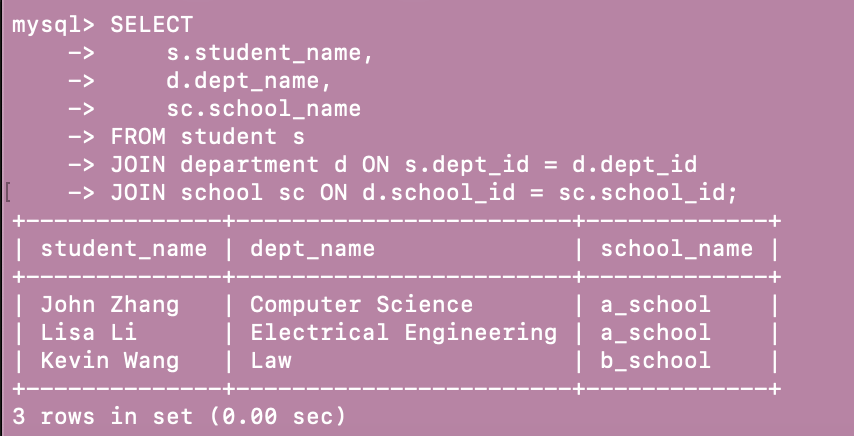
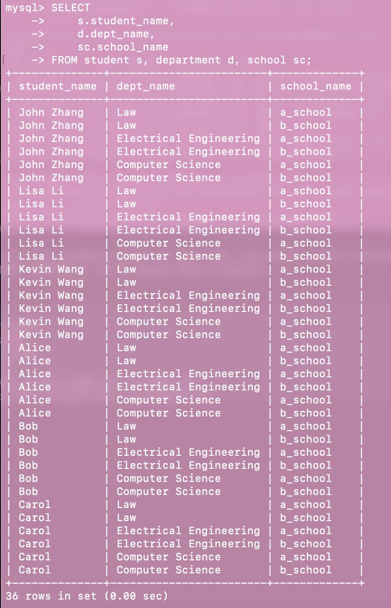
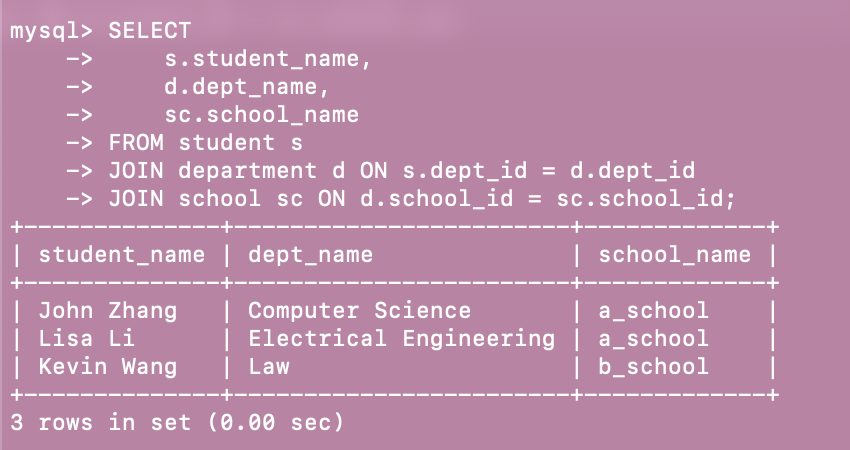
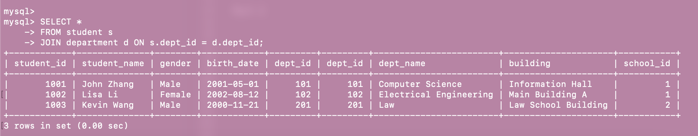
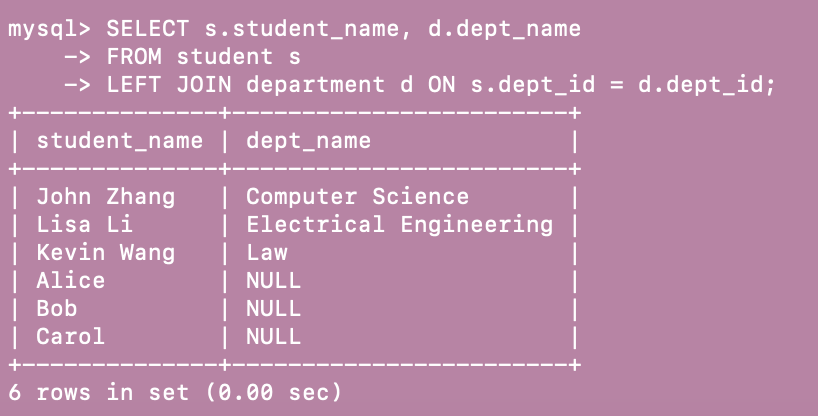
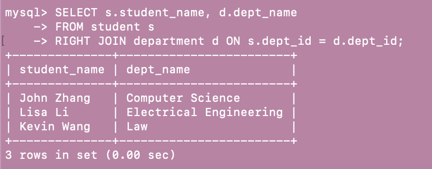
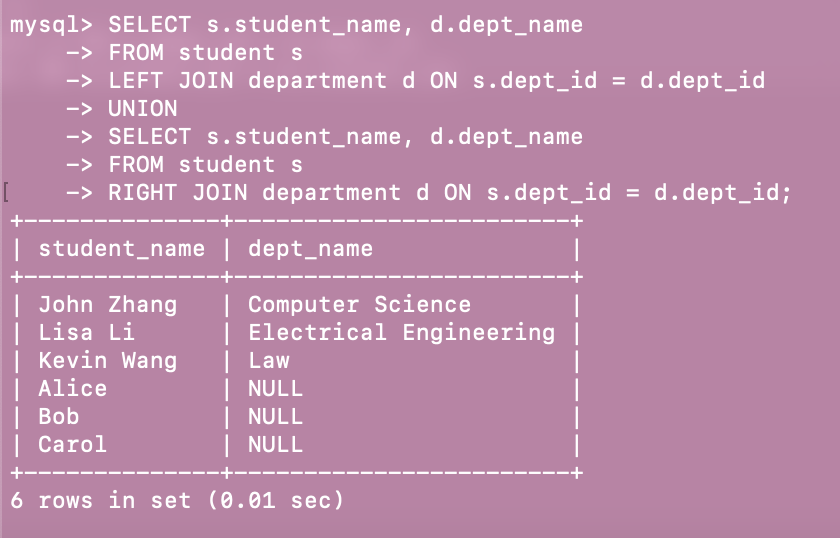
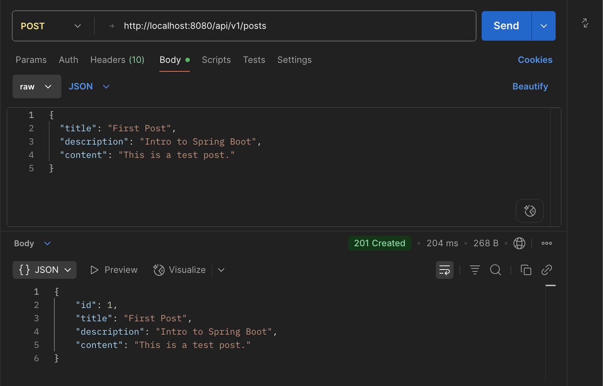

**Part 1**

Please try attached SQL queries, if the query doesn't work, explain why in your mark down file.

```
CREATE TABLE student (
    student_id INT PRIMARY KEY,
    student_name VARCHAR(100) NOT NULL,
    gender ENUM('Male', 'Female') NOT NULL,
    birth_date DATE,
    dept_id INT,
    FOREIGN KEY (dept_id) REFERENCES department(dept_id)
);
```

Error reason: In MySQL the parent table must already be present.


```
INSERT INTO student (student_id, student_name, gender, birth_date, dept_id)
VALUES 
(1001, 'John Zhang', 'Male', '2001-05-01', 101),
(1002, 'Lisa Li', 'Female', '2002-08-12', 102),
(1003, 'Kevin Wang', 'Male', '2000-11-21', 201);
```

Error reason: Because step 1 already failed, the table isn’t there, so every following INSERT into student fails.

```
CREATE TABLE school (
    school_id INT PRIMARY KEY,
    school_name VARCHAR(100) NOT NULL,
    city VARCHAR(50),
    established_year INT
);
```
Success

```
CREATE TABLE department (
    dept_id INT PRIMARY KEY,
    dept_name VARCHAR(100) NOT NULL,
    building VARCHAR(50),
    school_id INT,
    FOREIGN KEY (school_id) REFERENCES school(school_id)
);
```
Success

```
INSERT INTO student (student_id, student_name, gender, birth_date, dept_id)
VALUES 
(1001, 'Dawen Wei', 'Male', '2001-05-01', 101),
(1002, 'Ziwei Zhang', 'Female', '2002-08-12', 102),
(1003, 'Lang Wang', 'Female', '2000-11-21', 201),
(1002, 'Tyler A.', 'Female', '2002-08-12', 666);

```
Error reason: duplicate PK values, dept_id = 666 that has no match in department

```
INSERT INTO department (dept_id, dept_name, building, school_id)
VALUES 
(101, 'Computer Science', 'Information Hall', 1),
(102, 'Electrical Engineering', 'Main Building A', 1),
(201, 'Law', 'Law School Building', 2);
```
Error reason: no school created already

```
INSERT INTO department VALUES (102, 'Physics', 888);
```
Error reason: column-count mismatch

```
INSERT INTO student VALUES (1002, 'Nayina', 111);
```
Error reason: column-count mismatch

```
DELETE FROM department WHERE dept_id = 101;
```
Error reason: If any students point at dept 101, the delete fails unless you added ON DELETE CASCADE or first moved those students.

```
SELECT 
    s.student_name,
    d.dept_name,
    sc.school_name
FROM student s
JOIN department d ON s.dept_id = d.dept_id
JOIN school sc ON d.school_id = sc.school_id;
```
Success

**Part 2**

Please try attached SQL queries (with same data and schema setup as above), explain why we need join keyword, and compare inner join, left join, right join, and full join.
Write your answers with screenshots in your markdown file. 

In SQL, the JOIN keyword is used to combine rows from two or more tables based on related columns—typically foreign key relationships. While older SQL allowed you to use comma-separated table names with WHERE clauses to create joins (called "implicit joins"), using the JOIN keyword (also known as an "explicit join") is clearer, more structured, and safer.

```
SELECT 
    s.student_name,
    d.dept_name,
    sc.school_name
FROM student s, department d, school sc
WHERE 
    s.dept_id = d.dept_id
    AND d.school_id = sc.school_id;
```


```
SELECT 
    s.student_name,
    d.dept_name,
    sc.school_name
FROM student s
JOIN department d ON s.dept_id = d.dept_id
JOIN school sc ON d.school_id = sc.school_id;
```



```
SELECT 
    s.student_name,
    d.dept_name,
    sc.school_name
FROM student s, department d, school sc;
```


```
SELECT 
    s.student_name,
    d.dept_name,
    sc.school_name
FROM student s
JOIN department d ON s.dept_id = d.dept_id
JOIN school sc ON d.school_id = sc.school_id;
```


**Inner Join:** Returns only the rows that have matching values in both tables.

```
SELECT *
FROM student s
JOIN department d ON s.dept_id = d.dept_id;
```


**Left Join:** Returns all rows from the left table, and matched rows from the right table. If there's no match, NULLs are returned for columns from the right table.

```
SELECT s.student_name, d.dept_name
FROM student s
LEFT JOIN department d ON s.dept_id = d.dept_id;
```


**Right Join:** Returns all rows from the right table, and the matched rows from the left table. If there’s no match, NULLs are returned for columns from the left table.

```
SELECT s.student_name, d.dept_name
FROM student s
RIGHT JOIN department d ON s.dept_id = d.dept_id;
```


**Full Join:** Returns all rows from both tables. When there is no match, NULLs will be returned for missing side columns.

```
SELECT s.student_name, d.dept_name
FROM student s
LEFT JOIN department d ON s.dept_id = d.dept_id
UNION
SELECT s.student_name, d.dept_name
FROM student s
RIGHT JOIN department d ON s.dept_id = d.dept_id;
```


**Part 3**

Hands on:
1. clone redbook repository and import to IntelliJ (as a maven project)
2. modify your application.proerties file.
3. maven clean and compile.
4. run the application. 
5. create a postman request to generate a record in database
 
take screenshots for hands on tasks, in your markdown file and answer following questions in your markdown.




Questions:
1. Did you create the table POSTS in the database? if not, who did it for you? Can I change this behavior? (Hint: look at the application.properties file)

No, Spring Boot starts Hibernate, which inspects every @Entity class. Hibernate generates the DDL and sends it to the database at startup.

Yes, I can change this in application.properties:
```
spring.jpa.hibernate.ddl-auto=update 
```

2. Is your id in the database same as what you set in your request? why does this happen? (Hint: search the annotations used in your code)

No, because in: 
```
@Id
@GeneratedValue(strategy = GenerationType.IDENTITY)
private Long id;
```

@GeneratedValue tells Hibernate “let the database generate the value. IDENTITY means the column is an AUTO_INCREMENT. Therefore, if you include "id": 123 in the JSON, Hibernate ignores it (or even throws an error in strict mode). The DB inserts the row and returns the generated key (e.g. 1, 2, 3…), which Hibernate puts back into PostDto before it’s returned to the client.

