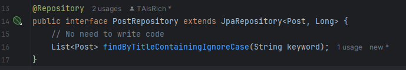
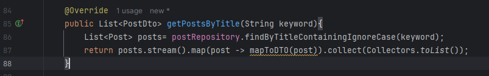
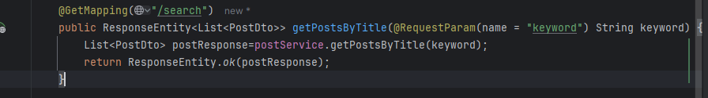
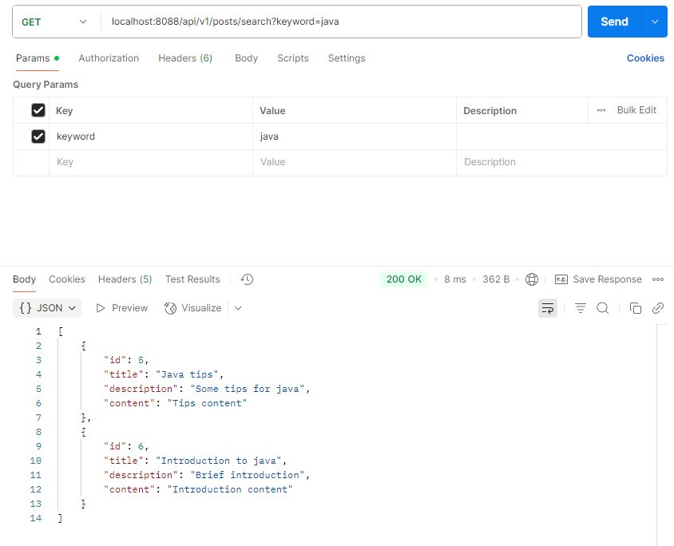

1.Custom exception class could show the specific pre defined error message in the response. It make the debugging easier compared to general exception like RuntimeException

2.@Table specify the table name in the db the entity class linked to. It could also set constraints. @Column specify the column name in the db the variable linked to. @Id specify the primary key in the db. 

If no @Id field, the application will failed to start. If no @Table or @Column, it will try to link to the default name, converting CamelCase to snake_case.

3.Class used in JPA repository initialization must have @Entity specified. If not, the app will failed to run.

4.If @RestController is missing, the class will not be recognized as a spring bean, the @Autowired inside it could not work. All request will return 404 error.

5.If no explicit name given, the CamelCase name in the entity will link to the lowercase snake_case name in the db. like column userName -> user_name, table OrderDetail -> order_detail

6.@PathVariable should be specified in request url path before the ? mark, while the @RequestParam should be specified as key-value pair in url after the ? mark, separate with & mark.

Hands On:
Repository:

Service:

Controller:

Postman api test:

