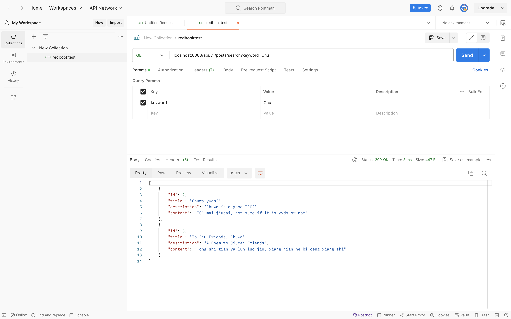

# Ryan Ma HW9 Answers


### 1.Why is it better to use a custom exception class (e.g. ResourceNotFoundException ) in your application?
- Clarity and Readability
  - Custom exceptions immediately communicate intent.
  - You or other developers can instantly understand what when wrong.
- Precise Exception Handling
  - You can catch specific exceptions without accidentally catching unrelated errors.
- Encapsulation of Domain Knowledge
  - A custom exception can carry additional context (resource ID, type) useful for logging or debugging.
- Future Proofing
  - If requirements change, you can handle this inside your custom exception handling without touching other parts of your codebase.

### 2.Explain how @Table , @Column , and @Id work. What is the default behavior if you don’t use them?
- @Table
  - Specifies the table name in the database that the entity maps to.
  - If not used, the table name defaults to the entity class name.
- @Column: 
  - Specifies column details in the database for a field
  - If not used, the column name defaults to the field name in the entity
- @Id:
  - Marks the primary key of the entity.
  - If not used, Your entity will fail to map and throw an error
  - 
### 3.What happens if you don’t annotate a class with @Entity , but still try to save it with JPA?
- Java will throw an error. JPA (Hibernate etc.) requires all persistent entities to be annotated with @Entity.
Without @Entity, JPA does not recognize the class as a managed entity, so it does not map it to any database table.

### 4.What happens if we forget to annotate a controller with @RestController and only use @RequestMapping ?
- Spring will not detect this class as a controller at all. None of your request mappings will work.
And you will get a 404 Not Found when you call any endpoint in this controller.
- 
### 5.What is the default naming strategy of JPA for tables and columns when no explicit name is given?
- If you do not use @Table(name = "table_name"), JPA will use the simple class name as the table name by default (@Entity's class name).
- If you do not use @Column(nam = "column_name"), JPA will use the field name as the column name by default.

### 6.How does @PathVariable differ from @RequestParam ?
| Feature                 | `@PathVariable`                      | `@RequestParam`                            |
|-------------------------|--------------------------------------|--------------------------------------------|
| **Source**              | URL path segment                     | Query string                               |
| **Example URL**         | `/users/123`                         | `/users?id=123`                            |
| **Usage**               | RESTful resource identification      | Filtering, pagination, optional parameters |
| **Required by default** | Yes                                  | No (can set default values)                |
| **Multiple values**     | Supported via multiple path segments | Supported via multiple query params        |

### 7.Write a method in a repository to find all posts with the title containing a certain keyword. (Create some test posts if necessary).Share screenshots in your markdown file.
- Code in PostRepository
```java
List<Post> findByTitleContaining(String keyword);
```
- Screenshot
