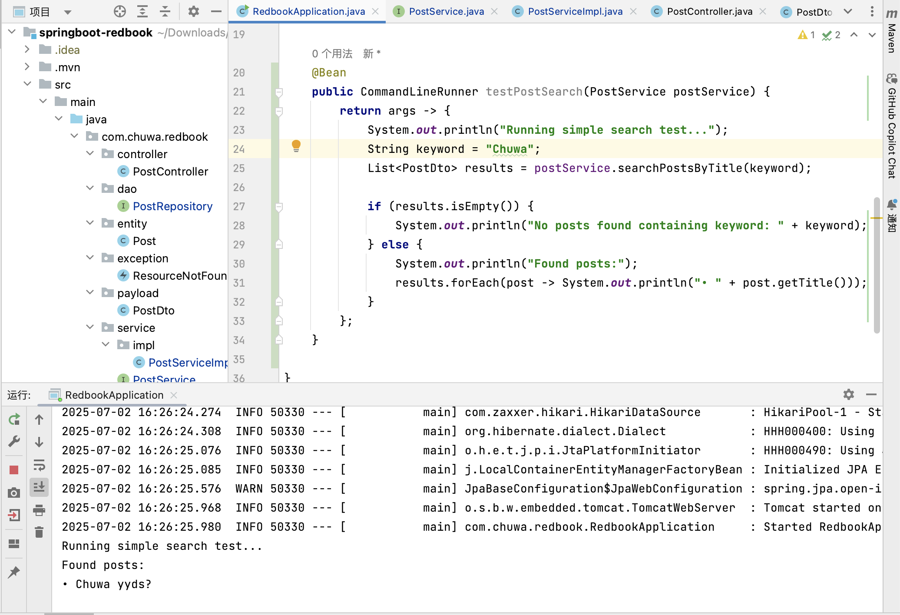

1. Why is it better to use a custom exception class (e.g. ResourceNotFoundException ) in your application?

	1. Improves Code Readability and Intent: A custom exception clearly communicates what kind of error occurred. This makes the code more self-documenting and easier for others to understand.

	2. Supports Centralized and Specific Error Handling: In Spring Boot, we can use @ControllerAdvice to handle specific exceptions. This avoids multiple if or try-catch blocks and ensures a consistent HTTP response (e.g. 404).

	3. Avoids Overuse of Generic Exceptions: Throwing general exceptions (like RuntimeException, Exception, etc.) makes it harder to debug and handle issues precisely. Custom exceptions narrow the context, making logs and stack traces more meaningful.

	4. Encapsulates Additional Error Details: We can enhance custom exceptions with fields like error code, timestamp, etc.

2. Explain how @Table , @Column , and @Id work. What is the default behavior if you don’t use them?

	@Table — Class-Level Annotation: Specifies the name of the table in the database that this entity is mapped to.

	@Column — Field-Level Annotation: Maps a field to a specific column in the table and allows customization (name, nullable, length, etc.)

	@Id — Field-Level Annotation: Marks a field as the primary key of the entity.

3. What happens if you don’t annotate a class with @Entity , but still try to save it with JPA?

If you don’t annotate a class with @Entity but still try to save it using JPA (e.g., with Spring Data JPA’s JpaRepository.save()), you will encounter a runtime error, because JPA won’t recognize the class as a persistent entity.

JPA needs @Entity to:

* Register the class as a managed entity

* Map it to a database table

* Track its lifecycle and enable operations like persist, merge, find, remove

If @Entity is missing:

* The class is just a plain Java object (POJO) with no metadata for JPA

* It won’t be added to the persistence context

* JPA won’t know how to map it to a database table

4. What happens if we forget to annotate a controller with @RestController and only use @RequestMapping?

If you forget to annotate a controller class with @RestController (or @Controller) and only use @RequestMapping, Spring will not recognize the class as a controller, and your route won’t be registered or accessible. You will get a 404 Not Found when trying to call that endpoint.

5. What is the default naming strategy of JPA for tables and columns when no explicit name is given?

Default Table Naming (from Class Name): 

If no @Table(name = "…") is provided: 
```
public class UserAccount {
    ...
}
```

The default table name will be: "user_account"

Default Column Naming (from Field Name)

If no @Column(name = "…") is provided:
```
private String emailAddress;
```
The default column name will be: "email_address"

Hibernate’s default naming strategy performs:

* CamelCase → snake_case

* Keeps everything lowercase

* Preserves underscores (createdAt → created_at, userID → user_id)

6. How does @PathVariable differ from @RequestParam?

 @PathVariable – Extracts data from the URL path

* Used when the value is part of the URI path itself.

* Typically used in RESTful endpoints.

@RequestParam – Extracts query parameters from the URL

* Used to get values from the query string (?key=value)

* Optional by default unless marked as required = true

7. Write a method in a repository to find all posts with the title containing a certain keyword. (Create some test posts if necessary)




