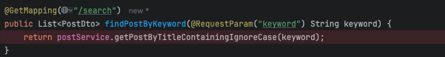
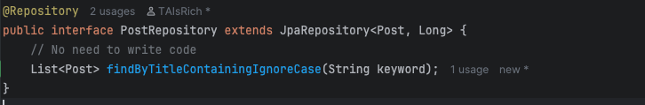
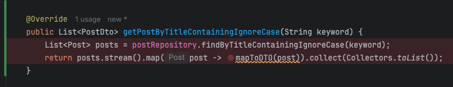

**1. Why is it better to use a custom exception class (e.g. ResourceNotFoundException ) in your application?**

- **Clarity**: Clearly communicates what went wrong (e.g., resource not found).
- **Better API responses**: Easily map to HTTP status codes like 404 using `@ExceptionHandler`.
- **Business logic separation**: Encapsulates domain-specific errors for maintainable code.
- **Improved Debugging**: Custom names make logs and stack traces easier to understand.
- **Scalability**: Supports consistent error handling as the app grows.

**2. Explain how @Table , @Column , and @Id work. What is the default behavior if you don’t use them?**

- **`@Table`**: Specifies the name of the database table to map the entity to.
  - *Default*: Uses the class name as the table name (e.g., `schoolAssignment` → `school_assignment`).

- **`@Column`**: Maps a field to a specific column in the table
  - *Default*: Use the field name as the column name unless overridden 
```java
@Entity
@Table(name = "students")  // overrides default table name
public class StudentProfile {
    @Column(name = "fname")  // overrides default column name
    private String firstName;
    // ...
}
```

- **`@Id`**: Marks the primary key of the entity.
  - *Required*: Without it, JPA won't know which filed is the identifier and will throw an error.

**3. What happens if you don’t annotate a class with @Entity , but still try to save it with JPA?**

If a class is not annotated with `@Entity`, JPA will not recognize it as persistent entity.
Trying to save it will result in a runtime error because JPA only manages classes explicitly marked with `@Entity`.

**4. What happens if we forget to annotate a controller with @RestController and only use
@RequestMapping?**

If a class is not annotated with `@RestController` (or `@Controller`), Spring does not detect it as a web controller, even if it had `@RequestMapping` methods. As a result, incoming HTTP requests will not be routed to that class.

**5. What is the default naming strategy of JPA for tables and columns when no explicit name is given?**

By default, JPA uses a **naming strategy** that maps:

- Class names to **table names** using the class name as-is (e.g., `Student` → `student`)
- Field names to **column names** using the field name as-is  (e.g., `firstName` → `first_name` with implicit snake_case if configured)

**6. How does @PathVariable differ from @RequestParam?**

- **@PathVariable**: Extract values **from the URI path**.
  - e.g. `@GetMapping("/users/{id}")`
  - `public User getUser(@PathVariable Long id)`

- **@RequestParam**
  - Extracts values **from the query string** or form data.
  - e.g. `@GetMapping("/search")`
  - `public List<User> search(@RequestParam String name)`

- Use `@PathVariable` for required, REST-style identifiers.
- Use `@RequestParam` for optional or filter parameter in URLs.

Write a method in a repository to find all posts with the title containing a certain keyword. (Create some
test posts if necessary)







