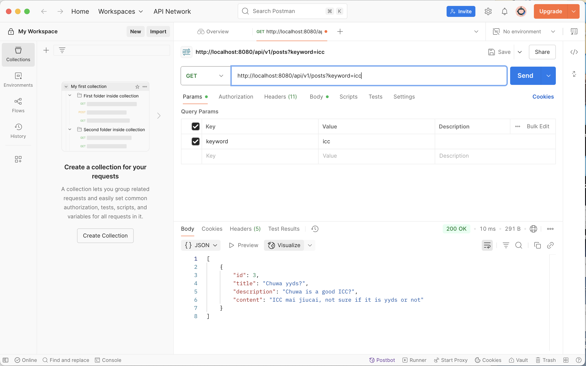

1. Using a custom exception class like ResourceNotFoundException improves code clarity, allows more precise error handling, and makes the application more maintainable. It clearly communicates the nature of the error, enables targeted exception catching, and supports better API design—such as mapping to specific HTTP status codes like 404. This leads to more readable, robust, and user-friendly applications.
2. In JPA, @Table specifies the database table name to map the entity to, @Column defines the mapping between a Java field and a specific database column, and @Id marks the primary key of the entity. If we don’t use @Table, the table name defaults to the class name. Without @Column, the column name also defaults to the field name. If @Id is omitted, the entity won't have a primary key, which leads to errors during persistence operations.
3. If we don’t annotate a class with @Entity and try to save it with JPA, it will result in a runtime error—typically an IllegalArgumentException stating that the object is not a known entity. JPA only manages classes explicitly marked with @Entity, so it cannot persist or recognize unannotated classes.
4. If we forget to annotate a controller with @RestController and only use @RequestMapping, Spring treats the return values as view names instead of sending them as JSON responses. This means the framework will try to resolve a view (like a JSP or HTML page), and we won’t get the expected JSON unless we also add @ResponseBody to each method.
5. When no explicit name is given, JPA uses a default naming strategy that typically maps the entity class name to the table name and the field names to column names, often converting camelCase to snake_case. For example, a UserAccount class with a createdDate field would map to a table named user_account and a column named created_date.
6. @PathVariable extracts values from the URL path itself (e.g., /users/{id}), while @RequestParam retrieves values from the query string (e.g., /users?id=123). @PathVariable is used for path-based routing, making URLs more RESTful, whereas @RequestParam is used to capture query parameters typically used for filtering or optional inputs.

```angular2html

// in PostController.java
@GetMapping
public List<PostDto> getAllPosts(@RequestParam(required = false) String keyword) &#123;
    if (keyword != null && !keyword.trim().isEmpty()) &#123;
        return postService.searchPostsByKeyword(keyword);
    &#125;
    return postService.getAllPost();
    &#125;


// in PostService.java
    List<PostDto> searchPostsByKeyword(String keyword);

// in PostServiceImpl.java
@Override
public List<PostDto> searchPostsByKeyword(String keyword) &#123;
    List<Post> posts = postRepository.findAll();
    String lowerKeyword = keyword.toLowerCase();
    List<Post> filteredPosts = posts.stream()
            .filter(post ->
                    (post.getTitle() != null && post.getTitle().toLowerCase().contains(lowerKeyword)) ||
                            (post.getDescription() != null && post.getDescription().toLowerCase().contains(lowerKeyword)) ||
                            (post.getContent() != null && post.getContent().toLowerCase().contains(lowerKeyword))
            )
            .collect(Collectors.toList());

    return filteredPosts.stream()
            .map(this::mapToDTO)
            .collect(Collectors.toList());
&#125;
```

Result look like the following screenshot:
