# chuwa hw10

## Part 1

See the annotations.md

## Part 2

### 2

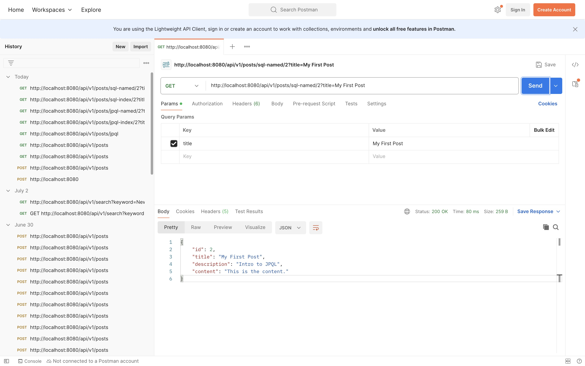

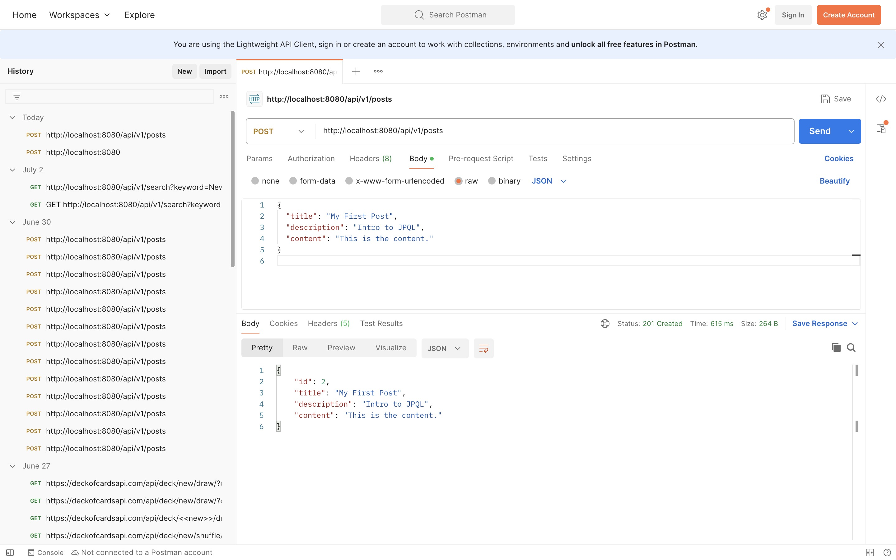

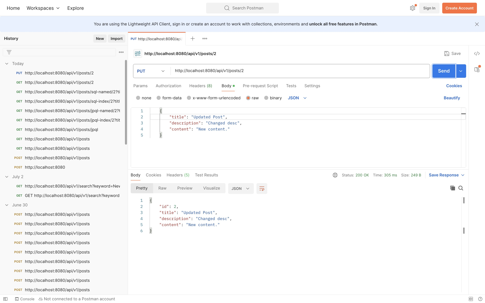

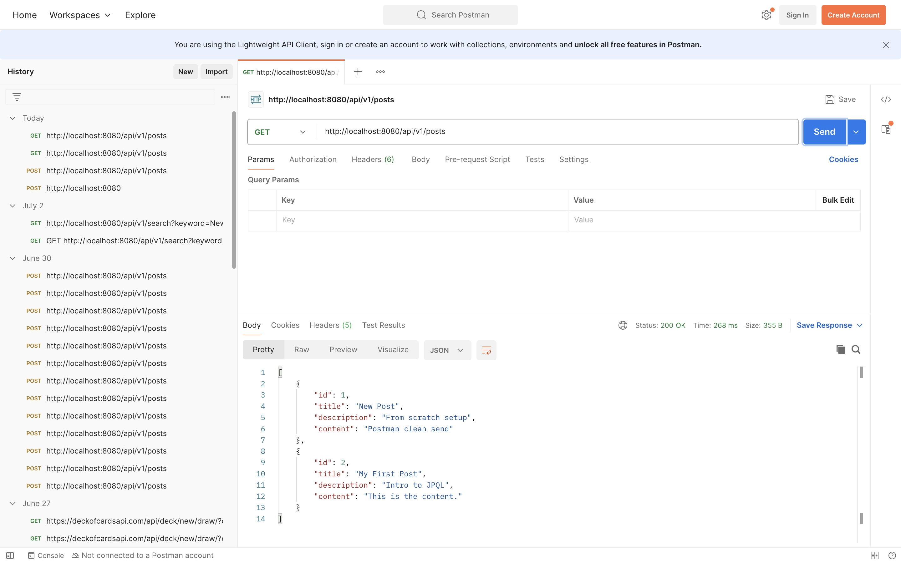

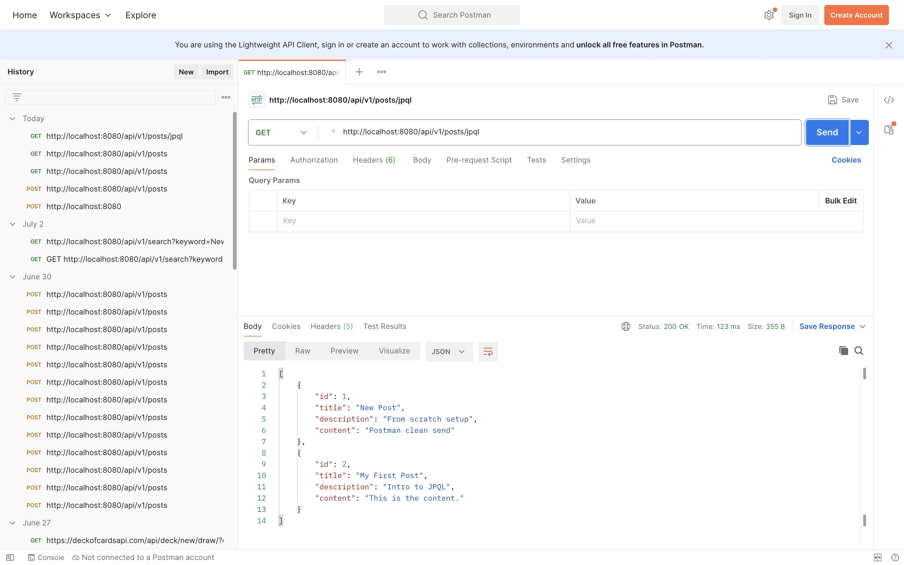

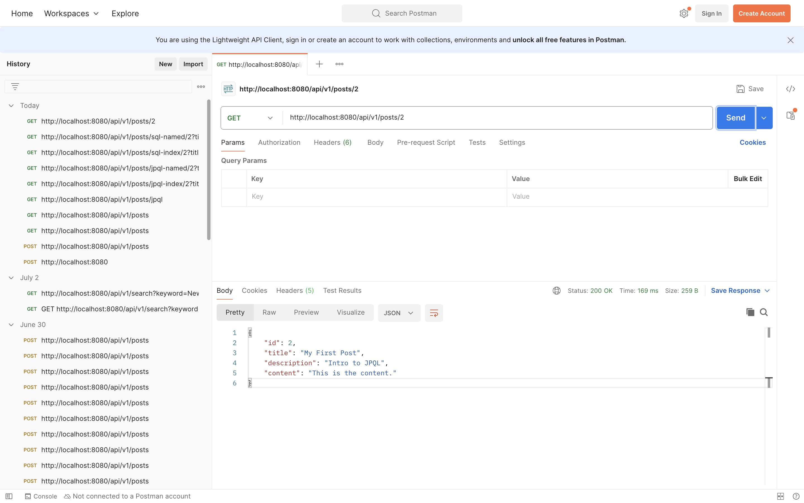

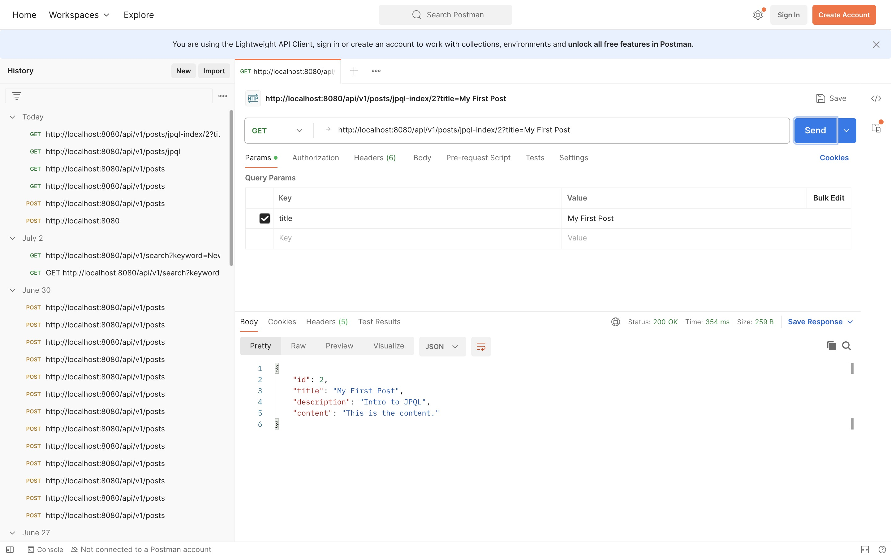


## Part 3

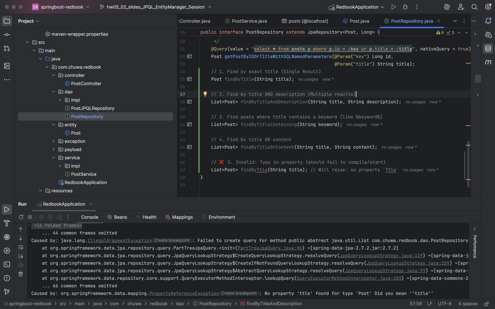

## Part 4

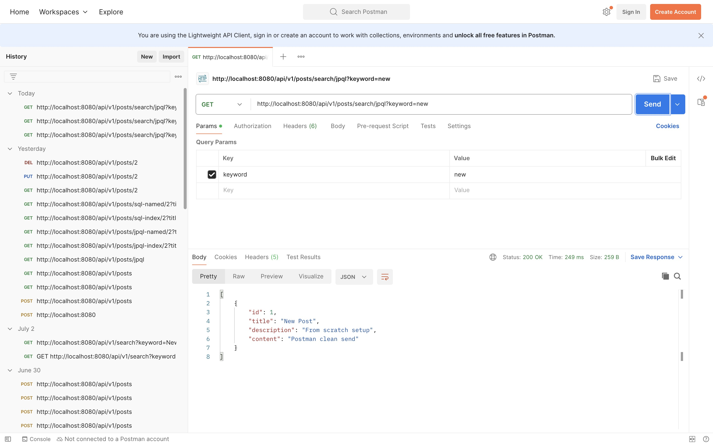

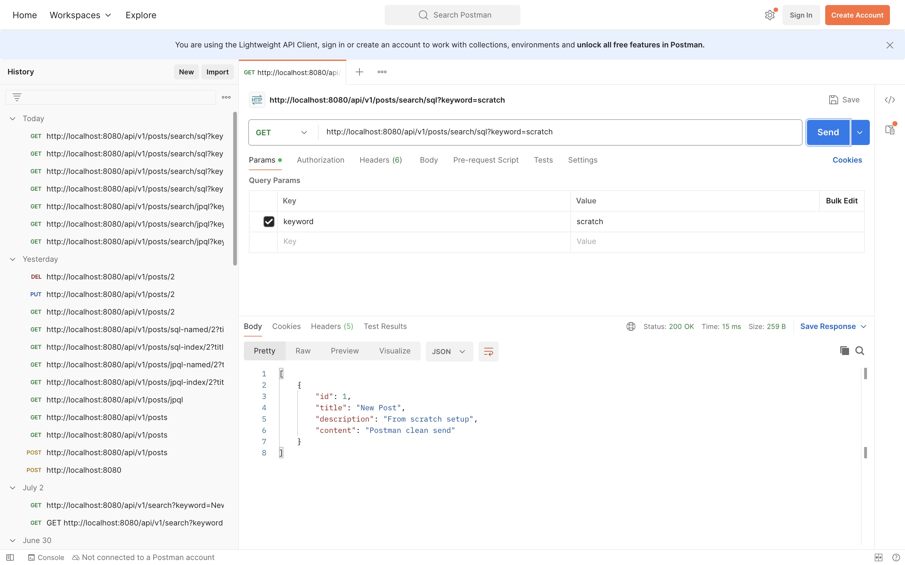

### 5

| Technology | Type | Role | Code Level |
| --- | --- | --- | --- |
| JDBC | Java API | Basic DB communication | Low-level |
| HikariCP | Connection Pool | Boosts DB connection performance | Internal |
| Hibernate | ORM Framework | Maps Java ↔ SQL | Mid-level |
| Spring Data JPA | Spring abstraction on JPA | Simplifies data access | High-level |

### 6

OneToMany

One entity has many of another entity.

Example: **One Post** has **many Comments**

- `mappedBy`: Used on the inverse side (non-owning side) to point to the field that owns the relationship.
- `cascade`: Propagates operations (e.g., persist, remove) to related entities.
- `fetch`: Specifies lazy (default) or eager loading.

```java
@Entity
public class Post {
    @Id
    @GeneratedValue
    private Long id;

    @OneToMany(mappedBy = "post", cascade = CascadeType.ALL, fetch = FetchType.LAZY)
    private List<Comment> comments;
}

@Entity
public class Comment {
    @Id
    @GeneratedValue
    private Long id;

    @ManyToOne
    @JoinColumn(name = "post_id") // foreign key column
    private Post post;
}

```

ManyToOne

Many entities relate to one.

Example: **Many Comments** belong to **one Post**.

- `optional`: If false, the relationship must always be present (non-null).
- `fetch`: Default is `EAGER`, but can be set to `LAZY`.

```java
@Entity
public class Comment {
    @Id
    @GeneratedValue
    private Long id;

    @ManyToOne(fetch = FetchType.LAZY)
    @JoinColumn(name = "post_id")
    private Post post;
}
```

ManyToMany

Many entities relate to many.

Example: **Users** can like many **Posts**, and **Posts** can be liked by many **Users**.

- `mappedBy`: Use it to define the inverse side of the relationship.
- `cascade`: Like others, defines what operations should cascade.
- `fetch`: LAZY or EAGER

```java
@Entity
public class User {
    @Id
    @GeneratedValue
    private Long id;

    @ManyToMany
    @JoinTable(
        name = "user_post_likes",
        joinColumns = @JoinColumn(name = "user_id"),
        inverseJoinColumns = @JoinColumn(name = "post_id")
    )
    private List<Post> likedPosts;
}

@Entity
public class Post {
    @Id
    @GeneratedValue
    private Long id;

    @ManyToMany(mappedBy = "likedPosts")
    private List<User> likedByUsers;
}

```

### 7

## `cascade = CascadeType.ALL`

This tells JPA to **apply all cascade operations** (persist, merge, remove, refresh, detach) to the related entity.

## `orphanRemoval = true`

This tells JPA to **automatically delete child entities** (orphans) that are no longer referenced from the parent.

| CascadeType | Description |
| --- | --- |
| `PERSIST` | When the parent is saved (`persist()`), the child is also saved. |
| `MERGE` | When the parent is updated (`merge()`), the child is also updated. |
| `REMOVE` | When the parent is deleted (`remove()`), the child is also deleted. |
| `REFRESH` | When the parent is refreshed (`refresh()`), the child is refreshed from DB too. |
| `DETACH` | When the parent is detached (`detach()`), the child is detached from the persistence context. |
| `ALL` | Applies all of the above cascade types. Equivalent to using every one listed. |

### 8

The fetch type defines **how related entities are loaded** from the database:

- **EAGER** = Load immediately (joined)
- **LAZY** = Load only when accessed (on demand)

| Relationship Type | Default Fetch Type | Recommended Practice |
| --- | --- | --- |
| `@OneToOne` | `EAGER` | Use `LAZY` unless always needed |
| `@ManyToOne` | `EAGER` | Acceptable as is (usually small) |
| `@OneToMany` | `LAZY` | Stick with `LAZY` (often large) |
| `@ManyToMany` | `LAZY` | Stick with `LAZY` |

## Part 4

### 9

**JPQL** is an object-oriented query language defined by JPA.

It allows you to query **Java entity objects**, not database tables directly.

JPQL works with entities and fields, not tables and columns.

| Aspect | JPQL | SQL |
| --- | --- | --- |
| Operates on | Java entities and fields | Tables and columns |
| Return type | Entity objects | ResultSet (rows, columns) |
| Type safety | Checked at compile-time (if used via repository methods) | Only at runtime |
| Syntax | Similar to SQL, but uses entity model | Purely relational |
| Database agnostic | Yes (abstracted via JPA) | No |

```java
@Query("SELECT p FROM Post p WHERE p.title = :title")
Post findPostByTitle(@Param("title") String title);
```

this equals

```sql
SELECT * FROM posts WHERE title = 'Some Title';
```

### 10

`@Query` is an annotation used in **Spring Data JPA repositories** to define custom queries manually — either **JPQL** or **native SQL**.

It is used when:

- The method name is too complex to derive a query.
- You need a **custom query**, **join**, or **specific filtering**.

```java
@Query("SELECT p FROM Post p WHERE p.title = :title")
Post findByTitle(@Param("title") String title);
```

```sql
@Query(value = "SELECT * FROM posts WHERE title = :title", nativeQuery = true)
Post findByTitleNative(@Param("title") String title);
```

## Part 5

### 11

EntityManager

- **Part of JPA (Java Persistence API)**.
- The main interface to manage persistence in JPA.
- Handles:
    - Entity lifecycle (`persist`, `merge`, `remove`, etc.)
    - Queries (`JPQL`, criteria, native)
    - Transaction boundaries (when managed manually)

Session Factory

- **Part of Hibernate (JPA implementation)**.
- Provides `Session` objects that are Hibernate's version of `EntityManager`.

You typically don’t need to use `SessionFactory` directly in Spring Boot projects, because **Spring wraps it behind `EntityManager`**.

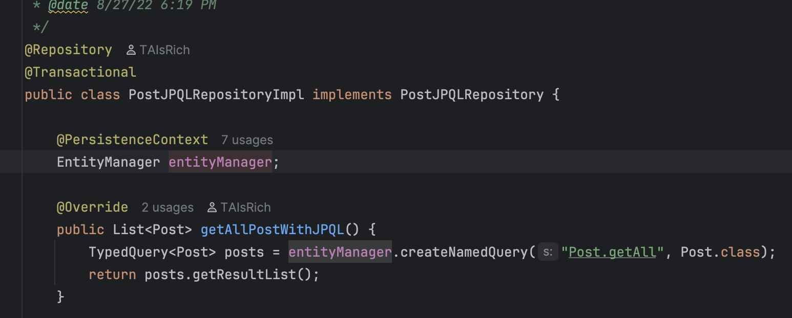

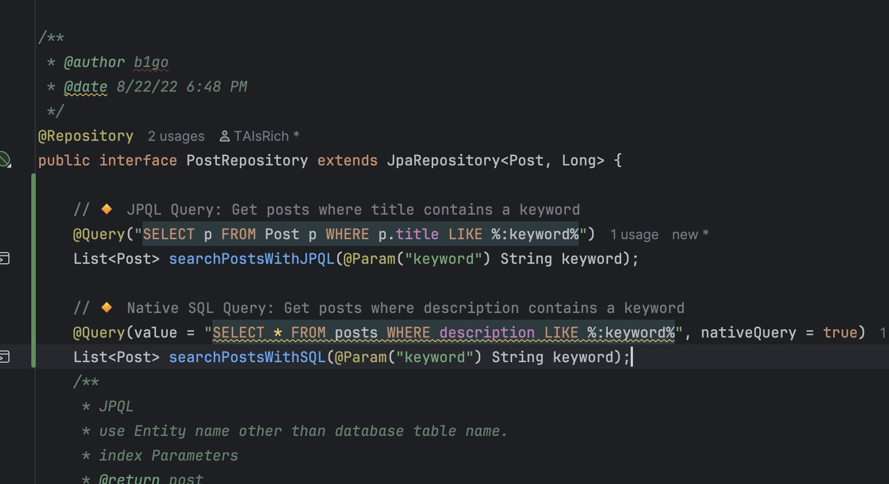

### 12

A **`Session`** is the main interface used in Hibernate to:

- **Interact with the database**
- **Perform CRUD operations**
- **Manage transactions and persistence context**

Think of a `Session` as a **single unit of work** — tied to a database connection.

`SessionFactory` is a **heavyweight factory object** responsible for creating and managing `Session` instances.

It is built **once** during application startup and holds the configuration, mappings, connection pool info, etc.

| Feature | `SessionFactory` | `Session` |
| --- | --- | --- |
| Purpose | Creates and manages `Session` objects | Used for DB operations in one context |
| Lifecycle | One per application (singleton) | Created per request/transaction |
| Thread Safety | Thread-safe | **Not** thread-safe |
| Cost of creation | Expensive (initialize once) | Lightweight |
| Typical usage | Application startup | Per transaction/unit of work |
| Managed by Spring | Rarely accessed directly | Often used internally via `EntityManager` |

## Part 6

### 13

A **transaction** is a **sequence of operations** performed as a **single logical unit of work** on a database.

Hibernate uses its `Session` object for transaction management:

```java
Session session = sessionFactory.openSession();
Transaction tx = session.beginTransaction();

try {
    session.save(post);
    tx.commit();
} catch (Exception e) {
    tx.rollback();
}

```

in SpringBoot

```java
@Service
public class PostServiceImpl implements PostService {

    @Autowired
    private PostRepository postRepository;

    @Transactional
    public Post createPost(Post post) {
        return postRepository.save(post); // auto commits or rolls back
    }
}

```

### 14

| Level | Scope | Enabled by default | Customizable |
| --- | --- | --- | --- |
| **First-Level** | Per `Session` | ✅ Yes | ❌ No |
| **Second-Level** | Shared (SessionFactory) | ❌ No | ✅ Yes |

First Level

- The **mandatory** cache built into Hibernate.
- **Scoped to a single `Session`**
- Caches entities by **identifier (primary key)**
- If you fetch the same entity twice in the same session, Hibernate only hits the DB **once**.

Second Level

- An **optional**, **configurable** cache
- Shared across multiple sessions
- Stores:
    - Entities
    - Collections
    - Query results (with Query Cache)
1. A **cache provider** (e.g. Ehcache, Caffeine, Redis)
2. Enable in `hibernate.cfg.xml` or `application.properties`
3. Annotate entities with `@Cacheable`

| Feature | First-Level Cache | Second-Level Cache |
| --- | --- | --- |
| Scope | Per Hibernate `Session` | Application-wide (`SessionFactory`) |
| Enabled by Default? | ✅ Yes | ❌ No |
| Configurable? | ❌ No | ✅ Yes (Ehcache, Caffeine, etc.) |
| Cleared when | Session is closed | Manually or via eviction strategy |
| Use Case | Prevent duplicate DB hits in a single session | Share data across sessions |
| Entity annotation | Not required | `@Cacheable` + Hibernate annotation |