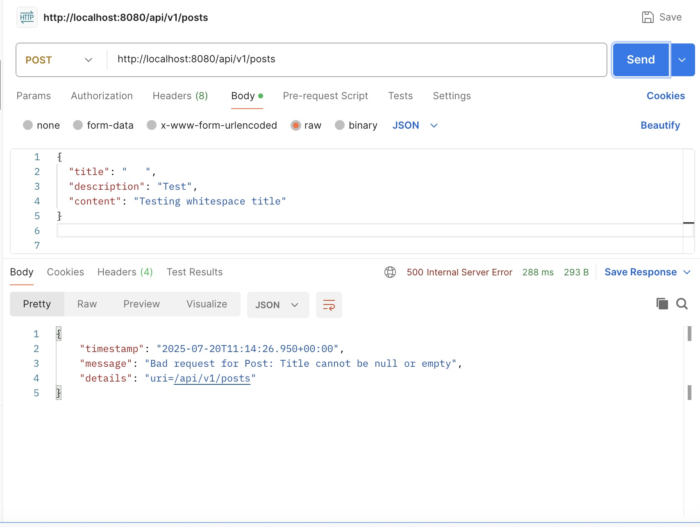
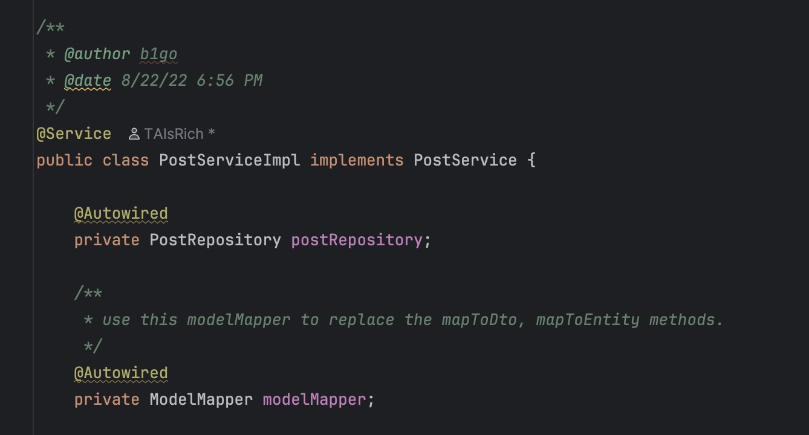
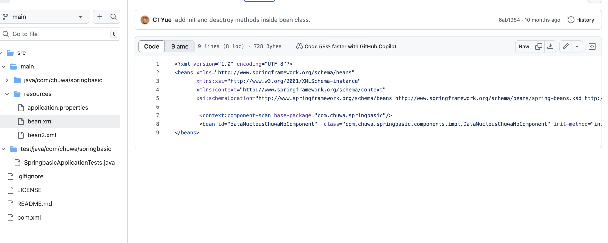

# Chuwa hw11

## Q1

See the annotation.md

## Q2

Can run on my local environment

## Q3

### 1. **Separation of Concerns**

You don’t want to expose your database entities directly in your API. DTOs help you:

- Avoid overexposing sensitive data
- Shape the response exactly as needed
- Validate request formats before saving

### 2. **Simplify Conversion**

Manually converting between `Entity ↔ DTO` becomes repetitive and error-prone.

Model mappers automate this mapping and reduce boilerplate.

### Scenario

- You have different **layers** (Entity, DTO, ViewModel)
- You want to expose only part of your data
- Your API and DB models don’t perfectly match
- You want to **reduce boilerplate** mapping logic

## Q4

### Mismatched Field names

```java
public class User {
    private String fullName;
}
public class UserDTO {
    private String name;
}
```

## Nested Objects Not Automatically Flattened

```java
public class User {
    private Address address;
}

public class Address {
    private String city;
}
public class UserDTO {
    private String city;
}

```

## Collections with Type Differences

```java
public class User {
    private List<Role> roles;
}

public class Role {
    private String name;
}
public class UserDTO {
    private List<String> roleNames;
}

```

## Q5

ModelMapper can **automatically cast or convert** between different data types between the **source object (e.g., Entity)** and the **target class (e.g., DTO)** — but it has **limitations**, and sometimes you need to define **custom converters**.

ModelMapper tries to match fields by **name** and then cast or convert the **types** based on:

1. **Built-in conversions** for common types
2. **Custom converters** you define for more complex mappings

| Source Type | Target Type | Works? | Example |
| --- | --- | --- | --- |
| `int` | `Integer` | ✅ Yes | `int age` → `Integer age` |
| `String` | `int` | ✅ Yes | `"42"` → `int 42` |
| `Date` | `String` | ✅ Yes | `Date` → `"2025-07-20"` |
| `String` | `LocalDate` | ❌ No | Needs custom converter |
| `List<Role>` | `List<String>` | ❌ No | Needs custom converter (e.g., `role.getName()`) |

## Q6

```java
package com.chuwa.redbook.exception;

public class BadRequestException extends RuntimeException {
    private String resourceName;
    private String reason;

    public BadRequestException(String resourceName, String reason) {
        super(String.format("Bad request for %s: %s", resourceName, reason));
        this.resourceName = resourceName;
        this.reason = reason;
    }

    public String getResourceName() {
        return resourceName;
    }

    public String getReason() {
        return reason;
    }
}
```



## Q7

`@ControllerAdvice` is a **global exception handling mechanism** in Spring MVC.

It allows you to define centralized error handling **across all your controllers**, instead of repeating `try-catch` blocks.

It works alongside `@ExceptionHandler` methods to catch specific exceptions and return customized error responses.

how it works:

```java
@RestControllerAdvice
public class GlobalExceptionHandler {

    @ExceptionHandler(ResourceNotFoundException.class)
    public ResponseEntity<?> handleResourceNotFound(ResourceNotFoundException ex) {
        Map<String, Object> error = new HashMap<>();
        error.put("message", ex.getMessage());
        error.put("status", HttpStatus.NOT_FOUND.value());
        error.put("timestamp", Instant.now());

        return new ResponseEntity<>(error, HttpStatus.NOT_FOUND);
    }
}

```

Other methods:

### **HandlerInterceptor or Filter (Advanced Use)**

You can use:

- `HandlerInterceptor`
- `Filter`
- `@ResponseStatus` on exceptions

To handle **pre-processing or low-level errors**, but it's **less intuitive** for standard exception-to-response mapping.

## Q8

Regular

- Java built-in
- No custom structure
- No resource-specific info
- Not meaningful to client

Custom

- Domain-specific
- Includes detailed context (`resource`, `field`, `value`)
- Easily handled in `@Controller`
- Produces **clean, structured JSON response**

| Feature | Regular Exception | Custom API Exception |
| --- | --- | --- |
| Type | `IllegalArgumentException` | `ResourceNotFoundException` |
| Message | `"Invalid ID"` | `"Post not found with id: 42"` |
| Handled by ControllerAdvice | ✅ Yes (if caught by `@ExceptionHandler`) | ✅ Yes |
| Response Customizable | ⚠️ Limited without parsing manually | ✅ Structured with custom fields |


## Q9

```java
    @Pattern(
            regexp = "^[A-Za-z0-9_ ]{3,30}$",
            message = "Name must be 3–30 characters, using only letters, numbers, underscores, and spaces"
    )
    private String name;
```

## Q10

### 1. **Inversion of Control (IoC)**

Spring manages the creation and wiring of objects, rather than the objects managing their own dependencies. This promotes loose coupling and modular design, which makes applications easier to maintain and test.

### 2. **Dependency Injection (DI)**

Related to IoC, DI is the mechanism by which Spring injects object dependencies at runtime. This simplifies the process of connecting different parts of an application and allows for greater flexibility and reuse.

### 3. **Aspect-Oriented Programming (AOP)**

Spring supports AOP to separate cross-cutting concerns such as logging, security, and transaction management from the core business logic. This leads to cleaner, more focused code and a better separation of concerns.

### 4. **Modularity and Layered Architecture**

Spring promotes organizing applications into layers such as controller, service, repository, and domain. Each layer has a specific responsibility, leading to better maintainability and testability.

### 5. **Declarative Programming**

Spring allows configuration and behavior (such as transactions, caching, and security) to be declared using annotations or configuration files. This reduces the amount of boilerplate code and simplifies configuration.

### 6. **Integration and Abstraction**

Spring provides abstraction layers over various technologies such as JDBC, JPA, JMS, and web services. This means you can switch or upgrade technologies with minimal code changes, and developers can focus on business logic instead of low-level infrastructure.

### 7. **Convention Over Configuration**

Spring follows sensible defaults, reducing the amount of configuration required. This speeds up development and reduces errors while still allowing full customization when needed.

### 8. **Testability**

Because of its support for dependency injection and modular architecture, Spring makes it easy to write unit and integration tests. This improves software quality and supports continuous integration and delivery.

### 9. **Flexibility and Scalability**

Spring is lightweight and modular. You can start with only what you need and add components as your application grows. This makes it suitable for both small applications and large, complex business systems.

### How These Principles Help Build Business Applications

- They reduce boilerplate and infrastructure code, allowing teams to focus on business functionality.
- They encourage clean, maintainable architecture, which is crucial for long-term projects.
- They support scalability by making it easy to extend and modify the application.
- They improve development speed and reliability through strong support for testing and configuration management.
- They facilitate integration with databases, message queues, web services, and cloud platforms, all of which are common in business systems.

## Q11

Dependency Injection is a design pattern where the framework (Spring) **provides required dependencies** to a class instead of the class creating them itself. This leads to **loose coupling**, easier testing, and better separation of concerns.

### A. **Constructor Injection**

Spring injects dependencies via the class **constructor**.

```java
@Service
public class UserService {

    private final UserRepository userRepository;

    // ✅ Best Practice
    @Autowired
    public UserService(UserRepository userRepository) {
        this.userRepository = userRepository;
    }
}

```

**Use when:**

- You want to enforce immutability.
- The dependency is required (non-optional).
- You want better testability (you can easily mock the constructor)

### B. **Setter Injection**

Spring injects dependencies via **public setter methods**.

```java
@Service
public class UserService {

    private UserRepository userRepository;

    @Autowired
    public void setUserRepository(UserRepository userRepository) {
        this.userRepository = userRepository;
    }
}

```

**Use when:**

- The dependency is **optional**.
- You need to **change the dependency** later (not common).
- There’s a need for framework-level proxying or AOP on the setter.

### C. **Field Injection**

Spring injects dependencies directly into **private fields** using reflection.

```java
@Service
public class UserService {

    @Autowired
    private UserRepository userRepository;
}
```



## Q12

### 1. **ClassPathXmlApplicationContext**

- Loads configuration from an XML file located in the classpath.
- Commonly used in standalone Java applications.
- Suitable for small or legacy projects where configuration is XML-based.

---

### 2. **FileSystemXmlApplicationContext**

- Loads configuration from an XML file in the file system (not necessarily on the classpath).
- Used when configuration files are stored externally, for example, in a different folder or drive.
- Offers flexibility in managing config without repackaging the application.

---

### 3. **AnnotationConfigApplicationContext**

- Loads Spring configuration from Java-based `@Configuration` classes.
- Preferred in modern Spring applications (especially Spring Boot).
- Enables annotation-based bean definitions rather than XML.

---

### 4. **WebApplicationContext**

- A specialized `ApplicationContext` used in Spring web applications (e.g., MVC, REST APIs).
- Integrated with the servlet context and supports web-specific scopes (like request or session).
- Automatically loaded by Spring MVC using a context loader listener or initializer.



## Q13

### @Component

- It is a class-level annotation.
- Used to mark a class as a Spring-managed component.
- Detected automatically during component scanning (`@ComponentScan`).
- Works with other stereotype annotations like `@Service`, `@Repository`, and `@Controller`, which are specialized forms of `@Component`.

**Use when:**

- You want Spring to automatically detect and register a class as a bean.
- The class is under your control (i.e., you wrote or can modify the source code).
- You prefer annotation-driven, declarative registration of beans.

---

### @Bean

- It is a method-level annotation.
- Declares a bean explicitly within a `@Configuration` class.
- Not discovered through component scanning.
- Gives you full control over bean instantiation, including constructor arguments, return types, and factory logic.

**Use when:**

- You need to register a bean from a third-party library (not annotated with `@Component`).
- You want to create and configure a bean manually or conditionally.
- You need to return different types or use dynamic logic during bean creation.

## Q14

### 1. **Singleton (default)**

- Only **one instance** of the bean is created per Spring container.
- All requests for this bean return the **same instance**.

**Use when:**

- The bean is **stateless** (no per-user or per-request data).
- You want **shared resources** or configuration objects.

---

### 2. **Prototype**

- A **new instance** is created every time the bean is requested.

**Use when:**

- The bean is **stateful** (holds user or request-specific data).
- You want **independent objects** for each usage.

---

### 3. **Request** (Web-aware scope)

- One bean instance per **HTTP request**.

**Use when:**

- The bean should be tied to a **single web request**.
- You are working in a **Spring MVC** or web application context.

---

### 4. **Session** (Web-aware scope)

- One bean instance per **HTTP session**.

**Use when:**

- You want to maintain **user-specific state** (e.g. shopping cart).
- The bean should persist across multiple requests from the same user session.

---

### 5. **Application**

- One bean instance per **ServletContext** (shared across all sessions and requests).

**Use when:**

- You need **global state** across the entire web application.

---

### 6. **Websocket**

- One bean instance per **WebSocket session**.

**Use when:**

- Working with **Spring WebSocket** to handle real-time messaging.

| Scope | Best for... | Example Use Case |
| --- | --- | --- |
| Singleton | Stateless, shared beans | Service classes, configuration, cache |
| Prototype | Independent, stateful beans | Complex domain models, tools |
| Request | Per-request objects in web apps | Request-scoped form backing beans |
| Session | Per-user session objects | User session info, shopping cart |
| Application | Global state or application-wide settings | Shared metrics, web-level config |
| Websocket | Real-time user-specific WebSocket sessions | Live chat, notifications per user |

## Q15

### **Bean Class**

- Refers to the **actual Java class** that Spring will instantiate and manage as a bean.
- This class contains the logic or structure of the object you want to use (e.g., a service, repository, or component).
- Defined using the `class` attribute in XML or by the class itself in annotations (`@Component`, `@Service`, etc.).

**Purpose:** Tells Spring **what to create**.

---

### **Bean ID**

- Refers to the **unique identifier (name)** assigned to a bean in the Spring container.
- This is how you **refer to the bean** when retrieving it or injecting it elsewhere.
- Can be defined explicitly in XML (`id="myService"`) or automatically generated in annotation-based config (e.g., default ID is the class name with the first letter lowercased).

**Purpose:** Tells Spring **how to refer to** the bean.

## Q16

When a Spring application contains multiple implementations of the same interface, and Spring is asked to inject one of them using dependency injection (e.g. via `@Autowired`), it needs a way to determine **which implementation** to inject. If not specified, it will not know which one to choose and will throw an error.

---

## How Spring Resolves Multiple Implementations

### 1. **By Default – Error**

If multiple candidate beans are available and none is marked as preferred, Spring throws an error due to ambiguity.

### 2. **Using Primary**

You can mark one bean as the default or primary option. When Spring sees this, it will inject that bean unless a more specific one is requested.

### 3. **Using Qualifier**

You can explicitly specify which bean to inject by providing a unique identifier or name. This gives precise control when there are multiple choices.

### 4. **Bean Naming**

When beans are defined with specific names (either manually or via configuration methods), you can refer to them using those names to resolve ambiguity.

---

## Summary of Selection Order

1. Spring looks for a uniquely matching bean.
2. If multiple beans match, it checks for a `primary` bean.
3. If still ambiguous, it looks for an explicit qualifier.
4. If nothing resolves the ambiguity, Spring throws an exception.

---

## Best Practice

Use a primary marker if one implementation should be used most of the time. Use qualifiers if different scenarios require different implementations and the choice must be made explicitly.