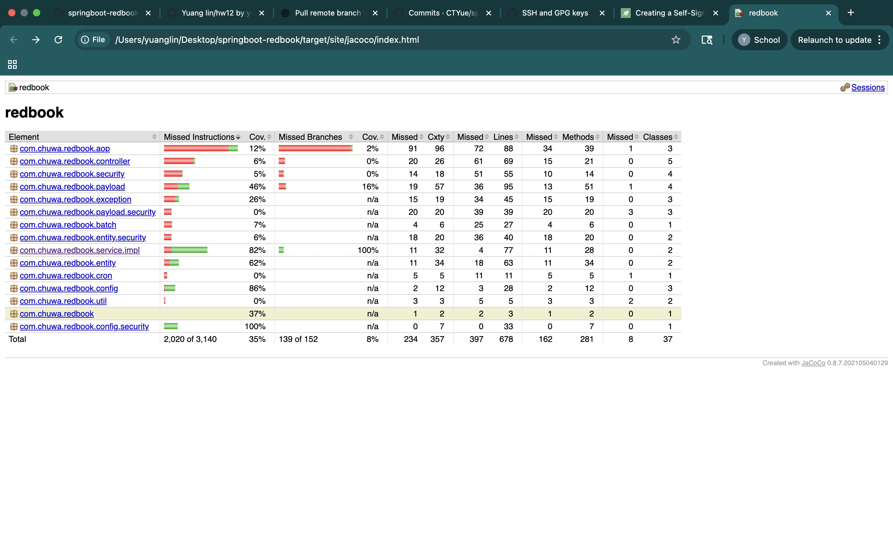
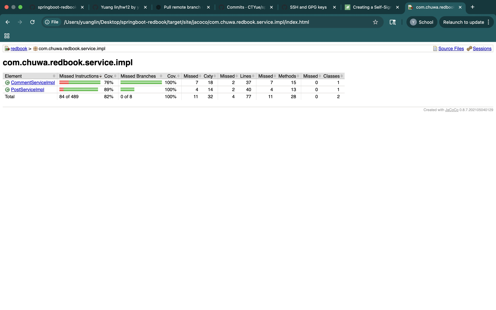

# chuwahw14

# Testing

### 1. **Unit Testing**

**What:** Tests **individual components (methods/functions)** in isolation.

**Goal:** Validate correctness of the smallest testable parts.

**Example:**

Testing a `calculateDiscount(price, userType)` method in isolation.

**Tool:** JUnit (Java), pytest (Python)

---

### 2. **Functional Testing**

**What:** Tests the system **against functional requirements**.

**Goal:** Ensure features behave as expected with valid inputs and produce correct outputs.

**Example:**

Testing a login page with correct and incorrect credentials to ensure correct redirection or error.

**Tool:** Selenium, Postman

---

### 3. **Integration Testing**

**What:** Tests **interfaces between components/modules**.

**Goal:** Verify combined parts work together (e.g., API ↔ DB, UI ↔ Backend).

**Example:**

Testing whether a user registration form correctly saves data into the database via the backend API.

**Tool:** TestNG, JUnit (for integration), Spring Boot Test

---

### 4. **Regression Testing**

**What:** Tests **existing functionality after changes** (code fixes, new features).

**Goal:** Ensure updates haven't broken existing features.

**Example:**

After adding a “coupon” feature, retest checkout flow to ensure nothing else broke.

**Tool:** Selenium, automated CI pipelines

---

### 5. **Smoke Testing**

**What:** **Basic sanity checks** to see if the system is stable enough for deeper testing.

**Goal:** Quickly identify major failures.

**Example:**

Verify app launches, login works, homepage loads — before starting detailed testing.

**Tool:** Manual or automated quick scripts

---

### 6. **Performance Testing**

**What:** Tests how the system **performs under expected load**.

**Goal:** Check response time, throughput, resource usage.

**Example:**

Test if the app can handle 500 concurrent users without lagging.

**Tool:** JMeter, Gatling, LoadRunner

---

### 7. **Stress Testing**

**What:** Tests **beyond expected capacity** to see how the system behaves under extreme conditions.

**Goal:** Determine the breaking point and recovery behavior.

**Example:**

Simulate 10,000 users hitting a website to see if it crashes gracefully.

**Tool:** JMeter, BlazeMeter

---

### 8. **A/B Testing**

**What:** Compares two versions (A and B) with real users to find which performs better.

**Goal:** Validate which version achieves higher user satisfaction or conversion.

**Example:**

Show Version A with a red “Buy” button and Version B with green, and measure which gets more clicks.

**Tool:** Google Optimize, Optimizely

---

### 9. **End-to-End Testing (E2E)**

**What:** Simulates **real-world user scenarios** from start to finish.

**Goal:** Ensure entire application workflow functions correctly.

**Example:**

Register → Login → Add to Cart → Checkout → Payment → Order Confirmation

**Tool:** Cypress, Selenium, Playwright

---

### 10. **User Acceptance Testing (UAT)**

**What:** Conducted by **end users or clients** to validate system meets business requirements.

**Goal:** Final approval before release.

**Example:**

A client tests their new HR portal to ensure it meets their internal workflow needs before go-live.

**Tool:** Manual execution with test scripts provided by QA

| Type | Scope | Performed By | Example Scenario | Purpose |
| --- | --- | --- | --- | --- |
| Unit Testing | Smallest units | Developers | Test `add(int a, int b)` | Check logic correctness |
| Functional Testing | Features | QA/Testers | Login, sign up, search | Validate business requirements |
| Integration Testing | Module interfaces | Devs/QAs | API ↔ DB ↔ UI | Ensure modules work together |
| Regression Testing | All features | QA/Automation | Rerun checkout tests after adding new feature | Prevent old bugs from resurfacing |
| Smoke Testing | Core workflows | QA | App starts, login works | Initial stability check |
| Performance Testing | Load behavior | QA/Performance Eng | 500 users hitting the system | Ensure acceptable speed |
| Stress Testing | Max load behavior | QA/Performance Eng | 10k+ users hammering the app | Find breaking point |
| A/B Testing | UI/UX variations | Product/Marketing | Red vs Green button | Measure impact of UI/UX changes |
| End-to-End Testing | Full flow | QA/Automation | User flow from login to payment | Ensure everything works together |
| User Acceptance Testing | Real usage | End Users/Clients | Validate a new HR system | Approve before production |

# Environment

## 1. **Development Environment**

**Purpose:**

Where **developers write and test code** during active development.

**Characteristics:**

- Frequently updated with new code.
- May use mock data or a local database.
- Debugging and logging enabled.
- May not be stable or secure.

**Example:**

A Java Spring Boot backend running locally on IntelliJ with an H2 in-memory database.

**Users:** Developers

---

## 2. **QA (Quality Assurance) Environment**

**Purpose:**

Used by **testers to validate functionality** before it moves closer to release.

**Characteristics:**

- Mirrors production structure more closely than development.
- Realistic (but often scrubbed) test data.
- Automated and manual tests run here (unit, integration, regression).
- Relatively stable.

**Example:**

A Dockerized version of the full app deployed on a test server, where automated test suites run after every build.

**Users:** Testers / QA engineers

---

## 3. **Pre-production / Staging Environment**

**Purpose:**

Used for **final testing and approval before release**. It simulates the production environment as closely as possible.

**Characteristics:**

- Identical or very close to production setup (same DB schema, services, cloud infrastructure).
- Can be used for UAT (User Acceptance Testing).
- May have real production data (sanitized).

**Example:**

A Spring Boot + React app deployed on AWS with the same services (e.g., MySQL, Redis, S3) as in production, accessed via a staging URL like `staging.myapp.com`.

**Users:** QA, Product Managers, End Users (for UAT)

---

## 4. **Production Environment**

**Purpose:**

The **live, customer-facing version** of the application.

**Characteristics:**

- Highly stable, monitored, and secured.
- Real user data.
- Deployed through CI/CD pipelines with change control.
- Performance optimized.

**Example:**

The actual live website `myapp.com` being used by thousands of users.

**Users:** End users, customers

| Environment | Purpose | Users Involved | Stability | Real Data | Usage |
| --- | --- | --- | --- | --- | --- |
| Development | Code writing, unit testing | Developers | Low | No | Feature creation, debugging |
| QA | Functional, integration, regression | Testers, QA engineers | Medium | Test data | Testing feature correctness |
| Pre-prod/Staging | Final testing, UAT | QA, PMs, Clients | High | Partial | Mirror production, ensure readiness |
| Production | Real-world use | Customers, End users | Very High | Yes | Actual application serving live traffic |

# Report

