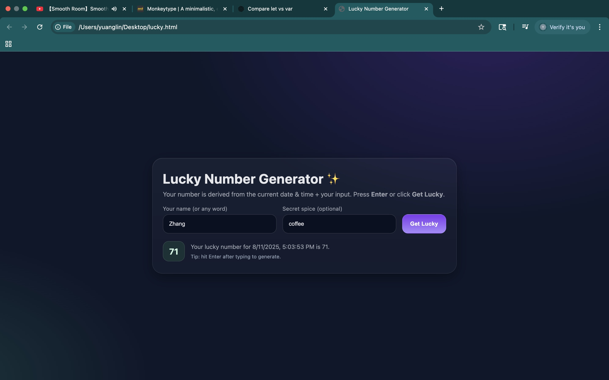
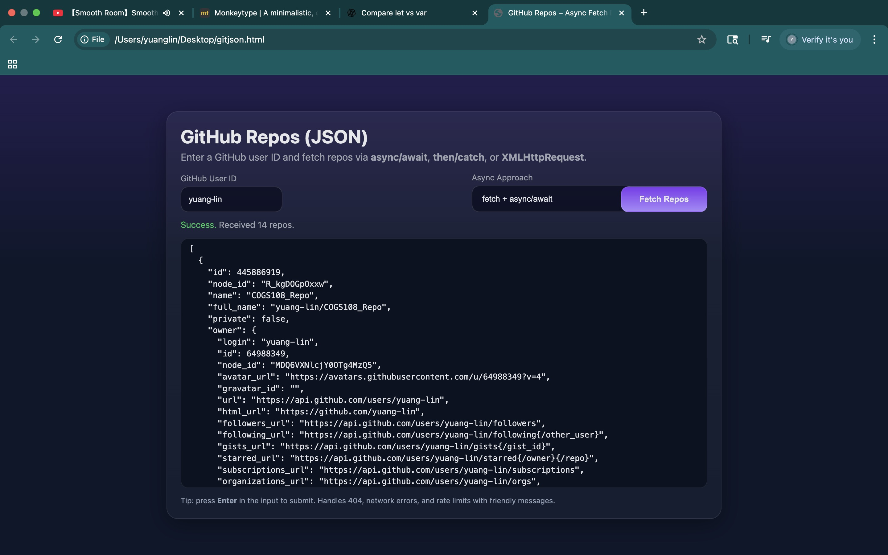

# chuwahw18

## Q1

Did it online compiler

## Q2

Did it on leetcode

## Q3

1. **Scope**
- `var` → function-scoped (or global if declared at top level), **not** block-scoped.
- `let` → **block-scoped** (`{ ... }`, `if`, `for`, `while`, etc.).

```jsx
function demoScope() {
  if (true) {
    var a = 1;
    let b = 2;
  }
  console.log(a); // 1  (var leaks out of the block)
  console.log(b); // ReferenceError: b is not defined (block-scoped)
}
demoScope();

```

**2.Redeclaration**

- `var` can be redeclared in the same scope (bad for bugs).
- `let` cannot be redeclared in the same scope.

```jsx
var x = 1;
var x = 2;     // ok

let y = 1;
let y = 2;     // SyntaxError: Identifier 'y' has already been declared

```

**3.Global object binding (in browsers)**

- Top-level `var` creates a property on `window`/`globalThis`.
- Top-level `let` does **not**.

```jsx
var g1 = 123;
let g2 = 456;

console.log(window.g1); // 123
console.log(window.g2); // undefined

```

- `var` uses one shared binding in loops.
- `let` creates a **new binding per iteration** (great for async callbacks).

```jsx
// Using var
for (var i = 0; i < 3; i++) {
  setTimeout(() => console.log('var i:', i), 0);
}
// Output: var i: 3 (three times)

// Using let
for (let j = 0; j < 3; j++) {
  setTimeout(() => console.log('let j:', j), 0);
}
// Output: let j: 0, let j: 1, let j: 2

```

## Q4

A **closure** is when a function “remembers” the variables from its **lexical scope**, even after that scope has finished executing.

This happens because functions in JavaScript carry a reference to their outer environment.

```jsx
function outer() {
  let count = 0; // variable in outer scope

  function inner() {
    count++;
    console.log(count);
  }

  return inner;
}

const counter = outer(); // outer() returns inner, `count` still exists in memory
counter(); // 1
counter(); // 2
counter(); // 3

```

## Q5

## **Definition**

**Callback Hell** happens when you have multiple asynchronous operations that depend on each other, and you nest callbacks inside callbacks inside callbacks…

The result: **deeply indented, hard-to-read, and hard-to-maintain code**.

---

### **Classic Callback Hell Example**

Imagine you want to:

1. Get user data from a server
2. Then get their orders
3. Then get shipping details for the first order
4. Then send a confirmation email

Using plain callbacks, it might look like:

```jsx
getUser(1, function(user) {
  console.log('User:', user);

  getOrders(user.id, function(orders) {
    console.log('Orders:', orders);

    getShippingDetails(orders[0], function(details) {
      console.log('Shipping:', details);

      sendEmail(user.email, details, function(result) {
        console.log('Email sent:', result);
      }, function(error) {
        console.error('Email error:', error);
      });

    }, function(error) {
      console.error('Shipping error:', error);
    });

  }, function(error) {
    console.error('Orders error:', error);
  });

}, function(error) {
  console.error('User error:', error);
});

```

## Q6

## **1. Promise**

A **Promise** is a JavaScript object that represents a value that may be **available now, later, or never** (in case of an error).

It can be in one of three states:

- **pending** → still working
- **fulfilled** → completed successfully (`resolve`)
- **rejected** → failed (`reject`)

```jsx
function fetchData() {
  return new Promise((resolve, reject) => {
    setTimeout(() => {
      const success = true;
      if (success) {
        resolve("Data loaded");
      } else {
        reject("Error loading data");
      }
    }, 1000);
  });
}

fetchData()
  .then(result => console.log(result))   // "Data loaded"
  .catch(error => console.error(error)); // if failed

```

## **2. Async / Await**

- `async` marks a function that **always returns a Promise** (even if you return a normal value).
- `await` can only be used inside an `async` function, and it **pauses** execution until the Promise is fulfilled/rejected.

Think of `await` as “**wait for this promise to finish, but don’t block the whole program**.”

```jsx
async function getData() {
  try {
    const result = await fetchData(); // pauses until resolved
    console.log(result); // "Data loaded"
  } catch (error) {
    console.error(error); // if rejected
  }
}

getData();

```

## **3. Converting Callbacks → Promises → Async/Await**

### Callback version (callback hell style)

```jsx
setTimeout(() => {
  console.log("Step 1 done");
  setTimeout(() => {
    console.log("Step 2 done");
    setTimeout(() => {
      console.log("Step 3 done");
    }, 1000);
  }, 1000);
}, 1000);

```

## **4. Parallel execution with Promise.all**

If tasks can run at the same time:

```jsx
async function runParallel() {
  const [data1, data2] = await Promise.all([
    fetchData(), 
    fetchData()
  ]);
  console.log(data1, data2); // Both finished
}
runParallel();

```

## Q7



## Q8



## Q9

# Big picture (why JS is “non-blocking”)

- JS runs on a **single thread** (one call stack).
- Long I/O, timers, and OS/browser work happen **outside** that thread (in the browser or Node’s libuv).
- When they’re done, callbacks are queued and the **event loop** decides when to run them.
- The loop alternates between running **macrotasks** and draining the **microtask** queue.

# Event Loop cycle (browser)

1. Take one **macrotask** and run it to completion (this fills and empties the **call stack**).
2. **Drain all microtasks** (run them until the microtask queue is empty).
3. (Browser only) Do rendering/layout if needed.
4. Repeat.

# What counts as a macrotask vs microtask?

| Type | Examples (browser) | When it runs |
| --- | --- | --- |
| **Macrotask** | `setTimeout`, `setInterval`, `setImmediate` (IE), message events, DOM events, network callbacks | One per tick (then microtasks drain) |
| **Microtask** | `Promise.then/catch/finally`, `queueMicrotask`, `MutationObserver` | Drained **right after** current macrotask (and also between microtasks until empty) |

Node.js adds: `process.nextTick` (runs **before** other microtasks), and event loop **phases** (timers, poll, check, etc.).