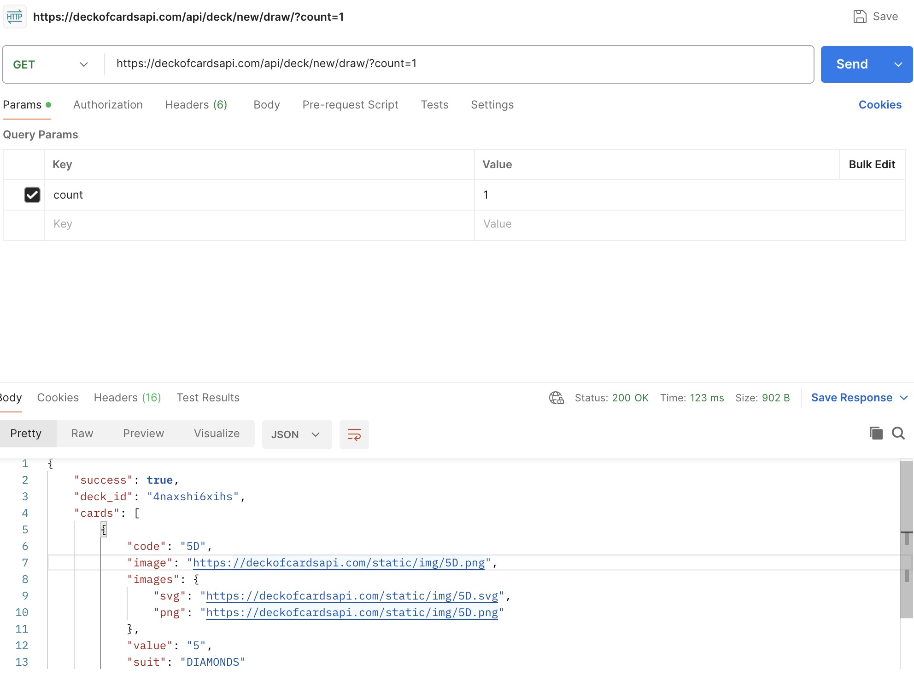
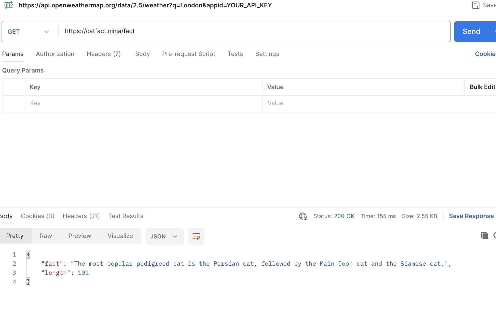
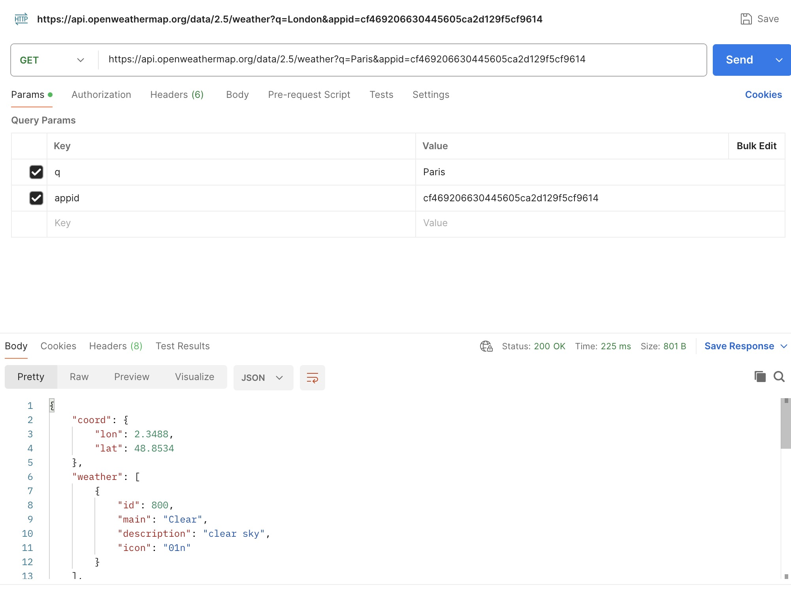
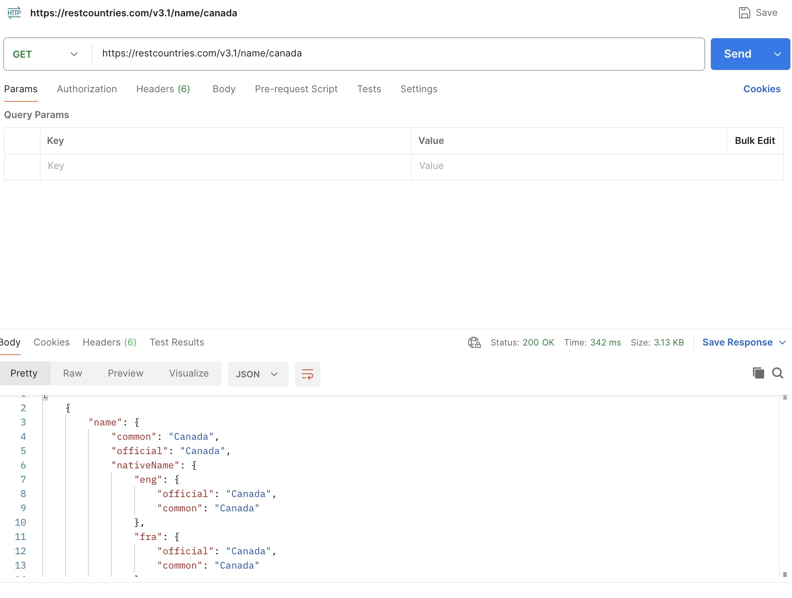
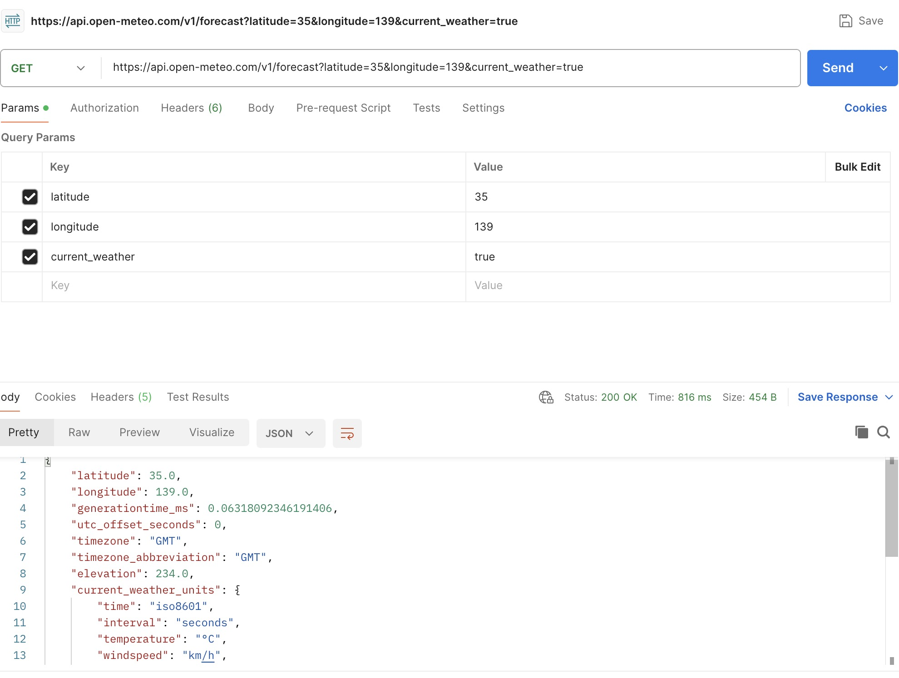

# Chuwa hw7

## Q1

**API** stands for **Application Programming Interface**. It is a set of rules and definitions that allow different software applications to **communicate with each other**.

- **Connect Different Systems**
    
    APIs let different apps, platforms, or services talk to each other — even if they're built in different languages or run on different machines.
    
- **Simplify Development**
    
    Developers can use existing APIs instead of building everything from scratch. Example: using Google Maps API to add maps to your app.
    
- **Improve Security**
    
    APIs expose only certain parts of a system, hiding the internal logic and data. This reduces the chance of misuse or hacking.
    
- **Enable Integration**
    
    APIs allow services like PayPal, Twitter, or Spotify to be embedded into other websites and apps.
    
- **Encourage Modularity**
    
    Systems can be broken into smaller, manageable services (like microservices), each accessed via an API.
    

## Q2

| Feature | **Developer API** | **Application API** |
| --- | --- | --- |
| **Definition** | APIs designed to be used **by developers** to build or integrate software | APIs used **within applications** to allow internal components or apps to interact |
| **Audience** | External or internal **developers** | The **application itself**, often hidden from end users |
| **Purpose** | Expose functionality or services for building apps | Enable communication **within** the app or between internal modules |
| **Examples** | - Twitter API for tweets- Stripe API for payments | - Android's Activity API- Java Collections API |
| **Visibility** | Often public or restricted-access for third-party devs | Internal, part of application SDKs or libraries |
| **Format** | Often **web-based (REST, GraphQL)** APIs | Often **language-based (Java, C#, etc.)** APIs (class/method-based) |
| **Used for** | Extending functionality externally or integrating systems | Structuring and organizing app features internally |

## Q3

| Type | Description |
| --- | --- |
| **REST API** | Uses HTTP; easy to use, stateless, most common web API style. |
| **SOAP API** | Protocol-based; strict structure using XML; used in enterprise systems. |
| **GraphQL API** | Query language for APIs; allows clients to ask for exactly the data they need. |
| **gRPC API** | High-performance, contract-based APIs using Protocol Buffers (used by Google). |

## Q4

| Feature | **Path Variables** | **Request Parameters (Query Params)** |
| --- | --- | --- |
| **Location** | Part of the **URL path** | Part of the **query string**, after `?` in the URL |
| **Usage** | Used to identify a **specific resource** | Used to **filter, sort, or paginate** data |
| **Format** | `/users/{id}` → `/users/42` | `/users?age=25&sort=asc` |
| **Required?** | Usually **required** | Often **optional** |
| **Use Case** | - Get user by ID- Get order by ID | - Search/filter users- Sort or paginate results |
| **Example URL** | `GET /books/123` | `GET /books?author=tolkien&year=1954` |
| **Defined In** | Route/path definition (`@PathVariable` in Spring) | Query string (`@RequestParam` in Spring) |
| **Can Have Multiple?** | Yes, but usually limited (e.g., `/users/{userId}/posts/{postId}`) | Yes, and you can pass many key-value pairs |

## Q5

1. Http methods: Define the type of action to perform on a resource
2. Endpoints: Unique address used to access a resource
3. Resources:The actual **data objects** being accessed or manipulated.
4. Http Status Code: Communicate the result of API call
5. Headers: Send **metadata** with requests/responses.
6. Request Body: Used in `POST`, `PUT`, `PATCH` to send data **to the server**
7. Response Body: The **data returned** by the server, typically in JSON.
8. Authentication & Authorization: Secures the API — determines *who* can do *what*.

## Q6

**cURL** (Client URL) is a **command-line tool** used to send requests to URLs — commonly used to test **REST APIs**.

| Feature | **Postman** | **cURL** (Command-Line) |
| --- | --- | --- |
| 🔍 **User Interface** | Easy-to-use GUI | Text-based CLI |
| 📚 **History & Collections** | Save, group, and reuse requests easily | You must save commands manually |
| 🛠️ **Testing Features** | Built-in tests, assertions | Requires scripting to validate |
| 🧪 **Automation** | Has scripting (pre-request & test tabs) | Needs external scripts |
| 📄 **Visual Response Viewer** | Pretty JSON, headers, status info | Plain terminal output |
| 🔐 **Auth Handling** | Built-in auth support (OAuth, API keys) | Must manually add headers |
| 🌐 **Multi-Environment Support** | Use variables for dev/prod/test APIs | Not built-in |

## Q7

| Code | Meaning | Use Case |
| --- | --- | --- |
| `200` | OK | Successful `GET`, `PUT`, etc. |
| `201` | Created | Successful `POST` |
| `400` | Bad Request | Missing/invalid input |
| `401` | Unauthorized | Invalid or missing auth |
| `404` | Not Found | Resource doesn't exist |
| `500` | Internal Server Error | Server-side error |

## Q8

| HTTP Method | Purpose | Common Status Codes |
| --- | --- | --- |
| `GET` | Retrieve data | `200`, `404`, `401` |
| `POST` | Create data | `201`, `400`, `409`, `401` |
| `PUT` | Replace data | `200`, `204`, `400`, `404` |
| `PATCH` | Update data | `200`, `204`, `400`, `404` |
| `DELETE` | Remove data | `200`, `204`, `404` |
| `OPTIONS` | Method check | `204` with `Allow` header |

## Q9

| Benefit | Explanation |
| --- | --- |
| **Scalability** | Servers can handle more requests since they don't track client state. Easy to add more servers (load balancing). |
| **Simplicity** | Each request is simple and self-contained. No complex session handling logic needed. |
| **Reliability** | Crashes or restarts don’t affect session data — because there is none. |
| **Cacheability** | Since requests are independent, responses can be cached more easily. |
| **Decoupling** | Client and server stay loosely coupled — they don't rely on ongoing "sessions." |

## Q10

- **Use Proper HTTP Methods**
    
    Follow REST conventions (`GET`, `POST`, `PUT`, `DELETE`, `PATCH`) to ensure compatibility with tools and optimizations (like caching and proxies).
    
- **Enable HTTP Caching**
    
    Use headers like `Cache-Control`, `ETag`, and `Last-Modified` to avoid unnecessary server hits for unchanged resources.
    
- **Implement Pagination for Large Responses**
    
    Break down large datasets:
    
    ```
    bash
    CopyEdit
    GET /users?page=2&limit=50
    
    ```
    
    This reduces memory usage, network transfer time, and improves client-side performance.
    
- **Compress Responses**
    
    Enable GZIP or Brotli on the server to reduce payload size — especially important for large JSON bodies.
    
- **Support Partial Responses (Field Filtering)**
    
    Allow clients to request only the fields they need:
    
    ```
    bash
    CopyEdit
    GET /users?fields=id,name,email
    
    ```
    
- **Use Asynchronous Processing for Heavy Tasks**
    
    For long-running operations, respond with `202 Accepted` and provide a status-check URL:
    
    ```json
    json
    CopyEdit
    {
      "statusUrl": "/jobs/12345/status"
    }
    
    ```
    
- **Avoid Overfetching and Underfetching**
    
    Design endpoints that return exactly what the client needs. Consider GraphQL or custom query parameters if flexibility is critical.
    
- **Link Related Resources**
    
    Instead of forcing clients to make multiple calls, return useful links in responses (HATEOAS-style):
    
    ```json
    json
    CopyEdit
    {
      "userId": 1,
      "orders": "/users/1/orders"
    }
    
    ```
    
- **Implement Rate Limiting**
    
    Protect your service from abuse and overload using headers like:
    
    ```
    yaml
    CopyEdit
    X-RateLimit-Limit: 1000
    X-RateLimit-Remaining: 998
    Retry-After: 60
    
    ```
    
- **Use Lightweight Authentication (e.g., JWT)**
    
    Avoid slow session lookups. Use stateless tokens, and cache user roles or permissions where possible.
    
- **Monitor and Optimize Continuously**
    
    Track latency, error rates, and payload sizes. Use APM tools (e.g., New Relic, Datadog) and log analysis to identify bottlenecks.
    

## Q11

| Aspect | **XSS** | **CSRF** |
| --- | --- | --- |
| Target | User's browser | Authenticated user actions |
| Attack Vector | Malicious script injection | Trick browser into sending requests |
| Goal | Run attacker code in user browser | Perform actions as the user |
| Key Prevention | Sanitize input, escape output, CSP | CSRF tokens, SameSite cookies |

# API practice

## Q1

See Screenshots

## Q2

For goolge api or openweather apis, they use pretty good api designs. But for some personal developed apis, they are very simple but may not be the best designs. They may need authorizations and link related resources.

## Q3

1. Random Cat Facts

```bash
curl https://catfact.ninja/fact
```

1. openweather get weather (change the key to the correct key)

```bash
curl "https://api.openweathermap.org/data/2.5/weather?q=London&appid=YOUR_API_KEY"

```

1. Rest Country API 

```bash
curl https://restcountries.com/v3.1/name/canada
```

1. return weather by latitude and longitude 

```bash
curl "https://api.open-meteo.com/v1/forecast?latitude=35&longitude=139&current_weather=true"
```

1. Draw a random card from shuffled deck 

```bash
curl https://deckofcardsapi.com/api/deck/new/draw/?count=1
```











## Q4

openmeteo:

request:

| Header | Meaning |
| --- | --- |
| `Postman-Token` | Auto-generated for each request (used internally by Postman) |
| `Host` | Calculated automatically (target API host) |
| `User-Agent` | Identifies the client: `PostmanRuntime/7.44.0` |
| `Accept` | `*/*` means it accepts any response type |
| `Accept-Encoding` | Tells the server the client can handle `gzip`, `deflate`, `br` |
| `Connection` | `keep-alive` keeps the TCP connection open |

response:

| Key | Value |
| --- | --- |
| `Status` | `200 OK` — **Success** 🎉 |
| `Time` | `816 ms` — Response time |
| `Size` | `454 B` — Response size |
| `Content-Type` | `application/json; charset=utf-8` — JSON response |
| `Transfer-Encoding` | `chunked` — Server sends data in chunks |
| `Connection` | `keep-alive` — Connection reused |
| `Content-Encoding` | `deflate` — Response was compressed using deflate |

Cat Facts:

Request:

| Header | Explanation |
| --- | --- |
| `Cookie` | Sends stored cookies (e.g., `XSRF-TOKEN`) used for security (to prevent **CSRF** attacks). |
| `Postman-Token` | Automatically generated by Postman to uniquely identify the request (helps avoid duplicate caching). |
| `Host` | Automatically calculated — tells the server which domain the request is meant for (e.g., `api.example.com`). |
| `User-Agent` | Identifies the client making the request. Here: `PostmanRuntime/7.44.0`. |
| `Accept` | Tells the server what type of response is acceptable. `*/*` means any type is fine. |
| `Accept-Encoding` | Indicates which compression algorithms the client can handle (`gzip`, `deflate`, `br`). |
| `Connection` | `keep-alive` asks the server to keep the TCP connection open for additional requests (improves performance). |

Response:

| Header | Explanation |
| --- | --- |
| `Date` | The date/time when the server responded. |
| `Content-Type` | Describes the type of content returned: `application/json` means the response is in JSON format. |
| `Transfer-Encoding` | `chunked` means the response was sent in parts (not one big block). Useful for streaming. |
| `Connection` | `keep-alive` means the server kept the TCP connection open for reuse. |
| `Server` | Identifies the server software or CDN (here, it's **Cloudflare**, a popular CDN and security layer). |
| `Cache-Control` | `no-cache, private` means the response should not be stored by public caches (like shared proxies). |
| `X-Ratelimit-Limit` | Indicates the total number of requests allowed per time window (e.g., 100 per minute or hour). |
| `X-Ratelimit-Remaining` | Shows how many requests you have left before hitting the limit (here, 99 remaining). |

Open Weather

Request:

| Header | Value | Explanation |
| --- | --- | --- |
| `Postman-Token` | `<calculated>` | Unique ID generated for each request by Postman (prevents caching issues). |
| `Host` | `<calculated>` | The domain of the API server, automatically set. |
| `User-Agent` | `PostmanRuntime/7.44.0` | Identifies the client (Postman here). |
| `Accept` | `*/*` | Client accepts any content type in the response. |
| `Accept-Encoding` | `gzip, deflate, br` | Tells the server what compression methods the client supports. |
| `Connection` | `keep-alive` | Client requests to keep the TCP connection open. |

Response:

| Header | Value | Explanation |
| --- | --- | --- |
| `Date` | `Fri, 27 Jun 2025 22:50:16 GMT` | Timestamp when the server responded. |
| `Content-Type` | `application/json; charset=utf-8` | The response is in JSON format. |
| `Content-Length` | `500` | Size of the response body (in bytes). |
| `Connection` | `keep-alive` | Server is keeping the connection open. |
| `X-Cache-Key` | `/data/2.5/weather?q=paris` | A cache key used to identify the request (may be internal). |
| `Access-Control-Allow-Origin` | `*` | CORS: Allows requests from any domain (good for public APIs). |
| `Access-Control-Allow-Credentials` | `true` | Indicates credentials (like cookies) are allowed in cross-origin requests. |
| `Access-Control-Allow-Methods` | `GET, POST` | Server allows `GET` and `POST` methods for cross-origin calls. |

Shuffle Deck of Cards

Request:

| Header | Value | Explanation |
| --- | --- | --- |
| `Postman-Token` | `<calculated>` | Auto-generated unique token to avoid caching |
| `Host` | `<calculated>` | Destination server domain (auto-set) |
| `User-Agent` | `PostmanRuntime/7.44.0` | Identifies the client (Postman runtime version) |
| `Accept` | `*/*` | Accept all response types |
| `Accept-Encoding` | `gzip, deflate, br` | Allows compressed responses to reduce size |
| `Connection` | `keep-alive` | Reuse TCP connection to improve performance |

Response:

| Header | Value | Explanation |
| --- | --- | --- |
| `Date` | `Fri, 27 Jun 2025 22:52:31 GMT` | Server response time |
| `Content-Type` | `application/json` | Response is in JSON |
| `Transfer-Encoding` | `chunked` | Response sent in chunks |
| `Connection` | `keep-alive` | Server keeps connection open |
| `Server` | `cloudflare` | Response delivered by Cloudflare CDN |
| `NEL` | `{"report_to":"cf-nel",...}` | Network Error Logging policy (used for debugging/reporting) |
| `Access-Control-Allow-Origin` | `*` | CORS: any origin can access this API |
| `X-Content-Type-Options` | `nosniff` | Prevents browsers from MIME-type sniffing (security feature) |

Rest Countries API

Request:

| Header | Value | Explanation |
| --- | --- | --- |
| `Postman-Token` | `<calculated>` | Unique ID generated by Postman to prevent cached responses. |
| `Host` | `<calculated>` | Automatically determined domain of the API. |
| `User-Agent` | `PostmanRuntime/7.44.0` | Identifies the client; here it's Postman. |
| `Accept` | `*/*` | The client will accept any content type. |
| `Accept-Encoding` | `gzip, deflate, br` | Client supports compressed response formats. |
| `Connection` | `keep-alive` | Keeps the TCP connection open for reuse. |

Response:

| Header | Value | Explanation |
| --- | --- | --- |
| `Server` | `nginx/1.22.1` | The API is hosted behind an Nginx server. |
| `Date` | `Fri, 27 Jun 2025 22:50:06 GMT` | Time the server responded. |
| `Content-Type` | `application/json` | The response is in JSON format. |
| `Content-Length` | `2999` | Size of the response body in bytes (2.93 KB). |
| `Connection` | `keep-alive` | Server also wants to keep the connection open. |
| `Cache-Control` | `public, immutable, max-age=31556926` | Browser and proxies can cache this response for ~1 year. |
