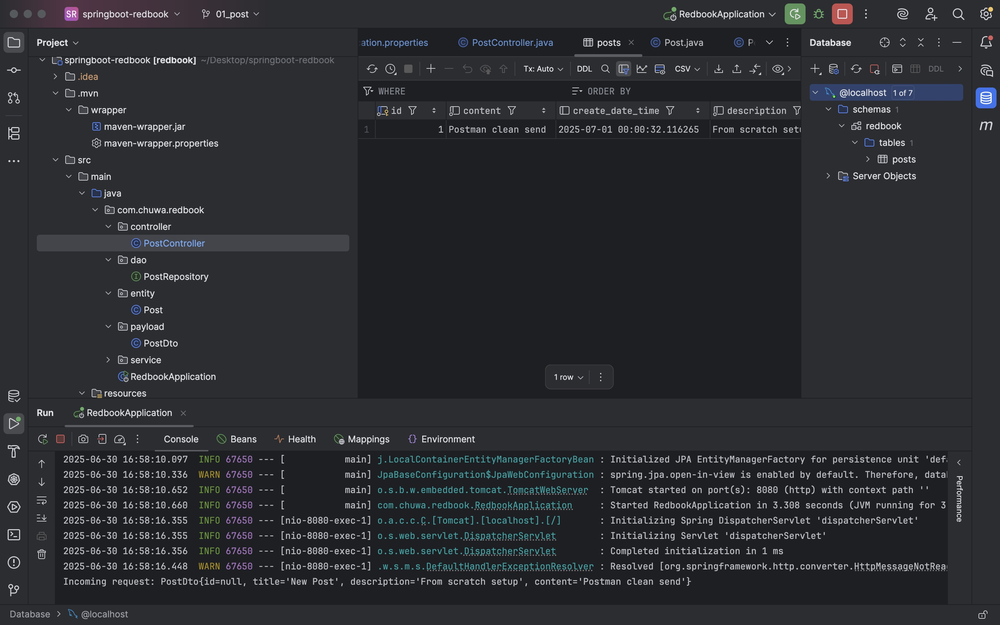

# Chuwa HW8

# Part 1

- **You create `student` first**, but `student` references `department` via a foreign key — and `department` doesn’t exist yet.
- **You create `school` next**, which is fine.
- **Then you create `department`**, which references `school` — but since `student` was created first, this causes a **dependency violation**.
- **You insert duplicate primary keys** (`student_id = 1002`), which causes errors.
- **You insert `dept_id = 666` into `student`**, which doesn’t exist in `department`, causing a **foreign key violation**.
- **You insert incomplete/invalid values** (like `'Nayina', 111`), which don’t match the column types.

# Part 2

In relational databases:

- **Data is split across multiple tables** (for normalization)
- `JOIN` lets you **recombine** that data using related keys (like `dept_id`, `school_id`)

For example:

- Student → has a `dept_id`
- Department → has the `dept_id` + `school_id`
- School → has the `school_id`

To get a student's full profile (name, department, school), you need to JOIN these tables.

| Use `JOIN` When You Want To... | JOIN Type |
| --- | --- |
| Get only matched rows in both tables | `INNER JOIN` |
| Keep all rows from the first (left) table | `LEFT JOIN` |
| Keep all rows from the second (right) table | `RIGHT JOIN` |
| Combine all rows from both, even unmatched ones | `FULL JOIN` (via `UNION`) |

# Part 3

1. I didn’t create the table Posts, **Spring Data JPA + Hibernate** created the `posts` table **automatically** based on your `@Entity` class `Post`.
2. I didn’t send my id in the request. But it automatically use number 1, i believe it is auto increasing id.

