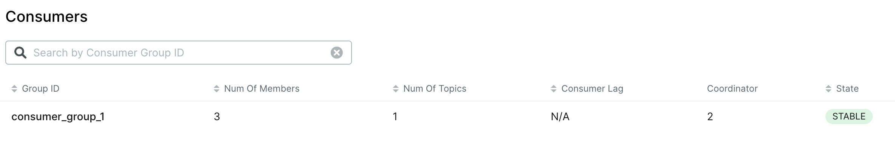
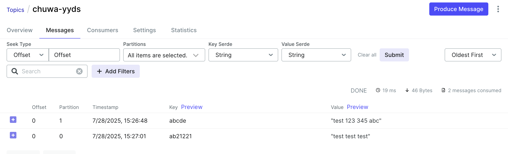
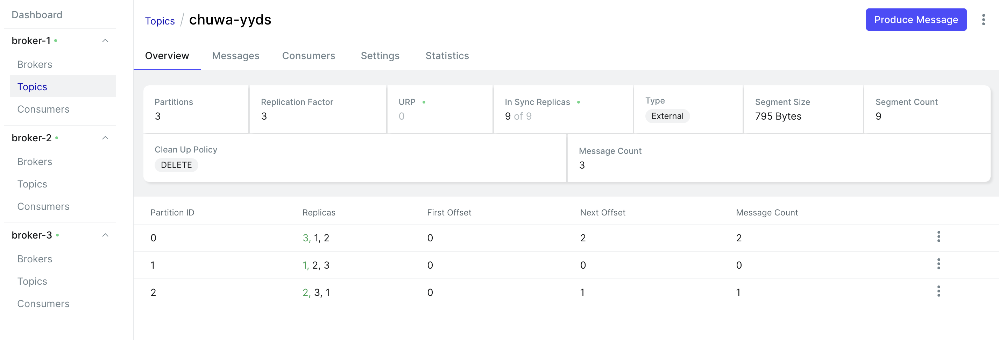
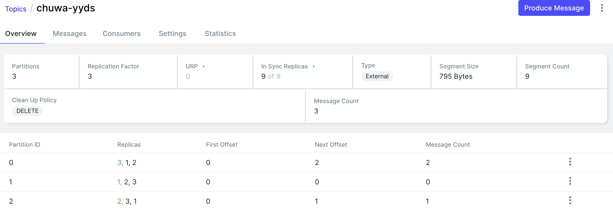
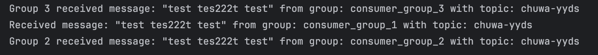
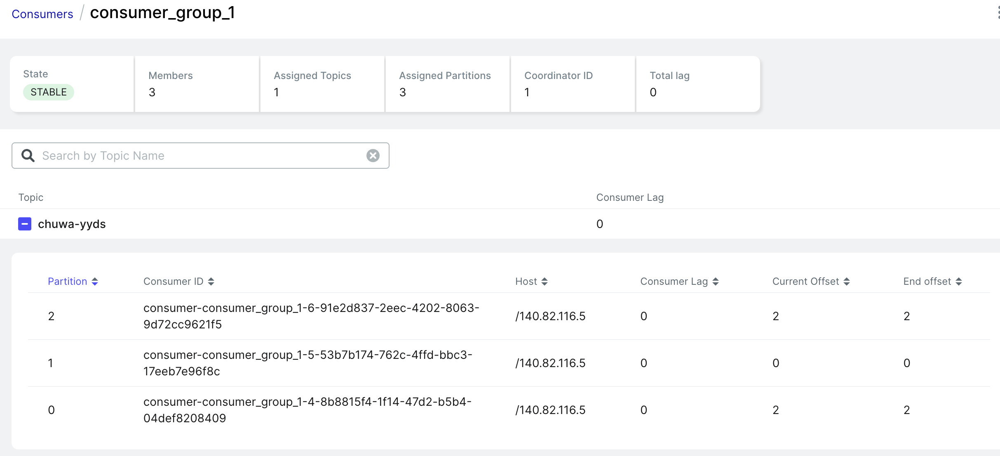
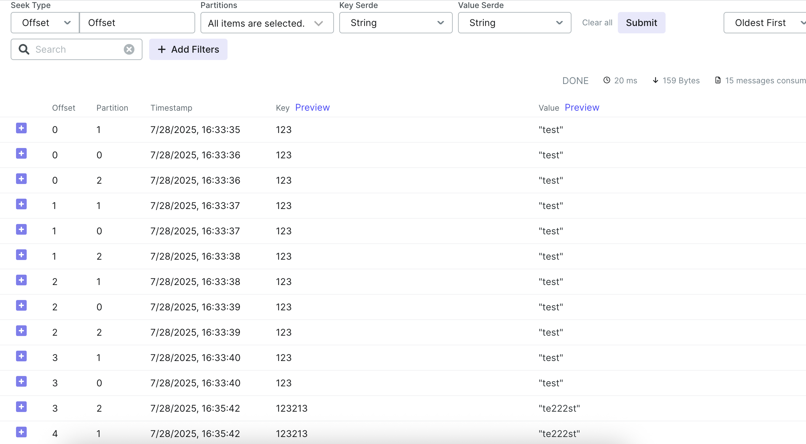

1. 
    ```
        @Bean
        public ConcurrentKafkaListenerContainerFactory<String, String>
        kafkaListenerContainerFactory() {
    
            ConcurrentKafkaListenerContainerFactory<String, String> factory =
                    new ConcurrentKafkaListenerContainerFactory<>();
            factory.setConsumerFactory(consumerFactory());
            factory.setConcurrency(3);//Set 5 individual consumers within a consumer group
            return factory;
        }
    ```
    
    
    
    

2. 
    Some consumers be in idle state with no assigned partitions(each partition can be assigned to only one consumer). Topic has 3 partitions and number of consumers > number of partitions.
3. 
   ```
    @Bean
    public ConsumerFactory<String, String> consumerFactory1() {
        Map<String, Object> props = new HashMap<>();
        props.put(
                ConsumerConfig.BOOTSTRAP_SERVERS_CONFIG,
                bootstrapServers);
        props.put(
                ConsumerConfig.GROUP_ID_CONFIG,
                "consumer_group_2");
        props.put(
                ConsumerConfig.KEY_DESERIALIZER_CLASS_CONFIG,
                StringDeserializer.class);
        props.put(
                ConsumerConfig.VALUE_DESERIALIZER_CLASS_CONFIG,
                StringDeserializer.class);
        return new DefaultKafkaConsumerFactory<>(props);
    }

    @Bean
    public ConsumerFactory<String, String> consumerFactory2() {
        Map<String, Object> props = new HashMap<>();
        props.put(
                ConsumerConfig.BOOTSTRAP_SERVERS_CONFIG,
                bootstrapServers);
        props.put(
                ConsumerConfig.GROUP_ID_CONFIG,
                "consumer_group_3");
        props.put(
                ConsumerConfig.KEY_DESERIALIZER_CLASS_CONFIG,
                StringDeserializer.class);
        props.put(
                ConsumerConfig.VALUE_DESERIALIZER_CLASS_CONFIG,
                StringDeserializer.class);
        return new DefaultKafkaConsumerFactory<>(props);
    }
    ```
   ```
   @Bean
    public ConcurrentKafkaListenerContainerFactory<String, String>
    kafkaListenerContainerFactory1() {

        ConcurrentKafkaListenerContainerFactory<String, String> factory =
                new ConcurrentKafkaListenerContainerFactory<>();
        factory.setConsumerFactory(consumerFactory1());
        factory.setConcurrency(2);//Set 5 individual consumers within a consumer group
        return factory;
    }

    @Bean
    public ConcurrentKafkaListenerContainerFactory<String, String>
    kafkaListenerContainerFactory2() {

        ConcurrentKafkaListenerContainerFactory<String, String> factory =
                new ConcurrentKafkaListenerContainerFactory<>();
        factory.setConsumerFactory(consumerFactory2());
        factory.setConcurrency(1);//Set 5 individual consumers within a consumer group
        return factory;
    }
   ```
    ```
   
    @KafkaListener(topics = "${kafka.topic.name}", groupId = "consumer_group_2")
    public void listenGroupFoo1(String message) {
        System.out.println("Group 2 received message: " + message + " from group: consumer_group_2 with topic: " + topic);
    }

    @KafkaListener(topics = "${kafka.topic.name}", groupId = "consumer_group_3")
    public void listenGroupFoo2(String message) {
        System.out.println("Group 3 received message: " + message + " from group: consumer_group_3 with topic: " + topic);
    }
   ```
   
    
   Offsets are incremented individually by each group
4. 
   All groups are reading content from chuwa_yyds topic.
    
5.
   1. At Most Once:
      1. Consumer commits offsets before message processing. 
      2. If failure occurs, the message will be lost.
   
   ```
   spring.kafka.listener.ack-mode=RECORD
    spring.kafka.consumer.enable-auto-commit=true
   ```
   ```
   @KafkaListener(
    topics = "${kafka.topic.name}",
    groupId = "consumer_group_1",
    containerFactory = "group1Factory")
    public void listenGroup1(String message) {
    System.out.println("Group 1 received: " + message);
    if (message.contains("test")) throw new RuntimeException("Simulated failure");
    }
    ```
   In this case, if a message contains test, it will throw an error and the message will be lost.
   2. At Least Once (preferred)
      1. Kafka commits offset after successful message processing. 
      2. If failure occurs before commit, then Kafka will redeliver the message and consumer can reprocessed the message.
   ```
   spring.kafka.listener.ack-mode=RECORD
   spring.kafka.consumer.enable-auto-commit=false  
   ```
   ```
   ack.acknowledge(); // use ack.acknowledge() for redelivery if crash happens.
   ```
   3. Exactly Once 
      1. No loss, no duplicates. 
      2. Requires **Kafka transaction** on producer. 
      3. The consumer needs idempotency and/or transactional guarantees.
6.  
   Added Round Robin logic
   ```
   configProps.put(ProducerConfig.PARTITIONER_CLASS_CONFIG, "org.apache.kafka.clients.producer.RoundRobinPartitioner");
   ```
   
   messages are received in 1->0->2 order