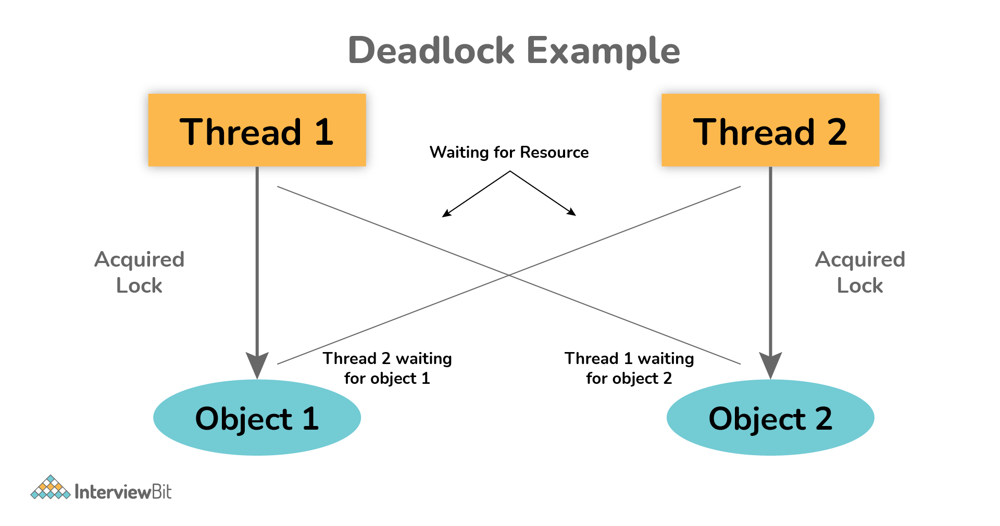

### Short Questions

# 2. Write a thread-safe singleton class 

## 1. Eager Initialization
```java
public class Singleton {
    private static final Singleton instance = new Singleton();

    private Singleton() {
        // private constructor
    }

    public static Singleton getInstance() {
        return instance;
    }
}
```

- Thread-safe by default because the instance is created at class loading time.

- Downside: Instance is created even if it's never used.

## 2. Lazy Initialization with `synchronized` Method
```java
public class Singleton {
    private static Singleton instance;

    private Singleton() {
        // private constructor
    }

    public static synchronized Singleton getInstance() {
        if (instance == null) {
            instance = new Singleton();
        }
        return instance;
    }
}
```
- Thread-safe, but the synchronized keyword makes it slower, especially after the instance is initialized.

## 3. Double-Checked Locking (Efficient and Thread-safe)

```java
public class Singleton {
    private static volatile Singleton instance;
    private Singleton(){

    }
    public static Singleton getInstance(){
        if(instance == null){
            synchronized(Singleton.class){
                if(instance == null){
                    instance=new Singleton();
                }
            }
        }
    }
}
```
- Uses volatile to prevent instruction reordering.

- Best balance of laziness, performance, and thread safety.
### Why is this faster?
**Without Double-Check: Always Synchronized:**
```java
public static synchronized Singleton getInstance() {
    if (instance == null) {
        instance = new Singleton();
    }
    return instance;
}
```
- Every call to getInstance() is synchronized.

- Synchronization is slow compared to a plain method call — it causes a performance hit, especially when many threads are calling it frequently after the singleton is already initialized.

**With Double-Checked Locking:**

- First check (if (instance == null)) happens without any lock.

- This allows fast access to the instance after it's initialized.

- Synchronization (synchronized) only happens once, when the instance is created.

- Second check inside the synchronized block prevents multiple initializations if two threads hit it simultaneously.
### Why volatile is necessary?
Without volatile, a thread might see a partially constructed object due to instruction reordering. volatile prevents this by ensuring:

Writes to instance happen after the constructor finishes.

All threads see the same state of the object.

## 4. Initialization-on-demand Holder Idiom (Best Practice)

```java
public class Singleton {
    private Singleton() {
        // private constructor
    }

    private static class Holder {
        private static final Singleton instance = new Singleton();
    }

    public static Singleton getInstance() {
        return Holder.instance;
    }
}
```
- Uses Java’s **class loading mechanism** to ensure thread safety.

- Lazy-loaded and no synchronization overhead.

|Method|	Thread-Safe|	Lazy|	Performance|	Recommended|
|------|------|------|------|------|
|Eager Initialization|	Yes|	No|	High|	If instance always used|
|Synchronized Method|	Yes|	Yes|	Low|	No
|Double-Checked Locking|	Yes|	Yes|	High|	Yes|
|Holder Class Idiom|	Yes|	Yes|	High|	✅ Best Choice|

# 3. How to create a new thread(Please also consider Thread Pool approach)?
## Create Manually:

###  1. Extend Thread class
```java
class MyThread extends Thread {
    public void run() {
        System.out.println("Thread is running.");
    }
}

public class Main {
    public static void main(String[] args) {
        Thread t = new MyThread();
        t.start();  // Starts a new thread
    }
}
```

### 2. Implement Runnable interface

```java
class MyRunnable implements Runnable {
    public void run() {
        System.out.println("Thread is running.");
    }
}

public class Main {
    public static void main(String[] args) {
        Thread t = new Thread(new MyRunnable());
        t.start();
    }
}
```

### 3. Lambda (since Java 8)
```java
public class Main {
    public static void main(String[] args) {
        Thread t = new Thread(() -> {
            System.out.println("Thread is running.");
        });
        t.start();
    }
}
```
## 2. Using a Thread Pool (ExecutorService)
Thread pools are more efficient for managing many short-lived threads.
```java
import java.util.concurrent.ExecutorService;
import java.util.concurrent.Executors;

public class Main {
    public static void main(String[] args) {
        ExecutorService executor = Executors.newFixedThreadPool(3); // 3 threads

        for (int i = 0; i < 5; i++) {
            int taskId = i;
            executor.submit(() -> {
                System.out.println("Running task " + taskId);
            });
        }

        executor.shutdown(); // Graceful shutdown
    }
}
```
### Common thread pool types:

|Executor Type|	Return Type |Usage|
|------|------|------|
|Executors.newFixedThreadPool(n)| static ExecutorService |	Fixed number of threads|
|Executors.newCachedThreadPool()| static ExecutorService |	Auto-adjusting thread count (flexible)|
|Executors.newSingleThreadExecutor()| static ExecutorService |	One thread (sequential tasks)
|Executors.newScheduledThreadPool(int corePoolSize)| static ScheduledExecutorService |	For scheduled/delayed tasks|

|Method|	When to Use|
|------|-----|
|Thread / Runnable|	Simple, quick one-off tasks|
|ExecutorService|	Production, scalable workloads|

# 4. Difference between Runnable and Callable?

|Runnable Interface|	Callable Interface |
|------|-----|
|It does not return any result and therefore, cannot throw a checked exception. |	It returns a result and therefore, can throw an exception.|
|It cannot be passed to invokeAll* method. |	It can be passed to invokeAll* method.|
|It was introduced in JDK 1.0.	|It was introduced in JDK 5.0, so one cannot use it before Java 5. |
|It simply belongs to Java.lang.|	It simply belongs to java.util.concurrent. |
|It uses the run() method to define a task.|	It uses the call() method to define a task.| 
|To use this interface, one needs to override the run() method. |	To use this interface, one needs to override the call() method.|

```
*
The invokeAll method in Java is a part of the ExecutorService interface within the java.util.concurrent package. It is designed for executing a collection of Callable tasks concurrently and waiting for their completion.

Java 中的 invokeAll 方法是 java.util.concurrent 包中 ExecutorService 接口的一部分。它旨在并发执行一组 Callable 任务并等待它们完成。
```

# 5. What is the difference between t.start() and t.run()?

start(): In simple words, the start() method is used to start or begin the execution of a newly created thread. When the start() method is called, a **new thread** is created and this newly created thread executes the task that is kept in the run() method. One can call the start() method only once.  

run(): In simple words, the run() method is used to start or begin the execution of the same thread. When the run() method is called, **no** new thread is created as in the case of the start() method. This method is executed by the current thread. One can call the run() method multiple times.

# 6. Which way of creating threads is better: Thread class or Runnable interface?

Implementing Runnable is generally preferred over extending Thread for several key reasons:
实现 Runnable 通常比扩展 Thread 更可取，原因如下：
 
- Flexibility and Multiple Inheritance: Java supports single inheritance, meaning a class can only extend one class. If you extend the Thread class, your class cannot extend any other class, limiting its flexibility. By implementing the Runnable interface, your class can still extend another class if needed, offering more design options.
<br>灵活性和多重继承：Java 支持单继承，这意味着一个类只能扩展一个类。如果扩展 Thread 类，则类无法扩展任何其他类，从而限制其灵活性。通过实现 Runnable 接口，你的类仍然可以在需要时扩展另一个类，从而提供更多的设计选项。

- Separation of Concerns: Implementing Runnable separates the task you want to execute from the thread management itself. The Runnable object defines the "what" (the task), and the Thread object handles the "how" (the execution). This promotes better object-oriented design and makes your code more modular and reusable. You can easily reuse the same Runnable object with different threads.
<br>关注点分离：实现 Runnable 将要执行的任务与线程管理本身分开。Runnable 对象定义 “什么” （任务），而 Thread 对象处理 “如何” （执行）。这促进了更好的面向对象的设计，并使代码更加模块化和可重用。您可以轻松地将同一个 Runnable 对象用于不同的线程。
- Compatibility with Executor Framework: The ExecutorService and Executors framework, the recommended way to manage thread pools in modern Java, primarily works with Runnable or Callable tasks. Using Runnable makes your code compatible with these advanced concurrency tools, leading to more efficient thread management and resource utilization.
<br>与 Executor 框架的兼容性：ExecutorService 和 Executors 框架是在现代 Java 中管理线程池的推荐方法，主要适用于可运行或可调用的任务。使用 Runnable 可以使您的代码与这些高级并发工具兼容，从而提高线程管理和资源利用率。
- Reusability: A single instance of a Runnable implementation can be shared among multiple threads, allowing them to share the same resources and state. This is particularly useful for tasks that involve shared resources and reduces memory consumption.
<br>可重用性：Runnable 实现的单个实例可以在多个线程之间共享，从而允许它们共享相同的资源和状态。这对于涉及共享资源和减少内存消耗的任务特别有用。
 
Extending Thread can be a suitable choice when:
<br>在以下情况下，扩展 Thread 可能是一个合适的选择：
 
- You need to quickly create and manage a thread for a simple task.
<br>您需要为简单任务快速创建和管理线程。

- You need to customize the thread's behavior or properties, such as its name or priority.
<br>您需要自定义线程的行为或属性，例如其名称或优先级。
- You want to directly access thread-specific methods like getName() or interrupt().
<br>您希望直接访问特定于线程的方法，如 getName() 或 interrup()。
 
In summary, while both approaches are valid, implementing Runnable is generally considered the better and more flexible approach for creating threads in Java, especially for complex applications and when working with modern concurrency frameworks. Extending Thread is more appropriate for simple scenarios where the task and thread management are tightly coupled.
<br>总之，虽然这两种方法都有效，但实现 Runnable 通常被认为是在 Java 中创建线程的更好、更灵活的方法，尤其是对于复杂的应用程序和使用现代并发框架时。ExtendingThread更适合任务和线程管理紧密耦合的简单场景。

# 8. Demonstrate deadlock and how to resolve it in Java code.

Deadlock, as the name suggests, is a situation where multiple threads are blocked forever. It generally occurs when multiple threads hold locks on different resources and are waiting for other resources to complete their task.
<br>顾名思义，Deadlock是一种多个线程永远被封锁的情况。通常发生于当多个线程在不同的资源上锁定并等待其他资源完成其任务时。
 
The above diagram shows a deadlock situation where two threads are blocked forever.  Thread 1 is holding Object 1 but needs object 2 to complete processing whereas Thread 2 is holding Object 2 but needs object 1 first. In such conditions, both of them will hold lock forever and will never complete tasks.
<br>上图显示了一个Deadlock，其中两个线程永远被封锁。 线程1持有对象1，但需要对象2才能完成处理，而线程2则保持对象2，但首先需要对象1。在这种情况下，他们俩都将永远锁定，并且永远不会完成任务。

# 9. How do threads communicate each other?

Threads can communicate using three methods i.e., wait(), notify(), and notifyAll().

#  10. What’s the difference between class lock and object lock?

## 1. Object Lock (Instance Lock):
- In java, each and every object has a unique lock usually referred to as an object-level lock.
<br>对象锁：在Java中，每个对象都有一个唯一的锁定，通常称为对象级锁定。
- Lock that is tied to a specific object instance (this).
<br>锁定与特定对象实例（this）绑定的锁。
- Used when synchronizing instance methods or blocks on this.
<br>当同步实例方法或块上时使用。

Used in:
```java
public synchronized void doSomething() {
    // Locks "this" object
}
```
or
```java
public void doSomething() {
    synchronized(this) {
        // Locks this instance
    }
}
```
## 2. Class Lock (Static/Class-Level Lock) 
类锁定 （静态/类级锁定）

- Lock that is tied to the Class object (i.e., MyClass.class).
<br>绑定到 Class 对象的 Lock（即 MyClass.class）。
- In java, each and every class has a unique lock usually referred to as a class level lock. 
<br>在Java中，每个类都有一个唯一的锁，通常称为类级锁。
- Used when synchronizing static methods or blocks on MyClass.class.
<br>在同步静态方法或块 onMyClass.class 时使用。

Used in:
```java
public static synchronized void staticMethod() {
    // Locks the class object
}
```
or
```java
public static void staticMethod() {
    synchronized(MyClass.class) {
        // Locks the class
    }
}
```
### Can a static class has object lock / a non-static class has  class lock?
First: The Lock is on the Object, Not the Code Itself
<br>A synchronized method or block does not itself hold a lock.

Instead, it tells the JVM to acquire a lock on an object before entering that code.

🔒 So What’s Being Locked?
|synchronized type|	What’s locked?|
|------|-----|
|synchronized instance method or synchronized(this)|	The object (this) instance|
|synchronized static method or synchronized(ClassName.class)|	The class object (only one per class)|

- ❓ Is the lock about the method or the class?
<br>No, the lock is about the object (instance or class), not the method or class itself.
<br>Think of it this way: synchronized code just says "acquire this lock before proceeding."
<br>What matters is which object the lock is on.
- ❓ Can a static class have an object lock?
<br>In Java, the term "static class" specifically refers to a static nested class. A top-level class cannot be declared as static.
<br>static nested classes are treated like top-level classes — they do not have an enclosing instance.
<br>So no, a static class cannot have an object lock on this, because this doesn’t exist in that context.
<br>However, it can use class locks (e.g., synchronized(MyStaticClass.class)).
- ❓ Can a non-static class use a class lock?
<br>Yes! Absolutely. A regular (non-static) class can still lock on the class object like this:
```java
synchronized(MyClass.class) {
    // class-level lock
}
```
This is how you enforce that only one thread can enter that code across all instances of the class.

🧠 Summary

|Class Type|	Can use object lock (this)	|Can use class lock (ClassName.class)|
|------|-----|-----|
|Non-static class|	✅ Yes|	✅ Yes|
|Static nested class|	❌ No (this doesn't exist)|	✅ Yes|


# 11. What is join() method?
join() method is generally used to pause the execution of a current thread unless and until the specified thread on which join is called is dead or completed. To stop a thread from running until another thread gets ended, this method can be used. It joins the start of a thread execution to the end of another thread’s execution. It is considered the final method of a thread class.
<br>join（）方法通常用于暂停当前线程的执行，除非和直到指定的加入的指定线程已死或完成。要阻止线程运行直到另一个线程结束，可以使用此方法。它将线程执行的开始连接到到另一个线程执行的末尾。它被认为是线程类的final方法。

In Java, the join() method is a crucial part of multithreading, allowing for synchronization between threads. It is a method of the Thread class and its primary purpose is to make one thread wait for the completion of another thread.
<br>在 Java 中，join（） 方法是多线程的关键部分，允许线程之间的同步。它是 Thread 类的一个方法，其主要目的是使一个线程等待另一个线程完成。
Here's how it works:
以下是它的工作原理：
### Waiting for Thread Completion: <br>等待线程完成：
When a thread (let's call it Thread A) calls the join() method on another thread (Thread B), Thread A will pause its execution and wait until Thread B finishes its execution (i.e., until Thread B's run() method completes). Once Thread B terminates, Thread A resumes its execution.
<br>当一个线程（我们称之为线程 A）在另一个线程（线程 B）上调用 join（） 方法时，线程 A 将暂停其执行并等待线程 B 完成其执行（即，直到线程 B 的 run（） 方法完成）。线程 B 终止后，线程 A 将继续执行。
### Synchronization Mechanism: <br>同步机制：
join() is a synchronization mechanism that ensures a specific order of execution among threads. It is particularly useful when one thread needs the results or completion of another thread before it can proceed.
<br>join（） 是一种同步机制，可确保线程之间的特定执行顺序。当一个线程需要另一个线程的结果或完成才能继续时，它特别有用。
### Overloaded Versions:<br>重载版本：
The join() method comes in three overloaded versions:
<br>join（） 方法有三个重载版本：

- join(): Waits indefinitely for the target thread to complete.
<br>join（）：无限期等待目标线程完成。
- join(long millis): Waits for the specified number of milliseconds for the target thread to complete. If the thread does not terminate within the specified time, the calling thread will resume. 
<br>join（long millis）：等待指定的毫秒数以完成目标线程。如果线程未在指定时间内终止，则调用线程将恢复。
- join(long millis, int nanos): Waits for the specified number of milliseconds and nanoseconds. 
<br>join（long millis， int nanos）：等待指定的毫秒数和纳秒数。

InterruptedException:  InterruptedException 异常：
The join() method can throw an InterruptedException, which needs to be handled (caught or declared to be thrown). This exception occurs if another thread interrupts the waiting thread while it's in the join() state.
<br>join（） 方法可以抛出一个 InterruptedException，它需要被处理（捕获或声明被抛出）。如果另一个线程在 join（） 状态时中断等待线程，则会发生此异常。
```java
class MyRunnable implements Runnable {
    private String name;

    public MyRunnable(String name) {
        this.name = name;
    }

    @Override
    public void run() {
        System.out.println(name + " starting.");
        try {
            Thread.sleep(2000); // Simulate some work
        } catch (InterruptedException e) {
            Thread.currentThread().interrupt();
        }
        System.out.println(name + " finishing.");
    }
}

public class JoinExample {
    public static void main(String[] args) {
        Thread thread1 = new Thread(new MyRunnable("Thread-1"));
        Thread thread2 = new Thread(new MyRunnable("Thread-2"));

        thread1.start();
        thread2.start();

        try {
            thread1.join(); // Main thread waits for thread1 to complete
            System.out.println("Thread-1 has finished.");
            thread2.join(); // Main thread waits for thread2 to complete
            System.out.println("Thread-2 has finished.");
        } catch (InterruptedException e) {
            Thread.currentThread().interrupt();
        }

        System.out.println("Main thread finishing.");
    }
}
```
Output:
```
Thread-2 starting.
Thread-1 starting.
Thread-2 finishing.
Thread-1 finishing.
Thread-1 has finished.
Thread-2 has finished.
Main thread finishing.
```

In this example, the main thread will start thread1 and thread2. Then, it will call thread1.join(), pausing its own execution until thread1 completes. After thread1 finishes, the main thread will then call thread2.join(), waiting for thread2 to complete before finally printing "Main thread finishing." This ensures that "Thread-1 has finished." is printed only after Thread-1 actually finishes, and similarly for Thread-2.
<br>
在此示例中，主线程将启动thread1和thread2。然后，它将调用thread1.join（），暂停自己的执行，直到thread1完成。thread1完成后，主线程将调用thread2.join（），等待thread2完成，然后最终打印“Main thread finishing.”。这样可以确保“thread1已经完成”仅在thread1实际完成后才打印，而对于Thread2类似。

# 12. what is yield() method?

Thread.yield(), is a static method that acts as a hint to the thread scheduler. When a thread calls yield(), it suggests to the scheduler that it is willing to temporarily pause its execution and allow other runnable threads, particularly those of the same or higher priority, to execute. 
<br>Thread.yield（），是一个静态方法，用作线程计划程序的提示。当线程调用yield()时，它会向调度程序建议它愿意暂时暂停其执行并允许其他可运行的线程，特别是那些具有相同或更高优先级的线程。
## Key characteristics and implications in Java synchronization:<br>Java 同步的主要特征和影响：
### Hint to the scheduler:  <br>给调度程序的提示：
yield() is not a guaranteed pause. The thread scheduler is free to ignore the hint and continue executing the current thread if it determines there are no other suitable threads to run or if its scheduling algorithm prioritizes the current thread.
<br>yield（） 不能保证暂停。如果线程调度程序确定没有其他合适的线程可供运行，或者其调度算法优先考虑当前线程，则可以自由地忽略该提示并继续执行当前线程。
### Does not release locks:  <br>不释放锁：
Unlike wait(), yield() does not release any monitors (locks) held by the current thread. If a thread calls yield() while inside a synchronized block, it will still retain the lock, potentially preventing other threads from acquiring it.
<br>与 wait（） 不同，yield（） 不会释放当前线程持有的任何监视器（锁）。如果线程在同步块内调用 yield（），它仍将保留该锁，从而可能阻止其他线程获取它。
### Purpose:  <br>目的：
It is primarily used as a heuristic attempt to improve the fairness of thread execution and prevent one thread from monopolizing the CPU, especially in scenarios with busy-wait loops.
<br>它主要用作一种启发式尝试，以提高线程执行的公平性并防止一个线程垄断 CPU，尤其是在具有忙等待循环的情况下。
### Limited practical use:  <br>有限的实际用途：
Due to its advisory nature and lack of guarantees, yield() is generally not recommended for precise control over thread execution or for managing synchronization. More robust mechanisms like sleep(), join(), wait()/notify(), or concurrency utilities from java.util.concurrent are typically preferred for reliable thread coordination and synchronization.
<br>由于其建议性质和缺乏保证，通常不建议使用 yield（） 来精确控制线程执行或管理同步。对于可靠的线程协调和同步，通常首选更健壮的机制，如 sleep（）、join（）、wait（）/notify（） 或 java.util.concurrent 中的并发实用程序。


# 13. What is ThreadPool? How many types of ThreadPool? What is the TaskQueue in ThreadPool?

A ThreadPool in Java is a pool of worker threads that execute tasks from a queue. It’s part of the java.util.concurrent package and is a key tool for efficient multithreading and resource management.Java 中的线程池是一组工作线程，它们从队列中执行任务。它是 java.util.concurrent 包的一部分，是高效多线程和资源管理的关键工具。

### 🔧 What is a ThreadPool?<br>🔧 什么是线程池？
A ThreadPool manages a fixed number of threads.<br>一个线程池管理固定数量的线程。

Instead of creating a new thread for each task (which is expensive), tasks are queued and executed by reusable threads.<br>与其为每个任务创建一个新线程（这很昂贵），任务会被排队并由可重用的线程执行。

Provided by the ExecutorService interface (mainly via Executors factory class).<br>由 ExecutorService 接口提供（主要通过 Executors 工厂类）。

### 🧵 Why use ThreadPool?<br>🧵 为什么使用线程池？
Reduces the overhead of thread creation.<br>减少线程创建的开销。

Limits the number of concurrent threads — prevents resource exhaustion.<br>限制并发线程数量 — 防止资源耗尽。

Improves performance for many short-lived or repetitive tasks.<br>提高许多短期或重复性任务的性能。

使⽤线程池通常⽐直接创建单个线程具有更好的性能和资源管理。线程池可以控制并发任务的数量，减少线程创建和销
毁的开销，提⾼性能。此外，线程池还可以对等待执⾏的任务进⾏排队，⾃动管理线程的⽣命周期，并提供更灵活的错
误处理机制。然⽽，在某些简单的场景中，使⽤单个线程可能会更简单。


### ✅ Types of Thread Pools (via Executors)<br>✅ 线程池类型（通过 Executors ）
|Method方法|	Description描述|
|------|------|
|Executors.newFixedThreadPool(n)|	A pool with a fixed number of threads<br>一个固定数量的线程池|
|Executors.newCachedThreadPool()|	A flexible pool that creates new threads as needed and reuses idle ones<br>一个灵活的池，按需创建新线程并重用空闲的线程|
|Executors.newSingleThreadExecutor()|	A single worker thread pool (sequential task execution)<br>一个单一的工作线程池（顺序任务执行）|
|Executors.newScheduledThreadPool(n)|	For scheduling tasks with delay or periodic execution<br>用于计划具有延迟或周期性执行的任务|

### 🔍 Custom ThreadPool: ThreadPoolExecutor<br>🔍 自定义线程池: ThreadPoolExecutor
For full control, use ThreadPoolExecutor directly:对于完全控制，直接使用 ThreadPoolExecutor ：

```java
ExecutorService executor = new ThreadPoolExecutor(
    corePoolSize,        // min number of threads
    maximumPoolSize,     // max threads allowed
    keepAliveTime,       // idle time before excess threads are terminated
    TimeUnit.SECONDS,
    new LinkedBlockingQueue<>(), // TaskQueue
    new MyThreadFactory(),       // (optional) custom thread factory
    new ThreadPoolExecutor.AbortPolicy() // (optional) Rejection handler
);
```
## 📦 What is TaskQueue in ThreadPool?<br>📦 线程池中的 TaskQueue 是什么？
➤ TaskQueue is the queue that holds pending tasks waiting to be executed by a thread in the pool.➤ 任务队列是存放待执行任务的队列，等待池中的线程来执行。
It’s a BlockingQueue<Runnable> implementation.这是一个 BlockingQueue<Runnable> 实现。

Threads in the pool pull tasks from the queue when they’re available.池中的线程在任务可用时从队列中拉取任务。

Common types:<br>常见类型：
|Queue Type队列类型|	Description描述|
|------|------|
|LinkedBlockingQueue|	Unbounded, used in FixedThreadPool<br>无界，用于 FixedThreadPool|
|SynchronousQueue|	No queue — task must be handed off directly to a thread (used in CachedThreadPool)<br>无队列 — 任务必须直接交给线程（用于 CachedThreadPool ）|
|ArrayBlockingQueue|	Bounded queue — good for backpressure control<br>有界队列 — 适用于背压控制|
|PriorityBlockingQueue|	Allows tasks with priority (used less often)<br>允许具有优先级的任务（使用频率较低）|

🧠 Summary🧠 摘要
|Concept概念|	Explanation解释|
|------|------|
|ThreadPool<br>线程池|	A manager of a fixed number of reusable threads<br>一个固定数量的可重用线程的管理器|
|Types<br>类型|	Fixed, Cached, Single, Scheduled<br>固定、缓存、单例、计划|
|TaskQueue<br>任务队列|	A queue where tasks wait to be picked up by a thread<br>一个任务等待线程来处理的队列|
|Benefits<br>优点|	Reuse threads, control concurrency, improve performance<br>重用线程，控制并发，提高性能|

# 14. Which Library is used to create ThreadPool? Which Interface provide main functions of thread-pool?


# 15. How to submit a task to ThreadPool?
# 16. What is the advantage of ThreadPool?
# 17. Difference between shutdown() and shutdownNow() methods of executor
# 18. What is Atomic classes? How many types of Atomic classes? Give me some code example of Atomic 
classes and its main methods. when to use it?
# 19. What is the concurrent collections? Can you list some concurrent data structure (Thread-safe)
# 20. What kind of locks do you know? What is the advantage of each lock?
# 21. What is future and completableFuture? List some main methods of ComplertableFuture.
# 22. Type the code by your self and try to understand it. (package com.chuwa.tutorial.t08_multithreading)
# 23. Write a code to create 2 threads, one thread print 1,3,5,7,9, another thread print 2,4,6,8,10. (solution is in 
com.chuwa.tutorial.t08_multithreading.c05_waitNotify.OddEventPrinter)
 1. One solution use synchronized and wait notify 
2. One solution use ReentrantLock and await, signal
```
 Thread-0: 1
 Thread-1: 2
 Thread-0: 3
 Thread-1: 4
 Thread-0: 5
 Thread-1: 6
 Thread-0: 7
 Thread-1: 8
 Thread-0: 9
 Thread-1: 10
 ```
 Process finished with exit code 0
# 24. create 3 threads, one thread ouput 1-10, one thread output 11-20, one thread output 21-22. threads run 
sequence is random. (solution is in com.chuwa.exercise.t08_multithreading.PrintNumber1)
``` 
 Thread-0: 1
 Thread-0: 2
 Thread-0: 3
 Thread-0: 4
 Thread-0: 5
 Thread-0: 6
 Thread-0: 7
 Thread-0: 8
 Thread-0: 9
 Thread-0: 10
 Thread-2: 11
 Thread-2: 12
 Thread-2: 13
 Thread-2: 14
 Thread-2: 15
 Thread-2: 16
 Thread-2: 17
 Thread-2: 18
 Thread-2: 19
 Thread-2: 20
 Thread-1: 21
 Thread-1: 22
 Thread-1: 23
 Thread-1: 24
 Thread-1: 25
 Thread-1: 26
 Thread-1: 27
 Thread-1: 28
 Thread-1: 29
 Thread-1: 30
 ```
# 25. completable future:
 1. Homework 1: Write a simple program that uses CompletableFuture to asynchronously get the sum 
and product of two integers, and print the results.
 2. Homework 2: Assume there is an online store that needs to fetch data from three APIs: products, 
reviews, and inventory. Use CompletableFuture to implement this scenario and merge the fetched 
data for further processing. (需要找public api去模拟，)
 1. 
Sign In to Developer.BestBuy.com
 2. 
Best Buy Developer API Documentation (bestbuyapis.github.io)
 3. 可以⽤fake api 
https://jsonplaceholder.typicode.com/
 4. Github public api: 
https://api.github.com/users/your-user-name/repos
 3. Homework 3: For Homework 2, implement exception handling. If an exception occurs during any API 
call, return a default value and log the exception information.