 In your last assignment, you have worked on https://github.com/CTYue/springboot-redbook/commits/06_mapper-exception
 on top of that, please

# 1. Add proper logging statements for this project, please use slf4j as your logger.

A: 
I added logger to postController.java.

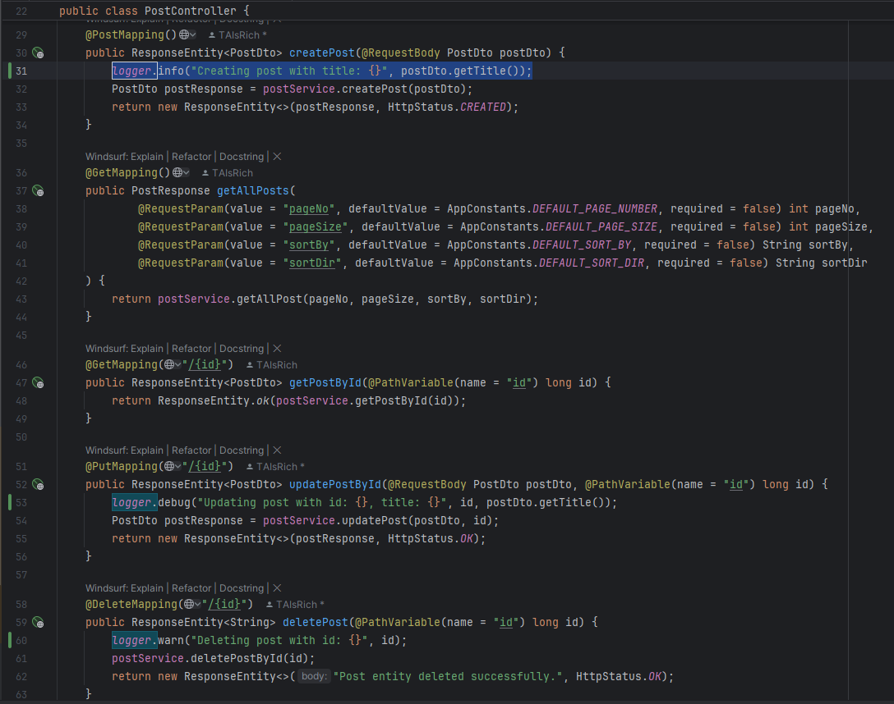

# 2. Set up proper logging level.

A: 
I used 3 logging level: DEBUG, INFO. WARN.

# 3. Take screenshots

A: 
After I created a post, it can log in my intellij:

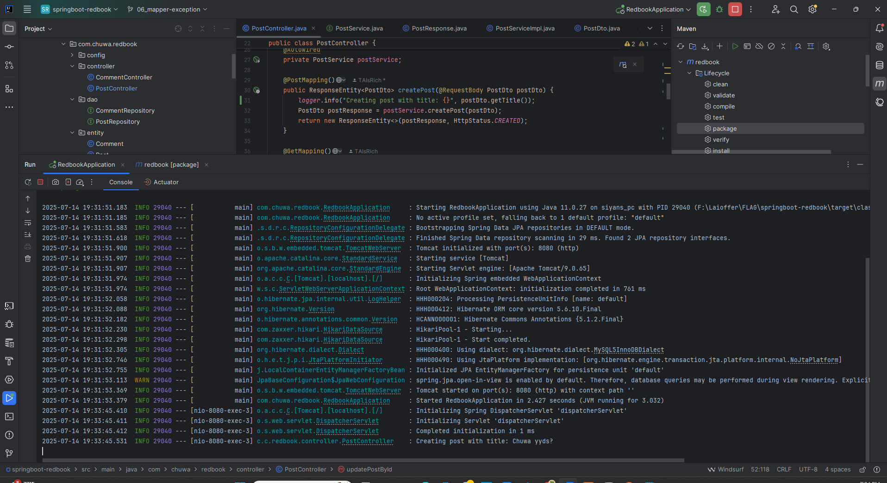 

# 4. external tomcat server

Instead of using embeded tomcat, setup an external tomcat server to bring up above application. Take 
screenshots

A: 
The code is in my repo forked from redbook. link: https://github.com/SiyanWen/springboot-redbook/tree/hw12_logger

I will explain what I did step by step:

1. To use external Tomcat server, first download Tomcat 9.0on my computer:

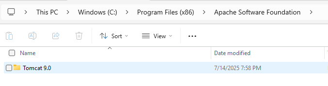 

2. Modify pom.xml:

include `<packaging>war</packaging>` and Tomcat:

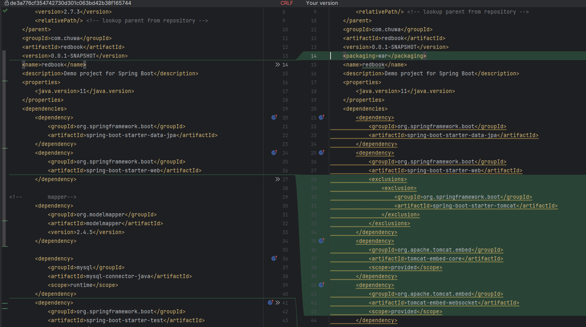 

Add `spring-boot-starter-tomcat`:

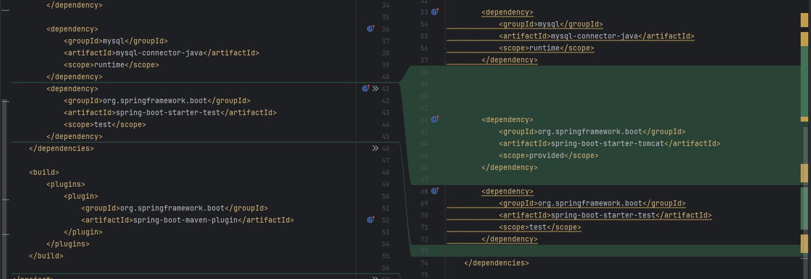 

3. In RedbookApplication.java, make `RedbookApplication` extends `SpringBootServletInitializer` and add `protected SpringApplicationBuilder configure()` method:

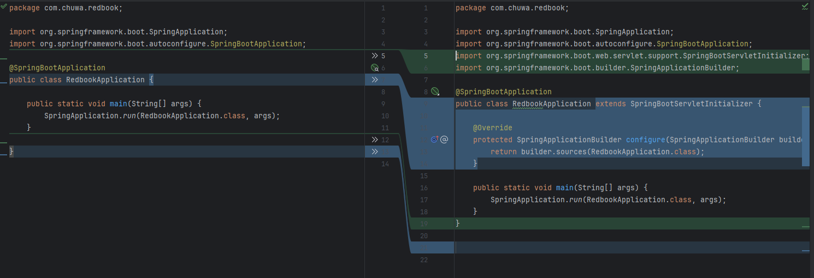 

4. Add file logback-spring.xml to make it show [DEBUG] level logging:

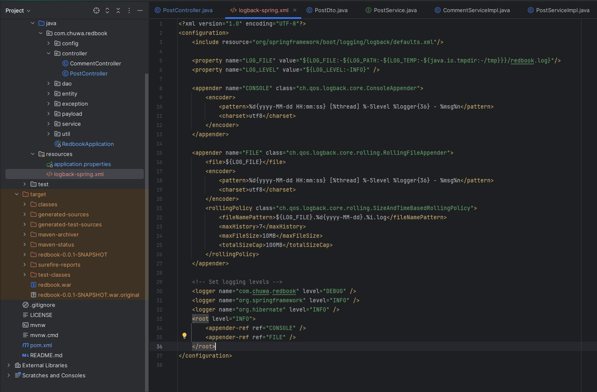 

5. generate war file using `mvn clean install`

6. copy generated war file to `<tomcat home>/webapps`. Rename it to 'redbook.war' for convenience.

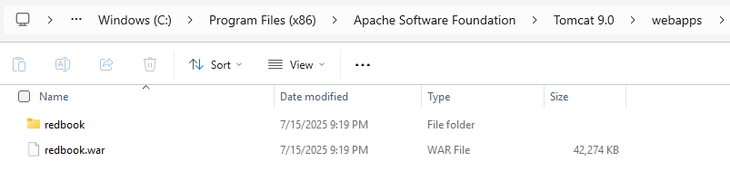

7. Enter `<tomcat home>/bin` and start the server by typing `catalina.bat run` in prompt:

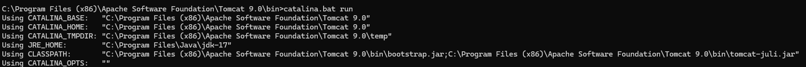

8. Use Postman to make API call:

Create:

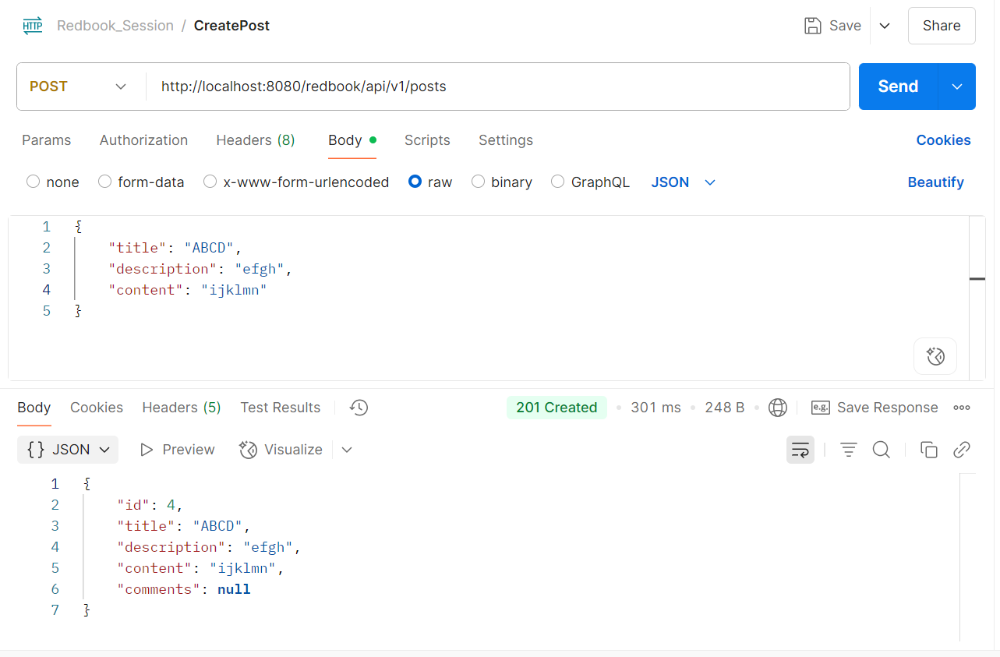 

Put:

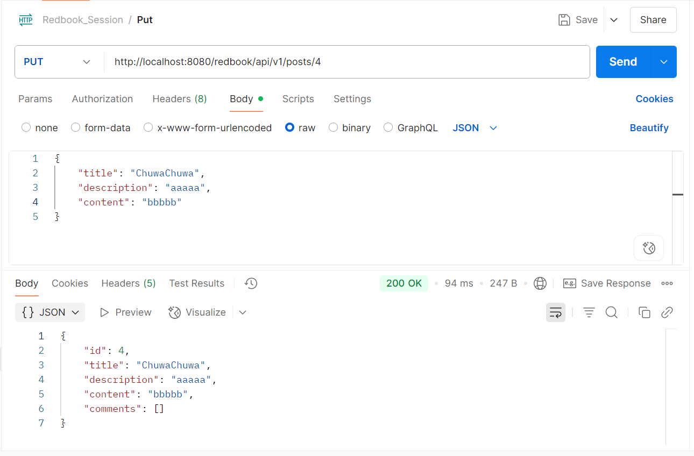

Delete:

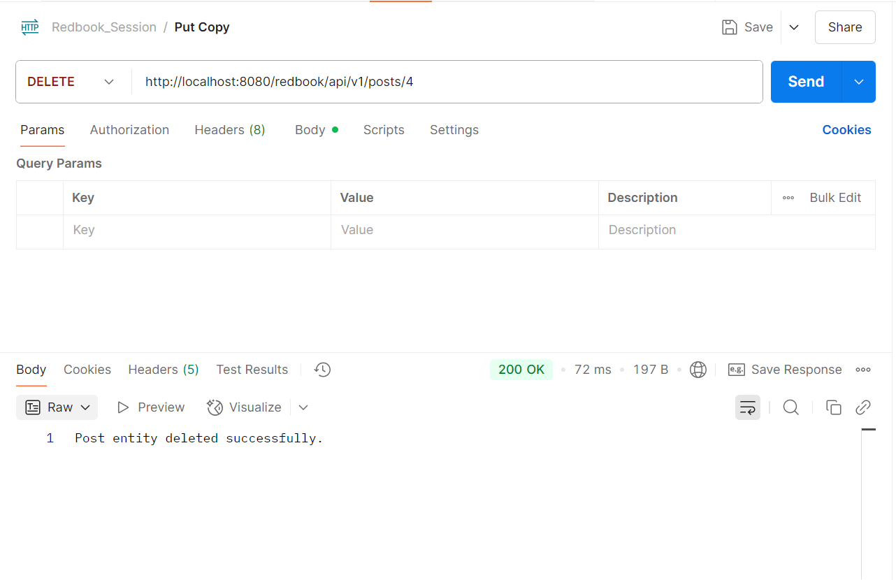

In Command Prompt, we can see the log messages:

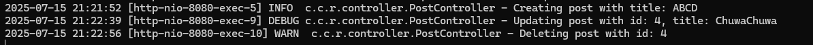

