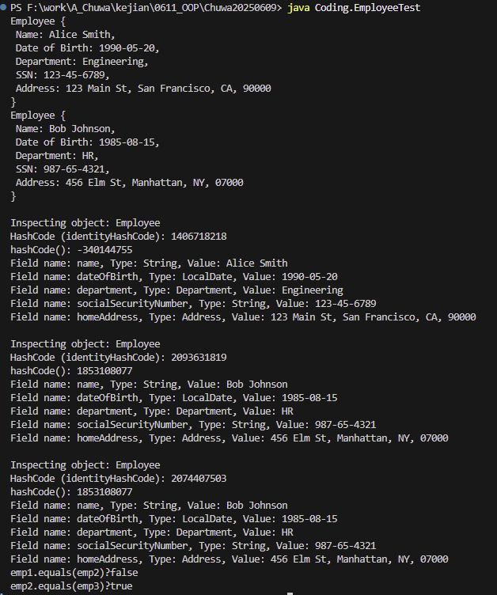
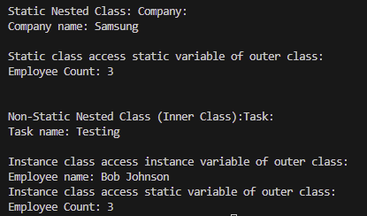
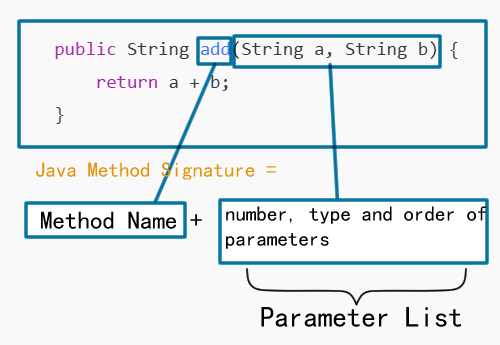

# 1. Write a Java POJO 
**Write a Java POJO (plain old java object) named "Employee", inside Employ class, you should have**
 1. Employee's name
 2. Employee's Date of Birth
 3. Employee's Department (it can be another POJO)
 4. Employee's Social Security Number
 5. Employee's home address (it can be another POJO)

 Override toString method, so that when an Employee object is being printed, the print out looks meaningful and readble.

 Override equals method, so that only when two Employees have identical information, we consider they are the same employee.

A: 
The code is in Coding folder (Employee.java and EmployeeTest.java).

# 2. Instantiate and JVM allocation demo
**Write code to instantiate at least two instances of above Employee class, use code snippets to explain how these Employee objects are allocated to JVM memory. You may use java relection utilities to demonstrate it.**

A: 
how these Employee objects are allocated to JVM memory:

The references that point to Objects, like Employee, Department and Address are stored  on stack. The instance itself are stored on heap, like the fields name, Date of Birth, Department, SSN, Address.
```bash
Method Area (Class Metadata)
└── Class structure of Employee, Department, Address loaded.

Heap
└── emp1 Employee object
|   ├── name = "Alice Smith"
|   ├── dateOfBirth = LocalDate object
|   ├── department = Department object ("Engineering")
|   ├── socialSecurityNumber = "123-45-6789"
|   └── homeAddress = Address object ("123 Main St, Springfield, IL 62704")
└── emp2 Employee object
|   ├── name = "Bob Johnson"
|   ├── dateOfBirth = LocalDate object
|   ├── department = Department object ("HR")
|   ├── socialSecurityNumber = "987-65-4321"
|   └── homeAddress = Address object ("456 Elm St, Manhattan, NY, 07000")
└── dept1 Department Object
|   └── department = "Engineering"
└── dept2 Department Object
|   └── department = "HR"
└── addr1 Department Object
|   └── address = "123 Main St, San Francisco, CA, 90000"
└── addr1 Department Object
    └── address = "456 Elm St, Manhattan, NY, 07000"

Stack (main thread stack frame)
└── Local variables:
    ├── emp1 → reference to Employee object in Heap
    ├── emp2 → reference to Employee object in Heap
    ├── dept1, dept2 → Department objects
    └── addr1, addr2 → Address objects
```
## Demonstrate using relection utilities:



In the picture above, because employee 2 and 3 are instanciated using exact same parameters.

Using `System.identityHashCode(obj)`, which is tied to the object’s memory address (identity), we can see they are different, meaning they are different objects.

But because we overrided the `equals()` and `hashCode()`, the equals() method returns true, and the hashcodes are the same.

# 3. static and instance variables

**Write static utilities in your Employee class, demostrate how static content differs from others during class instantiation.**

A:
I wrote Static Inner Class Company and Non-Static Inner Class Task.

To initiate a static class, we don't need a instance of outer class, just use `Employee.Company company = new Employee.Company("Samsung");`. For Non-static Inner Class, we need a instance, and the syntax becomes: `Employee.Task task = new Employee(...).new Task("Testing");`.

The instance of static class cannot access the non-static variable of outer class, where as the instance of non-static class can access both static and non-static variable.



# 4. Global variable

**Explain why global variables are NOT recommended, you may use code snippets.**

A:
Global Variables Are Not Recommended in Java (or Any Language).

Global variables (static fields accessible globally) can cause code maintainability issues, thread safety problems, and hidden dependencies. 

## 1. Uncontrolled Access Leads to Bugs

Global variables can be read/written from anywhere, making it hard to trace bugs.

```java
public class Config {
    public static String systemMode = "TEST"; // Global variable
}

public class ServiceA {
    public void run() {
        System.out.println("Mode: " + Config.systemMode);
    }
}

public class ServiceB {
    public void changeMode() {
        Config.systemMode = "PRODUCTION"; // Global modification
    }
}
```
You may expect the system to run in TEST mode, but ServiceB modifies it, potentially breaking logic in ServiceA — unintended side effects.

## 2. Difficult to Track Code Flow
Code becomes tightly coupled — any class can silently depend on Config.systemMode.

Refactoring becomes risky since changing global state may break other classes without compile-time errors.

## 3. Thread Safety Issues
In multi-threaded programs, global variables are unsafe without synchronization.

Example:

```java
public class Counter {
    public static int count = 0;
}

public class CounterTask implements Runnable {
    public void run() {
        for (int i = 0; i < 1000; i++) {
            Counter.count++; // Race condition!
        }
    }
}
```

In multithreaded environments, count will likely have incorrect final value because multiple threads modify it unsafely.

Better alternative:

```java
public class Counter {
    private static final AtomicInteger count = new AtomicInteger(0);
    public static int incrementAndGet() {
        return count.incrementAndGet();
    }
}
```

- Uses AtomicInteger to handle concurrency properly.

## 4. Testing and Reusability Problems

Global state makes unit testing difficult:

- Tests can interfere with each other since they share the same global state.

- Order-dependent tests arise.

Better Practice:
Use Dependency Injection (pass required objects via constructors/methods) to keep code modular and testable.

## Summary: Why Global Variables Are Discouraged

| Problem                  | Description                                           | Alternative                                    |
| ------------------------ | ----------------------------------------------------- | ---------------------------------------------- |
| **Uncontrolled Access**  | Unpredictable changes from anywhere                   | Use private fields with public getters/setters |
| **Hidden Dependencies**  | Hard to trace which class uses what                   | Use dependency injection (DI)                  |
| **Thread Safety Issues** | Race conditions in concurrent scenarios               | Use thread-safe constructs like Atomic types   |
| **Testing Challenges**   | Tests influence each other due to shared global state测 | Isolate state within objects, use mocking      |

Conclusion:

Global variables break encapsulation, make code harder to maintain, introduce race conditions, and lead to fragile tests.


Best practice: Favor encapsulation, dependency injection, and local scope.

# 5. String are considered "Immutable"

**Explain why Strings in Java are considered "Immutable"?**

A:
If we do `String s = "Hello"; s += " World";`, it didn't change it, instead, we created a new string (the hashCode will change).

This is because String maintains a final char[] inside it. Once a `String` object is created, its value cannot be changed. String in Java is made immutable for following reason:

### 1. **Security**

-   Strings are widely used in sensitive operations like:
    
    ```java
    Class.forName("com.mysql.jdbc.Driver");
    File file = new File("config.properties");
    ```
    
-   **Immutable strings prevent tampering**. If `String` was mutable, a hacker could modify class names, file paths, or SQL queries after initialization.
    

---

### 2. **Hashing Performance**

-   `String` overrides `hashCode()` and is often used as a **key in HashMap**: 

    
    ```java
    Map<String, Integer> map = new HashMap<>();
    map.put("Key", 123);
    ```
    
-   **Immutable means the hash code is cached** after creation, ensuring:

    
    -   **Consistent hash codes**
        
    -   **Fast key lookups**
        

If `String` was mutable, changing the value would **break the hash table structure**.


---

### 3. **Thread Safety**

-   Strings are inherently **thread-safe** because:

    
    -   They **can be shared between threads without synchronization**.

        
    -   No thread can change the string, eliminating synchronization overhead.

        

---

### 4. **String Pool Optimization**

-   The **String Constant Pool** allows reuse of string literals:
    
    ```java
    String a = "Hello";
    String b = "Hello";
    System.out.println(a == b); // true, both point to the same object
    ```
    
-   This **reduces memory footprint** since identical string literals reference **the same object**.
    
-   This would be **impossible** if strings were mutable (changing `a` would unexpectedly change `b`).
    

---

## Summary Table

| **Reason** | **Benefit** |
| --- | --- |
| **Security** | Prevents tampering in sensitive operations |
| **Hashing** | Stable hashCode enables reliable hashing |
| **Thread Safety** | Safe sharing across threads without locks |
| **Performance** | Memory savings via String Pool |


# 6. Final

**Write code snippets to explain what does "Final" keyword do, and what we need it?**

A:
The `final` keyword **prevents modification**. 

It can be applied to:

-   Variables (fields, local variables)
    
-   Methods
    
-   Classes
    

---

## 1. `final` Variables → **Value Cannot Be Changed**

```java
final int MAX_USERS = 100;
MAX_USERS = 200; // ❌ Compilation Error: cannot assign a value to final variable
```

**Why Use It?**

-   Makes **constants** (unchangeable values).

-   Code becomes **clearer**: `"MAX_USERS"` won’t change later by mistake.

---

### Example with Object Reference:

```java
final List<String> names = new ArrayList<>();
names.add("Alice");  // ✅ OK, modifying internal state
names = new ArrayList<>();  // ❌ Error: cannot reassign final variable
```

✅ You **can't reassign** the reference,
 

✅ but you **can modify the object** itself (unless it's an immutable object like `String`).


---

## 2. `final` Methods → **Cannot Be Overridden**

```java
class Animal {
    public final void speak() {
        System.out.println("Generic animal sound");
    }
}

class Dog extends Animal {
    // ❌ Compilation Error: cannot override final method
    // public void speak() { System.out.println("Bark"); }
}
```

**Why Use It?**

-   Prevents **unexpected behavior changes** in subclasses.
    
-   Common in **security-sensitive libraries** to lock method behavior.

---

## 3. `final` Class → **Cannot Be Extended**

```java
final class PaymentProcessor {
    public void process() {
        System.out.println("Processing payment...");
    }
}

// ❌ Compilation Error
// class AdvancedProcessor extends PaymentProcessor {}
```

**Why Use It?**

-   To **prevent inheritance** for security, simplicity, or performance reasons.
    
-   Example: `java.lang.String` is `final` — prevents subclassing and protects immutability.
    
---

## 4. `final` in Method Parameters → **Cannot Modify Parameter Inside Method**

```java
public void printMessage(final String message) {
    System.out.println(message);
    // message = "New Message"; ❌ Error: cannot assign a value to final parameter
}
```

Makes sure you **don’t accidentally modify inputs** inside a method.
确保你不会在方法中意外修改输入。

---

#  Summary Table

| Usage             | Effect                       | Why Use It?                              |
| ----------------- | ---------------------------- | ---------------------------------------- |
| `final` Variable  | Value cannot change          | Create constants, avoid reassignment     |
| `final` Method    | Method cannot be overridden  | Ensure fixed behavior in subclasses      |
| `final` Class     | Class cannot be extended     | Prevent inheritance, ensure immutability |
| `final` Parameter | Parameter cannot be modified | Protect method inputs                    |


---

### Conclusion:

-   **`final` → freeze what should never change**. 
    
-   It improves **readability**, **predictability**, **safety** of your code.
    
-   Java designers use it extensively (e.g., **`String` is `final`**).

# 7. pass by value

**Write code snippets to explain why Java is "pass-by-value", and why do some people think it might be "pass-by-reference"?**

A:

-   **Java is always pass-by-value.**
    
-   However, when you pass **object references**, the **value of the reference** (memory address) is passed, leading to **confusion**.

    

---

## 1. Example: Primitive Type (Straightforward)

```java
public class Example {
    public static void modifyPrimitive(int x) {
        x = 10;
    }

    public static void main(String[] args) {
        int a = 5;
        modifyPrimitive(a);
        System.out.println(a); // 👉 Output: 5 (unchanged)
    }
}
```

**Why?** 

-   `a` passes its value `5` to the method. 

    
-   Inside `modifyPrimitive`, `x` is a **copy**, changes don't affect `a`.

    

---

## 2. Example: Object Reference (Common Confusion)

```java
class Person {
    String name;
    Person(String name) { this.name = name; }
}

public class Example {
    public static void changePerson(Person p) {
        p = new Person("Bob"); // reassigning reference
    }

    public static void main(String[] args) {
        Person person = new Person("Alice");
        changePerson(person);
        System.out.println(person.name);  // 👉 Output: Alice
    }
}
```

**Why?** 

-   `person`'s **reference (memory address)** is copied. 

-   Reassigning `p` doesn't affect the original reference.

---

## 3. Modifying Object State (Trickier Case) 

```java
public class Example {
    public static void modifyPerson(Person p) {
        p.name = "Bob"; // modifying internal state
    }

    public static void main(String[] args) {
        Person person = new Person("Alice");
        modifyPerson(person);
        System.out.println(person.name); // 👉 Output: Bob
    }
}
```

**Why?**

-   You’re modifying the **object through its reference**.

-   You **don’t change the reference**, but you **change the object's state**.

---

## Summary: Why People Get Confused

| Case| Behavior | Why?？ |
| --- | --- | --- |
| Primitive type | Value copied, no effect | ✅ True value is passed |
| Object reference reassigned | Original reference unchanged | ✅ Reference value copied |
| Object state modified | Original object changed | ✅ Same object, reference unchanged |

---

### Key Rule:

> Java is **pass-by-value** — **always copies** the **value**:
> 
> -   For primitives ➡️ value of the primitive is copied.
>     
> -   For objects ➡️ value of **reference** (memory address) is copied.
>     

---

###  **One-Liner Explanation for Interview**

✅ Java passes **copies of variables** — but when passing objects, it copies the **reference value**, so you can modify the **object**, but you **can’t reassign the caller’s reference**. 


# 8. Overloading

**Write code snippets to explain overloading in Java, explain how does Java define method signature.**

A:

> **Method Overloading** = Same method name, but **different parameter lists** (in the same class).

✅ Overloading happens **at compile time** (Java decides which method to call **based on parameter types and counts**).

---

## Example: Method Overloading

```java
public class Calculator {
    
    // Overloaded methods (same name, different parameters)
    public int add(int a, int b) {
        return a + b;
    }
    // different type
    public double add(double a, double b) {
        return a + b;
    }
    // different number
    public int add(int a, int b, int c) {
        return a + b + c;
    }

    public String add(String a, String b) {
        return a + b;
    }

    public static void main(String[] args) {
        Calculator calc = new Calculator();
        System.out.println(calc.add(1, 2));           // calls int add(int, int)
        System.out.println(calc.add(1.5, 2.5));       // calls double add(double, double)
        System.out.println(calc.add(1, 2, 3));        // calls int add(int, int, int)
        System.out.println(calc.add("Hello ", "World")); // calls String add(String, String)
    }
}
```

✅ **Output:**：

```
3
4.0
6
Hello World
```



Java Method Signature = Method name + number,type and order of parameters (parameter list)

❌ It does not include:

- Return type

- Access modifier

- Exceptions thrown


# 9. reminder

You may be asked to demo and explain your answers/code in class.

# 10. LeetCode Practice

Use Java collection framework datastructures (e.g. Set, Map, List) to solve following Leetcode questions, you MUST use Java and you MUST use datastructures provided by Java Collection framwork:

1. Top K Frequent Elements（LeetCode 347）

2. Two Sum（LeetCode 1）

This is a separate coding task other than daily leetcoding questions, please submit your solutions as part of this assignment, rather than in the leetcoding sheet.

11. You can either have your code snippets in your markdown file, or include in a Java project

A:

## 347. Top K Frequent Elements

Given an integer array nums and an integer k, return the k most frequent elements. You may return the answer in any order.

 

Example 1:

> Input: nums = [1,1,1,2,2,3], k = 2
>
> Output: [1,2]

Example 2:

> Input: nums = [1], k = 1
>
> Output: [1]
 

Constraints:

1 <= nums.length <= 105
-104 <= nums[i] <= 104
k is in the range [1, the number of unique elements in the array].
It is guaranteed that the answer is unique.
 

Follow up: Your algorithm's time complexity must be better than O(n log n), where n is the array's size.


Submition link: https://leetcode.com/problems/top-k-frequent-elements/submissions/1697030276/

Data structure used: Min Heap

```java
class Solution {
    // Min-heap TC O(nlogk) is better than maxHeap O(nlogn). SC:O(n+k)
    // Where n is the length of the array and k is the number of top frequent elements.
    public int[] topKFrequent(int[] nums, int k) {
        Map<Integer,Integer> count = new HashMap<>();
        for(int num:nums){
            count.put(num, count.getOrDefault(num, 0)+1);
        }
        PriorityQueue<int[]> pq = new PriorityQueue<>((a,b)->a[0]-b[0]);
        for(Map.Entry<Integer,Integer> entry : count.entrySet()){
            pq.offer(new int[]{entry.getValue(), entry.getKey()});
            if(pq.size()>k){
                pq.poll();
            }
        }
        int[] res = new int[k];
        for(int i =0; i<k; i++){
            res[i] = pq.poll()[1];
        }
        return res;
    }
}
```

## 1. Two Sum
Description:

Given an array of integers nums and an integer target, return indices of the two numbers such that they add up to target.

You may assume that each input would have exactly one solution, and you may not use the same element twice.

You can return the answer in any order.

 

Example 1:

> Input: nums = [2,7,11,15], target = 9
>
> Output: [0,1]
>
> Explanation: Because nums[0] + nums[1] == 9, we return [0, 1].

Example 2:

> Input: nums = [3,2,4], target = 6
>
> Output: [1,2]

Example 3:

> Input: nums = [3,3], target = 6
>
> Output: [0,1]


Submition link: https://leetcode.com/problems/two-sum/

Data structure used: Hash Map

```java
class Solution {
    // Hash Map (Two Pass)
    // TC: O(2n) => O(n) We traverse the list containing n elements exactly twice.
    // SC: O(n) (HashMap)
    public int[] twoSum(int[] nums, int target) {
        HashMap<Integer, Integer> map = new HashMap<>();
        // put all values into hashmap as <key:index, val: value>.
        for (int i = 0; i < nums.length; i++){
            map.put(nums[i],i);
        }
        // check if ant value-current target exist.
        for (int i = 0; i < nums.length; i++){
            int complete  = target-nums[i];
            if (map.containsKey(complete) && map.get(complete)!=i){
                return new int[]{i, map.get(complete)};
            }
        }
        return new int[]{};
    }
}
```

