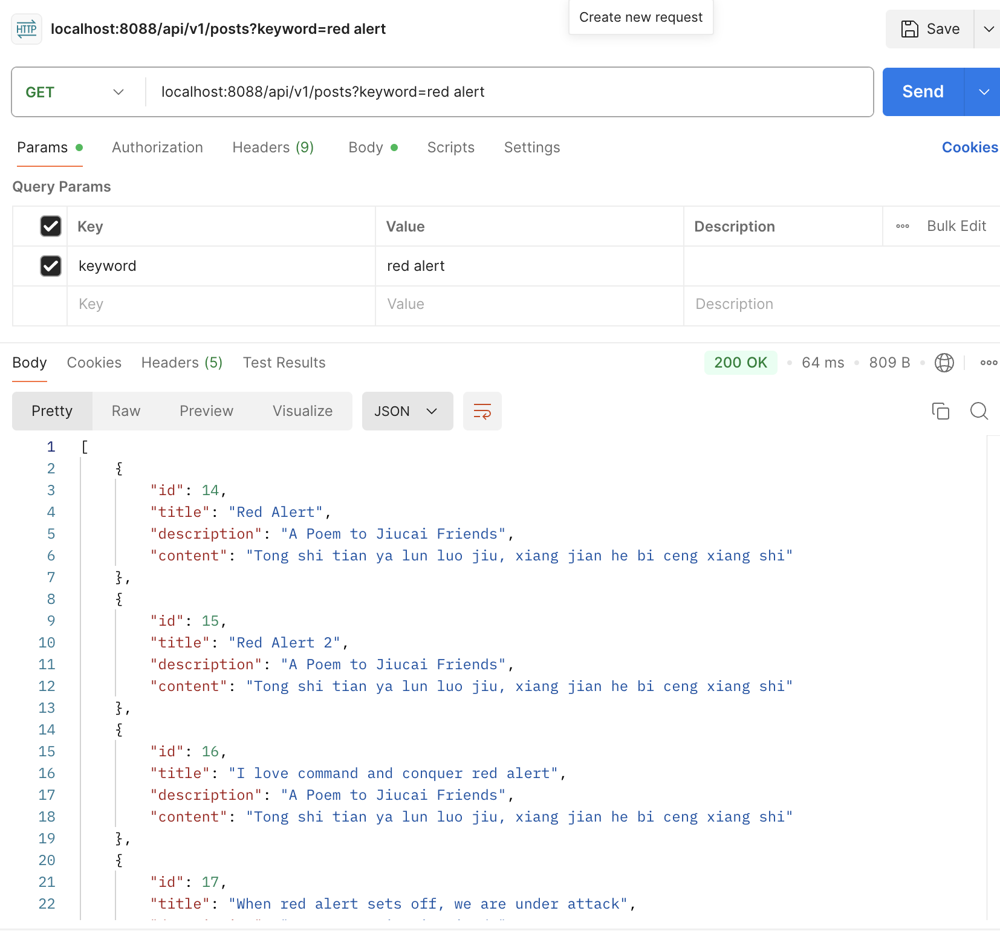

1.  Why is it better to use a custom exception class in your application?
    Using customer exceptions is a good practice for several reasons.
    - Improves clarity and context. Custom exceptions make code more readable and easier to understand by explicitly stating what 
      went wrong.
    - Encapsulates Domain-specific Logic. Custom exceptions help express business rules and domain constrains more clearly.
    - Easier Error Handling and Logging.
    - Better API design. Custom exceptions map well to HTTP error codes, making API more robust and predictable.
    - Avoids Misuse of Generic Exceptions. Using generic exceptions for all problems can hide real issues and make debugging difficult.
    - Improves Maintainability. Custom exceptions centralize error logic. When business rules change, you only need to update them in one place, not scattered throw statements

2. Explain how '''java @Table, @Column''' and  '''java @Id" work.
   In JPA with Hibernate as the default implementation, the annotations are used to map Java classes and fields to database tables and columns.
   - '''Java @Table'''
     Maps a Java class to a specific database table.
     Optional - if not used, the class name is used as the table name by default.
     Hibernate automatically translates camelcase to underscore in sql
  - '''Java @Column'''
     Maps a field or property to a column in the database table.
     Optional - if not used, the field name is used as the column name by default.
     Hibernate automatically translates camelcase to underscore in sql.
  - '''Java @Id'''
     Marks a field as the primary key of the entity (table).
     Required for every JPA entity
     Has a '''Java @Generated Value''' to auto-generate the primary key.

3. What happens if you don't annotate a class with @Entity, but still try to save it with JPA?
   In my experiment, if I only comment out the @Entity annotatiopn, Springboot throws a MappingException error, because it fails to recognize the class as a persistent entity.
   The @Entity annotation tells JPA that a class is a JPA-managed entity, meaning it should be mapped to a table in the database.
   Without @Entity, the class is just a regular Java object, and JPA has no metadata to map it to a database table.
    
4. What happens if we forget to annotate a controller with @RestController and only use @RequestMapping?
   The controller methods won't be registered or invoked at all. Spring Boot won't detect the class as a controller. So, even though @RequestMapping is present, no request will ever reach the application.
   When I post in postman, the application returns a 404 not found error. However, If I annotate the class with @Component annotation, @RequestMapping seems to register request method just fine.

5. What is default naming strategy of JPA for tables and columns when no explicit  name is given?
   camelCase in Java becomes snake_case in the DB, and class names are lowercased with underscores.

6. How does @PathVariable differ from @RequestParam?
   In Spring Boot, @PathVariable and @RequestParam are both used to extract values from the HTTP request, but they differ in where they extract values from and how they are used.
   | Feature            | `@PathVariable`                              | `@RequestParam`                                    |
   | ------------------ | -------------------------------------------- | -------------------------------------------------- |
   | 📍 Source          | Part of the **URL path**                     | Part of the **query string** or **form data**      |
   | 📦 Used For        | Dynamic segments in the path (`/users/{id}`) | Query parameters like `?sort=name`                 |
   | 🔗 URL Example     | `/users/123`                                 | `/users?sort=name`                                 |
   | 💬 Declaration     | `@PathVariable Long id`                      | `@RequestParam String sort`                        |
   | 📌 Optional?       | Required by default                          | Optional by default (can specify `required=false`) |
   | 🧩 Multiple values | Usually one per segment                      | Can handle list: `?tag=a&tag=b`                    |
   And one can use @RequestParam and @PathVariable in one request.

7. Write a method in a repository to find all posts with the title containing a certain keyword.
   - create a method called getPostsByKeyword and its matching declaration in the interface
     public List<PostDto> getPostsByKeyword(String keyword) {
        List<Post> posts = postRepository.findByTitleContainingIgnoreCase(keyword);;
        List<PostDto> postDtos = posts.stream().map(post -> mapToDTO(post)).collect(Collectors.toList());
        return postDtos;
     }
   - Modify the getAllPost() method
     @GetMapping
     public List<PostDto> getAllPosts(@RequestParam(required = false) String keyword) {
         if(keyword==null) return postService.getAllPost();
         return postService.getPostsByKeyword(keyword);
     }
   - 