# 🔧 HW1 – Homework Submission

**Student:** Juan Wu  
**Date:** 2025-06-25  

---

## Table of Contents
- [1. JDK 17](#1-jdk-17)
- [2. IntelliJ IDEA](#2-intellij-idea)
- [3. Maven 3.9+](#3-maven-39)
- [4. Git CLI](#4-git-cli)
- [5. MySQL 8.4](#5-mysql-84)
- [6. Docker Desktop](#6-docker-desktop)
- [7. Optional Tools](#7-optional-tools)
- [8. Smoke-Test Build](#8-smoke-test-build)

---

## 1  JDK 17

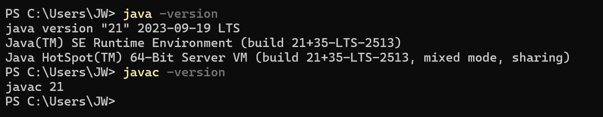

---

## 2  IntelliJ IDEA

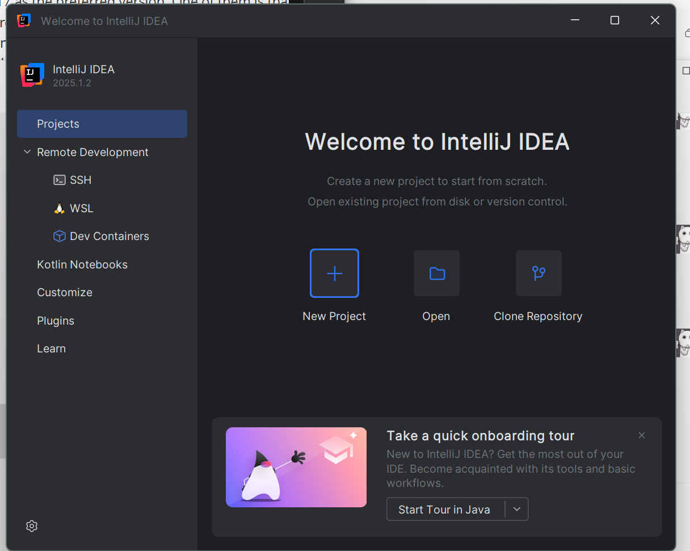
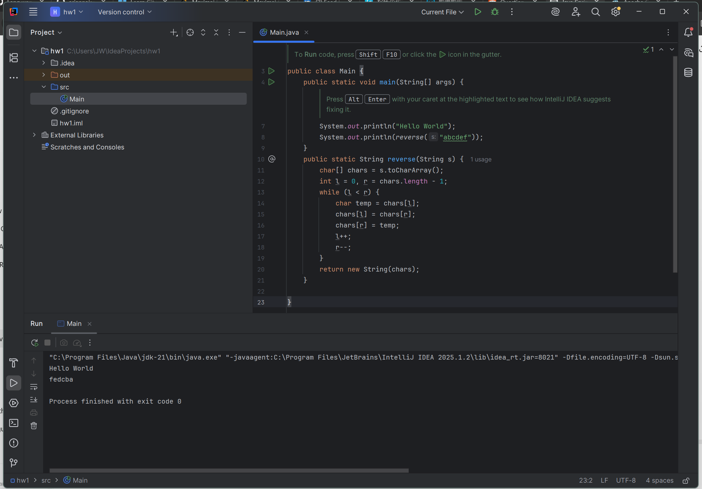

---

## 3  Maven 3.9+

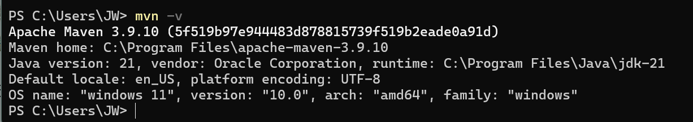

---

## 4  Git CLI

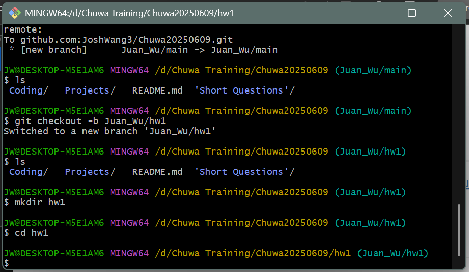
---

## 5  MySQL 8.4

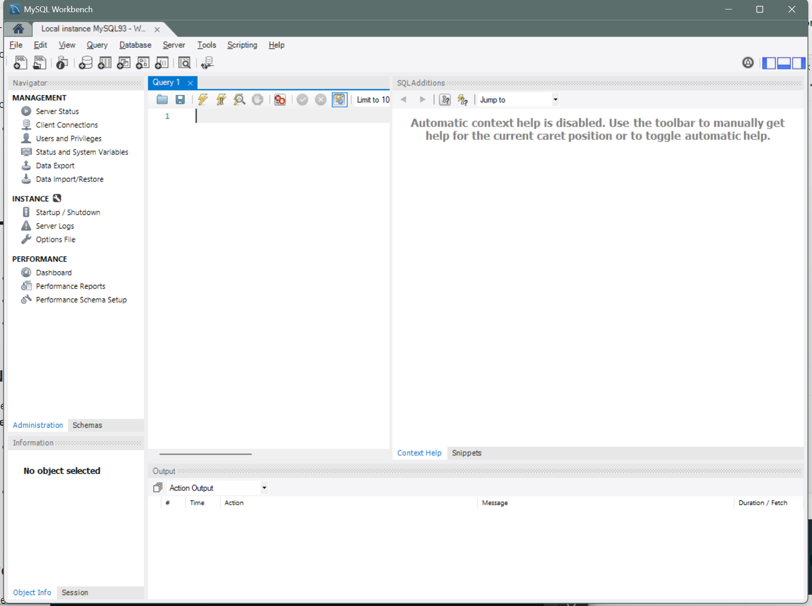
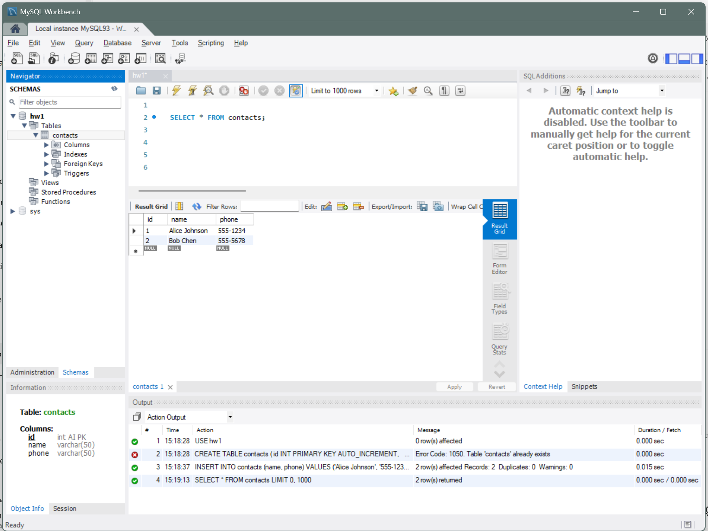

## 6 NoSQL

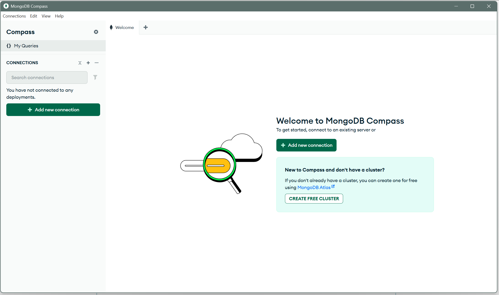
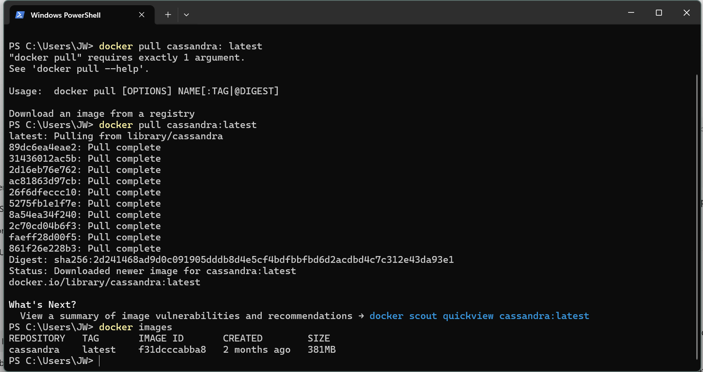

## 7  Docker Desktop

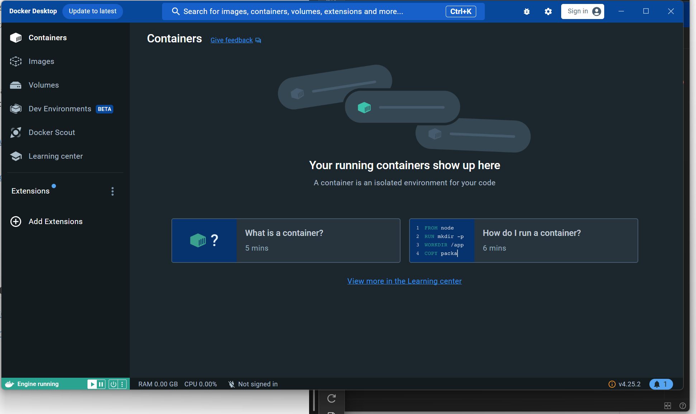

---

## 8  Postman

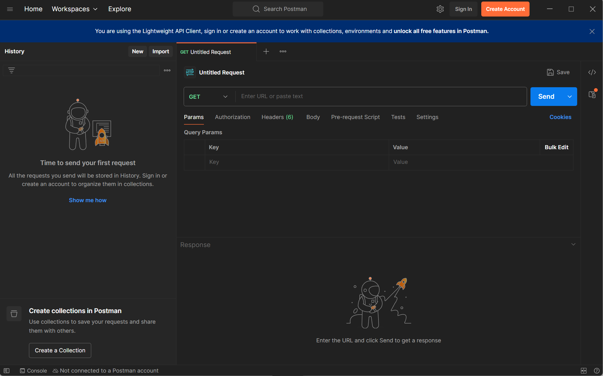
