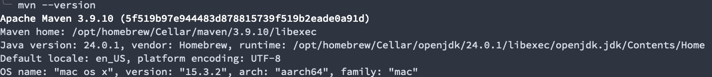
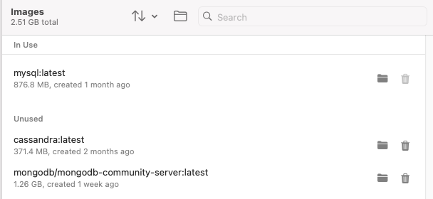

### Short Questions
Author: Cheng-Yu Hsieh

## Development Environment Setup

### JDK Installation and Configuration

### Java IDE Development Environment

### Maven Project Management

### Tomcat Server

## Development Tools and Version Control

### Git Version Control

### Postman API Testing Tool

## Containerization

### Docker Containerization

### Orbstack (Docker Desktop Alternative)

## Database

### MySQL Database Operations

### Database Docker Images: MySQL, MongoDB, Cassandra
