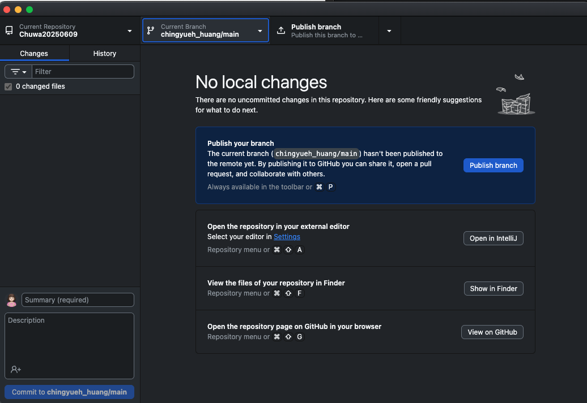
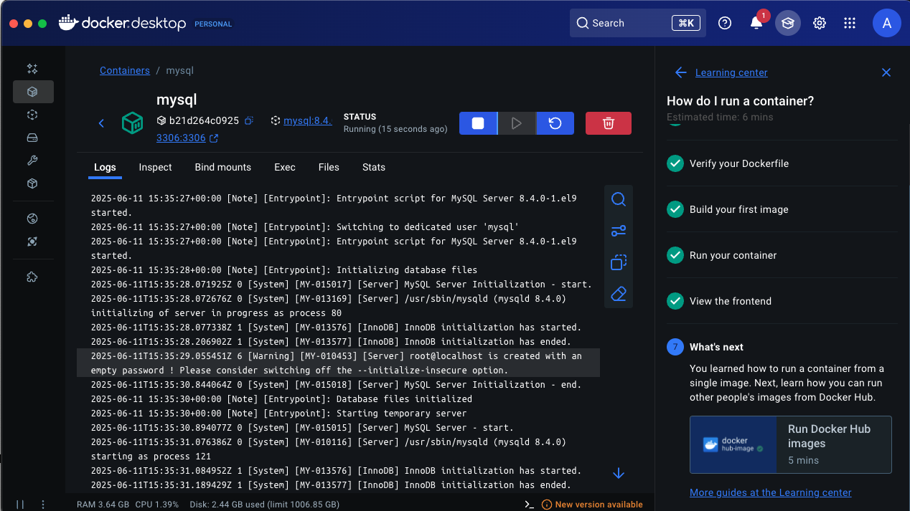
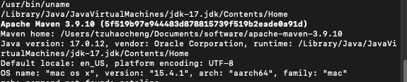
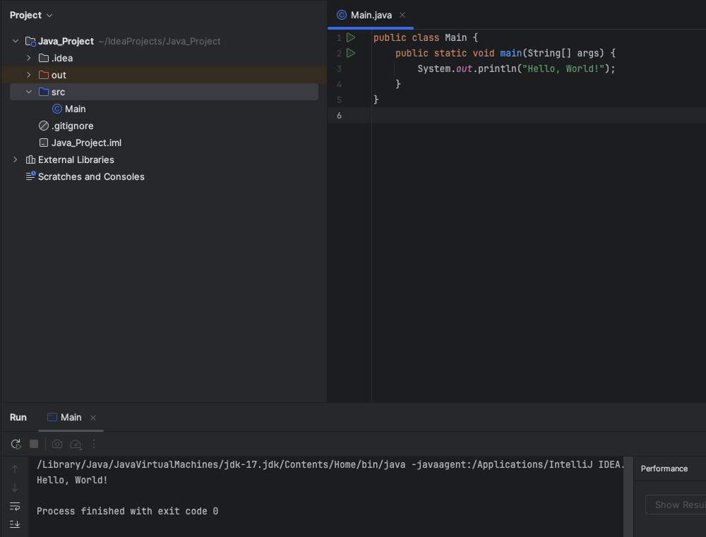
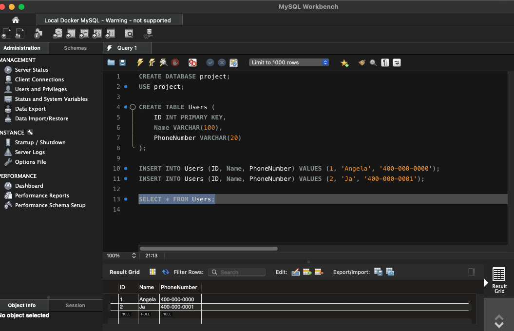
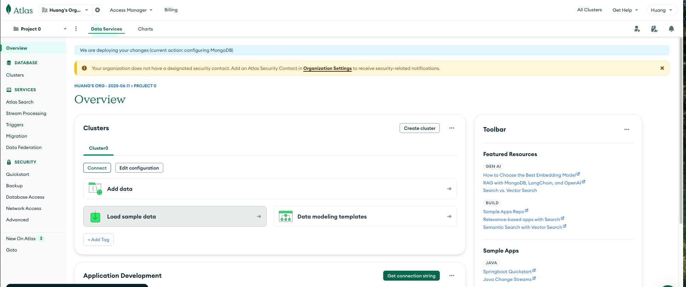
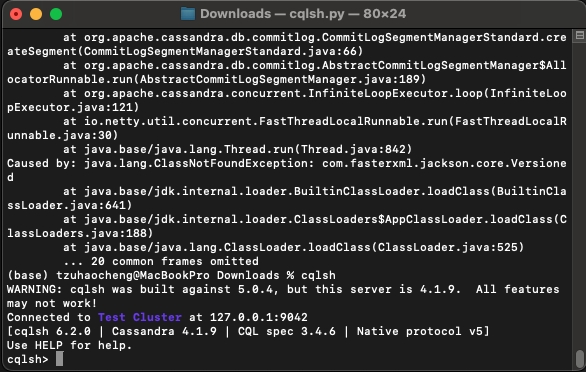
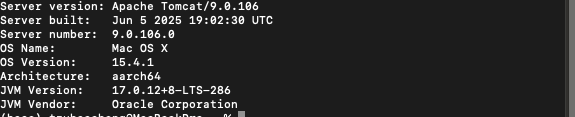
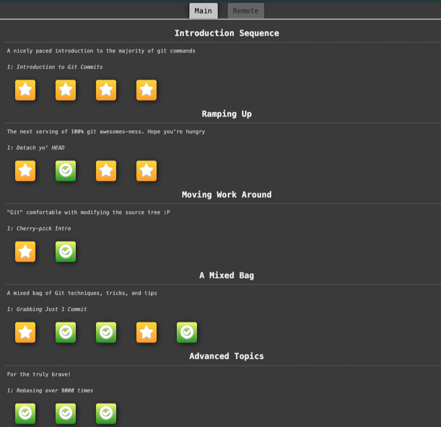
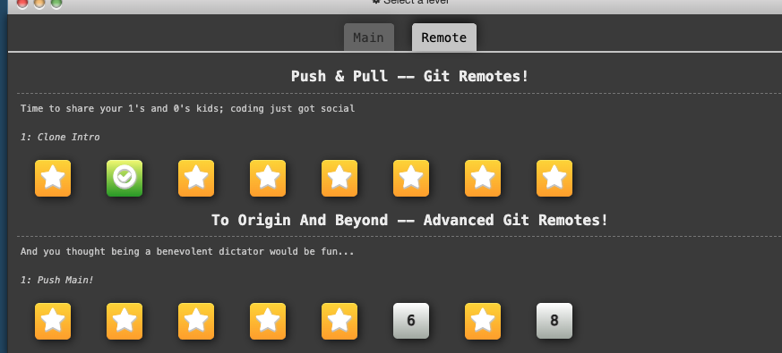

# HW1 Setup Screenshots

## GitHub Desktop

## Docker Running MySQL

## Maven & Java Version

## Hello World IntelliJ

## Reverse String IntelliJ

## MySQL Workbench Setup

## MongoDB Running

## Cassandra Running

## Tomcat Version

## Git Branch Learn

