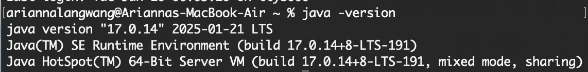
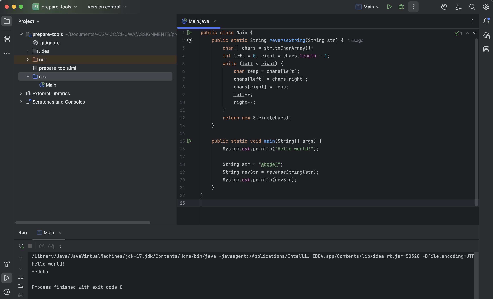
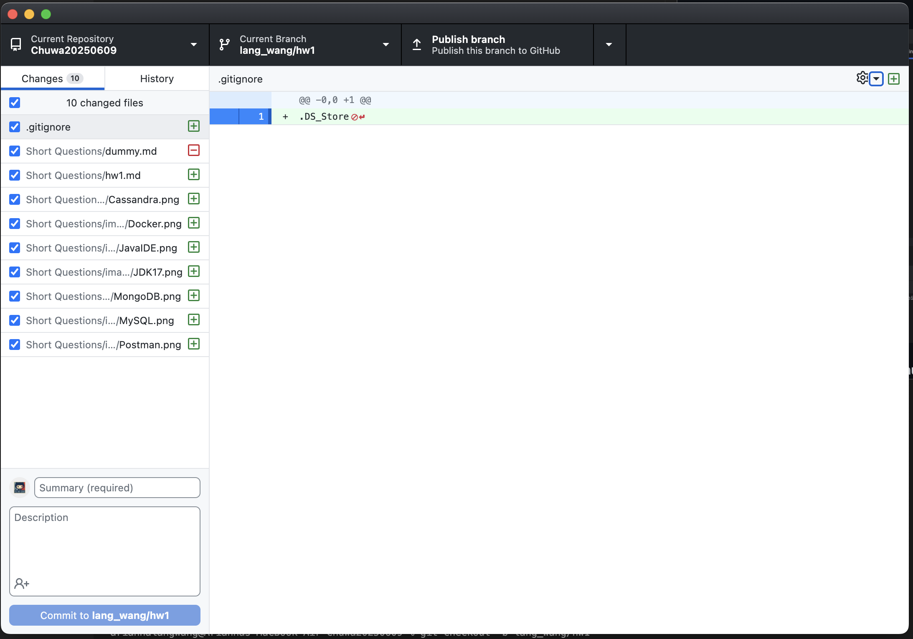
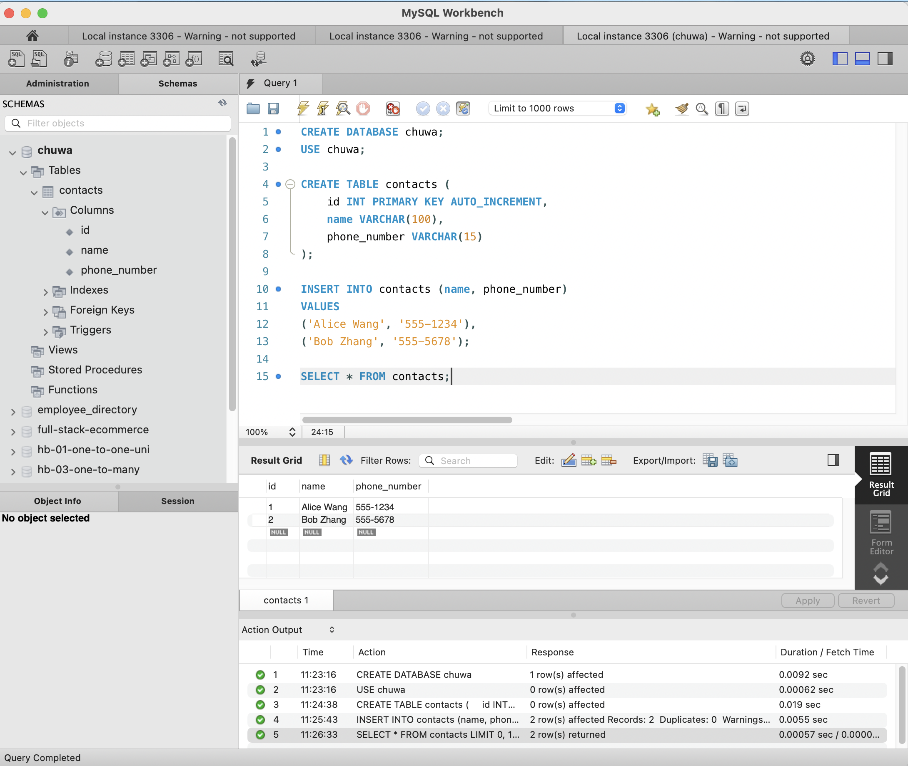
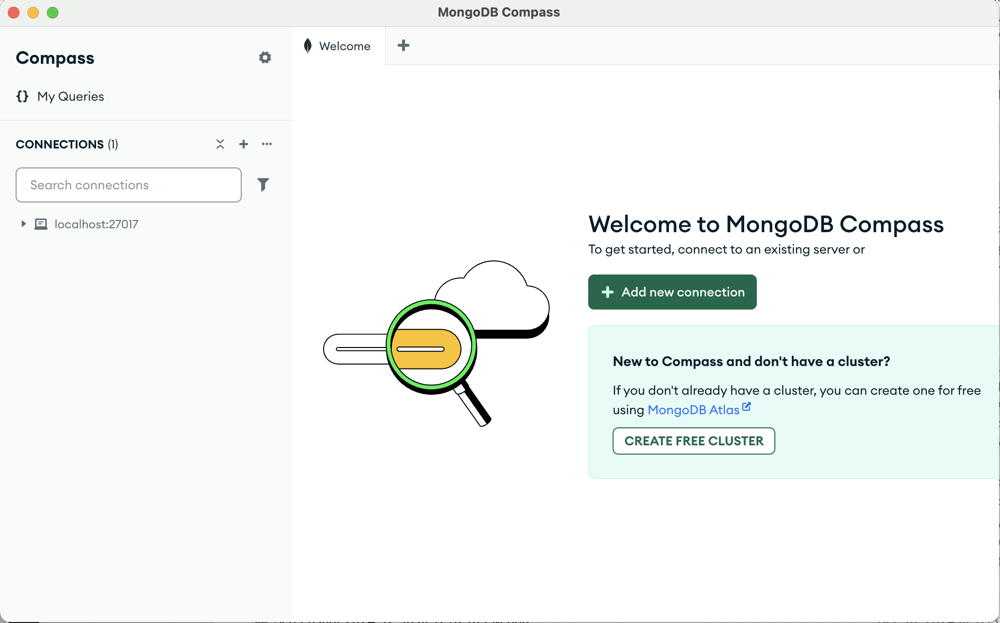
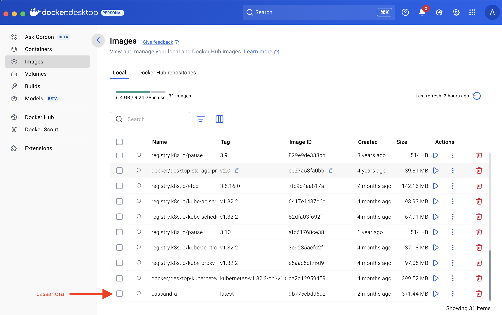
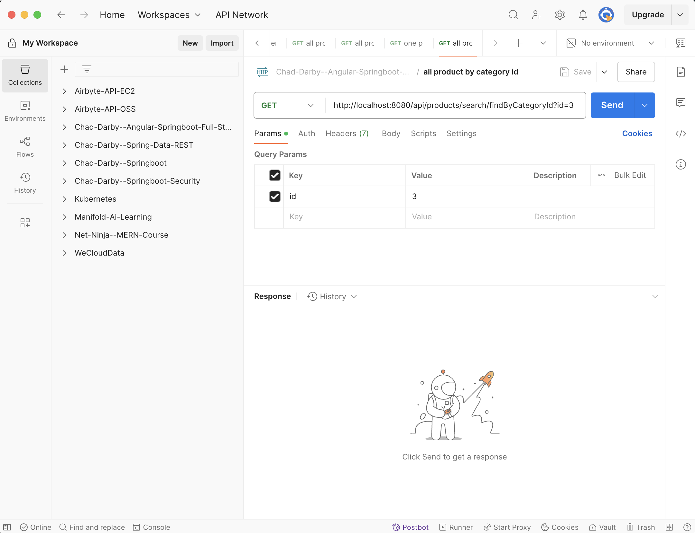
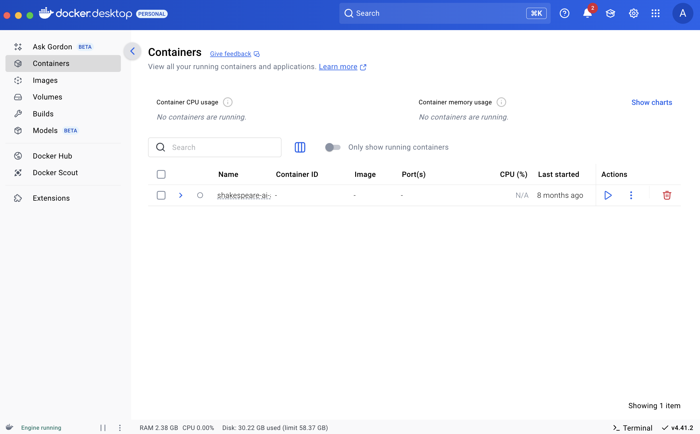

### hw1
JDK:

Java IDE:  
With Java code & output:

Maven:  
I plan to use the IntelliJ's automatically installed Maven Wrapper.  
So did not install a separate version at this moment.

Git CLI/Desktop:

MySQL 8.0+:   
With SQL code & output.

MonogoDB:

Cassandra:  
Pulled the Cassandra docker image:

Postman Desktop:

Docker Desktop:

