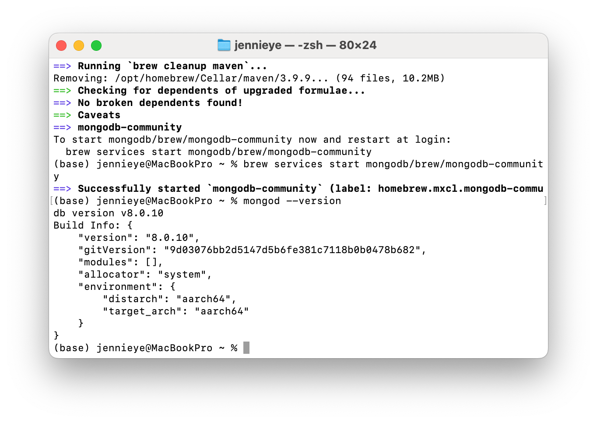

# HW1 - June 10, 2025
## Chun Ye

---

## Screenshot 1 - JDK

---

## Screenshot 2 - Java IDE

---

## Screenshot 3 - Maven

---
## Screenshot 4 - Git CLI/Desktop:

---

## Screenshot 5 - MySQL 8.0+:

---

## Screenshot 6 - MongoDB:

---

## Screenshot 7 - Docker:

---

## Screenshot 8 - Postman:

---

## Screenshot 9 - Git learning:

