## Part 2:  

## Hands-on Project Work  


### Part2-2  
Change 1: configuration change  
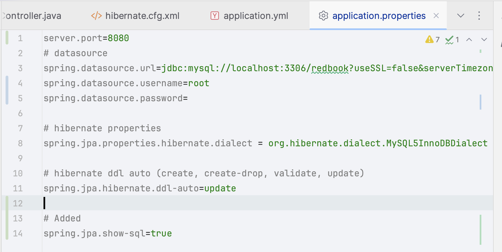    
Change 2: add interfaces in PostJPQLRepository  
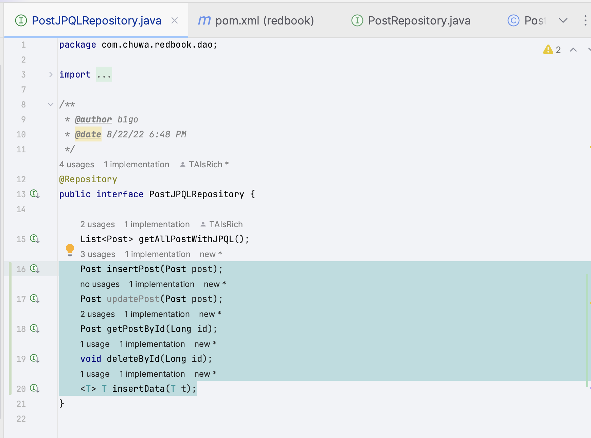  
Change 3: set up the database  
```roomsql
-- Set up database
CREATE DATABASE IF NOT EXISTS Redbook;

DROP TABLE IF EXISTS posts;

USE Redbook;

-- create posts table
CREATE TABLE IF NOT EXISTS posts (
    id BIGINT AUTO_INCREMENT PRIMARY KEY,
    title VARCHAR(255) NOT NULL UNIQUE,
    description TEXT NOT NULL,
    content TEXT NOT NULL,
    create_date_time TIMESTAMP DEFAULT CURRENT_TIMESTAMP,
    update_date_time TIMESTAMP DEFAULT CURRENT_TIMESTAMP ON UPDATE CURRENT_TIMESTAMP
);

```

Test each controller:  
- /jpql 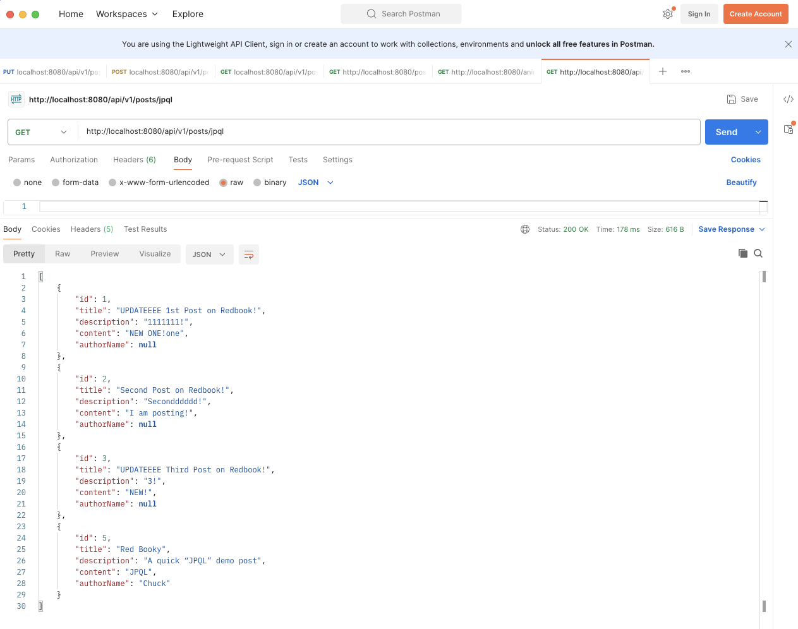  
- /jpql-index/{id}  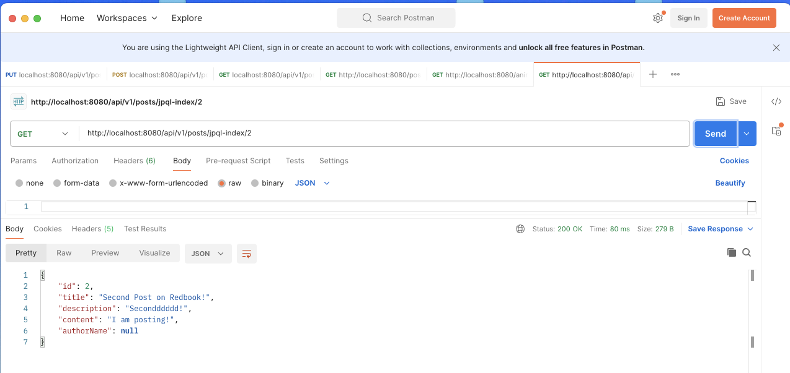
- /jpql-named/{id}  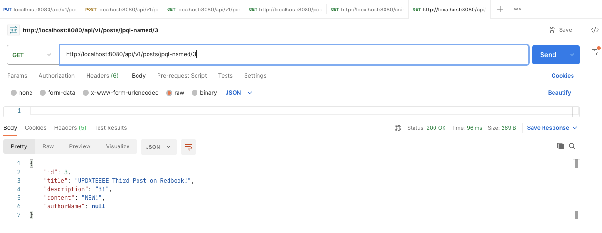
- /sql-index/{id}  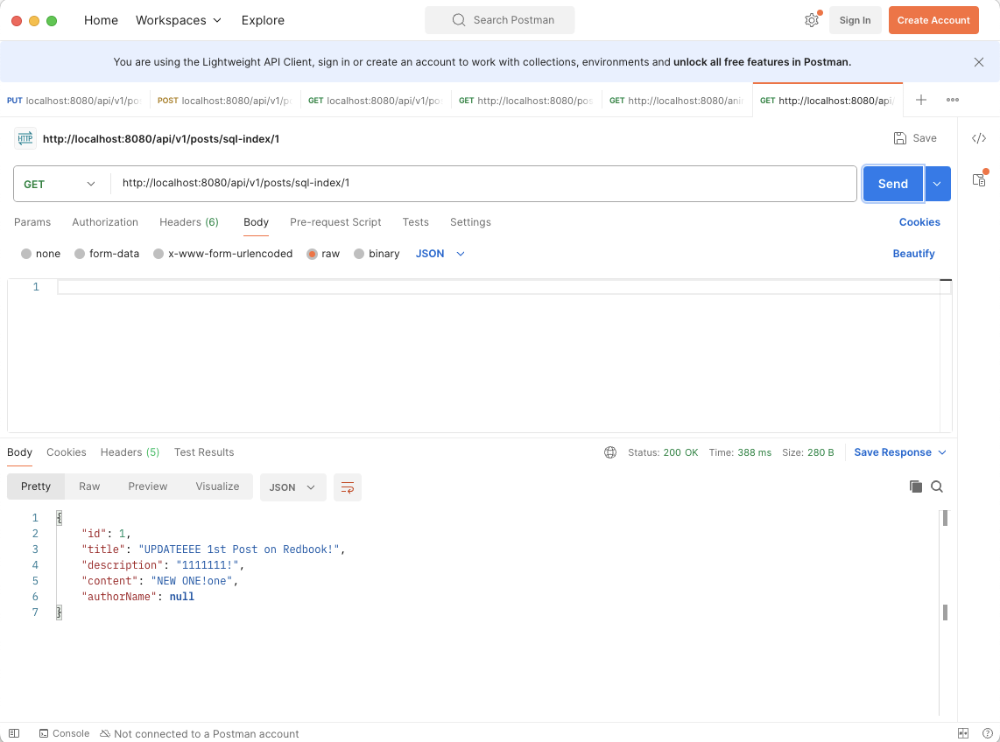  
- /sql-named/{id}  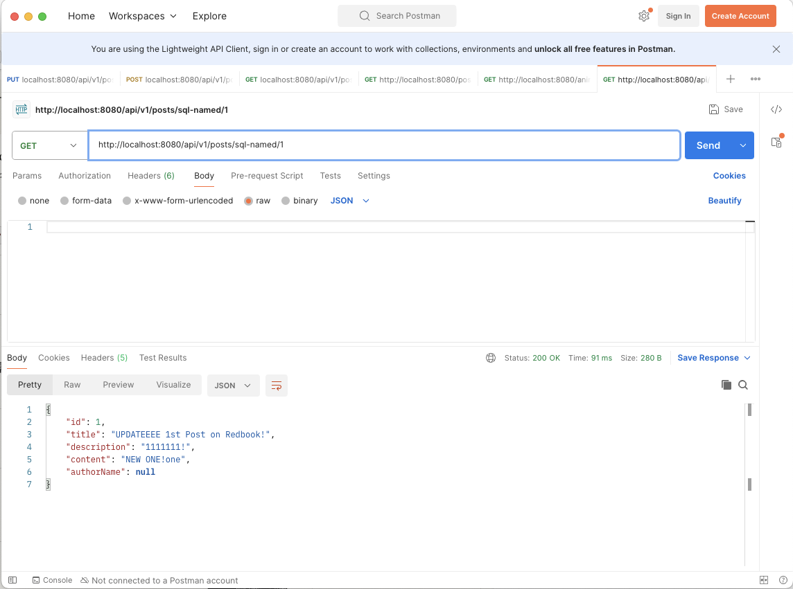  
- GET /{id} 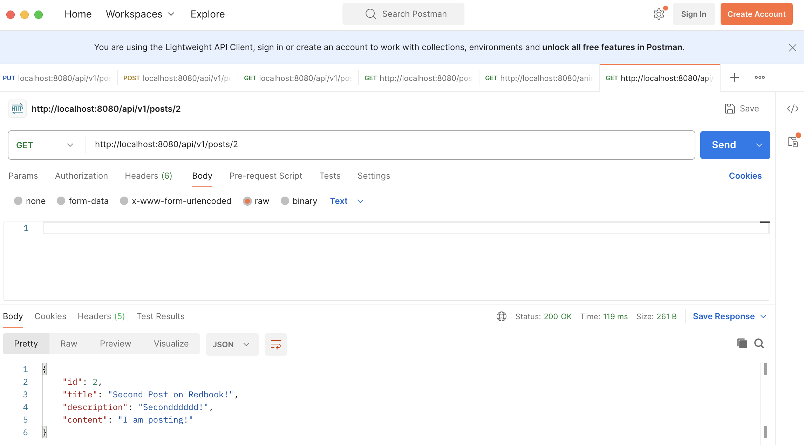  
- PUT /{id}  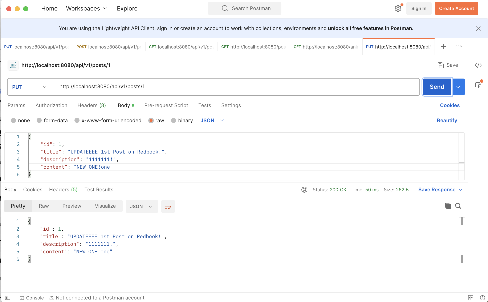  
- DELETE /{id}   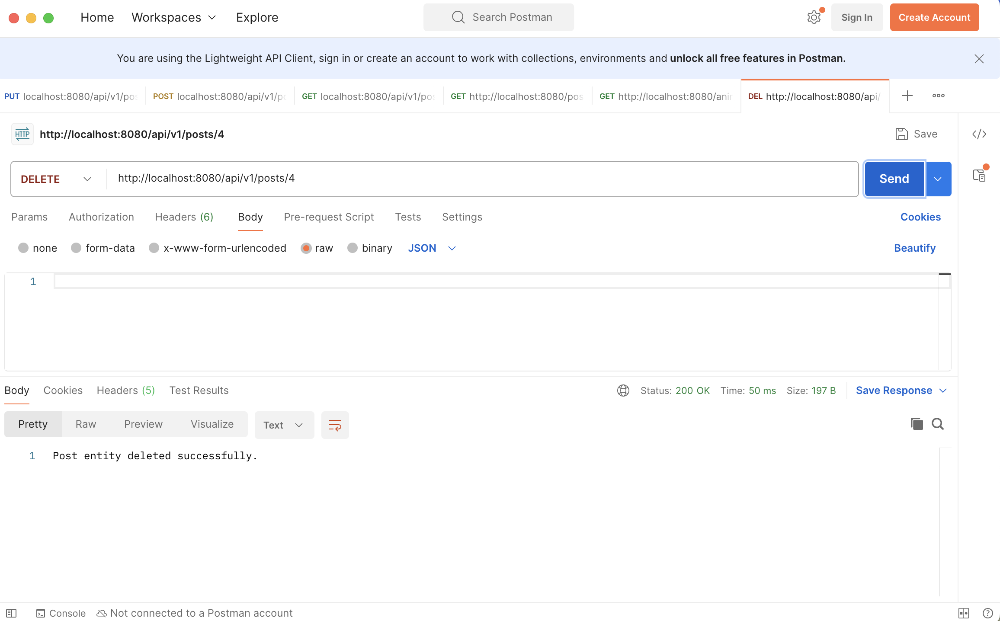  

### Part2-3 

##### Part2-3-1 In PostRepository.java, added custom JPA methods using Spring Data JPA naming conventions  
```java
    // Check if a post with the exact title exists
    boolean existsByTitle(String title);

    // Find all posts where the title contains the given keyword (case-sensitive)
    List<Post> findByTitleContaining(String keyword);

    // Find all posts where the title contains the given keyword (ignore case)
    List<Post> findByTitleContainingIgnoreCase(String keyword);

    // Count the number of posts with the exact title
    long countByTitle(String title);
```

##### Part2-3-2 Demonstrate how JPA performs compile-time syntax checks on method names.  

```java
    /*
     * check whether a post with the given TTiittllee exists
     */
     boolean existsByTTiittllee(String TTiittllee); // **ADDED** Wrong syntax
     boolean existsByTitle(String Title);           // **ADDED** Correct syntax
```


### Part2-4

In PostRepository Interface, 
#####  Added: JPQL query to fetch posts by authorName
```java
    @Query("SELECT p FROM Post p WHERE p.authorName = :authorName")
    List<Post> findByAuthorNameWithJPQL(@Param("authorName") String authorName);
```


#####  Added: Native SQL query to fetch posts by status   
```java
    @Query(value = "SELECT * FROM posts p WHERE p.author_name = :authorName", nativeQuery = true)
    List<Post> findByAuthorNameWithNativeQuery(@Param("authorName") String authorName);
```

Test both using Postman:  
- **JPQL**: 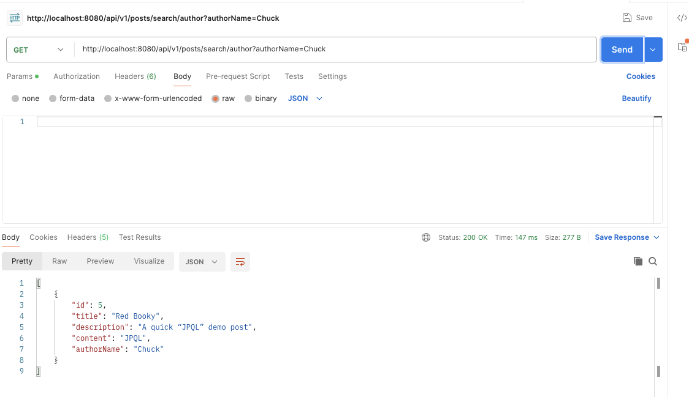  
- **Native SQL**: 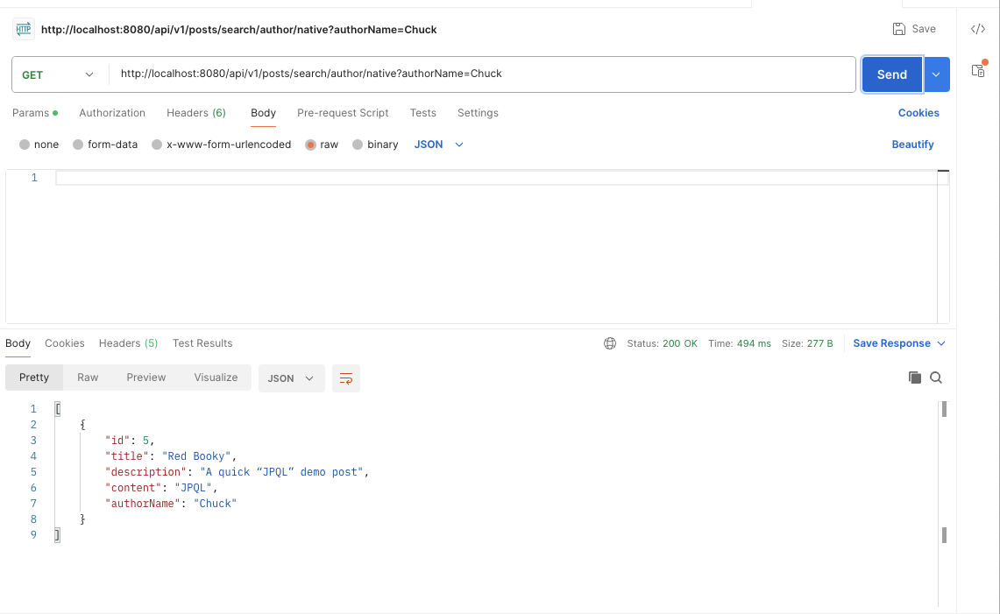  
