## Question 2

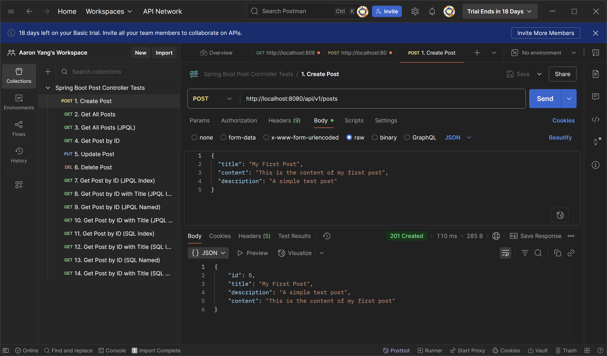

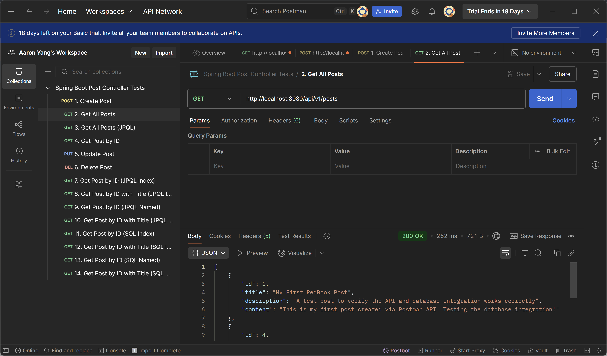

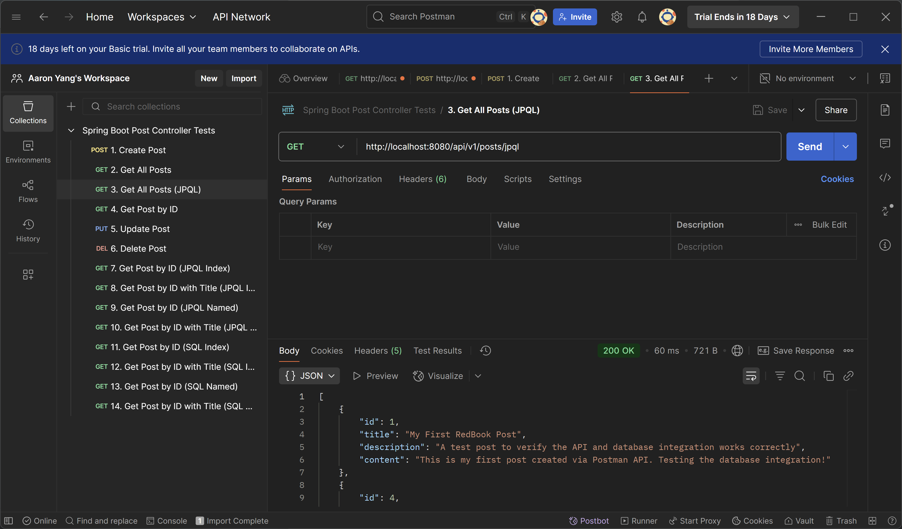

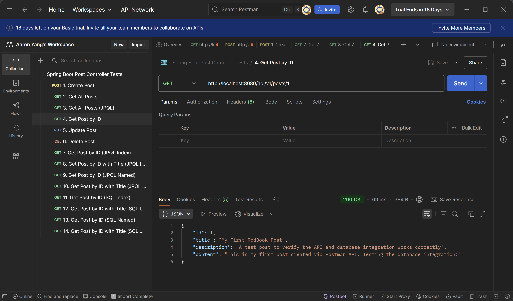

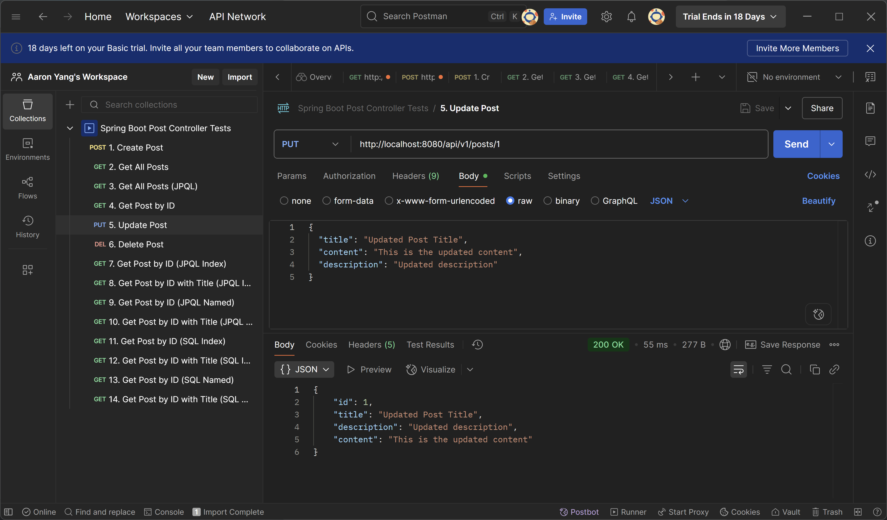

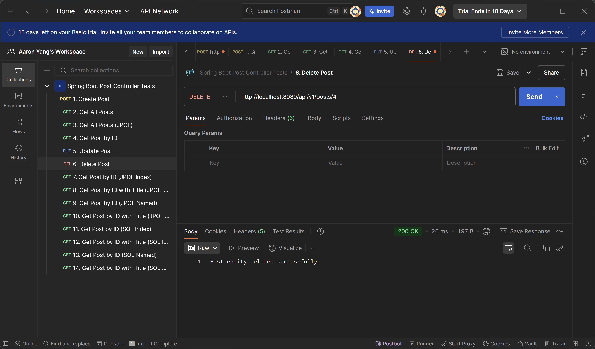

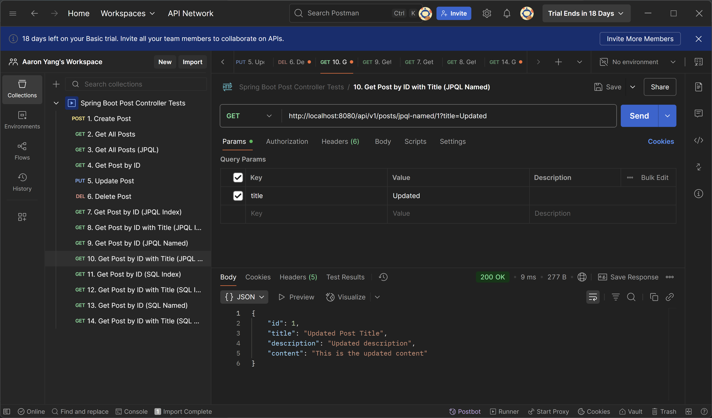

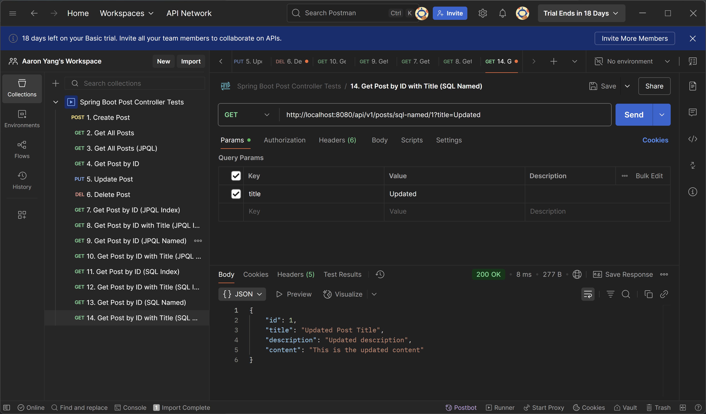

## Question 3

```java
/*  
 * Spring Data JPA Query Method 
 * Finds posts where title ends with the given suffix 
 * Orders results by ID in descending order 
 * @param suffix the suffix to match at the end of the title  
 * @return List of posts matching the criteria, ordered by ID desc  
 */
 List<Post> findByTitleEndingWithOrderByIdDesc(String suffix);
```
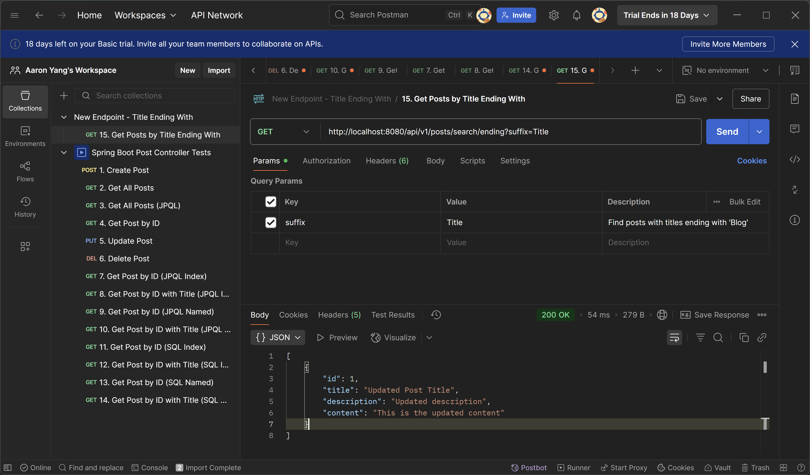
Pattern: [action][By][property][condition][And/Or][property2][condition][OrderBy][property][direction] 
findBy +  Title  +  EndingWith  +  OrderBy  +  Id  +  Desc

## Question 4
```java
/*  
 * JPQL Query * Finds posts where title ends with the given suffix using JPQL * @param suffix the suffix to match at the end of the title  
 * @return List of posts matching the criteria, ordered by ID desc  
 */
 @Query("SELECT p FROM Post p WHERE p.title LIKE %:suffix ORDER BY p.id DESC")  
 List<Post> findPostsByTitleEndingWithJPQL(@Param("suffix") String suffix);  
  
/*
 * Native SQL Query * Finds posts where title ends with the given suffix using native SQL * @param suffix the suffix to match at the end of the title  
 * @return List of posts matching the criteria, ordered by ID desc  
 */
 @Query(value = "SELECT * FROM posts WHERE title LIKE CONCAT('%', :suffix) ORDER BY id DESC", nativeQuery = true)  
 List<Post> findPostsByTitleEndingWithSQL(@Param("suffix") String suffix);
```


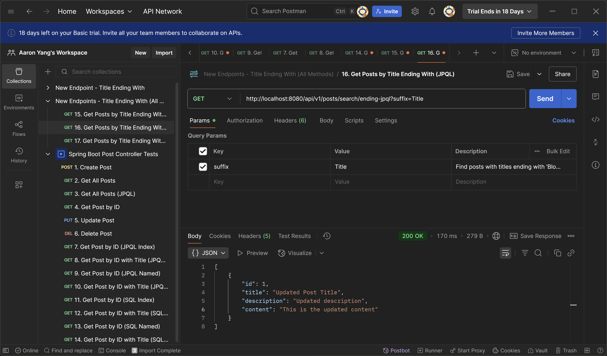

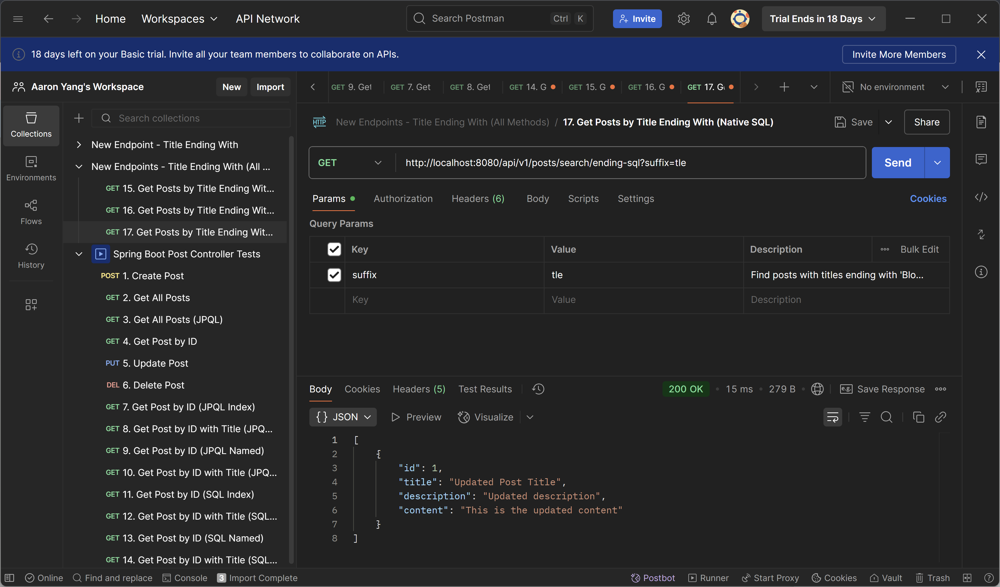

## Question 5

JDBC - Low-level Java database API for executing SQL statements

HikariCP - High-performance connection pool that manages JDBC connections efficiently

Hibernate - ORM framework that sits on top of JDBC, maps objects to database tables. Uses JDBC (through HikariCP) under the hood

Spring Data JPA - Abstraction layer over JPA implementations (like Hibernate), provides repository pattern and reduces boilerplate code. Uses Hibernate as the default JPA implementation

Spring Data JPA → Hibernate → HikariCP → JDBC → Database

## Question 6

@OneToMany - One entity relates to many instances of another entity

@ManyToOne - Many entity relates to one instance of another entity

@ManyToMany - Many entity relates to many instances of another entity

mappedBy - Specifies the field that owns the relationship

cascade - Operations that cascade to related entities:
- CascadeType.ALL
- CascadeType.PERSIST
- CascadeType.REMOVE
- CascadeType.MERGE

fetch - Loading strategy:
- FetchType.LAZY
- FetchType.EAGER

orphanRemoval - Removes orphaned entities when removed from collection

## Question 7
- CascadeType.ALL: Applies all cascade operations to related entities when the parent entity is modified.
- CascadeType.PERSIST: When parent is saved, unsaved child entities are also saved
- CascadeType.REMOVE: When parent is removed, child entities are also removed
- CascadeType.MERGE: When parent is merged, child entities are also merged with the persistence context
- CascadeType.DETACH: When parent is detached from persistence context, child entities are also detached
- CascadeType.REFRESH: When parent is refreshed from database, child entities are also refreshed

orphanRemoval = true: Automatically deletes child entities when they're removed from the parent's collection or when the parent-child relationship is broken


## Question 8
- FetchType.LAZY: Child entities are loaded only when explicitly accessed. Used when child data isn't always needed, for 1-M/M-M
- FetchType.EAGER: Child entities are loaded immediately when parent entity is loaded. Used when child data frequently accessed, for M-1/1-1

## Question 9

JPQL - Object-oriented query language for JPA entities, on entity objects and properties. Can navigate object relationships directly, e.g. 
```sql
SELECT o.customer.name FROM Order o WHERE o.total >  100
```

SQL - On database tables and columns. Requires JOIN to navigate entity relationships.  e.g. 
```sql
SELECT c.name FROM orders o JOIN customers c ON o.customer_id = c.id WHERE o.total > 100
```

## Question 10
@Query - Defines custom queries in Spring Data JPA repository methods. Used only on repository interface methods

nativeQuery = true to use it for native queries.

## Question 11

EntityManager - JPA standard interface for managing entities and persistence operations. For transaction/request

SessionFactory - Hibernate-specific interface for creating Sessions. For application/singleton

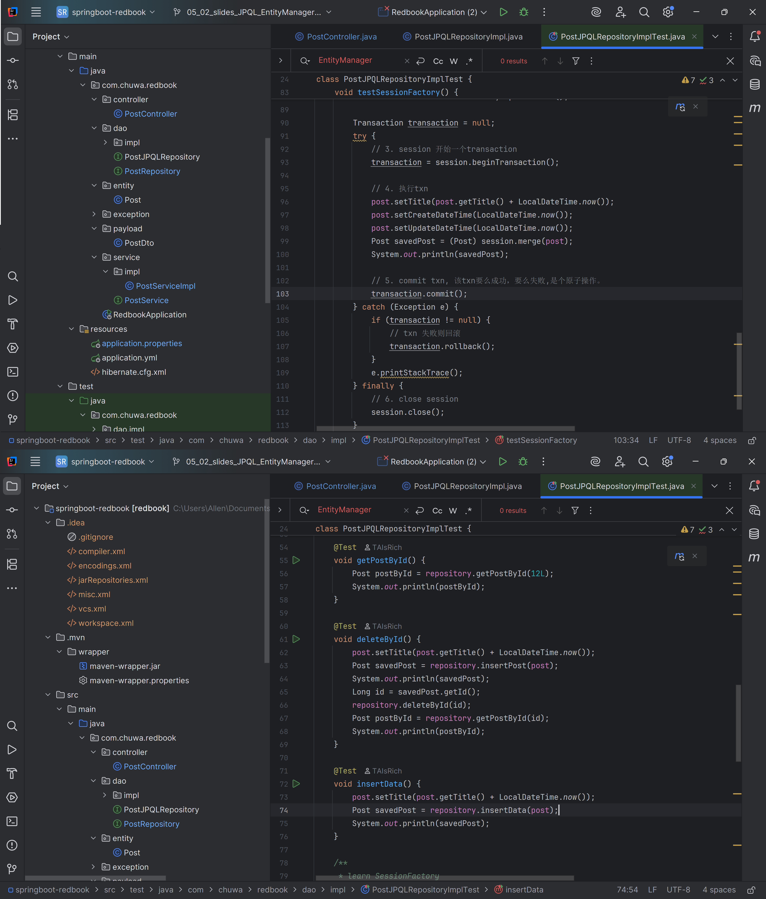

## Question 12 
Session - Object representing a single database conversation
SessionFactory creates Session e.g. 
```java
Session session = sessionFactory.openSession();
```

## Question 13
A transaction is a group of database operations that must all succeed or all fail together.

Spring: using @Transactional annotation
Hibernate: using Session

## Question 14
First-Level Cache: 
- Automatic cache at Session level
- Scope: Single Session/EntityManager instance
- Stores entities retrieved during session lifetime

Second-Level Cache: 
- Optional cache shared across all sessions
- Scope: Application (SessionFactory)
- Must be configured
