# HW 10 – Homework Submission
---

## Part2. Hands-on Project Work
### 2.1 Setup and Test

| #  | Endpoint & Description                                                     | Screenshot                                                |
| -- | -------------------------------------------------------------------------- | --------------------------------------------------------- |
| 1  | **POST** `/posts` — *Create new post*                                      | 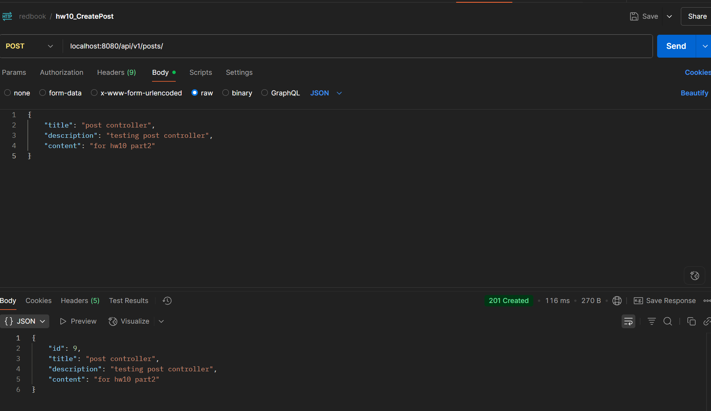             |
| 2  | **GET** `/posts` — *Retrieve all posts*                                    | 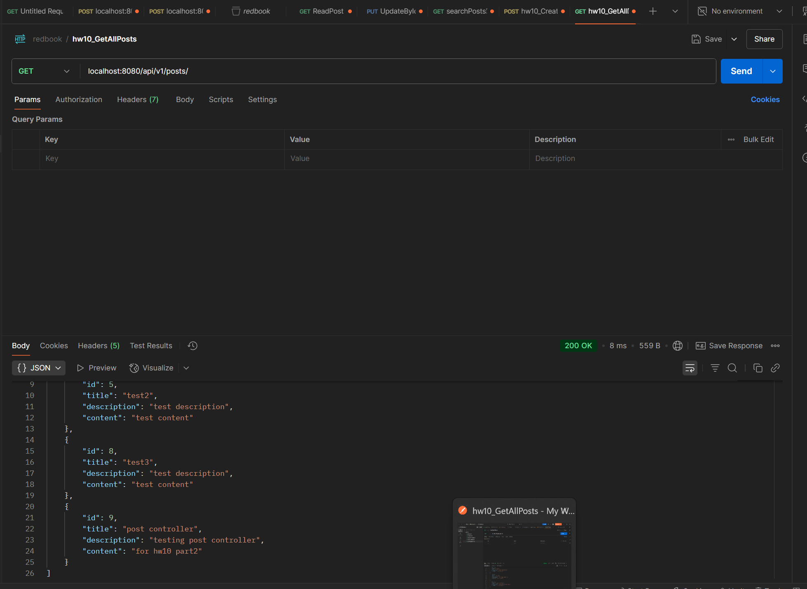        |
| 3  | **GET** `/posts/{id}` — *Retrieve single post by ID*                       | 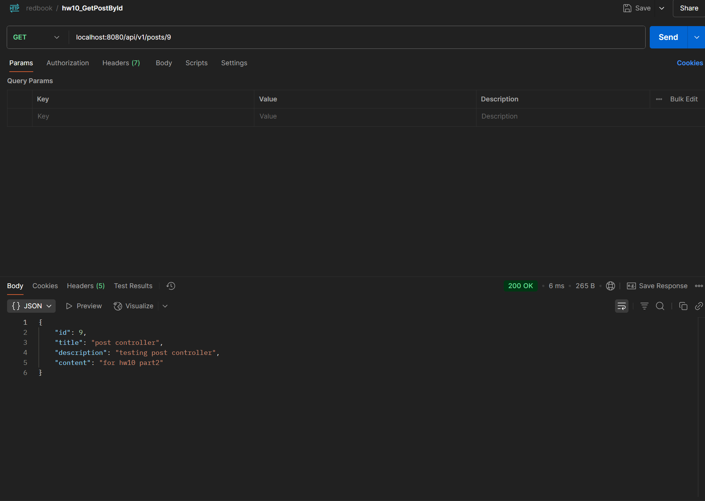       |
| 4  | **PUT** `/posts/{id}` — *Update post*                                      | 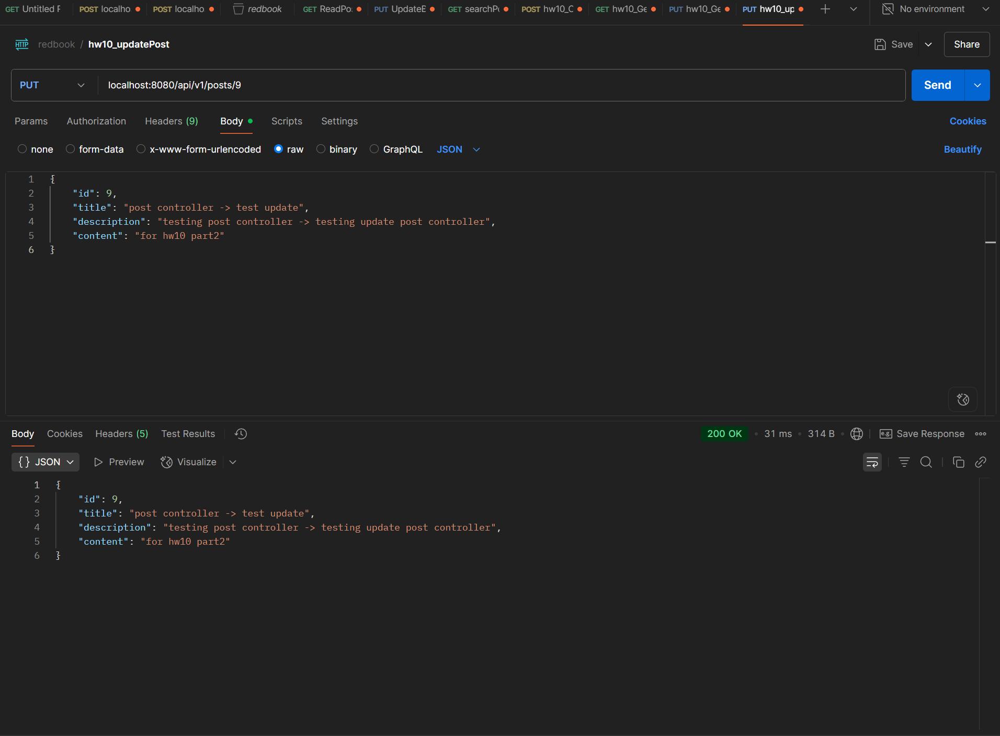             |
| 5  | **DELETE** `/posts/{id}` — *Delete post*                                   | 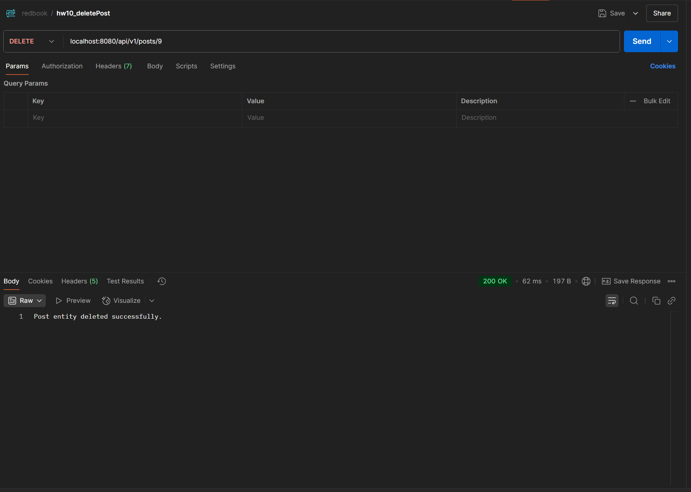           |
| 6  | **GET** `/posts/jpql` — *Custom JPQL query*                                | 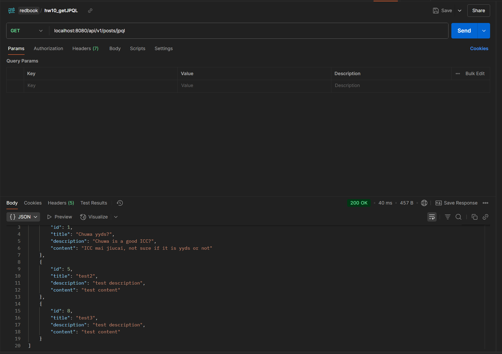                |
| 7  | **GET** `/posts/byIdOrTitle` *(JPQL @Query ‑ positional)*                  | 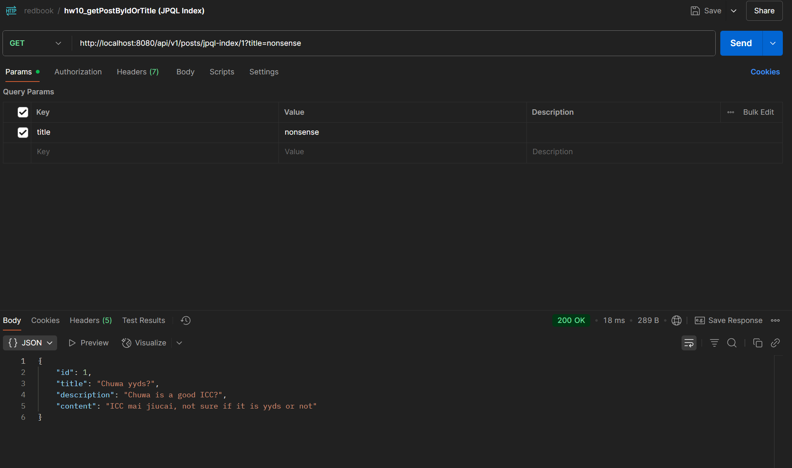 |
| 8  | **GET** `/posts/byIdOrTitleNamed` *(JPQL @Query ‑ named params)*           |                |
| 9  | **GET** `/posts/sql/byIdOrTitle` *(Native SQL @Query ‑ positional)*        | 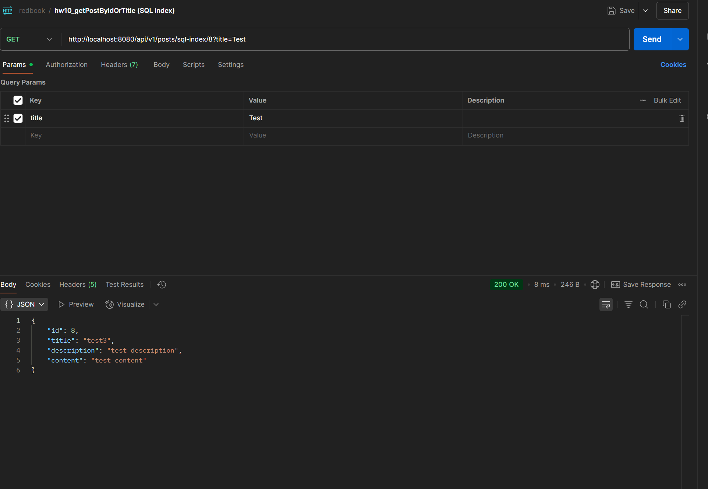   |
| 10 | **GET** `/posts/sql/byIdOrTitleNamed` *(Native SQL @Query ‑ named params)* | 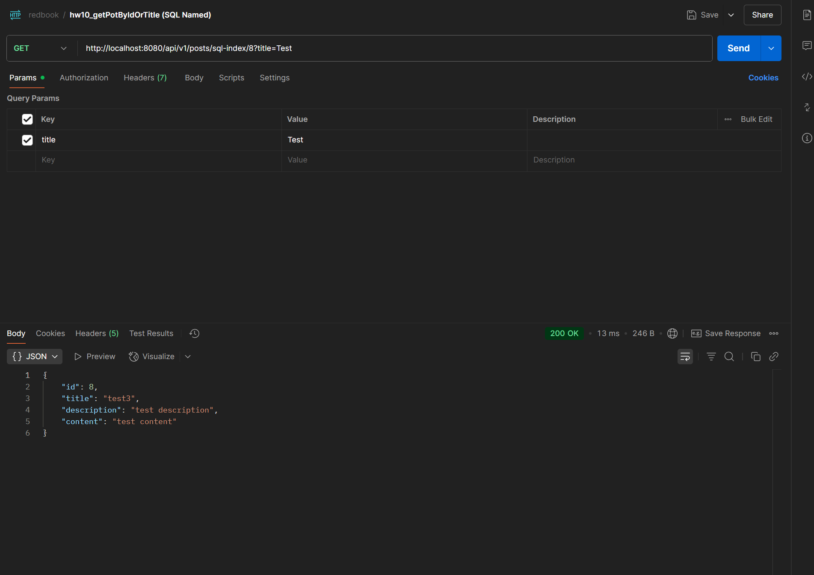   |

---
### 2.2 Custom JPA Methods & Compile‑Time Validation

> Screenshots showing Spring Data method‑name parsing and syntax checks.

###  `findPostsByTitle`

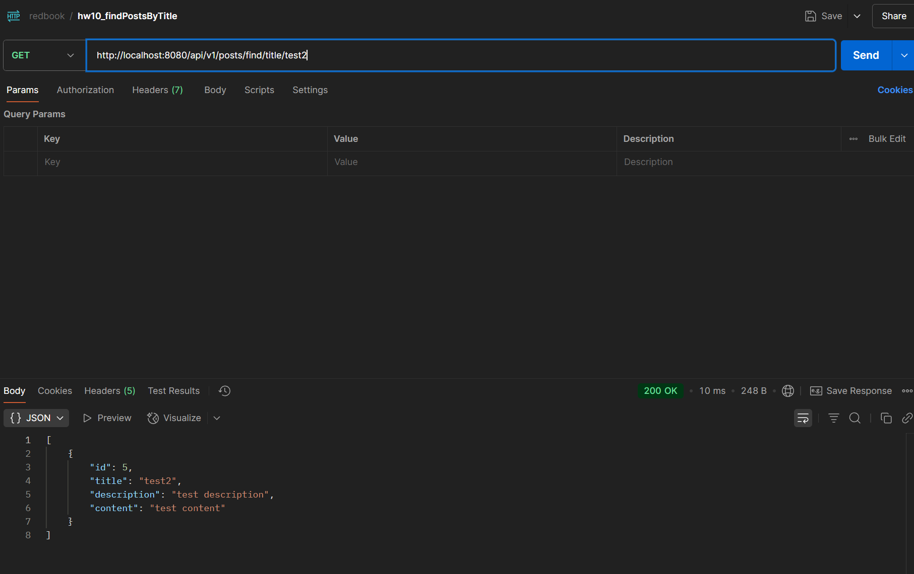

###  `findPostsContaining`

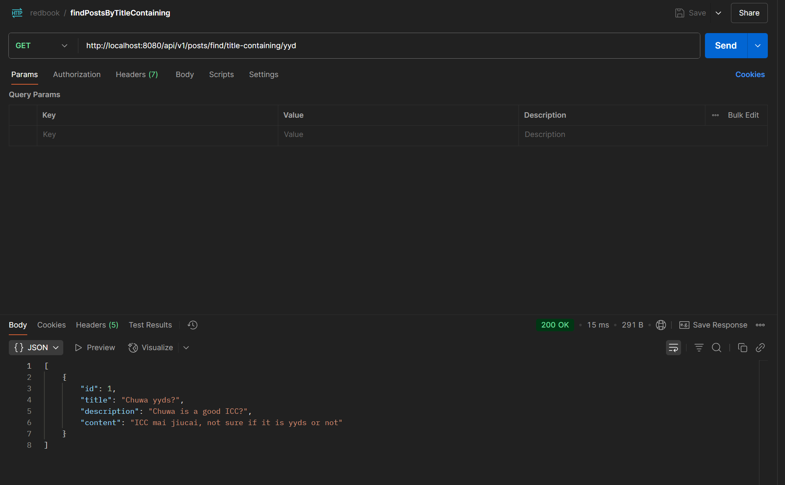

### Invalid Method Name (Compile‑time Error)

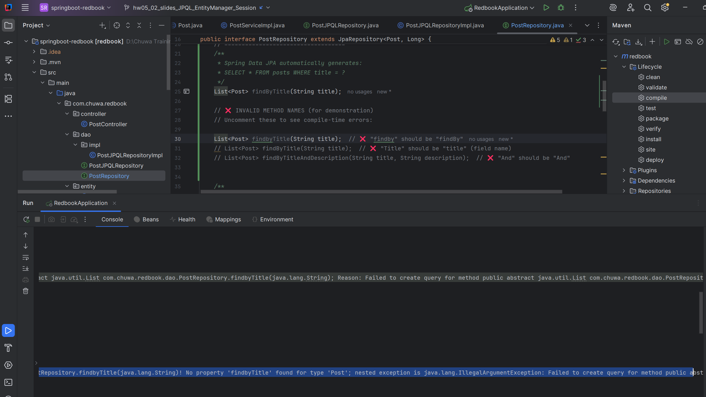

### 2.3 · JPQL & Native SQL Queries

> Evidence that repository‑level `@Query` methods execute correctly.

### Custom JPQL Query (`@Query`)

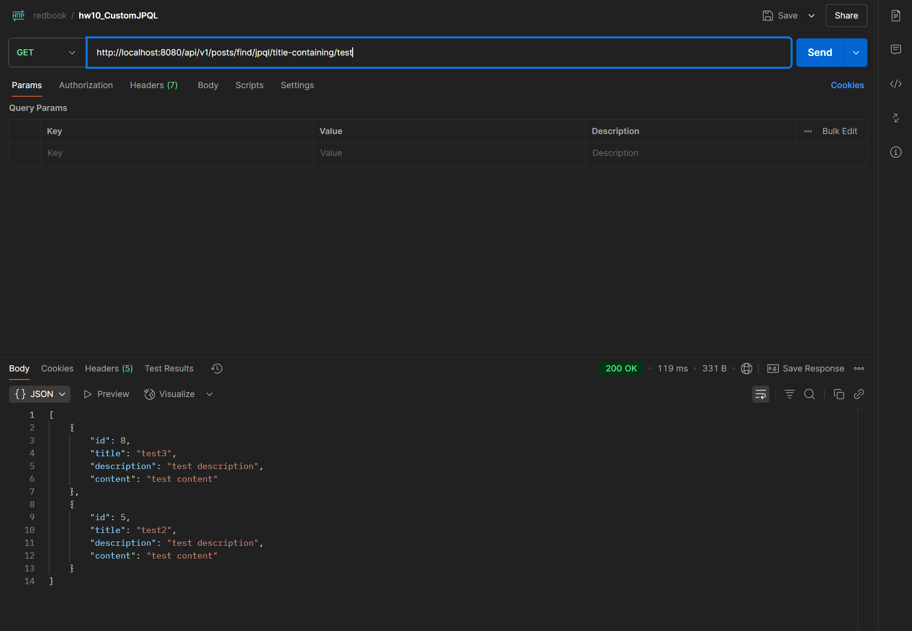

### Custom Native SQL Query (`@Query(nativeQuery = true)`)

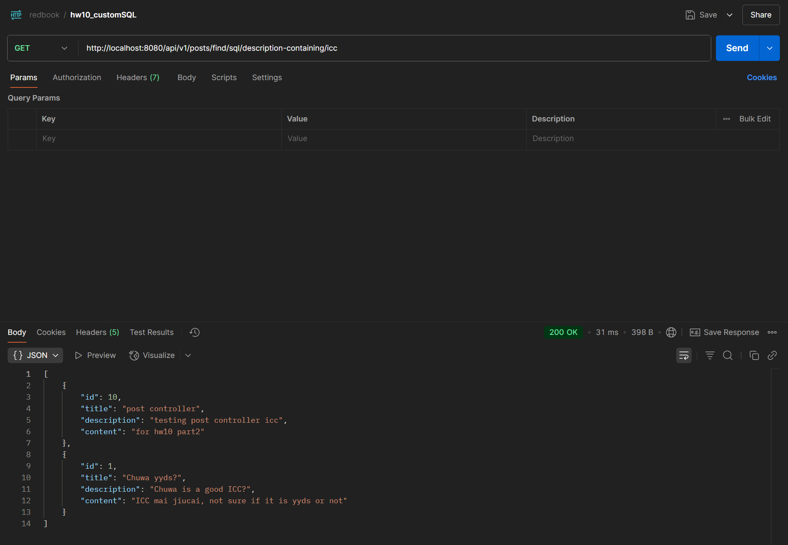

## Part3. Core Conceptual Understanding

### 5. Technology Comparison
# JDBC vs. HikariCP vs. Hibernate vs. Spring Data JPA

## 5.1 JDBC (Java Database Connectivity)

* **What it is** – The lowest‑level, standard Java API for talking to relational databases (MySQL, PostgreSQL, Oracle, …).
* **What it does** – Lets you send SQL queries & updates and process results via `Connection`, `Statement`, `ResultSet`.
* **How you use it** – Write raw SQL strings, manually manage connections and resource cleanup (`try‑with‑resources`).

---

## 5.2 HikariCP

* **What it is** – A lightweight, high‑performance **JDBC connection‑pool** library.
* **What it does** – Keeps a pool of open DB connections ready for reuse, cutting the overhead of creating new ones.
* **How you use it** – Spring Boot ships with HikariCP as the default pool; configure size & timeouts in `application.properties`.
* **Relationship** – Sits between your app and the DB, handing out JDBC connections.

---

## 5.3 Hibernate

* **What it is** – The most popular **ORM** (Object‑Relational Mapping) framework in Java.
* **What it does** – Maps Java entities ↔ database tables; generates SQL and handles caching, dirty checking, and transactions.
* **How you use it** – Annotate entity classes (`@Entity`), let Hibernate handle CRUD via Session/EntityManager.
* **Relationship** – Internally uses JDBC (and the configured pool, e.g. HikariCP) to execute SQL.

---

## 5.4 Spring Data JPA

* **What it is** – A Spring project that streamlines working with **JPA/ORM** frameworks such as Hibernate.
* **What it does** – Generates repository implementations at runtime based on interface signatures and method names.
* **How you use it** – Declare `interface PostRepository extends JpaRepository<Post, Long>` and Spring does the rest.
* **Relationship** – Builds on JPA (Hibernate by default) → Hibernate uses JDBC → JDBC connections are pooled by HikariCP.


### Dependency Flow

```
Your Code → Spring Data JPA → Hibernate (JPA Provider) → JDBC API → HikariCP Pool → Database
```

---

## 6. JPA Relationships
### 6.1 **@OneToMany**

### **Meaning**
- One entity (parent) is related to many entities (children).
- Example: One `Post` has many `Comment`s.

### **Example**
```java
@Entity
public class Post {
    @Id
    private Long id;

    @OneToMany(mappedBy = "post", cascade = CascadeType.ALL, fetch = FetchType.LAZY)
    private List<Comment> comments;
    // mappedBy = "post" means the "post" field in Comment owns the relationship
}
```
```java
@Entity
public class Comment {
    @Id
    private Long id;

    @ManyToOne
    @JoinColumn(name = "post_id")
    private Post post;
}
```

---

### 6.2 **@ManyToOne**

### **Meaning**
- Many entities (children) are related to one entity (parent).
- Example: Many `Comment`s belong to one `Post`.

### **Example**
```java
@Entity
public class Comment {
    @Id
    private Long id;

    @ManyToOne(fetch = FetchType.LAZY)
    @JoinColumn(name = "post_id")
    private Post post;
}
```
- The `@JoinColumn` annotation specifies the foreign key column in the `Comment` table.

---

### 6.3 **@ManyToMany**

### **Meaning**
- Many entities relate to many other entities.
- Example: A `Post` can have many `Tag`s, and a `Tag` can belong to many `Post`s.

### **Example**
```java
@Entity
public class Post {
    @Id
    private Long id;

    @ManyToMany(cascade = CascadeType.ALL, fetch = FetchType.LAZY)
    @JoinTable(
        name = "post_tag",
        joinColumns = @JoinColumn(name = "post_id"),
        inverseJoinColumns = @JoinColumn(name = "tag_id")
    )
    private Set<Tag> tags;
}
```
```java
@Entity
public class Tag {
    @Id
    private Long id;

    @ManyToMany(mappedBy = "tags")
    private Set<Post> posts;
}
```

---

## **Configuration Properties**

### **1. mappedBy**
- **Purpose:** Indicates which side owns the relationship (the "inverse" side).
- **Usage:** Only used on the non-owning side.
- **Example:**  
  In `@OneToMany(mappedBy = "post")`, the `Comment` entity has the `post` field that owns the relationship.

### **2. cascade**
- **Purpose:** Specifies which operations (persist, remove, etc.) should be cascaded from parent to child.
- **Common values:**
  - `CascadeType.PERSIST` – Save child when parent is saved
  - `CascadeType.REMOVE` – Delete child when parent is deleted
  - `CascadeType.ALL` – All operations are cascaded
- **Example:**
  ```java
  @OneToMany(cascade = CascadeType.ALL)
  private List<Comment> comments;
  ```
  Deleting a `Post` will also delete all its `Comment`s.

### **3. fetch**
- **Purpose:** Determines when related entities are loaded from the database.
- **Values:**
  - `FetchType.LAZY` (default for collections): Load only when accessed
  - `FetchType.EAGER`: Load immediately with the parent
- **Example:**
  ```java
  @OneToMany(fetch = FetchType.LAZY)
  private List<Comment> comments;
  ```

---

## **Summary Table**

| Annotation      | Relationship         | Example in Parent | Example in Child | Typical mappedBy? | Typical Join Table? |
|-----------------|---------------------|-------------------|------------------|-------------------|---------------------|
| @OneToMany      | 1 → N               | `@OneToMany(mappedBy = "post")` | `@ManyToOne` | Yes                | No                  |
| @ManyToOne      | N → 1               | `@OneToMany`      | `@ManyToOne`     | No                | No                  |
| @ManyToMany     | N ↔ N               | `@ManyToMany`     | `@ManyToMany(mappedBy = "tags")` | Sometimes           | Yes                 |


---


## **7. Cascade in JPA**

**Cascade** in JPA defines how operations performed on a parent entity are automatically applied to its related child entities.  
This is especially important for relationships like `@OneToMany`, `@ManyToOne`, and `@ManyToMany`.

---

### **1. `cascade = CascadeType.ALL`**

- **What it means:**  
  All JPA operations (persist, merge, remove, refresh, detach) performed on the parent will also be performed on the child entities.
- **Example:**
  ```java
  @OneToMany(mappedBy = "post", cascade = CascadeType.ALL)
  private List<Comment> comments;
  ```
  - Saving a `Post` will save all its `Comment`s.
  - Deleting a `Post` will delete all its `Comment`s.
  - Updating a `Post` will update all its `Comment`s, etc.

---

### **2. `orphanRemoval = true`**

- **What it means:**  
  If a child entity is removed from the parent’s collection (but not necessarily deleted directly), it will be deleted from the database as well.
- **Example:**
  ```java
  @OneToMany(mappedBy = "post", cascade = CascadeType.ALL, orphanRemoval = true)
  private List<Comment> comments;
  ```
  - If you remove a `Comment` from the `comments` list of a `Post`, that `Comment` will be deleted from the database.

---

## **All CascadeType Values**

| CascadeType      | What it does                                                                                   | Example Use Case                        |
|------------------|-----------------------------------------------------------------------------------------------|-----------------------------------------|
| **PERSIST**      | When you save (persist) the parent, also save the children.                                   | Save a new `Post` and its `Comment`s    |
| **MERGE**        | When you update (merge) the parent, also update the children.                                 | Update a `Post` and its `Comment`s      |
| **REMOVE**       | When you delete (remove) the parent, also delete the children.                                | Delete a `Post` and its `Comment`s      |
| **REFRESH**      | When you refresh the parent from the database, also refresh the children.                     | Reload a `Post` and its `Comment`s      |
| **DETACH**       | When you detach the parent from the persistence context, also detach the children.             | Detach a `Post` and its `Comment`s      |
| **ALL**          | Applies all of the above (PERSIST, MERGE, REMOVE, REFRESH, DETACH).                          | Most common for parent-child relationships |

---

## **Quick Example Table**

| CascadeType      | Parent Action | Child Action |
|------------------|--------------|--------------|
| PERSIST          | save         | save         |
| MERGE            | update       | update       |
| REMOVE           | delete       | delete       |
| REFRESH          | refresh      | refresh      |
| DETACH           | detach       | detach       |
| ALL              | all above    | all above    |

---

## **8. What is FetchType?**

**FetchType** in JPA determines **when** related entities (e.g., child objects in a relationship) are loaded from the database.

---

## **1. FetchType.LAZY**

- **Definition:**  
  Related entities are **not loaded immediately** with the parent entity.  
  They are loaded **on-demand** (when you access the relationship for the first time).

- **Default for:**  
  - `@OneToMany`
  - `@ManyToMany`

- **Example:**
  ```java
  @OneToMany(mappedBy = "post", fetch = FetchType.LAZY)
  private List<Comment> comments;
  ```

- **How it works:**  
  When you fetch a `Post`, the `comments` list is **not** loaded from the database until you call `post.getComments()`.

- **When to use:**  
  - When you **don’t always need** the related data.
  - To **improve performance** and **reduce memory usage**.
  - For large collections or rarely-used relationships.

---

## **2. FetchType.EAGER**

- **Definition:**  
  Related entities are **loaded immediately** with the parent entity, in the same database query (or with additional queries).

- **Default for:**  
  - `@ManyToOne`
  - `@OneToOne`

- **Example:**
  ```java
  @ManyToOne(fetch = FetchType.EAGER)
  private Post post;
  ```

- **How it works:**  
  When you fetch a `Comment`, the associated `Post` is **also loaded** right away.

- **When to use:**  
  - When you **always need** the related data.
  - For **small, simple relationships** (e.g., a `Comment` always needs its `Post`).

---

## **Comparison Table**

| FetchType      | When is related data loaded? | Default for         | Use when...                        |
|----------------|-----------------------------|---------------------|------------------------------------|
| **LAZY**       | On-demand (when accessed)   | OneToMany, ManyToMany | Related data is large or rarely used |
| **EAGER**      | Immediately (with parent)   | ManyToOne, OneToOne | Related data is always needed      |

---

## **Best Practices**

- **Prefer LAZY** for collections and large relationships to avoid performance issues (the "N+1 select problem").
- **Use EAGER** only when you are sure you always need the related data.
- **Be careful with EAGER** on large collections—it can cause huge, slow queries and memory problems.

---

## **Summary**

- **FetchType.LAZY**: Loads related data **only when needed**.  
  *Best for large or optional relationships.*

- **FetchType.EAGER**: Loads related data **immediately** with the parent.  
  *Best for small, always-needed relationships.*

---

## Part4. Quering and Data Access
## ** 9.What is JPQL?**

**JPQL** stands for **Java Persistence Query Language**.  
It is a query language defined by the JPA (Java Persistence API) specification.

- **Purpose:**  
  To query and manipulate data in a database using the **entity model** (Java classes and fields), not the database schema (tables and columns).

- **Who uses it?**  
  Java developers working with JPA/Hibernate and entity classes.

---

## **How is JPQL Different from SQL?**

| Aspect         | JPQL (Java Persistence Query Language) | SQL (Structured Query Language)      |
|----------------|---------------------------------------|--------------------------------------|
| **Targets**    | Java entity classes and fields        | Database tables and columns          |
| **Portable?**  | Yes (database-agnostic)               | No (database-specific syntax)        |
| **Object-Oriented?** | Yes (uses Java class names, relationships) | No (uses table/column names)         |
| **Joins**      | Uses entity relationships             | Uses foreign keys and explicit joins |
| **Return Type**| Entities or fields                    | Rows/columns                        |

---

## **Example: JPQL vs SQL**

Suppose you have this entity:

```java
@Entity
public class Post {
    @Id
    private Long id;
    private String title;
    private String content;
}
```

### **1. Simple Select**

**JPQL:**
```java
// In a repository or EntityManager
@Query("SELECT p FROM Post p WHERE p.title = :title")
List<Post> findByTitle(@Param("title") String title);
```
- Uses the **entity name** (`Post`) and **field name** (`title`).

**SQL:**
```sql
SELECT * FROM posts WHERE title = 'Spring Boot';
```
- Uses the **table name** (`posts`) and **column name** (`title`).

---

### **2. Join Example**

Suppose `Post` has a `List<Comment> comments` relationship.

**JPQL:**
```java
@Query("SELECT c FROM Comment c JOIN c.post p WHERE p.title = :title")
List<Comment> findCommentsByPostTitle(@Param("title") String title);
```
- Uses the **entity relationship** (`c.post`).

**SQL:**
```sql
SELECT c.* FROM comments c
JOIN posts p ON c.post_id = p.id
WHERE p.title = 'Spring Boot';
```
- Uses **table joins** and **foreign keys**.

---

### **3. Aggregation Example**

**JPQL:**
```java
@Query("SELECT COUNT(p) FROM Post p WHERE p.title LIKE :keyword")
long countPostsByTitle(@Param("keyword") String keyword);
```

**SQL:**
```sql
SELECT COUNT(*) FROM posts WHERE title LIKE '%Spring%';
```

---

## **Key Points**

- **JPQL is object-oriented:**  
  You write queries using Java class and field names, not table/column names.

- **JPQL is portable:**  
  The same JPQL works with any database supported by JPA/Hibernate.

- **JPQL supports relationships:**  
  You can navigate entity relationships directly (e.g., `p.comments`).

- **SQL is database-specific:**  
  You write queries using the actual database schema.

---

## **Summary Table**

| Feature         | JPQL Example                                      | SQL Example                        |
|-----------------|---------------------------------------------------|------------------------------------|
| Select          | `SELECT p FROM Post p`                            | `SELECT * FROM posts`              |
| Where           | `WHERE p.title = :title`                          | `WHERE title = 'Spring Boot'`      |
| Join            | `JOIN p.comments c`                               | `JOIN comments c ON c.post_id = p.id` |
| Count           | `SELECT COUNT(p) FROM Post p`                     | `SELECT COUNT(*) FROM posts`       |

---

## **When to Use JPQL?**

- When you want to write **database-agnostic** queries in your Java code.
- When you want to work with **entities and relationships** instead of raw tables.
- When using **Spring Data JPA** or **Hibernate**.

---

**In summary:**  
- **JPQL** is for querying Java entities in a database-agnostic, object-oriented way.
- **SQL** is for querying tables and columns directly in the database.

---

## **10. What is the `@Query` Annotation?**

- **Purpose:**  
  The `@Query` annotation allows you to define custom queries directly on repository methods in Spring Data JPA.
- **Where is it used?**  
  On methods in your repository interfaces (e.g., `PostRepository`).

---

## **Why Use `@Query`?**

- When you need a query that can’t be expressed with method naming conventions.
- When you want to write a custom JPQL or native SQL query for more control or performance.

---

## **How to Use `@Query`**

### **1. JPQL Queries (Default)**

- **JPQL** (Java Persistence Query Language) uses entity and field names.
- **Example:**
  ```java
  @Query("SELECT p FROM Post p WHERE p.title = :title")
  List<Post> findPostsByTitle(@Param("title") String title);
  ```
  - `Post` is the entity name, not the table name.
  - `title` is the field name, not the column name.

---

### **2. Native SQL Queries**

- **Native SQL** uses actual table and column names from your database.
- **You must set** `nativeQuery = true`.
- **Example:**
  ```java
  @Query(value = "SELECT * FROM posts WHERE title = :title", nativeQuery = true)
  List<Post> findPostsByTitleNative(@Param("title") String title);
  ```
  - `posts` is the table name.
  - `title` is the column name.

---

## **Parameter Binding**

- Use `:paramName` in the query and annotate the method parameter with `@Param("paramName")`.
- For positional parameters, use `?1`, `?2`, etc.

**Example:**
```java
@Query("SELECT p FROM Post p WHERE p.title = ?1 AND p.description = ?2")
List<Post> findByTitleAndDescription(String title, String description);
```

---

## **Where to Use `@Query`**

- In any interface that extends `JpaRepository`, `CrudRepository`, or `PagingAndSortingRepository`.

**Example:**
```java
@Repository
public interface PostRepository extends JpaRepository<Post, Long> {
    @Query("SELECT p FROM Post p WHERE p.title = :title")
    List<Post> findPostsByTitle(@Param("title") String title);
}
```

---

## **Summary Table**

| Query Type | Example | Notes |
|------------|---------|-------|
| JPQL       | `@Query("SELECT p FROM Post p WHERE p.title = :title")` | Uses entity and field names |
| Native SQL | `@Query(value = "SELECT * FROM posts WHERE title = :title", nativeQuery = true)` | Uses table and column names |

---

## **When to Use JPQL vs Native SQL**

- **JPQL:**  
  - When you want portability and to work with entities.
  - Most common for business logic queries.
- **Native SQL:**  
  - When you need database-specific features or performance optimizations.
  - When JPQL cannot express the query you need.

---

## **In Summary**

- `@Query` lets you write custom queries in your repository interfaces.
- By default, it uses JPQL (entity/field names).
- Set `nativeQuery = true` to use raw SQL (table/column names).
- Use `@Param` to bind method parameters to query parameters.

---
## Part5. Hibernate and Entity Management
## **11.EntityManager vs SessionFactory: Overview**

| Feature           | EntityManager (JPA)                | SessionFactory (Hibernate)         |
|-------------------|------------------------------------|------------------------------------|
| **API Standard**  | JPA (Java Persistence API)         | Hibernate (proprietary API)        |
| **Main Purpose**  | Manages JPA entities and queries   | Creates Hibernate Sessions         |
| **Lifecycle**     | Short-lived, per operation/request | Long-lived, one per application    |
| **How to get**    | `@PersistenceContext` or `EntityManagerFactory.createEntityManager()` | `new Configuration().buildSessionFactory()` |
| **Thread Safety** | Not thread-safe                    | Thread-safe                        |
| **Usage**         | Standard in modern Spring/JPA apps | Used in legacy or Hibernate-only   |

---

## **Relationship**

- **SessionFactory** is Hibernate’s original way to manage database sessions.
- **EntityManager** is the JPA standard interface, and is now the preferred way in Spring and JPA-based apps.
- Under the hood, when you use JPA with Hibernate as the provider, **EntityManager** is implemented by Hibernate and delegates to a **Session** (which is created by a **SessionFactory**).

---

## **In Codebase**
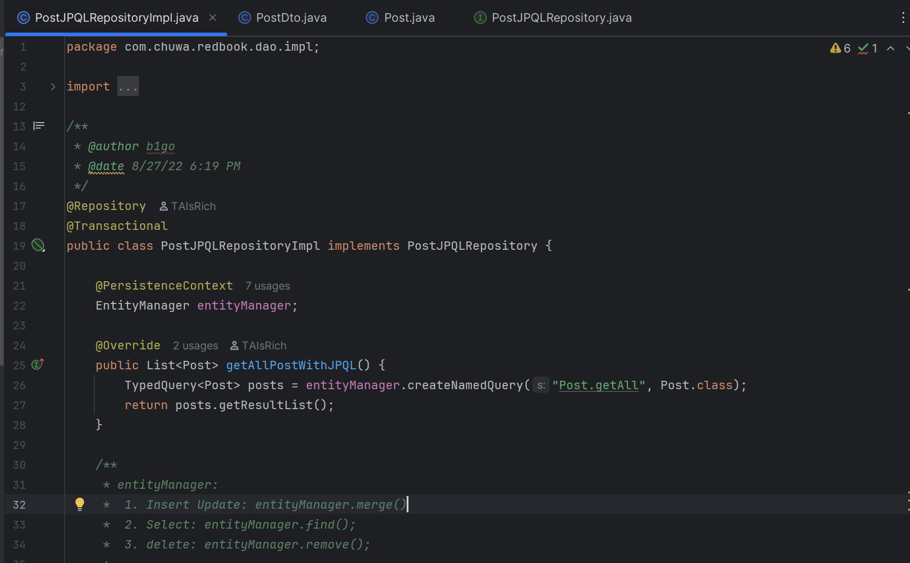
## **How They Relate**

- In a Spring Boot JPA app, you use `EntityManager` (JPA standard).
- If Hibernate is the JPA provider, `EntityManager` is a wrapper around Hibernate’s `Session`.
- The `Session` is created by a `SessionFactory` behind the scenes.

**Diagram:**
```
Your Code (EntityManager)
        ↓
Hibernate's EntityManagerImpl
        ↓
Hibernate Session
        ↓
SessionFactory (singleton, managed by Hibernate)
```

---

## **Summary Table**

| Aspect         | EntityManager                | SessionFactory                |
|----------------|-----------------------------|-------------------------------|
| API            | JPA Standard                | Hibernate-specific            |
| Usage          | Per operation/request       | Singleton, app-wide           |
| Thread Safety  | Not thread-safe             | Thread-safe                   |
| Spring Boot    | Preferred                   | Not used directly             |
| In your code   | Yes                         | No                            |

---

## **In Summary**

- **Use `EntityManager`** in modern Spring/JPA apps (as you do).
- **`SessionFactory`** is used internally by Hibernate, but you don’t need to manage it directly.
- **EntityManager** is the JPA abstraction; **SessionFactory** is the Hibernate implementation detail.

## Part6. Database Fundamentals

## **13. SQL Transactions**

### **What is a Transaction?**
A **transaction** in a relational database is a sequence of one or more SQL operations (such as INSERT, UPDATE, DELETE) that are executed as a single, atomic unit of work.

**Key properties (ACID):**
- **Atomicity:** All operations succeed or none do.
- **Consistency:** The database moves from one valid state to another.
- **Isolation:** Transactions are isolated from each other.
- **Durability:** Once committed, changes are permanent.

**Example:**
```sql
BEGIN;
UPDATE accounts SET balance = balance - 100 WHERE id = 1;
UPDATE accounts SET balance = balance + 100 WHERE id = 2;
COMMIT;
```
If any step fails, the whole transaction is rolled back.

---

### **How Spring/Hibernate Manage Transactions**

- **Spring:**  
  Uses the `@Transactional` annotation to manage transactions declaratively.
  ```java
  @Transactional
  public void transferMoney(Long fromId, Long toId, BigDecimal amount) {
      // All DB operations here are part of one transaction
  }
  ```
  - If an exception is thrown, Spring will automatically roll back the transaction.
  - You can annotate methods in services or repositories.

- **Hibernate:**  
  Manages transactions via the `Session` object.
  ```java
  Session session = sessionFactory.openSession();
  Transaction tx = session.beginTransaction();
  // ... do work ...
  tx.commit(); // or tx.rollback() on error
  session.close();
  ```
  - In Spring Boot, you rarely manage Hibernate transactions directly; Spring does it for you.

---

## **14. Hibernate Caching**

Hibernate uses caching to reduce the number of database queries and improve performance.

### **First-Level Cache (Session Scope)**
- **Scope:** Per Hibernate `Session` (or JPA `EntityManager`).
- **Behavior:**  
  - All entities loaded or saved in a session are cached in memory.
  - If you query the same entity again in the same session, Hibernate returns it from the cache, not the database.
- **Lifecycle:**  
  - Cache is cleared when the session is closed.
- **Configuration:**  
  - Always enabled; you don’t need to configure it.

**Example:**
```java
Session session = sessionFactory.openSession();
Post post1 = session.get(Post.class, 1L); // Hits DB
Post post2 = session.get(Post.class, 1L); // Returns from cache
session.close();
```

---

### **Second-Level Cache (Shared/Global Scope)**
- **Scope:** Across sessions, shared for the entire application.
- **Behavior:**  
  - Entities are cached beyond a single session.
  - Multiple sessions can benefit from the same cached data.
- **Lifecycle:**  
  - Cache persists as long as the application is running.
- **Configuration:**  
  - Must be explicitly enabled and configured.
  - Requires a cache provider (e.g., Ehcache, Hazelcast, Infinispan).

**Example:**
```java
// Session 1
Session session1 = sessionFactory.openSession();
Post post1 = session1.get(Post.class, 1L); // Hits DB, stores in 2nd-level cache
session1.close();

// Session 2
Session session2 = sessionFactory.openSession();
Post post2 = session2.get(Post.class, 1L); // Returns from 2nd-level cache
session2.close();
```

**How to enable:**
```properties
spring.jpa.properties.hibernate.cache.use_second_level_cache=true
spring.jpa.properties.hibernate.cache.region.factory_class=org.hibernate.cache.ehcache.EhCacheRegionFactory
```
And annotate your entity:
```java
@Entity
@Cacheable
public class Post { ... }
```

---

### **Comparison Table**

| Feature             | First-Level Cache         | Second-Level Cache         |
|---------------------|--------------------------|---------------------------|
| **Scope**           | Per session/EntityManager| Application-wide          |
| **Enabled by**      | Default (always on)      | Must be configured        |
| **Shared?**         | No                       | Yes                       |
| **Cleared when**    | Session closed           | App shutdown or eviction  |
| **Use case**        | Avoid duplicate DB hits in one session | Share data across sessions |

---

## **Summary**

- **Transactions** ensure data integrity and are managed by Spring with `@Transactional` or by Hibernate with `Session`/`Transaction`.
- **Hibernate Caching**:
  - **First-Level:** Always on, per session, avoids duplicate DB hits in one session.
  - **Second-Level:** Optional, shared across sessions, must be configured, improves performance for frequently accessed data.

Let me know if you want code samples or diagrams for either topic!

```sql
BEGIN;
UPDATE accounts SET balance = balance - 100 WHERE id = 1;
UPDATE accounts SET balance = balance + 100 WHERE id = 2;
COMMIT;
```

```java
  @Transactional
  public void transferMoney(Long fromId, Long toId, BigDecimal amount) {
      // All DB operations here are part of one transaction
  }
```

```java
  Session session = sessionFactory.openSession();
  Transaction tx = session.beginTransaction();
  // ... do work ...
  tx.commit(); // or tx.rollback() on error
  session.close();
```

```java
Session session = sessionFactory.openSession();
Post post1 = session.get(Post.class, 1L); // Hits DB
Post post2 = session.get(Post.class, 1L); // Returns from cache
session.close();
```

```java
// Session 1
Session session1 = sessionFactory.openSession();
Post post1 = session1.get(Post.class, 1L); // Hits DB, stores in 2nd-level cache
session1.close();

// Session 2
Session session2 = sessionFactory.openSession();
Post post2 = session2.get(Post.class, 1L); // Returns from 2nd-level cache
session2.close();
```

```properties
spring.jpa.properties.hibernate.cache.use_second_level_cache=true
spring.jpa.properties.hibernate.cache.region.factory_class=org.hibernate.cache.ehcache.EhCacheRegionFactory
```

```java
@Entity
@Cacheable
public class Post { ... }
```


