# Part 1:  Annotation & Syntax Reference
# 1. Spring Annotation Cheatsheet
Q: List all of the annotations you’ve learned from class and homework in a file named annotations.md. 
This will serve as your Spring annotation reference.
A:
## 1. Annotation in Main Entry file like RedbookApplication.java

### `@SpringBootApplication`
A convenience annotation that combines @Configuration, @EnableAutoConfiguration, and @ComponentScan. It is typically placed on the main application class.
表示整个程序的入口

## 2. Annotations in Controller.java

### `@RestController`
A shortcut for @Controller and @ResponseBody, commonly used in RESTful web services.

It indicates:
它表示：

This class is a Spring MVC Controller.
这个类是一个 Spring MVC 控制器。

Every method’s return value will be serialized (typically as JSON) and sent directly in the HTTP response body.
每个方法的返回值将被序列化（通常是 JSON 格式），并直接发送在 HTTP 响应体中。

### `@RequestMapping`:
@RequestMapping only maps HTTP requests to handler methods or classes.@RequestMapping 
仅将 HTTP 请求映射到处理器方法或类。

It does not tell Spring that the class is a controller and does not handle response serialization.
它不会告诉 Spring 这个类是一个控制器，也不会处理响应序列化。

### `@GetMapping`, `@PostMapping`, `@PutMapping`, `@DeleteMapping`
Specific HTTP method shortcuts for `@RequestMapping`.
特定 HTTP 方法的快捷方式。


## 3. Annotations in Entity(like Post.java):

### `@Entity`
Marks a Java class as a JPA entity, indicating that instances of this class can be persisted to a database.
将 Java 类标记为 JPA 实体，表示该类的实例可以持久化到数据库中。

### `@Table`
Used in conjunction with `@Entity`, this annotation allows you to specify details about the database table to which the entity is mapped, such as the table name, schema, and unique constraints. 
与 `@Entity` 结合使用时，此注解允许您指定实体映射到的数据库表的详细信息，例如表名、模式以及唯一约束。

### `@Id`
Designates a field within an entity class as the primary key of the corresponding database table.
指定实体类中的一个字段作为相应数据库表的主键。

### `@GeneratedValue`
Used with `@Id`, this annotation specifies the strategy for generating primary key values (e.g., identity, sequence, auto).
与 `@Id` 结合使用时，此注解指定生成主键值的策略（例如，identity、sequence、auto）。

### `@Column`
Provides fine-grained control over the mapping of an entity field to a database column, including the column name, length, nullability, and uniqueness.
提供对实体字段映射到数据库列的细粒度控制，包括列名、长度、可空性和唯一性。

### `@Transient`
Indicates that a field should not be persisted to the database and should be ignored by JPA. 
指示该字段不应持久化到数据库，JPA 应忽略该字段。

### Relationship Annotations:关系注解：

### `@OneToOne`, `@OneToMany`, `@ManyToOne`, `@ManyToMany`

These annotations define the different types of relationships between entities (one-to-one, one-to-many, many-to-one, and many-to-many).
这些注解定义了实体之间不同类型的关系（一对一、一对多、多对一和多对多）。

### `@JoinColumn`

Used to specify the foreign key column in a relationship.
用于指定关系中的外键列。

### `@JoinTable`

Used in many-to-many relationships to define the join table that manages the association. 
在多对多关系中，用于定义管理关联的连接表。


## 4. Annotations in Repository.java:

### `@Query`

The `@Query` annotation in Spring Data JPA provides a mechanism to define custom database queries directly within repository interface methods. This offers flexibility beyond the automatically generated query methods based on method names.
Spring Data JPA 中的 `@Query` 注解提供了一种机制，可以直接在仓库接口方法中定义自定义数据库查询。这提供了比基于方法名自动生成的查询方法更大的灵活性。

#### Key features and usage:主要特点和用法：

#### Custom Queries:  自定义查询：

It allows you to write custom JPQL (Java Persistence Query Language) or native SQL queries.
它允许你编写自定义的 JPQL（Java 持久化查询语言）或原生 SQL 查询。

#### JPQL:

By default, the value attribute of @Query expects a JPQL query, which operates on entities and their relationships. 
默认情况下， value 属性期望 @Query 为 JPQL 查询，该查询作用于实体及其关系。

```java

    /**
     * JPQL
     * use Entity name other than database table name.
     * index Parameters
     * @return post
     */
    @Query("select p from Post p where p.id = ?1 or p.title = ?2")
    Post getPostByIDOrTitleWithJPQLIndexParameters(Long id, String title);

    /**
     * JPQL
     * use Entity name other than database table name.
     * index Parameters
     * @return post
     */
    @Query("select p from Post p where p.id = :key or p.title = :title")
    Post getPostByIDOrTitleWithJPQLNamedParameters(@Param("key") Long id,
                                                   @Param("title") String title);
```

- Native SQL: To use native SQL, set the nativeQuery attribute to true. This allows you to write database-specific SQL queries.
原生 SQL：要使用原生 SQL，将 nativeQuery 属性设置为 true 。这允许你编写特定于数据库的 SQL 查询。

```java
    /**
     * SQL
     * use database table name.
     * index Parameters
     * @return post
     */
    @Query(value = "select * from posts p where p.id = ?1 or p.title = ?2", nativeQuery = true)
    Post getPostByIDOrTitleWithSQLIndexParameters(Long id, String title);
```
#### Parameters:  参数：

You can pass parameters to your queries using:
您可以使用以下方式向您的查询传递参数：

- Positional parameters: `?1`, `?2`, etc., corresponding to the method's argument order.
位置参数： `?1` 、 `?2` 等，对应于方法参数的顺序。

- Named parameters: :paramName, which are then bound using the `@Param("paramName")` annotation on the method arguments.
命名参数： :paramName ，这些参数通过在方法参数上使用 @Param("paramName") 注解进行绑定。

`@Modifying`:

For update or delete operations using `@Query`, you must also annotate the method with `@Modifying` to indicate that the query modifies the database.
使用 `@Query` 进行更新或删除操作时，您还必须用 `@Modifying` 注解该方法，以表明该查询会修改数据库。

```java
    @Modifying
    @Query("UPDATE User u SET u.active = false WHERE u.id = ?1")
    void deactivateUser(Long userId);
```

- Precedence: Queries defined with `@Query` take precedence over named queries (defined with `@NamedQuery` or in orm.xml). 
优先级：使用 `@Query` 定义的查询优先级高于命名查询（使用 `@NamedQuery` 定义或在 orm.xml 中定义的）。

#### When to use @Query:何时使用 `@Query` ：

- When the derived query methods (e.g., `findByLastNameAndFirstName`) become too complex or insufficient for your needs.
当衍生查询方法（例如 `findByLastNameAndFirstName` ）变得过于复杂或无法满足您的需求时。

- When you need to perform more complex queries involving joins, aggregations, or specific database functions not easily expressed by derived methods.
当你需要执行涉及连接、聚合或特定数据库函数的复杂查询，而这些函数难以通过派生方法表达时。

- When you want to optimize query performance by writing highly specific and optimized queries.
当你希望通过编写高度特定和优化的查询来优化查询性能时。


## 5. Other Annotations

### `@Autowired`
Used for automatic dependency injection.
用于自动依赖注入。

### `@Service`, `@Repository`, `@Controller`, `@Component`

Stereotype annotations to categorize Spring-managed components based on their roles.
@Service、@Repository、@Controller、@Component：根据其角色对 Spring 管理的组件进行分类的模板注解。


### `@Configuration`
Indicates a class that contains Spring bean definitions.
指示一个包含 Spring Bean 定义的类。


### `@Bean`
Used to explicitly declare a Spring bean within a configuration class.
用于在配置类中显式声明一个 Spring Bean。


### `@EnableAutoConfiguration`
Enables Spring Boot's auto-configuration mechanism.
启用 Spring Boot 的自动配置机制。


### `@Qualifier`
Used to resolve ambiguity when multiple beans of the same type are available for autowiring.
用于在存在多个相同类型的 Bean 可供自动装配时解决歧义。

### `@Value`
Injects values from properties files or environment variables.
从属性文件或环境变量中注入值。

### `@Transactional`
Manages transactional behavior for methods or classes.
管理方法或类的事务行为。

### `@ExceptionHandler`
Handles exceptions thrown by specific handler methods.
处理特定处理器方法抛出的异常。

## 6. Annotation of Annotation:

```java
@Target({ElementType.TYPE, ElementType.FIELD})
@Retention(RetentionPolicy.RUNTIME)
public @interface Table {
    ...
}
```
@Target and @Retention are on each Annotation.

### `@Target`

The @Target annotation in Spring JPA, similar to its usage in standard Java, is a meta-annotation that specifies the applicable locations for a custom annotation. It dictates where a particular annotation can be used within the code.
Spring JPA 中的 @Target 注释，与它在标准 Java 中的使用类似，是一个元注释，用于指定定制注释的适用位置。它规定特定注释可以在代码中的哪些地方使用。

| Element Type |	Element to be Annotated |
|------|------|
|Type |	Class, interface or enumeration|
|Field |	Field|
|Method |	Method |
|Constructor | Constructor|
|Local_Variable |	Local variable| 
|Annotation_Type |	Annotation Type |
|Package | PACKAGE|
|Type_Parameter	|Type Parameter |
|Parameter |	Formal Parameter|

While @Target is not a direct JPA annotation itself (like @Entity or @Id), it becomes relevant in Spring JPA when defining custom annotations that might be used alongside JPA entities or repositories.
虽然 @Target 本身不是 JPA 注释（如 @Entity 或 @Id ），但在 Spring JPA 中定义可能用于 JPA 实体或仓库的定制注释时，它变得相关。

### `@Retention`

The `@Retention` annotation in Java, and consequently in Spring Boot, is a meta-annotation used to specify how long an annotation with the annotated type is to be retained. It determines at what point in the program's lifecycle the annotation information will be available.

Java 中的 `@Retention` 注解，以及在 Spring Boot 中，是一个元注解，用于指定被注解类型的注解应保留多久。它决定了注解信息在程序生命周期中的哪个阶段可用。
There are three main RetentionPolicy values that can be applied:

可以应用三种主要的 RetentionPolicy 值：

1. #### `RetentionPolicy.SOURCE`:

- Annotations with this policy are retained only in the source code.
采用此策略的注解仅保留在源代码中。

- They are discarded by the compiler during compilation and are not included in the .class file.
它们在编译期间被编译器丢弃，并且不包含在 .class 文件中。

- These are typically used for compile-time processing, such as by IDEs, code generators, or for documentation purposes (e.g., @Override, @SuppressWarnings).
它们通常用于编译时处理，例如 IDE、代码生成器或用于文档目的（例如 @Override 、 @SuppressWarnings ）。

2. #### `RetentionPolicy.CLASS`:

- Annotations with this policy are stored in the .class file during compilation.
采用此策略的注解在编译期间存储在 .class 文件中。

- However, they are not retained by the Java Virtual Machine (JVM) at runtime and cannot be accessed through reflection.
然而，它们在运行时不会被 Java 虚拟机（JVM）保留，也无法通过反射来访问。

- This policy is often used for annotations that provide metadata for tools that process bytecode, but not for runtime behavior.
这项策略通常用于为处理字节码的工具提供元数据的注解，但不用于运行时行为。

3. #### `RetentionPolicy.RUNTIME`:

- Annotations with this policy are stored in the .class file and are also retained by the JVM at runtime.
采用这项策略的注解存储在 .class 文件中，并且在运行时由 JVM 保留。

- This allows them to be accessed and processed reflectively by the application at runtime.
这使得它们可以在运行时被应用程序通过反射访问和处理。

- Many Spring Boot annotations, such as @Component, @Service, @Repository, and custom annotations that need to be processed by Spring's dependency injection or AOP mechanisms, use RetentionPolicy.RUNTIME to enable their functionality.
许多 Spring Boot 注解，如 @Component 、 @Service 、 @Repository ，以及需要通过 Spring 依赖注入或 AOP 机制处理的自定义注解，使用 RetentionPolicy.RUNTIME 来启用其功能。

In the context of Spring Boot, @Retention(RetentionPolicy.RUNTIME) is crucial for most of Spring's core annotations and any custom annotations you create that need to be read and acted upon by the Spring framework during application startup or execution. This allows Spring to discover components, configure beans, apply aspects, and perform other runtime operations based on the annotation metadata.
在 Spring Boot 的上下文中， @Retention(RetentionPolicy.RUNTIME) 对于大多数 Spring 的核心注解以及任何需要在应用程序启动或执行期间被 Spring 框架读取和处理的自定义注解都至关重要。这使得 Spring 能够根据注解元数据发现组件、配置 Bean、应用切面并执行其他运行时操作。


# Part 2:  Hands-on Project Work

# 2. Setup Starter Project & Test APIs

Q: - Clone the following repository:
 https://github.com/CTYue/springboot-redbook/tree/05_02_slides_JPQL_EntityManager_Session
- Make the necessary code/configuration changes to bring up the application.
- Test each controller using Postman and take screenshots.

A:
## createPost(PostDto postDto)
Before creation, the posts in database:

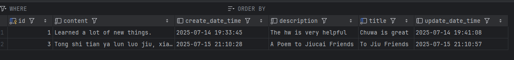

Send post request via postman:

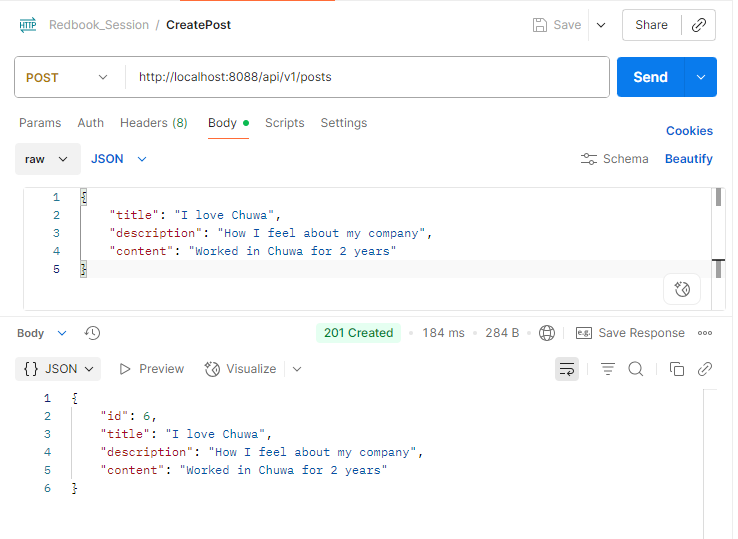

added a new post in database.

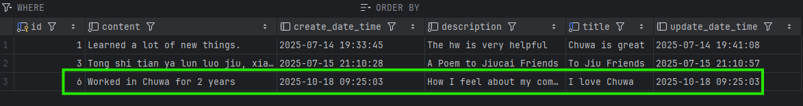

## getAllPost()

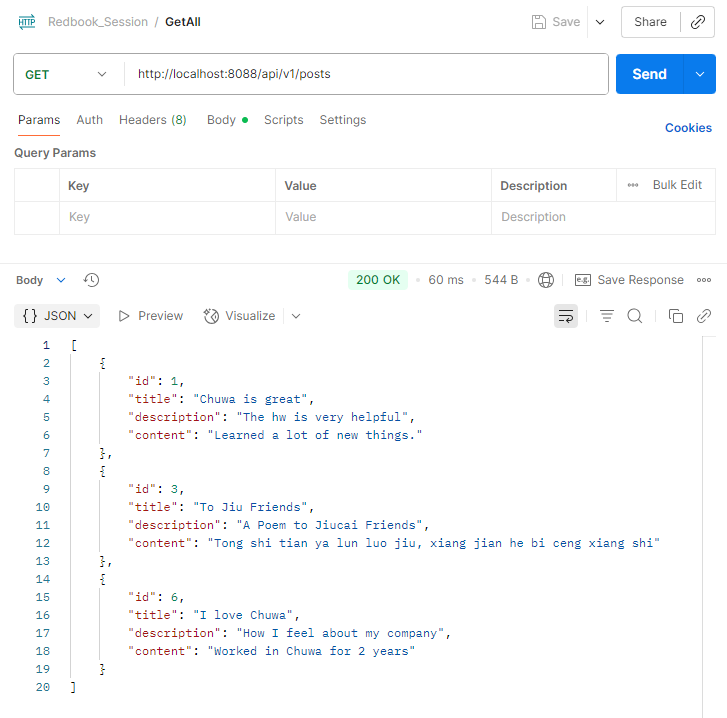

## getAllPostsJPQL()

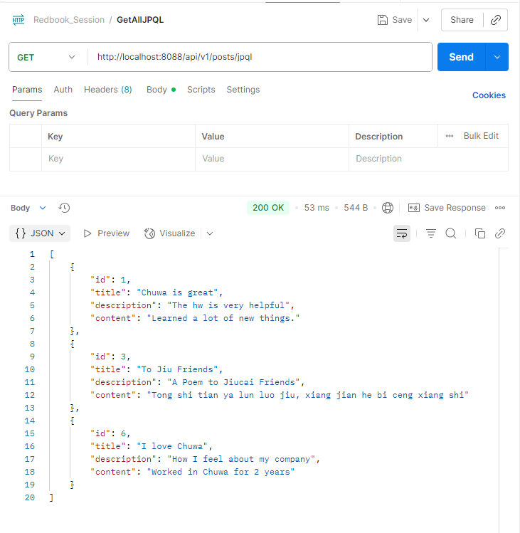

## getPostByIdOrTitleJPQLIndex( @PathVariable(name = "id") long id, @RequestParam(value = "title", required = false) String title) 

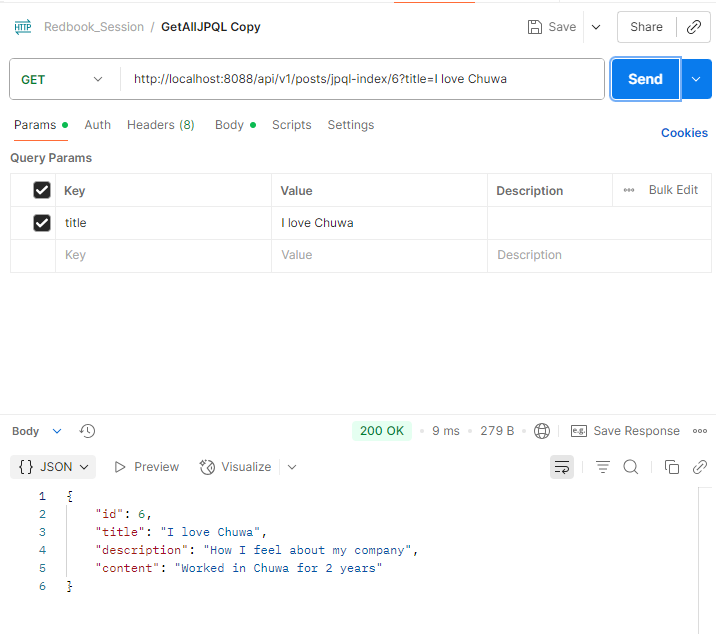

## getPostByIdOrTitleJPQLNamed( @PathVariable(name = "id") long id, @RequestParam(value = "title", required = false) String title) 

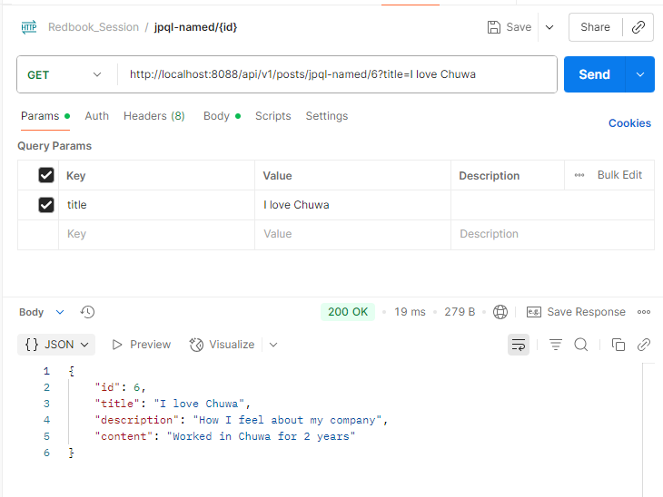

## getPostByIdOrTitleSQLIndex( @PathVariable(name = "id") long id, @RequestParam(value = "title", required = false) String title) 

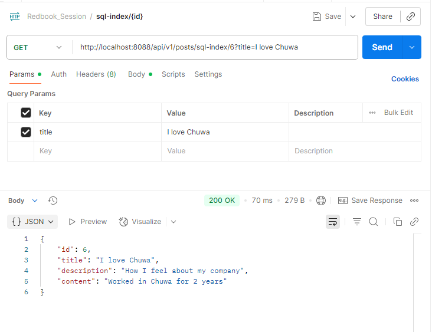

## getPostByIdOrTitleSQLNamed( @PathVariable(name = "id") long id, @RequestParam(value = "title", required = false) String title) 

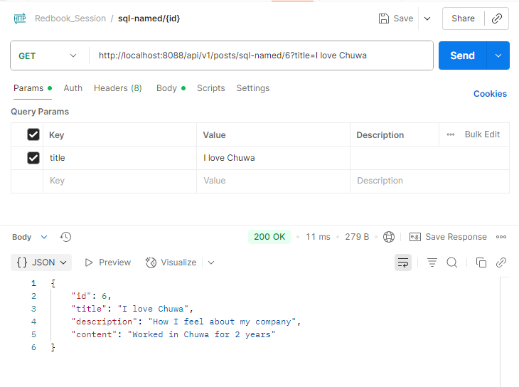

They can work without query parameter "?title=I love Chuwa":

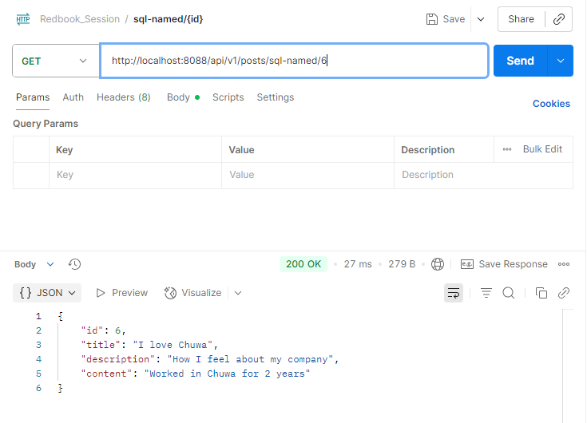

## getPostById(@PathVariable(name = "id") long id)

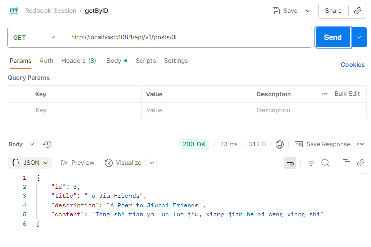

## updatePostById(@RequestBody PostDto postDto, @PathVariable(name = "id") long id)

Postman request:

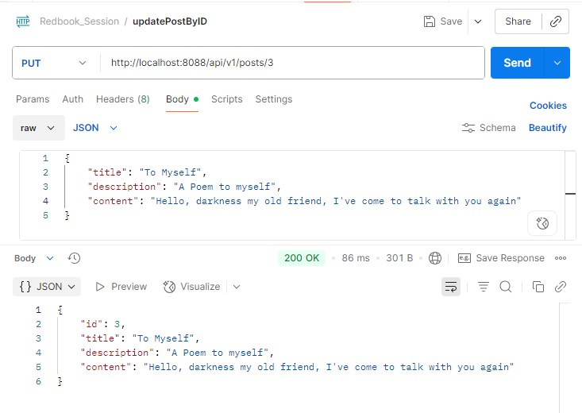

Before update:

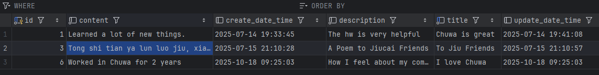

After update:

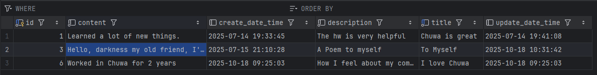

## deletePost(@PathVariable(name = "id") long id) 
Postman request:

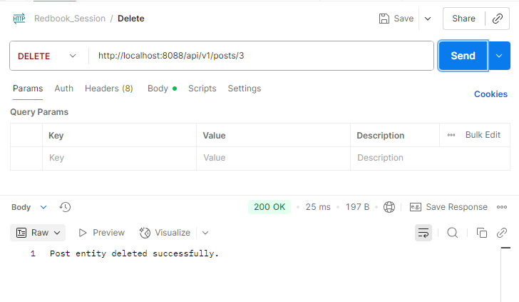

Before delete:


After delete:

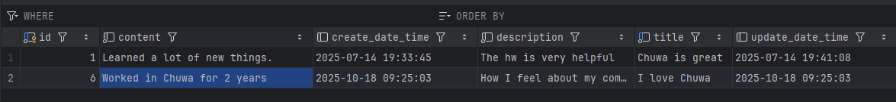


# 3. Write Custom JPA Methods and Validate Syntax
Q: - Based on the codebase from Task 2:
    - Write custom JPA methods using Spring Data JPA naming conventions.
    - Demonstrate how JPA performs compile-time syntax checks on method names.

A:
My custom JPA query is going to fetch posts that starts with a specific string.
Screenshot of all posts:

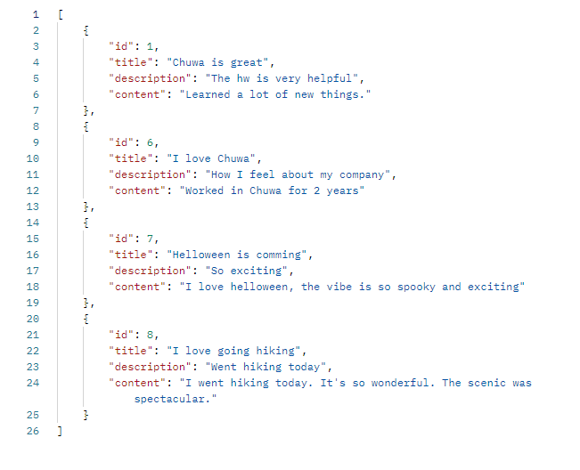

Fetch posts that starts with 'I love':

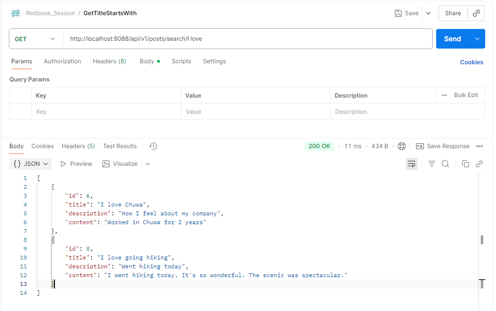

*We can replace space in url with '%20'.

Here is my code:

```java
// Controller:

@RestController
@RequestMapping("/api/v1/posts")
public class PostController {

    @Autowired
    private PostService postService;

    /**
     *  custom JPA methods using Spring Data JPA naming conventions
     */
    @GetMapping("/search/{title}")
    public List<PostDto> searchPostByTitleStartsWith(@PathVariable(name = "title") String title) {
        return postService.searchPostByTitleStartingWith(title);
    }
}

// Service:

public interface PostService {
    List<PostDto> searchPostByTitleStartingWith(String title);
}

//ServiceImpl:

@Service
public class PostServiceImpl implements PostService {

    @Autowired
    private PostRepository postRepository;


    @Override
    public List<PostDto> searchPostByTitleStartingWith(String title) {
        List<Post> posts = postRepository.searchPostByTitleStartingWith(title);
        return posts.stream().map(post -> mapToDTO(post)).collect(Collectors.toList());
    }
}

// Repo:

@Repository
public interface PostRepository extends JpaRepository<Post, Long> {
    List<Post> searchPostByTitleStartingWith(String title);
}
```

Q: Demonstrate how JPA performs compile-time syntax checks on method names.

A: Spring Data JPA parses repository method names at compile/start-up time.
If the property names or keywords don’t match valid entity fields, the framework throws a descriptive error before running the application.
This ensures query correctness is checked early — a compile-time safety feature of the query-derivation mechanism.
If we have a typo in repository file:
```java
public interface PostRepository extends JpaRepository<Post, Long> {
    // Typo: "ttle" field does NOT exist in Post
    List<Post> searchPostByTtleStartingWith(String title);
}
```
# 4. Implement JPQL and Native SQL Queries
Q:
- In your repository interface, add:
    - One JPQL query using the @Query annotation
    - One native SQL query using @Query(nativeQuery = true)
- Update your service layer to use these queries.
- Test both using Postman and capture screenshots

A:
My `JPQL query using the @Query annotation` is to search Posts by id less than or equal a specific id.
My `native SQL query using @Query(nativeQuery = true)` is to search Posts by content Longer than tr equal a specific length.
Screenshot of all posts:


Fetch posts that id less than or equal 6:

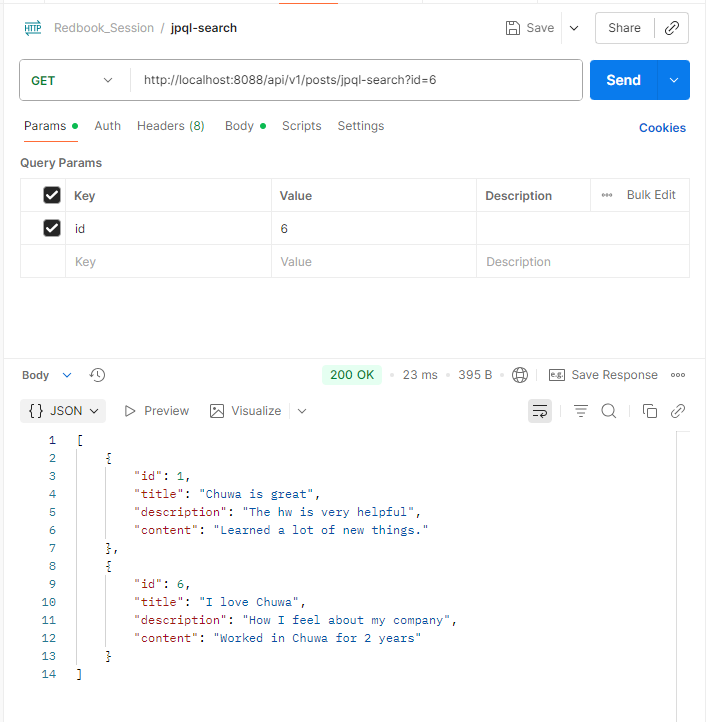

Fetch posts that content longer than 28 characters:

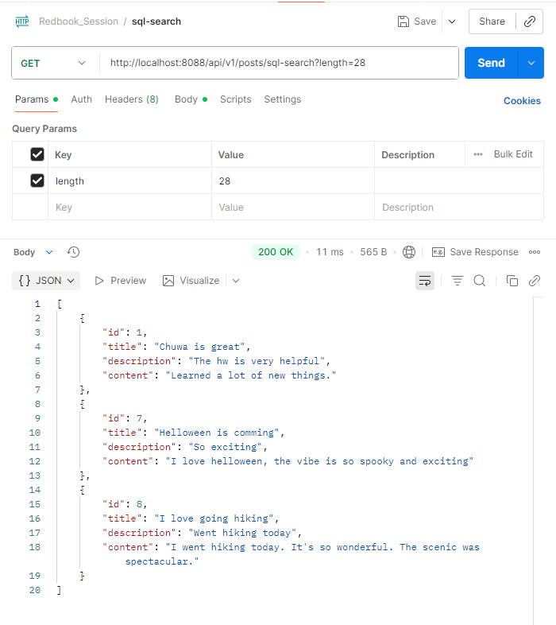

Code:
```java
// Controller:

@RestController
@RequestMapping("/api/v1/posts")
public class PostController {

    @Autowired
    private PostService postService;

    /**
     *  custom JPA methods using Spring Data JPA naming conventions
     */
    @GetMapping("/search/{title}")
    public List<PostDto> searchPostByTitleStartsWith(@PathVariable(name = "title") String title) {
        return postService.searchPostByTitleStartingWith(title);
    }

    /**
     * JPQL query using the @Query annotation
     */
    @GetMapping("/jpql-search")
    public List<PostDto> searchPostByIdLessThanOrEqual(@RequestParam(value = "id", required = false) long id) {
        return postService.searchPostByIdLessThanOrEqual(id);
    }

    /**
     * Native SQL query using @Query(native = true)
     */
    @GetMapping("/sql-search")
    public List<PostDto> searchPostByContentLongerThan(@RequestParam(value = "length", required = false) long length) {
        return postService.searchPostByContentLongerThanOrEqual (length);
    }
}

// Service:

public interface PostService {
    List<PostDto> searchPostByTitleStartingWith(String title);
    List<PostDto> searchPostByIdLessThanOrEqual(long id);
    List<PostDto> searchPostByContentLongerThanOrEqual(long length);
}

//ServiceImpl:

@Service
public class PostServiceImpl implements PostService {

    @Autowired
    private PostRepository postRepository;


    @Override
    public List<PostDto> searchPostByTitleStartingWith(String title) {
        List<Post> posts = postRepository.searchPostByTitleStartingWith(title);
        return posts.stream().map(post -> mapToDTO(post)).collect(Collectors.toList());
    }
    @Override
    public List<PostDto> searchPostByIdLessThanOrEqual(long id) {
        List<Post> posts = postRepository.searchPostByIdLessThanOrEqual(id);
        return posts.stream().map(post -> mapToDTO(post)).collect(Collectors.toList());
    }


    @Override
    public List<PostDto> searchPostByContentLongerThanOrEqual(long length) {
        List<Post> posts = postRepository.searchPostByContentLongerThanOrEqual(length);
        return posts.stream().map(post -> mapToDTO(post)).collect(Collectors.toList());
    }

}

// Repo:

@Repository
public interface PostRepository extends JpaRepository<Post, Long> {
    List<Post> searchPostByTitleStartingWith(String title);

    @Query("select p from Post p where p.id <= ?1")
    List<Post> searchPostByIdLessThanOrEqual(Long id);

    @Query(value = "select * from posts p where LENGTH(p.content) >= ?1", nativeQuery = true)
    List<Post> searchPostByContentLongerThanOrEqual(Long length);
}
```

# Part 3:  Core Conceptual Understanding


# 5. Technology Comparison
Q: Explain the differences and relationships among:
 - **Spring Data JPA**
 - **Hibernate**
 - **HikariCP**
 - **JDBC**

A:
### 🧩 **Spring Data JPA (Java Persistence API )**

-   **Purpose:** A *high-level abstraction layer* built on top of JPA (and thus Hibernate).
    
-   **Function:** Simplifies data access by auto-generating queries from repository interfaces.
    
-   **Example:**
    
    ```java
    public interface UserRepository extends JpaRepository<User, Long> {
        List<User> findByEmail(String email);
    }
    ```
    
    ➜ No SQL or EntityManager needed; Spring Data JPA parses the method name and creates the query automatically.
    

---

### 🧩 **Hibernate**

-   **Purpose:** A *JPA provider / ORM engine* that actually implements the JPA specification.
    
-   **Function:** Converts Java objects ↔ SQL tables, manages sessions, caching, and dirty checking.
    
-   **Relationship:** Spring Data JPA delegates persistence work to Hibernate by default.

---

### 🧩 **HikariCP (connection pool)**

-   **Purpose:** A *connection pool manager* bundled by default in Spring Boot.
    
-   **Function:** Efficiently maintains a pool of open JDBC connections for reuse.
    
-   **Example Configuration (application.properties):**
    
    ```properties
    spring.datasource.hikari.maximum-pool-size=10
    spring.datasource.hikari.connection-timeout=30000
    ```
    

---

### 🧩 **JDBC (Java Database Connectivity)**

-   **Purpose:** The *lowest-level* database API in Java.
    
-   **Function:** Allows direct SQL execution via `Connection`, `PreparedStatement`, and `ResultSet`.
    
-   **Example:**
    
    ```java
    Connection conn = DriverManager.getConnection(url, user, pass);
    PreparedStatement ps = conn.prepareStatement("SELECT * FROM user WHERE id=?");
    ```
    

---

### ⚙️ **Relationship Overview**

| Layer | Description | Example |
| --- | --- | --- |
| **JDBC** | Raw SQL interface to DB | `PreparedStatement` |
| **HikariCP** | Manages JDBC connections efficiently | Connection Pool |
| **Hibernate (JPA Provider)** | ORM that translates Java objects ↔ SQL | `Session.save()` |
| **Spring Data JPA** | Simplifies CRUD/query boilerplate | `userRepository.findAll()` |
# 6. JPA Relationships
Q: Explain the following annotations with examples:
- **@OneToMany**
- **@ManyToOne**
- **@ManyToMany**
 Also describe and explain the configuration properties inside each, such as mappedBy, cascade, and fetch.
A:
### 🧩 **@OneToMany / @ManyToOne**

Used when **one entity owns multiple** of another.

```java
@Entity
public class User {
    @Id @GeneratedValue
    private Long id;
    private String name;

    @OneToMany(mappedBy="user", cascade=CascadeType.ALL, fetch=FetchType.LAZY)
    private List<Post> posts;
}

@Entity
public class Post {
    @Id @GeneratedValue
    private Long id;
    private String title;

    @ManyToOne
    @JoinColumn(name="user_id")  // foreign key
    private User user;
}
```

-   `mappedBy="user"` → `User` is not the owner of the relationship; `Post` owns it via `user_id`.
    
-   `cascade=CascadeType.ALL` → Persist/delete posts when user is persisted/deleted.
    
-   `fetch=FetchType.LAZY` → Load posts only when accessed.
    

---

### 🧩 **@ManyToMany**

Used when **both sides** can relate to many of the other.

```java
@Entity
public class Student {
    @Id @GeneratedValue
    private Long id;
    private String name;

    @ManyToMany
    @JoinTable(
        name="student_course",
        joinColumns=@JoinColumn(name="student_id"),
        inverseJoinColumns=@JoinColumn(name="course_id")
    )
    private Set<Course> courses;
}

@Entity
public class Course {
    @Id @GeneratedValue
    private Long id;
    private String title;

    @ManyToMany(mappedBy="courses")
    private Set<Student> students;
}
```

This creates a *junction table* `student_course` with both foreign keys.

---

### ⚙️ **Key Configuration Properties**

| Property | Purpose |
| --- | --- |
| **mappedBy** | Defines inverse side (non-owning) of relationship |
| **cascade** | Defines propagation behavior for persist/remove/etc. |
| **fetch** | Defines when related data loads: `EAGER` or `LAZY` |

# 7. Cascade Options in JPA
Q: Explain cascade = CascadeType.ALL and orphanRemoval = true.
 Also describe all other CascadeType values:
- **PERSIST
- MERGE
- REMOVE
- DETACH
- REFRESH**
A:
### 🧩 **CascadeType.ALL**

Applies *all* cascade operations (`PERSIST`, `MERGE`, `REMOVE`, `DETACH`, `REFRESH`).  
If you delete or save a parent, all children are also affected.

```java
@OneToMany(mappedBy="user", cascade=CascadeType.ALL)
private List<Post> posts;
```

→ When a `User` is saved or deleted, all `Post` entities under it follow.

---

### 🧩 **orphanRemoval = true**

Automatically deletes child entities that are removed from the parent collection.

```java
user.getPosts().remove(0);  // orphan post is deleted in DB automatically
```

---

### 🧾 **Other Cascade Types**

| Type | Behavior |
| --- | --- |
| **PERSIST** | Save child when parent is saved. |
| **MERGE** | Update child when parent is merged. |
| **REMOVE** | Delete child when parent is deleted. |
| **DETACH** | Detach child from persistence context when parent detached. |
| **REFRESH** | Reload child state from DB when parent refreshed. |

**Example:**

```java
@OneToMany(cascade = {CascadeType.PERSIST, CascadeType.MERGE})
private List<Post> posts;
```

# 8. Fetch Types in JPA
Q: Explain **FetchType.LAZY** and **FetchType.EAGER**, and describe when to use each.
A:
JPA defines two strategies for loading relationships: **LAZY** and **EAGER**.

### 🧩 **FetchType.LAZY**

-   Child data is **loaded only when accessed**.
    
-   Uses a proxy until the relationship is explicitly called.
    
-   Default for `@OneToMany` and `@ManyToMany`.
    

```java
@OneToMany(fetch = FetchType.LAZY)
private List<Post> posts;
```

**Benefit:** Improves performance, reduces unnecessary SQL queries.  
**Drawback:** May trigger *LazyInitializationException* if accessed outside session.

---

### 🧩 **FetchType.EAGER**

-   Child data is **loaded immediately** with the parent via `JOIN FETCH`.
    
-   Default for `@ManyToOne` and `@OneToOne`.
    

```java
@ManyToOne(fetch = FetchType.EAGER)
private User user;
```

**Benefit:** Easy access, no lazy issues.  
**Drawback:** May load unnecessary data and slow performance if not needed.

---

### ⚙️ **When to Use**

| Scenario | Recommended Type | Reason |
| --- | --- | --- |
| Large collections / rarely used data | **LAZY** | Saves memory and SQL cost |
| Frequently accessed small relations | **EAGER** | Avoids extra DB hits |
| REST APIs with JSON serialization | **LAZY** | Prevents circular fetch loops |

✅ **Summary of 5–8**

| # | Topic | Key Idea |
| --- | --- | --- |
| 5 | Spring Data JPA vs Hibernate vs HikariCP vs JDBC | Layered abstraction from low-level JDBC to high-level repositories |
| 6 | Relationships | `@OneToMany`, `@ManyToOne`, `@ManyToMany` link entities |
| 7 | Cascade Options | Controls how parent operations propagate |
| 8 | Fetch Types | Controls *when* related entities load (lazy vs eager) |


# Part 4:  Querying and Data Access
# 9. JPQL Overview
Q: Explain what JPQL is and how it differs from SQL. Include examples.
 
A:
### 💡 What is JPQL?

**JPQL (Java Persistence Query Language)** is a query language defined by JPA that operates on **entity objects** rather than database tables.  
It is **object-oriented**, portable across databases, and translated into SQL by the JPA provider (e.g., Hibernate).

---

### 🧩 Example

```java
@Query("SELECT p FROM Post p WHERE p.author = :author")
List<Post> findPostsByAuthor(@Param("author") String author);
```

-   `Post` → entity name, **not** the table name
    
-   `p.author` → entity field, **not** the column name
    

Spring Data JPA converts this JPQL to SQL automatically, e.g.:

```sql
SELECT * FROM post WHERE author = ?;
```

---

### ⚙️ **JPQL Features**

| Feature | Description |
| --- | --- |
| Entity-based | Uses entity names, not tables |
| Field-based | Uses object fields, not column names |
| Portable | Works across databases |
| Supports joins | `SELECT p FROM Post p JOIN p.user u WHERE u.name = :name` |

---

### 🧾 **JPQL vs SQL**

| Aspect | JPQL | SQL |
| --- | --- | --- |
| Operates on | Entity objects | Tables |
| Fields used | Entity fields | Table columns |
| Return type | Entity instances | Raw rows |
| Portability | Cross-DB portable | DB-specific syntax |

# 10. Using the @Query Annotation
Q: Explain what the @Query annotation does, where it is used, and how to use it for both JPQL and native 
queries.

A:
### 💡 What It Does

`@Query` is used in Spring Data JPA repository interfaces to define **custom JPQL or SQL queries** directly on methods, when you need more control than derived query methods provide.

---

### 🧩 **JPQL Example**

```java
public interface PostRepository extends JpaRepository<Post, Long> {
    @Query("SELECT p FROM Post p WHERE p.title LIKE %:keyword%")
    List<Post> searchByTitle(@Param("keyword") String keyword);
}
```

**Explanation:**

-   Uses entity field `title`
    
-   `%:keyword%` adds wildcard matching
    
-   Executed as JPQL → converted to SQL by Hibernate
    

---

### 🧩 **Native SQL Example**

```java
public interface PostRepository extends JpaRepository<Post, Long> {
    @Query(value = "SELECT * FROM post WHERE likes > ?1", nativeQuery = true)
    List<Post> findPopularPosts(int minLikes);
}
```

**Explanation:**

-   Uses actual table and column names
    
-   `nativeQuery = true` tells Spring to execute this as a raw SQL query
    

---

### ⚙️ **Where It’s Used**

-   Inside repository interfaces (interfaces that extend `JpaRepository` or `CrudRepository`)
    
-   Supports both JPQL and native queries
    
-   Can return custom DTOs or projections
    

---

### 🧾 **Example Comparison**

| Type | Syntax | Uses Table or Entity | Example |
| --- | --- | --- | --- |
| JPQL | `@Query("SELECT p FROM Post p")` | Entity | Object-based |
| Native SQL | `@Query(value="SELECT * FROM post", nativeQuery=true)` | Table | DB-specific |

# Part 5:  Hibernate and Entity Management
# 11. EntityManager vs SessionFactory
Q: Compare EntityManager and SessionFactory.
 Include screenshots from the codebase to illustrate their relationship.
 
 A:
 ### 🧩 **EntityManager**

-   Defined by **JPA specification** (standard interface)
    
-   Used for interacting with the persistence context (save, find, update, remove)
    
-   Methods:
    
    ```java
    entityManager.persist(post);
    entityManager.find(Post.class, 1L);
    entityManager.createQuery("SELECT p FROM Post p").getResultList();
    ```
    
-   Provided by Hibernate or another JPA provider underneath Spring Boot.
    

---

### 🧩 **SessionFactory (Hibernate-specific)**

-   Native to **Hibernate**, not part of JPA.
    
-   Used to create and manage `Session` objects (equivalent to database connections in Hibernate).
    
    ```java
    SessionFactory factory = new Configuration().configure().buildSessionFactory();
    Session session = factory.openSession();
    session.beginTransaction();
    session.save(post);
    session.getTransaction().commit();
    ```
    

---

### ⚙️ **Relationship Between the Two**

| Concept | Description |
| --- | --- |
| `EntityManager` | JPA standard interface |
| `SessionFactory` | Hibernate’s internal implementation |
| `EntityManager` internally wraps a Hibernate `Session` | `EntityManager.unwrap(Session.class)` can retrieve it |

---

### 🧾 **Example Integration**

```java
@PersistenceContext
private EntityManager entityManager;

public void savePost(Post post) {
    Session session = entityManager.unwrap(Session.class); // Hibernate session inside
    session.save(post);
}
```

➡️ Shows how Spring uses `EntityManager` (standard) which delegates to `Session` (Hibernate implementation).

# 12. SessionFactory vs Session
Q: Explain the role of Session and how it differs from SessionFactory.

A:
### 🧩 **SessionFactory**

-   Heavyweight object, typically one per database.
    
-   Thread-safe and designed to be created once at application startup.
    
-   Responsible for providing `Session` instances.
    
    ```java
    SessionFactory sessionFactory = new Configuration().configure().buildSessionFactory();
    ```
    

---

### 🧩 **Session**

-   Lightweight, **non-thread-safe** object representing a single unit of work (similar to a DB connection).
    
-   Used to perform CRUD operations on entities.
    
    ```java
    Session session = sessionFactory.openSession();
    session.beginTransaction();
    session.save(post);
    session.getTransaction().commit();
    session.close();
    ```
    

---

### ⚙️ **Comparison Table**

| Aspect | SessionFactory | Session |
| --- | --- | --- |
| Purpose | Creates sessions | Executes DB operations |
| Scope | Application-wide | Per-request / transaction |
| Thread Safety | Thread-safe | Not thread-safe |
| Lifecycle | Long-lived | Short-lived |
| Example | `sessionFactory.openSession()` | `session.save(post)` |

---

### 🧾 **Spring Integration**

In Spring Boot + Hibernate (via JPA):

-   You rarely create these manually.
    
-   Spring automatically manages `SessionFactory` and opens `Session` behind the scenes using `EntityManager`.
    

---

✅ **Summary of 9–12**

| # | Topic | Key Point |
| --- | --- | --- |
| 9 | JPQL | Object-based query language that abstracts SQL |
| 10 | @Query Annotation | Allows writing custom JPQL or SQL directly in repositories |
| 11 | EntityManager vs SessionFactory | JPA vs Hibernate layers; EntityManager wraps Session |
| 12 | SessionFactory vs Session | Factory–Instance relationship; Session executes DB operations |

# Part 6:  Database Fundamentals 
# 13. SQL Transactions
 Explain what a transaction is in the context of relational databases, and how Spring/Hibernate 
manage transactions.

In the context of relational databases, a transaction is a sequence of operations treated as a single logical unit of work. This means all operations within a transaction either fully succeed and are committed to the database, or none of them are, ensuring data consistency. Spring and Hibernate provide frameworks for managing these transactions, simplifying the process for developers. 
在关系数据库的上下文中，事务是一系列被视为单个逻辑工作单元的操作。这意味着事务中的所有操作要么全部成功并提交到数据库，要么全部不成功，以确保数据一致性。Spring 和 Hibernate 提供了管理这些事务的框架，简化了开发人员的过程。

## Transaction in Relational Databases:
关系数据库中的事务：

- A transaction is a fundamental concept for maintaining data integrity and consistency in databases. 
事务是维护数据库数据完整性和一致性的基本概念。

- It represents a series of database operations that should be treated as a single atomic unit. 
它代表了一系列应该被视为单个原子单元的数据库操作。

- ACID Properties: Transactions adhere to ACID properties: Atomicity (all operations succeed or fail), Consistency (transaction maintains database integrity), Isolation (concurrent transactions don't interfere), and Durability (committed changes are permanent). 
ACID 特性：事务遵循 ACID 特性：原子性（所有操作成功或失败）、一致性（事务维护数据库完整性）、隔离性（并发事务不互相干扰）和持久性（提交的更改是永久性的）。

- Examples include transferring money between accounts (subtracting from one, adding to another), or updating multiple related records. 
例如，在账户间转账（从一个账户减去，加到另一个账户），或更新多个相关记录。

## Spring's Transaction Management:
Spring 的事务管理：


- Spring provides a declarative transaction management model using the `@Transactional` annotation, simplifying transaction handling. 
Spring 使用 `@Transactional` 注解提供了一种声明式的事务管理模型，简化了事务处理。

- @Transactional: This annotation, when applied to a method or class, instructs Spring to manage transactions around the execution of that code. 
@Transactional：当应用于方法或类时，此注解指示 Spring 管理该代码执行时的事务。

- Transaction Propagation: The `@Transactional` annotation allows you to control how transactions propagate between methods (e.g., joining an existing transaction or creating a new one). 
事务传播： `@Transactional` 注解允许你控制事务如何在方法之间传播（例如，加入现有事务或创建新事务）。

- Transaction Manager: Spring uses a transaction manager (e.g., `DataSourceTransactionManager` for JDBC) to interact with the underlying database and handle commits and rollbacks. 
事务管理器：Spring 使用事务管理器（例如， `DataSourceTransactionManager` 用于 JDBC）与底层数据库交互并处理提交和回滚。

- Default Behavior: By default, Spring starts a transaction before the method execution and commits it upon successful completion. If an exception is thrown, it rolls back the transaction. 
默认行为：默认情况下，Spring 在方法执行前启动事务，并在成功完成后提交。如果抛出异常，则回滚事务。

- Declarative vs. Programmatic: Spring offers both declarative (using annotations) and programmatic (using transaction APIs directly) approaches to transaction management. 
声明式与程序式：Spring 提供了声明式（使用注解）和程序式（直接使用事务 API）两种事务管理方法。

## Hibernate's Transaction Management:
Hibernate 的事务管理：

- Hibernate also provides transaction management capabilities, often used in conjunction with Spring.
Hibernate 也提供了事务管理功能，通常与 Spring 一起使用。

- Hibernate Session: Hibernate uses a Session object to interact with the database, and transactions are managed within the scope of a session.
Hibernate Session：Hibernate 使用一个 Session 对象与数据库交互，事务在会话的作用范围内进行管理。

- Hibernate Transaction API: Hibernate provides methods like beginTransaction(), commit(), and rollback() for managing transactions.
Hibernate 事务 API：Hibernate 提供了 beginTransaction() 、 commit() 和 rollback() 等方法来管理事务。

- Integration with Spring: Spring can manage Hibernate sessions and transactions, providing a consistent transaction management experience across different persistence technologies.
与 Spring 的集成：Spring 可以管理 Hibernate 会话和事务，为不同的持久化技术提供一致的交易管理体验。

- Example: A typical Hibernate transaction involves opening a session, starting a transaction, performing database operations (like saving or updating entities), and then committing or rolling back the transaction. 
示例：一个典型的 Hibernate 事务涉及打开会话、启动事务、执行数据库操作（如保存或更新实体），然后提交或回滚事务。

In essence, Spring and Hibernate work together to provide a robust transaction management framework. Spring provides the declarative and programmatic transaction management capabilities, while Hibernate handles the persistence layer interactions, including session and transaction management within its own context. 

本质上，Spring 和 Hibernate 协同工作，提供了一个强大的事务管理框架。Spring 提供声明式和程序化的事务管理能力，而 Hibernate 处理持久化层交互，包括在其自身上下文中管理会话和事务。
# 14. Hibernate Caching
Explain Hibernate’s caching mechanisms.
Compare:
First-Level Cache (session scope)
Second-Level Cache (shared/global scope)

Hibernate offers two levels of caching to optimize database interactions: a first-level cache associated with the session and a second-level cache shared across sessions. The first-level cache is enabled by default and stores entities within a single session, preventing redundant database hits for the same entity within that session. The second-level cache, on the other hand, is optional and can be shared among multiple sessions, improving performance for read-heavy applications by reducing database trips. 
Hibernate 提供两级缓存来优化数据库交互：与会话关联的第一级缓存和跨会话共享的第二级缓存。第一级缓存默认启用，并在单个会话内存储实体，防止在该会话内对同一实体进行冗余的数据库访问。而第二级缓存是可选的，可以在多个会话间共享，通过减少数据库访问次数来提升读密集型应用的性能。

## First-Level Cache (Session Scope):
第一级缓存（会话范围）：

### Scope:  范围：

Bound to a single Hibernate session. [According to a Stack Overflow post](https://stackoverflow.com/questions/337072/what-are-the-first-and-second-level-caches-in-nhibernate), the first-level cache is associated with the session object and is enabled by default. 
绑定到单个 Hibernate 会话。根据 Stack Overflow 的一篇帖子，第一级缓存与会话对象相关联，并且默认启用。

### Purpose:  目的：
Reduces database queries within a single transaction or session. 
减少单个事务或会话中的数据库查询。

### Default Behavior:  默认行为：
Enabled by default and automatically manages entity caching within the session. 
默认启用，并自动管理会话中的实体缓存。

### Mechanism:  机制：
Uses a `Persistence Context` (a map-like structure) to store entities, keyed by their primary key. 
使用 `Persistence Context` （一种类似映射的结构）来存储实体，以它们的唯一标识符为键。

### Clearing:  清除：
Typically cleared when the session is closed or when the transaction is completed. 
通常在会话关闭或事务完成时清除。

## Second-Level Cache (Shared/Global Scope):
二级缓存（共享/全局范围）：

### Scope:  范围：

Shared across multiple Hibernate sessions associated with the same SessionFactory. 
在多个与同一 SessionFactory 关联的 Hibernate 会话之间共享。

### Purpose:  目的：
Reduces database trips by caching frequently accessed entities across sessions. 
通过跨会话缓存频繁访问的实体来减少数据库访问次数。

### Configuration:  配置：
Requires explicit configuration with a chosen cache provider (e.g., Ehcache, Infinispan, Hazelcast). 
需要使用选定的缓存提供程序（例如，Ehcache、Infinispan、Hazelcast）进行显式配置。

### Enabling:  启用：
Enabled at the SessionFactory level, affecting all sessions created from that factory. 
在 SessionFactory 级别启用，影响由此工厂创建的所有会话。

### Cache Strategies:  缓存策略：
Different strategies (e.g., read-only, read-write, transactional) can be applied based on data characteristics. 
根据数据特征，可以应用不同的策略（例如，只读、读写、事务性）。

### Use Cases:  使用场景：
Beneficial for read-heavy applications where the same data is accessed across multiple sessions. 
有利于读密集型应用，其中相同的数据被多个会话访问。

### Key Differences Summarized:
主要区别总结：

|Feature  |First-Level Cache|Second-Level Cache|
|------|------|------|
|Scope  |Single session|Multiple sessions (SessionFactory)|
|Default  |Enabled by default|Requires explicit configuration|
|Caching Entity Instances|Within a single session|Across multiple session|
|Performance Impact  |Reduces DB hits within a session减少会话内的数据库访问次数|Reduces DB hits across sessions减少跨会话的数据库访问|
|Configuration  |No explicit configuration needed无需显式配置|Requires configuration with cache provider需要通过缓存提供者进行配置|