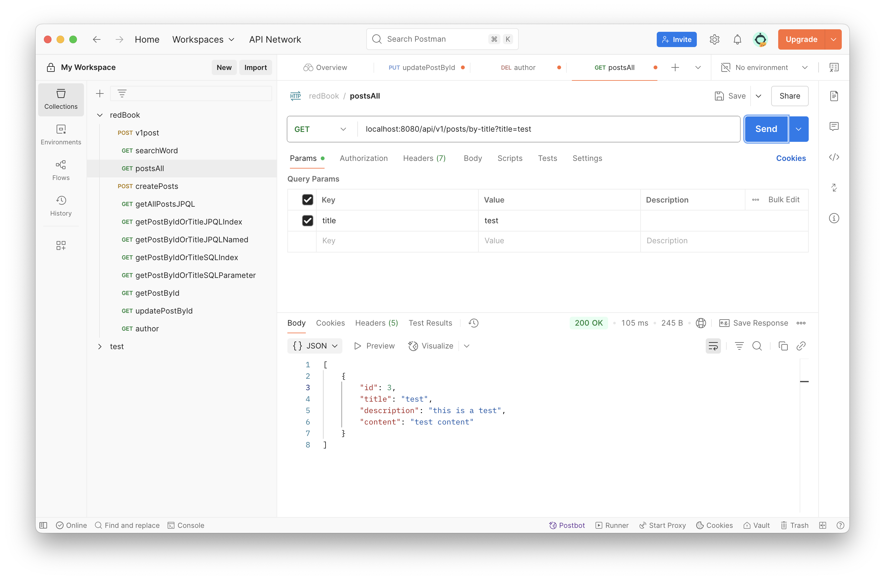
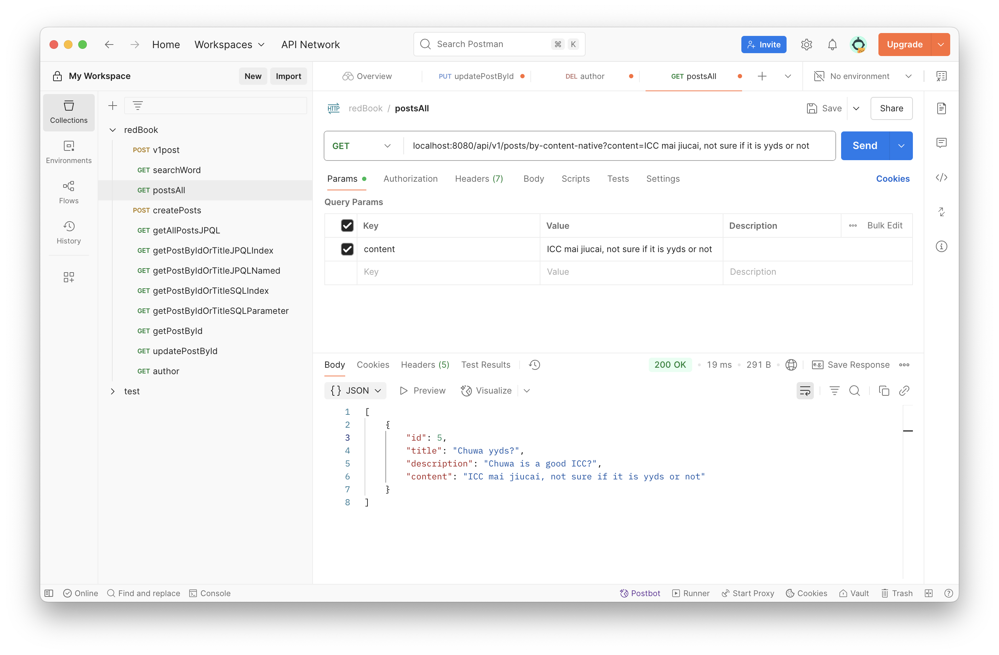

# HW10
# Spring Annotation Cheatsheet

# Spring Data Assignment

---

## Part 1: Annotation & Syntax Reference

### 1. Spring Annotation Cheatsheet
List all of the annotations you’ve learned from class and homework in a file named `annotations.md`. This will serve as your Spring annotation reference.">
- annotations.md is attached
---

## Part 2: Hands-on Project Work

### 2. Setup Starter Project & Test APIs
- Clone the following repository:  
  [https://github.com/CTYue/springboot-redbook/tree/05_02_slides_JPQL_EntityManager_Session](https://github.com/CTYue/springboot-redbook/tree/05_02_slides_JPQL_EntityManager_Session)
- Make the necessary code/configuration changes to bring up the application.
- Test each controller using Postman and take screenshots.
- - all the captured pics are under the images directory
---

### 3. Write Custom JPA Methods and Validate Syntax
- Based on the codebase from Task 2:
    - Write custom JPA methods using Spring Data JPA naming conventions.
    - Demonstrate how JPA performs compile-time syntax checks on method names.
    - 
    - 	•	findByTitle maps to the title field in the Post entity.
         •	findByDescriptionAndContent maps to the description and content fields.
         •	Spring Data JPA automatically generates queries like:
---

### 4. Implement JPQL and Native SQL Queries
- In your repository interface, add:
    - One JPQL query using the `@Query` annotation.
    - One native SQL query using `@Query(nativeQuery = true)`.
- Update your service layer to use these queries.
- Test both using Postman and capture screenshots.
  - 
  - 

---

## Part 3: Core Conceptual Understanding

### 5. Technology Comparison
Explain the differences and relationships among:
- Spring Data JPA
- Hibernate
- HikariCP
- JDBC

-## 📖 Technology Comparison: Spring Data JPA, Hibernate, HikariCP, and JDBC

Spring Data JPA, Hibernate, HikariCP, and JDBC are core technologies in Java-based applications for data persistence and database interaction. They work together in a layered architecture but have distinct roles and responsibilities.

- **JDBC** is the foundation for all database operations.
- **Hibernate** provides ORM to map objects to tables.
- **Spring Data JPA** simplifies Hibernate by offering repositories and query derivation.
- **HikariCP** optimizes connection handling for JDBC, making database interactions faster and more efficient.
---

### 6. JPA Relationships
Explain the following annotations with examples:
- @OneToMany
- @ManyToOne
- @ManyToMany  
  Also describe and explain the configuration properties inside each, such as `mappedBy`, `cascade`, and `fetch`.

## JPA Relationships: @OneToMany, @ManyToOne, @ManyToMany

In JPA, entity relationships are defined using annotations like `@OneToMany`, `@ManyToOne`, and `@ManyToMany`. These annotations describe how entities relate to each other in the database and provide configuration options to control their behavior.

### @OneToMany：A relationship where **one entity** is associated with **many instances** of another entity.

### @ManyToOne：The inverse of `@OneToMany`. Many instances of an entity relate to one instance of another entity.

###  @ManyToMany A relationship where many instances of an entity relate to many instances of another entity.

- `mappedBy` indicates the owner of the relationship (inverse side doesn’t own the DB foreign key).
- `cascade` allows operations on the parent entity to cascade to child entities.
- `fetch` determines whether associations are loaded eagerly or lazily.

---

### 7. Cascade Options in JPA
Explain:
- `cascade = CascadeType.ALL`
- `orphanRemoval = true`
  Also describe all other `CascadeType` values:
- PERSIST
- MERGE
- REMOVE
- DETACH
- REFRESH

`PERSIST` Saves child entities when the parent is saved.                                                 |
`MERGE`   Updates child entities when the parent is updated.                                             |
`REMOVE`  Deletes child entities when the parent is deleted.                                             |
`DETACH`  Detaches child entities when the parent is detached from the persistence context.              |
`REFRESH` Refreshes child entities when the parent is refreshed (reload from DB).                        |
`ALL`     Applies all of the above cascades (`PERSIST`, `MERGE`, `REMOVE`, `DETACH`, `REFRESH`).         |
---

### 8. Fetch Types in JPA
Explain `FetchType.LAZY` and `FetchType.EAGER`, and describe when to use each.
- FetchType.LAZY: Loads child entities on demand. Default for @OneToMany, @ManyToMany.
- FetchType.EAGER: Loads child entities immediately. Default for @ManyToOne, @OneToOne.
---

## Part 4: Querying and Data Access

### 9. JPQL Overview
Explain what JPQL is and how it differs from SQL. Include examples.
- JPQL (Java Persistence Query Language): Object-oriented query language for JPA entities.
- Differs from SQL: Operates on entity objects and attributes instead of database tables and columns.
```java
@Query("SELECT p FROM Post p WHERE p.title LIKE %:title%")
List<Post> findByTitle(String title);
```
---

### 10. Using the @Query Annotation
Explain what the `@Query` annotation does, where it is used, and how to use it for both JPQL and native queries.
- Definition: Used in Spring Data JPA repositories to define custom JPQL or native SQL queries.
```java
//jpql
@Query("SELECT p FROM Post p WHERE p.title = :title")
List<Post> findByTitle(@Param("title") String title);
//native
@Query(value = "SELECT * FROM posts WHERE content = :content", nativeQuery = true)
List<Post> findByContent(@Param("content") String content);
```
---

## Part 5: Hibernate and Entity Management

### 11. EntityManager vs SessionFactory
Compare EntityManager and SessionFactory.
Include screenshots from the codebase to illustrate their relationship.
- EntityManager: JPA interface for managing persistence context (CRUD, transactions).
- SessionFactory: Hibernate-specific factory to create Session instances.
- Key Difference: EntityManager is JPA standard; SessionFactory is Hibernate implementation.
---

### 12. SessionFactory vs Session
Explain the role of Session and how it differs from SessionFactory.
- SessionFactory: Heavyweight, thread-safe factory for creating Session objects.
- Session: Lightweight, not thread-safe, used for a single unit of work (CRUD, transactions).
---

## Part 6: Database Fundamentals

### 13. SQL Transactions
Explain what a transaction is in the context of relational databases, and how Spring/Hibernate manage transactions.
- Definition: A sequence of database operations treated as a single unit (ACID properties).
- Spring/Hibernate Management: Use @Transactional annotation in Spring to handle transaction boundaries automatically.
Example: If one operation fails, the transaction rolls back.
---

### 14. Hibernate Caching
Explain Hibernate’s caching mechanisms. Compare:
- First-Level Cache (session scope)
- Second-Level Cache (shared/global scope)

- First-Level Cache: Default, session-scoped. Cached entities within a single Session.
- Second-Level Cache: Optional, global. Cached entities shared across sessions using providers like Ehcache or Redis.
-  First-level is automatic; second-level must be configured.
