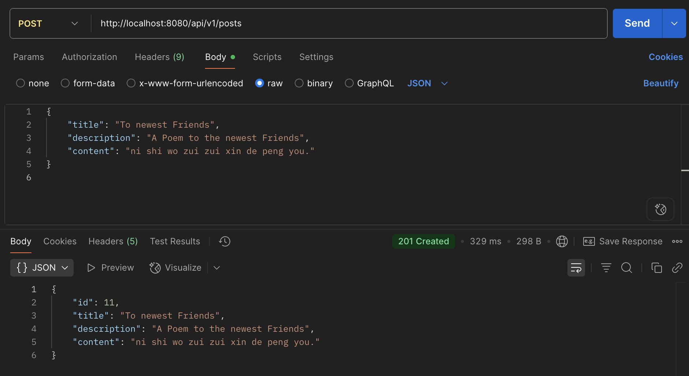
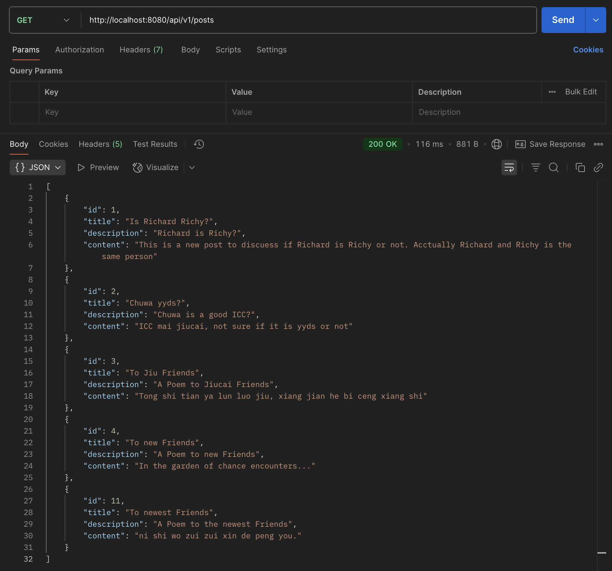
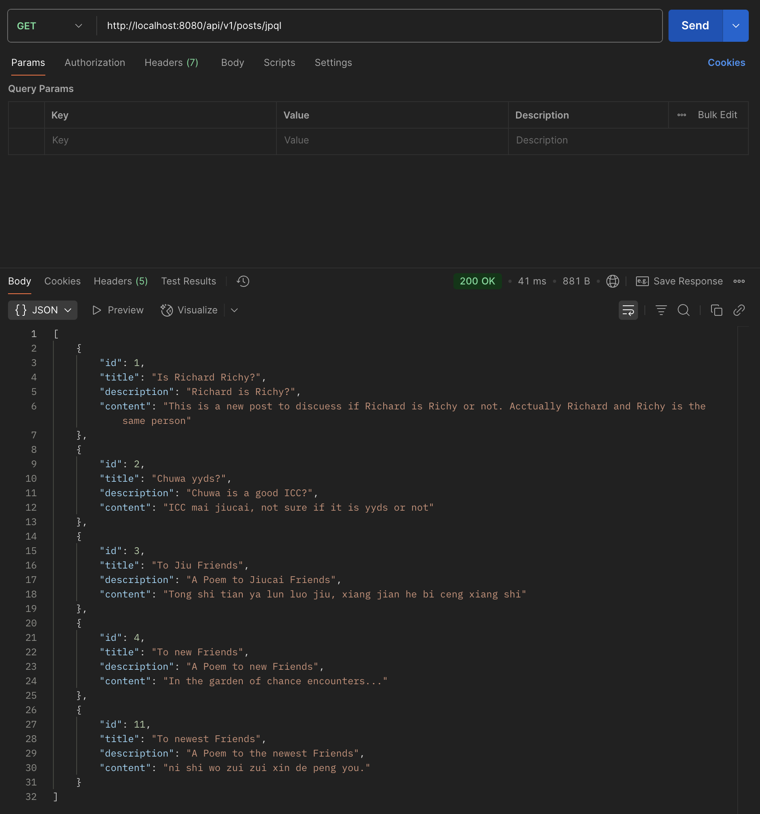
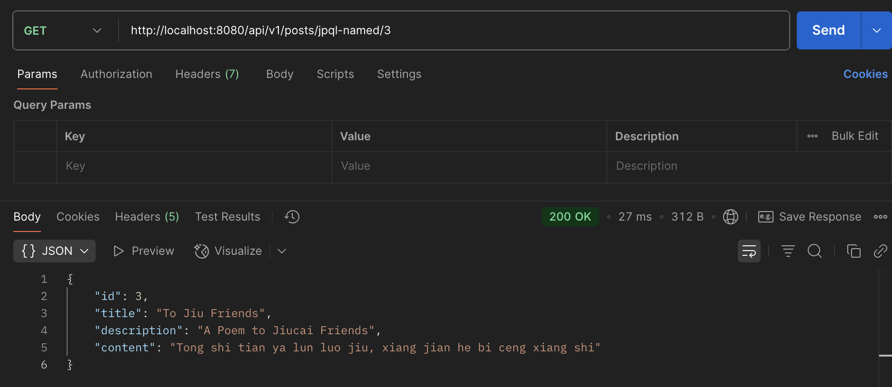
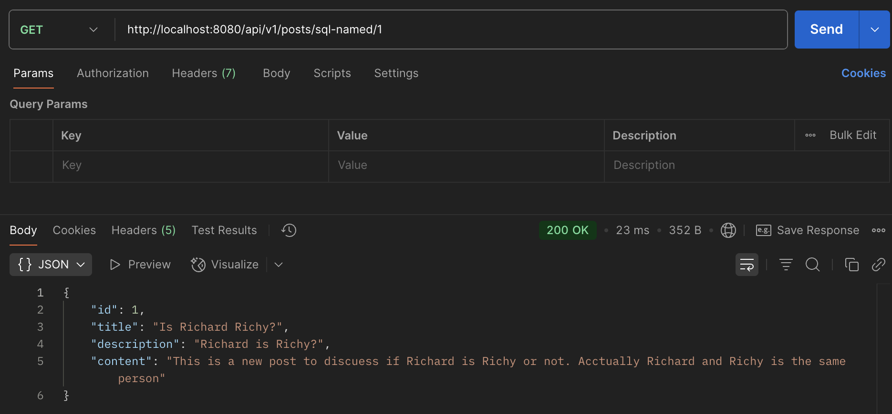
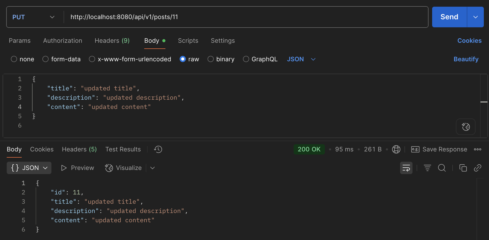
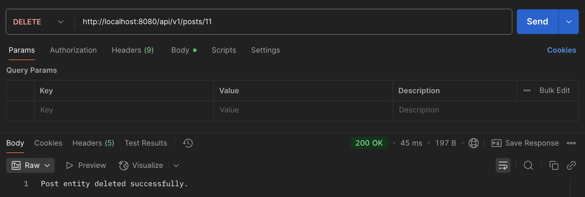
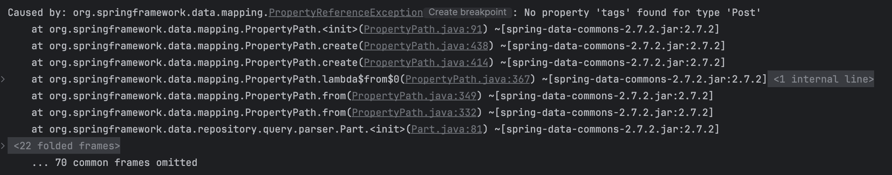
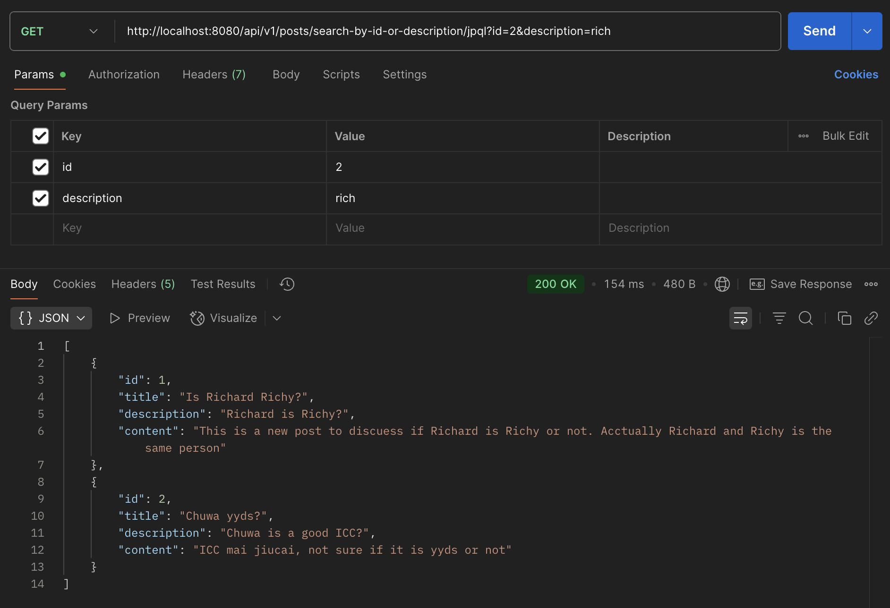
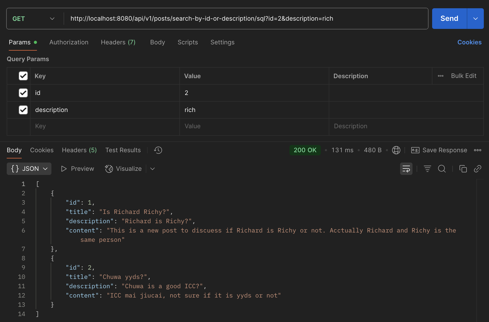

### hw 10

---
### Part 1: Annotation & Syntax Reference

---
#### 1. Spring Annotation Cheatsheet
See file in path: `Short Questions/annotations.md`


---
### Part 2: Hands-on Project Work
> _Code is in:_   
> https://github.com/ariannalangwang/springboot-redbook/tree/hw10_05_02_slides_JPQL_EntityManager_Session
> 


---
#### 2. Setup Starter Project & Test APIs
Test each controller using Postman and take screenshots.

---
> createPost:



> getAllPosts:



> getAllPostsJPQL:



> getPostByIdOrTitleJPQLIndex:


> getPostByIdOrTitleJPQLNamed:



> getPostByIdOrTitleSQLIndex:


> getPostByIdOrTitleSQLParameter:



> getPostById:


> updatePostById:



> deletePost:



---
#### 3. Write Custom JPA Methods and Validate Syntax
Write custom JPA methods using Spring Data JPA naming conventions.  
Demonstrate how JPA performs compile-time syntax checks on method names.

---

```java
@Repository
public interface PostRepository extends JpaRepository<Post, Long> {
    
  ...

  List<Post> findByTitleContainingIgnoreCase(String title);
  List<Post> findByTitleContainingIgnoreCaseOrDescriptionContainingIgnoreCase(String title, String description);
  
}
```

**Demonstrate how JPA performs compile-time syntax checks on method names:** 

If I write a wrong method name for the `Custom JPA Method`, my application will throw compile-time error. 

Example of using a non-existing field:
```java
List<Post> findByTagsContainingIgnoreCase(String tag);
```
Error:
```error
Reason: Failed to create query for method public abstract java.util.List com.chuwa.redbook.dao.PostRepository.findByTagsContainingIgnoreCase(java.lang.String)! 
No property 'tags' found for type 'Post'; 
```




---
#### 4. Implement JPQL and Native SQL Queries
In your repository interface, add:  
- One JPQL query using the @Query annotation
- One native SQL query using @Query(nativeQuery = true)  

Update your service layer to use these queries.  
Test both using Postman and capture screenshots.

---

PostRepository:
```java
@Repository
public interface PostRepository extends JpaRepository<Post, Long> {

  @Query("SELECT p FROM Post p WHERE p.id = :id OR LOWER(p.description) LIKE LOWER(CONCAT('%', :description, '%'))")
  List<Post> findByIdOrDescriptionJPQL(@Param("id") Long id, @Param("description") String description);

  @Query(value = "SELECT * FROM posts WHERE id = :id OR LOWER(description) LIKE LOWER(CONCAT('%', :description, '%'))", nativeQuery = true)
  List<Post> findByIdOrDescriptionSQL(@Param("id") Long id, @Param("description") String description);
}
```

PostService:
```java
public interface PostService {

  List<PostDto> getPostsByIdOrDescriptionJPQL(Long id, String description);
  List<PostDto> getPostsByIdOrDescriptionSQL(Long id, String description);
}
```


PostServiceImpl:
```java
@Override
public List<PostDto> getPostsByIdOrDescriptionJPQL(Long id, String description) {
    List<Post> posts = postRepository.findByIdOrDescriptionJPQL(id, description);
    return posts.stream()
            .map(this::mapToDTO)
            .collect(Collectors.toList());
}


@Override
public List<PostDto> getPostsByIdOrDescriptionSQL(Long id, String description) {
    List<Post> posts = postRepository.findByIdOrDescriptionSQL(id, description);
    return posts.stream()
            .map(this::mapToDTO)
            .collect(Collectors.toList());
}
```

PostController:
```java
@GetMapping("/search-by-id-or-description/jpql")
public ResponseEntity<List<PostDto>> getPostsByIdOrDescriptionJPQL(@RequestParam(value = "id", required = false) Long id,
                                                                   @RequestParam(value = "description", required = false) String description) {
    List<PostDto> posts = postService.getPostsByIdOrDescriptionJPQL(id, description);
    return ResponseEntity.ok(posts);
}


@GetMapping("/search-by-id-or-description/sql")
public ResponseEntity<List<PostDto>> getPostsByIdOrDescriptionSQL(@RequestParam(value = "id", required = false) Long id,
                                                                  @RequestParam(value = "description", required = false) String description) {
    List<PostDto> posts = postService.getPostsByIdOrDescriptionSQL(id, description);
    return ResponseEntity.ok(posts);
}
```

JPQL:


SQL:



---
### Part 3: Core Conceptual Understanding

---
#### 5. Technology Comparison
Explain the differences and relationships among:
- Spring Data JPA
- Hibernate
- HikariCP
- JDBC

---


- **Spring Data JPA**: High-level abstraction to simplify JPA-based data access; delegates to JPA provider (usually Hibernate).
- **Hibernate**: JPA provider that handles object-relational mapping and SQL generation; internally uses JDBC.
- **JDBC**: Low-level API that executes SQL commands and communicates directly with the database.
- **HikariCP**: Connection pool that manages and optimizes JDBC connections for performance.


|          | Type                | Role                                                                 | Relationship to Others                                      |
|----------|---------------------|----------------------------------------------------------------------|--------------------------------------------------------------|
| **JDBC** | Low-level API       | Java standard API for interacting with relational databases.         | Base layer used by all other components.                     |
| **Hibernate** | ORM Framework       | Maps Java objects to DB tables; manages persistence logic.           | Uses JDBC internally.                                        |
| **Spring Data JPA** | Spring abstraction | Simplifies data access using JPA; auto-generates queries, etc.       | Uses JPA (typically backed by Hibernate).                    |
| **HikariCP** | Connection Pool     | Manages DB connections efficiently for performance.                  | Used by Spring Boot as default connection pool; wraps JDBC.  |


---
#### 6. JPA Relationships
Explain the following annotations with examples:
- @OneToMany
- @ManyToOne
- @ManyToMany
- Also describe and explain the configuration properties inside each, such as `mappedBy`, `cascade`, and `fetch`.

---


`@OneToMany`:
- One entity has many related entities.
- **Used On**: The "one" side.
- Example:
    ```java
    @OneToMany(mappedBy = "post", cascade = CascadeType.ALL, fetch = FetchType.LAZY)
    private List<Comment> comments;
    ```

`@ManyToOne`:
- Many entities relate to one parent.
- **Used On**: The "many" side (i.e., the child entity).
- Example:
    ```java
    @ManyToOne(fetch = FetchType.LAZY)
    @JoinColumn(name = "post_id")
    private Post post;
    ```

`@ManyToMany`:
- Many entities relate to many others.
- **Used On**: Both sides.
- Example:
    ```java
    @ManyToMany(fetch = FetchType.LAZY, cascade = CascadeType.ALL)
    @JoinTable(
        name = "student_course",
        joinColumns = @JoinColumn(name = "student_id"),
        inverseJoinColumns = @JoinColumn(name = "course_id")
    )
    private Set<Course> courses;
    ```


>**Key Properties:**  

**@JoinColumn**:
- Specifies the foreign key column name (e.g., `"post_id"`).


**mappedBy**:
- Refers to the field in the child entity that owns the relationship. Used to define the inverse side of a bi-directional relationship.


**@JoinTable**:
- Defines the join table and foreign key columns in a `@ManyToMany` relationship.
    - **`name`**: Name of the join table.
    - **`joinColumns`**: Foreign key referencing the current entity.
    - **`inverseJoinColumns`**: Foreign key referencing the target entity.


**cascade**:
- Propagates operations from parent to child entities.  


**fetch**:
- Determines when related data is loaded.
    - `LAZY` *(default)*: Loads the related entities only when accessed.
    - `EAGER`: Loads related entities immediately with the parent entity.


    

---
#### 7. Cascade Options in JPA
Explain `cascade = CascadeType.ALL` and `orphanRemoval = true`.
- Also describe all other CascadeType values:
- PERSIST
- MERGE
- REMOVE
- DETACH
- REFRESH

---


>`cascade = CascadeType.ALL`:  
- Applies all JPA cascade operations (`PERSIST`, `MERGE`, `REMOVE`, `REFRESH`, `DETACH`) from parent to child entities.
- **Effect**: When you perform an operation on the parent, the same is applied to all related children.


- Example:
    ```java
    @OneToMany(mappedBy = "post", cascade = CascadeType.ALL)
    private List<Comment> comments;
    ```


>`orphanRemoval = true`:
- Automatically deletes a child entity when it is removed from the parent's collection or when the parent-child relationship is broken.
- **Use**: When child entities have no meaning without their parent.
- **Don't use**: When child entities can exist independently or be shared between parents.
- **Example use cases**: `Order` → `OrderItems`, `Blog` → `Comments`


- Example:
    ```java
    @Entity
    public class Author {
    @OneToMany(mappedBy = "author",
    cascade = CascadeType.ALL,
    orphanRemoval = true)
    private List<Book> books = new ArrayList<>();
    }
    
    @Entity
    public class Book {
    @ManyToOne
    @JoinColumn(name = "author_id")
    private Author author;
    }
  
    ...
  
    // Remove book from collection - orphanRemoval will DELETE the book
    author.getBooks().remove(book1);  // book1 is automatically deleted from database
    
    // Set book's author to null - orphanRemoval will DELETE the book
    book2.setAuthor(null);  // book2 is automatically deleted from database
    ```


**In Summary:**
- `CASCADE.REMOVE`: Deletes children when parent is deleted.
- `orphanRemoval`: Deletes children when they become "orphaned" - a.k.a. no longer referenced by parent.


**JPA `CascadeType` Values:**

| CascadeType      | Description                                                                 |
|------------------|-----------------------------------------------------------------------------|
| `PERSIST`        | When parent is persisted, child is also persisted.                          |
| `MERGE`          | When parent is merged, child is also merged.                                |
| `REMOVE`         | When parent is removed, child is also removed.                              |
| `DETACH`         | When parent is detached from persistence context, child is also detached.   |
| `REFRESH`        | When parent is refreshed, child is also refreshed from DB.                  |
| `ALL`            | Applies all of the above cascade types.                                     |


---
#### 8. Fetch Types in JPA
Explain `FetchType.LAZY` and `FetchType.EAGER`, and describe when to use each.

---


| FetchType     | Description                                               | When Data is Loaded                    | When to Use                                                 |
|---------------|-----------------------------------------------------------|----------------------------------------|-------------------------------------------------------------|
| `LAZY`        | Data is loaded **on-demand**, only when accessed.         | When getter is called or iterated.     | - Default for `@OneToMany`, `@ManyToMany`                   |
|               |                                                           |                                        | - Use for performance with large or optional relationships. |
|               |                                                           |                                        |                                                             |
| `EAGER`       | Data is loaded **immediately** with the parent entity.    | During initial query.                  | - Default for `@ManyToOne`, `@OneToOne`                     |
|               | Can result in heavy joins even if child data is not used. |                                        | - Use when child is always needed with parent.              |
                                                                                                                                                                             

**Recommendation:**
- **Prefer `LAZY`** by default for better performance and memory efficiency.
- Use **`EAGER`** only when you're certain the related data is always required.


---
### Part 4: Querying and Data Access

---
#### 9. JPQL Overview
Explain what `JPQL` is and how it differs from `SQL`. Include examples.

---


- **JPQL (Java Persistence Query Language)** is a query language used in **JPA** to query **Java entity objects**.
- It operates on **entity class names and fields**, not directly on database tables and columns.

Example:   
Query all posts with title = 'Hello'.

**JPQL:**
```java
@Query("SELECT p FROM Post p WHERE p.title = :title")
List<Post> findByTitle(@Param("title") String title);
```

**SQL:**
```sql
SELECT * FROM posts WHERE title = 'Hello';
```


---
#### 10. Using the `@Query` Annotation
Explain what the `@Query` annotation does, where it is used, and how to use it for both `JPQL` and `native queries`.

---


- `@Query` is used to define **custom queries** in a Spring Data JPA repository method.
- You can write either **JPQL** or **native SQL** inside it.
- It replaces the need for method name conventions when you want more control over the query.

**JPQL Example:**
```java
@Query("SELECT p FROM Post p WHERE p.author = :author")
List<Post> findByAuthor(@Param("author") String author);
```
- Use **entity class name** (`Post`) and **field** (`author`).
- `:author` is a **named parameter** (must match `@Param`).


**Native SQL Example:**
```java
@Query(value = "SELECT * FROM posts WHERE author = :author", nativeQuery = true)
List<Post> findByAuthorNative(@Param("author") String author);
```
- Uses real **table name** (`posts`) and **column name** (`author`)
- `nativeQuery = true` must be set.


---
### Part 5: Hibernate and Entity Management

---
#### 11. `EntityManager` vs `SessionFactory`
Compare `EntityManager` and `SessionFactory`.  
Include screenshots from the codebase to illustrate their relationship.  

---

**`EntityManager`:**
- Standard JPA API.
- Integrated with Spring via `@PersistenceContext`.
- Cleaner, declarative transaction management via `@Transactional`.
- More portable (can switch from Hibernate to EclipseLink, etc.)

**`SessionFactory` + `session`:**
- Low-level Hibernate-native API.
- Explicit control over `Session`, `Transaction`, and `SessionFactory`.
- Verbose & tightly coupled to Hibernate.

**Best Practice:**
- ✅ Use `EntityManager` + `Spring JPA` in enterprise apps.
- ⛔ Avoid raw `SessionFactory` unless you need low-level Hibernate control (e.g., legacy code or tuning).


> _Code is From:_   
> _https://github.com/TAIsRich/springboot-redbook.git_  
> _branch: 05_slides_JPQL_EntityManager_Session_  

_EntityManager_:


_SessionFactory + Session_:


**Summary:** Conceptual Mapping

|               | Hibernate (Low-level)     | JPA (Standard API)           |
|---------------|----------------------------|-------------------------------|
| **Factory Object** | `SessionFactory`           | `EntityManagerFactory`       |
| **DB Connection** | `Session`                  | `EntityManager`              |
| **Transaction Handling** | `Transaction` (manual)     | `@Transactional` (declarative) |
| **Insert/Update** | `session.merge()`          | `entityManager.merge()`      |
| **Select**    | `session.get()` / `load()` | `entityManager.find()`       |
| **Delete**    | `session.delete()`         | `entityManager.remove()`     |


---
#### 12. `SessionFactory` vs `Session`
Explain the role of `Session` and how it differs from `SessionFactory`.

---

**SessionFactory:** 
- A heavyweight, thread-safe factory for creating `Session` objects.
- **Analogy**: Like a database **connection pool factory**.

**Session:**
- A lightweight, non-thread-safe object for interacting with the database.
- A session is created per request / transaction.


**Key Differences:**

|              | SessionFactory               | Session                 |
|--------------|------------------------------|-------------------------|
| Scope        | Application-wide (singleton) | Per operation / request |
| Thread Safety | Thread-safe                  | Not thread-safe         |
| Usage        | Creates `Session` objects     | Executes DB operations  |
| Cost         | Heavy                        | Lightweight             |


**Summary:**
- Use `SessionFactory` **once** to configure and bootstrap Hibernate.
- Use `Session` to **interact with the DB** per transaction.


---
### Part 6: Database Fundamentals

---
#### 13. SQL Transactions
Explain what a `transaction` is in the context of `relational databases`, and how `Spring/Hibernate` manage `transactions`.

---

A **transaction** is a unit of work in a relational database that is executed as a **single logical operation**.  

It follows the **ACID** properties:
  - **A**tomicity: All or nothing.
  - **C**onsistency: DB stays valid.
  - **I**solation: No interference from other transactions.
  - **D**urability: Changes persist after commit.


> Transaction Management in Spring / Hibernate:  

**Spring (Declarative):**
- Use `@Transactional` on methods / classes.
- Spring handles **begin, commit, rollback** automatically.

```java
@Transactional
public void savePost(Post post) {
    postRepository.save(post);
}
```

**Hibernate (Programmatic):**
- Manually control transaction with Session and Transaction.

```java
Session session = sessionFactory.openSession();
Transaction transaction = session.beginTransaction();
session.save(post);
transaction.commit();
session.close();
```


**Summary:**

|               | Spring                      | Hibernate                     |
|---------------|-----------------------------|-------------------------------|
| **Type**      | Declarative                 | Programmatic                  |
| **Key Annotation/API** | `@Transactional`            | `Transaction` via `Session`   |
| **Rollback Handling** | Automatic (on exceptions)  | Manual                        |
| **Simplicity** | Cleaner, preferred in apps  | More control, more verbose    |


---
#### 14. Hibernate Caching
Explain Hibernate’s caching mechanisms.  
Compare:
- `First-Level Cache` (session scope)
- `Second-Level Cache` (shared/global scope)

---

Hibernate provides two main levels of caching to improve performance by reducing database access:

|              | First-Level Cache                 | Second-Level Cache                    |
|--------------|-----------------------------------|---------------------------------------|
| **Scope**    | Per `Session`                     | Shared across sessions                |
| **Enabled By** | Default (always on)               | Must be explicitly configured         |
| **Cache Type** | Local memory                      | Pluggable (e.g., Ehcache, Infinispan) |
| **Lifespan** | Session-limited                   | Application / `session-factory` scoped  |
| **Use Case** | Reuse within a transaction        | Improve performance across sessions   |

First-Level Cache Example:
```java
Session session = sessionFactory.openSession();
Post post1 = session.get(Post.class, 1); // Hits DB
Post post2 = session.get(Post.class, 1); // Uses cache
```

Second-Level Cache Example:
```properties
hibernate.cache.use_second_level_cache=true
hibernate.cache.region.factory_class=org.hibernate.cache.ehcache.EhCacheRegionFactory
```


