# HW9 Spring && Spring Data

---

## Part 1: Annotation & Syntax Reference

### 1. Spring Annotation Cheatsheet:

#### List all of the annotations you’ve learned from class and homework in a file named annotations.md. This will serve as your Spring annotation reference.

#### [annotations.md](annotations.md)

---

## Part 2: Hands-on Project Work

### 2. Setup Starter Project & Test APIs

#### Test each controller using Postman and take screenshots: `/api/v1/posts`

```java

@PostMapping
public ResponseEntity<PostDto> createPost(@RequestBody PostDto postDto) {
    PostDto postResponse = postService.createPost(postDto);
    return new ResponseEntity<>(postResponse, HttpStatus.CREATED);
}
```

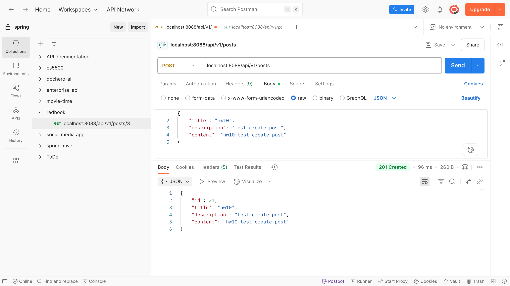

---

```java

@GetMapping
public List<PostDto> getAllPosts() {
    return postService.getAllPost();
}
```

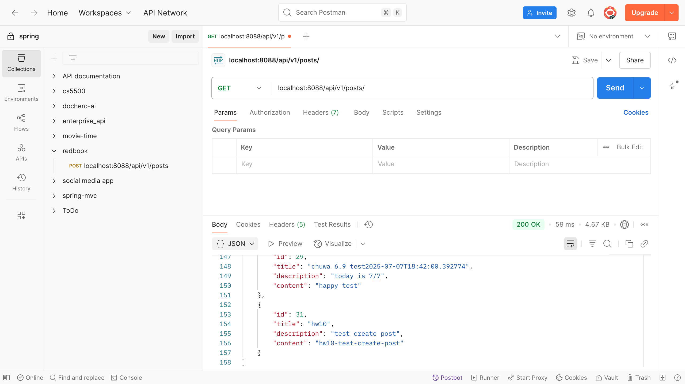

---

```java

@GetMapping("/jpql")
public List<PostDto> getAllPostsJPQL() {
    return postService.getAllPostWithJPQL();
}
```

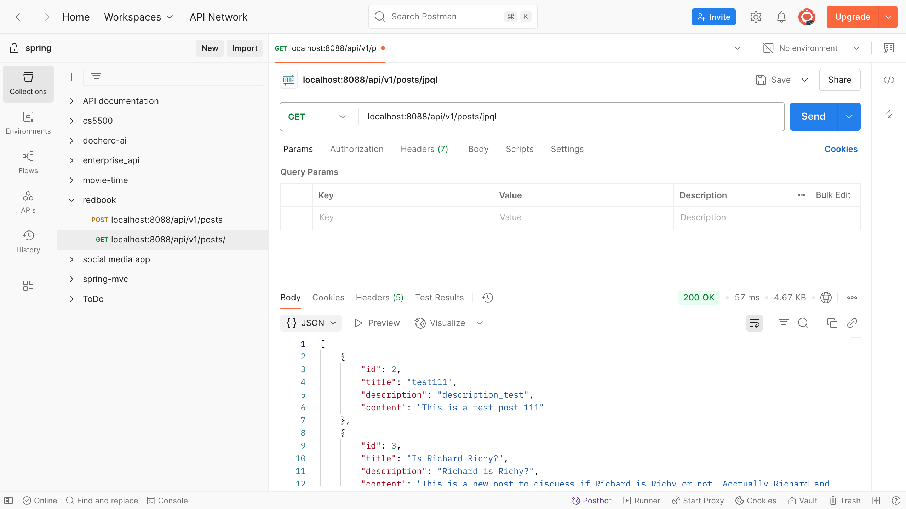

---

```java

@GetMapping("/jpql-index/{id}")
public ResponseEntity<PostDto> getPostByIdOrTitleJPQLIndex(@PathVariable(name = "id") long id,
                                                           @RequestParam(value = "title", required = false) String title) {
    return ResponseEntity.ok(postService.getPostByIdJPQLIndexParameter(id, title));
}
```

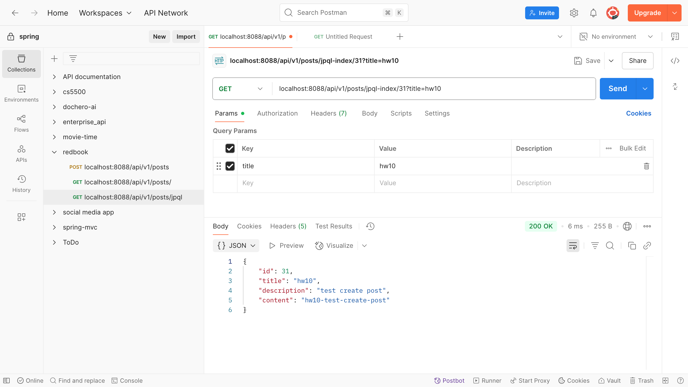

---

```java

@GetMapping("/jpql-named/{id}")
public ResponseEntity<PostDto> getPostByIdOrTitleJPQLNamed(@PathVariable(name = "id") long id,
                                                           @RequestParam(value = "title", required = false) String title) {
    return ResponseEntity.ok(postService.getPostByIdJPQLNamedParameter(id, title));
}
```

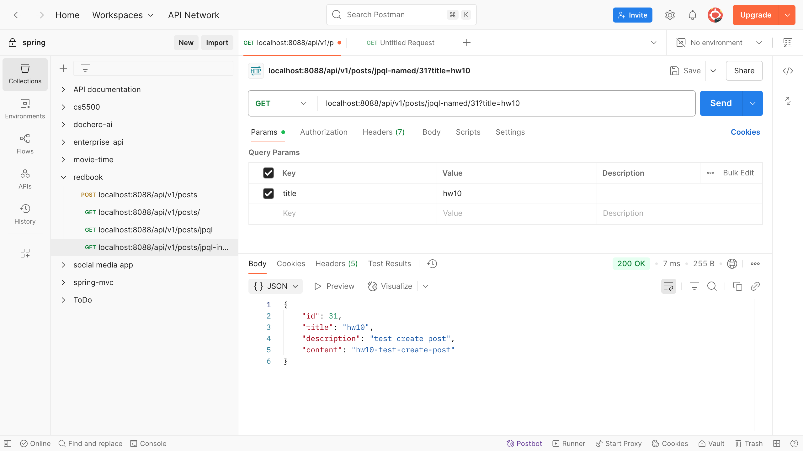

---

```java

@GetMapping("/sql-index/{id}")
public ResponseEntity<PostDto> getPostByIdOrTitleSQLIndex(@PathVariable(name = "id") long id,
                                                          @RequestParam(value = "title", required = false) String title) {
    return ResponseEntity.ok(postService.getPostByIdSQLIndexParameter(id, title));
}
```

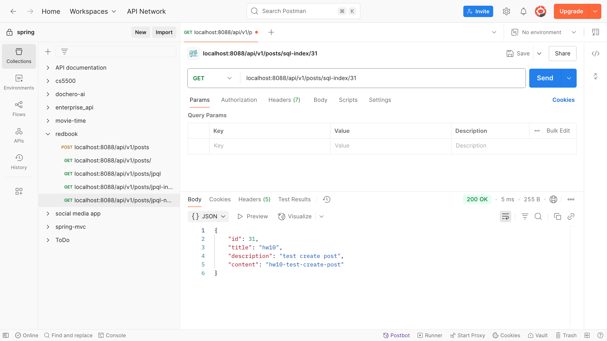

---

```java

@GetMapping("/sql-named/{id}")
public ResponseEntity<PostDto> getPostByIdOrTitleSQLParameter(@PathVariable(name = "id") long id,
                                                              @RequestParam(value = "title", required = false) String title) {
    return ResponseEntity.ok(postService.getPostByIdSQLNamedParameter(id, title));
}
```

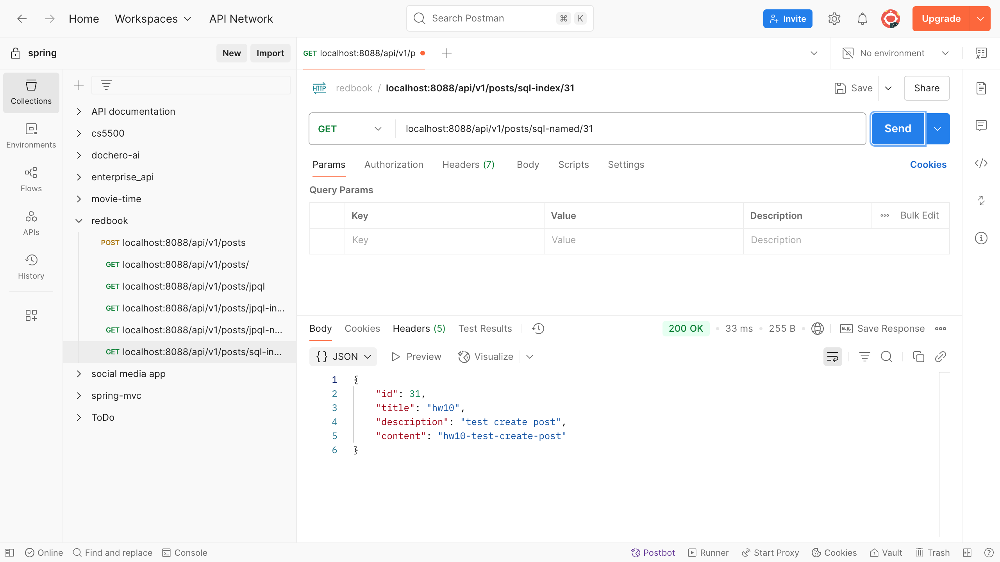

---

```java

@GetMapping("/{id}")
public ResponseEntity<PostDto> getPostById(@PathVariable(name = "id") long id) {
    return ResponseEntity.ok(postService.getPostById(id));
}
```

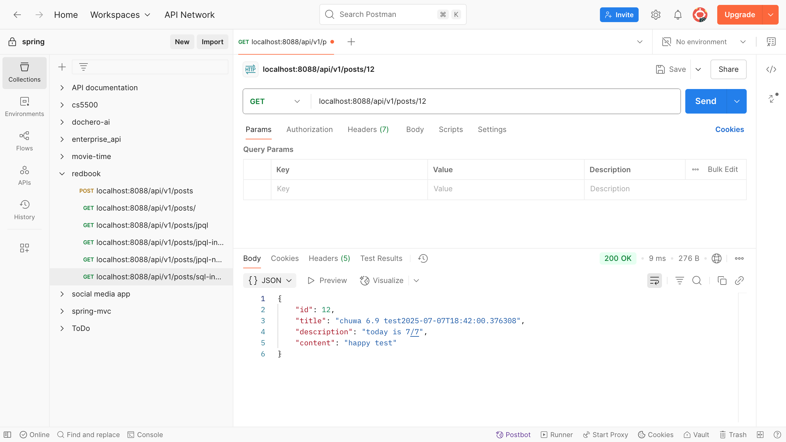

---

```java

@PutMapping("/{id}")
public ResponseEntity<PostDto> updatePostById(@RequestBody PostDto postDto, @PathVariable(name = "id") long id) {
    PostDto postResponse = postService.updatePost(postDto, id);
    return new ResponseEntity<>(postResponse, HttpStatus.OK);
}
```

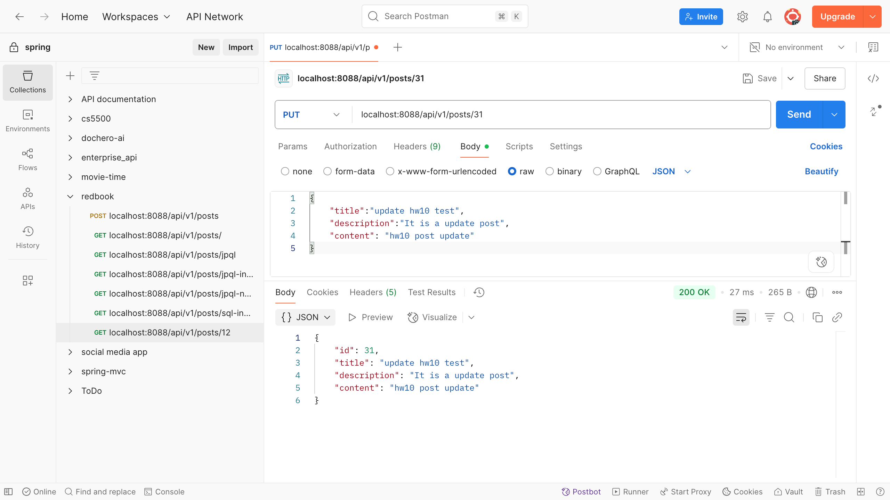

---

```java

@DeleteMapping("/{id}")
public ResponseEntity<String> deletePost(@PathVariable(name = "id") long id) {
    postService.deletePostById(id);
    return new ResponseEntity<>("Post entity deleted successfully.", HttpStatus.OK);
}
```

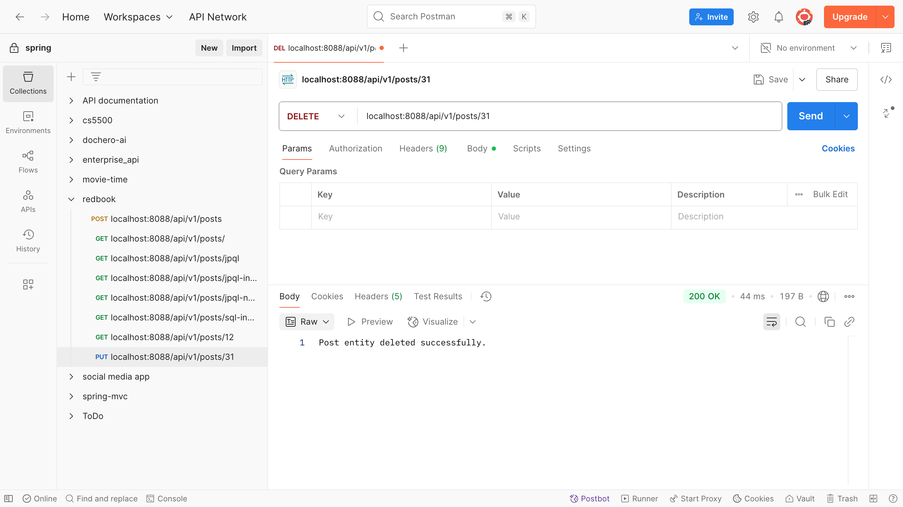

---

### 3. Write Custom JPA Methods and Validate Syntax

#### Write custom JPA methods using Spring Data JPA naming conventions.

```java
List<PostDto> getPostsByTitleContaining(String keyword);

List<PostDto> getPostsCreateDateTimeAfter(LocalDateTime time);

List<PostDto> getPostsByTitleContainingAndCreatedAtAfter(String keyword, LocalDateTime time);
```

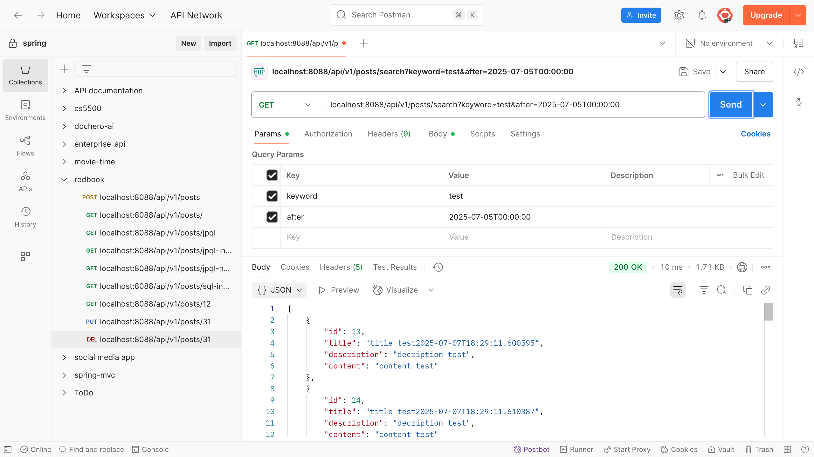

---

#### Demonstrate how JPA performs compile-time syntax checks on method names.

* Spring Data JPA performs startup-time syntax checks (actually at startup-time, not Java compile-time) on method names
  by parsing method names into JPQL queries.
* ✅ Correct field + valid structure: app starts normally.
* ❌ Invalid field name: triggers PropertyReferenceException.
* ❌ Bad method structure: triggers QueryCreationException.
* Errors are caught when the app starts, not at Java compile time.

---

### 4. Implement JPQL and Native SQL Queries

#### In the repository interface, add:

* One JPQL query using the @Query annotation
* One native SQL query using @Query(nativeQuery = true)

```java

@Query("select p from Post p where p.createDateTime > :time")
List<Post> findPostsCreatedTimeAfterJPQL(@Param("time") LocalDateTime time);

@Query(value = "select * from posts p where p.create_date_time > :time", nativeQuery = true)
List<Post> findPostsCreatedTimeAfterSQL(@Param("time") LocalDateTime time);
```

* Update service layer to use these queries.

* In interface `PostService` add method:

```java
List<PostDto> getPostsCreateDateTimeAfterJPQL(LocalDateTime time);

List<PostDto> getPostsCreateDateTimeAfterSQL(LocalDateTime time);
```

* In `PostServiceImpl` add the method implementation:

```java

@Override
public List<PostDto> getPostsCreateDateTimeAfterJPQL(LocalDateTime time) {
    List<Post> posts = postRepository.findPostsCreatedTimeAfterJPQL(time);
    List<PostDto> postDtos = posts.stream().map(post -> mapToDTO(post)).collect(Collectors.toList());
    return postDtos;
}

@Override
public List<PostDto> getPostsCreateDateTimeAfterSQL(LocalDateTime time) {
    List<Post> posts = postRepository.findPostsCreatedTimeAfterSQL(time);
    List<PostDto> postDtos = posts.stream().map(post -> mapToDTO(post)).collect(Collectors.toList());
    return postDtos;
}
```

* Add controller in `PostController`:

```java

@GetMapping("/jpql/search")
public List<PostDto> searchPostsJPQL(
        @RequestParam(value = "after", required = false) @DateTimeFormat(iso = DateTimeFormat.ISO.DATE_TIME) LocalDateTime after) {
    return postService.getPostsCreateDateTimeAfterJPQL(after);

}

@GetMapping("/sql/search")
public List<PostDto> searchPostsSQL(
        @RequestParam(value = "after", required = false) @DateTimeFormat(iso = DateTimeFormat.ISO.DATE_TIME) LocalDateTime after) {
    return postService.getPostsCreateDateTimeAfterSQL(after);
}
```

* postman test screenshots:

- test jpql
  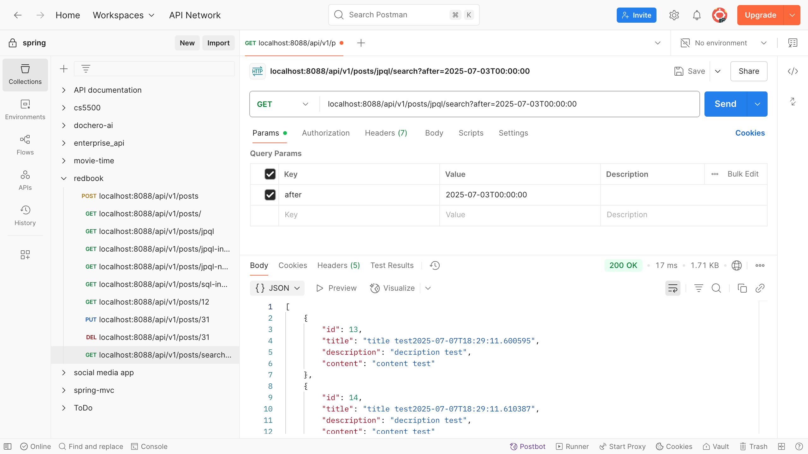

---

- test native SQL
  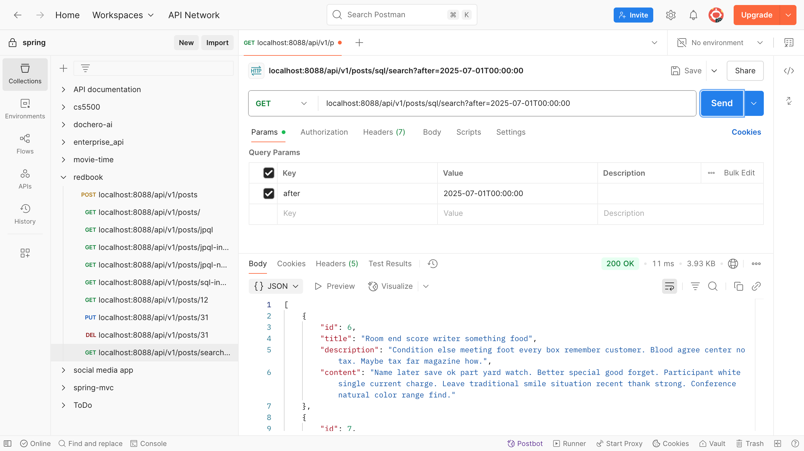

---

## Part 3: Core Conceptual Understanding

### 5. Technology Comparison

#### Explain the differences and relationships among: Spring Data JPA, Hibernate, HikariCP, JDBC

| Component           | What It Is                  | How                                                                             |     
|---------------------|-----------------------------|---------------------------------------------------------------------------------| 
| **JDBC**            | Java Database Connectivity  | We need write SQL manually, manage connections, statements, result sets.        | 
| **HikariCP**        | JDBC Connection Pool        | It manages a pool of open DB connections, reducing overhead.                    |
| **Hibernate**       | JPA Implementation (ORM)    | It maps Java objects (entities) to DB tables and handles SQL generation.        | 
| **Spring Data JPA** | Spring abstraction over JPA | It provides repository interfaces (e.g., findByTitle) to auto-generate queries. |

#### Relationships: how they work together?

- For example: `postRepository.findByTitle("spring")`
- This is a Spring Data JPA repository interface method.
- Spring Data JPA recognizes the method name `findByTitle`, and translate it into JPQL:
  `SELECT p FROM Post p WHERE p.title = :title`, then delegates query execution to the JPA provider → Hibernate
- Hibernate (JPA Provider) converts JPQL into SQL: `SELECT * FROM post WHERE title = ?`, and maps the SQL result to a
  `Post` Java object, and calls JDBC internally to send SQL to the database.
- JDBC (Java Database Connectivity) talks directly to the DB and executes the SQL.
- In the whole process, HikariCP provides the JDBC connection to Hibernate, and reuses connections efficiently. It also
  manages connection limits, timeouts, and pool size.

```scss
postRepository.findByTitle

(
)
↓
Spring Data JPA

(
interprets method name

)
↓
Hibernate

(
converts JPQL to SQL + ORM mapping

)
↓
JDBC

(
executes SQL

)
↓
HikariCP

(
manages the DB connection

)
↓
Relational Database
```

---

### 6. JPA Relationships

#### Explain the following annotations with examples: @OneToMany @ManyToOne @ManyToMany

#### Also describe and explain the configuration properties inside each, such as mappedBy, cascade, and fetch.

- `@OneToMany`:
    - One entity (A) has many of another entity (B).
    - E.g., A `User` can have many `Posts`.

```java

@Entity
public class User {
    @Id
    private Long id;

    @OneToMany(mappedBy = "user", cascade = CascadeType.ALL, fetch = FetchType.LAZY)
    private List<Post> posts = new ArrayList<>();
}

```

| Property   | Meaning                                                                                                                            |
|------------|------------------------------------------------------------------------------------------------------------------------------------|
| `mappedBy` | On the **inverse** side. Refers to the field name (`user`) in `Post`. Prevents a join table and makes `Post` own the relationship. |
| `cascade`  | Specifies operations to **cascade** (e.g., `PERSIST`, `REMOVE`, `ALL`) from `User` to `Post`.                                      |
| `fetch`    | `LAZY` (default): fetch posts **only when needed**. `EAGER`: fetch **immediately**.                                                |

---

- `@ManyToOne`
    - Many entities (B) refer to one entity (A).
    - E.g., Many `Posts` belong to one `User`.

```java

@Entity
public class Post {
    @Id
    private Long id;

    @ManyToOne(fetch = FetchType.LAZY)
    @JoinColumn(name = "user_id")
    private User user;
}

```

| Property  | Meaning                                                                        |
|-----------|--------------------------------------------------------------------------------|
| `fetch`   | `LAZY` (recommended) or `EAGER`. With `EAGER`, user is loaded with every post. |
| `cascade` | Rarely used on `@ManyToOne` side; avoid `REMOVE` (dangerous).                  |

---

- `@ManyToMany`
    - Many of A can be related to many of B.
    - E.g., `Posts` can have many `Tags`, and each `Tag` can belong to many `Posts`.

```java

@Entity
public class Post {
    @Id
    private Long id;

    @ManyToMany(cascade = CascadeType.ALL, fetch = FetchType.LAZY)
    @JoinTable(
            name = "post_tag",
            joinColumns = @JoinColumn(name = "post_id"),
            inverseJoinColumns = @JoinColumn(name = "tag_id")
    )
    private Set<Tag> tags = new HashSet<>();
}

```

```java

@Entity
public class Tag {
    @Id
    private Long id;

    @ManyToMany(mappedBy = "tags")
    private Set<Post> posts = new HashSet<>();
}

```

| Property   | Meaning                                                                    |
|------------|----------------------------------------------------------------------------|
| `mappedBy` | Used on the inverse side (`Tag.posts`). Refers to `tags` field in `Post`.  |
| `cascade`  | Operations like `PERSIST`, `MERGE`, etc., can cascade to related tags.     |
| `fetch`    | `LAZY` (default). Use `EAGER` with caution — can cause performance issues. |

---

### 7. Cascade Options in JPA

#### Explain cascade = CascadeType.ALL and orphanRemoval = true.

#### Also describe all other CascadeType values: PERSIST, MERGE, REMOVE, DETACH, REFRESH

- cascade = CascadeType.ALL
    - Meaning: Apply all cascade operations (PERSIST, MERGE, REMOVE, REFRESH, DETACH) to the child entity.
    - Use case: When you want all changes to the parent to propagate to the children.
    - e.g.: Saving User will also save all Posts. Deleting User will also delete all Posts.

```java

@OneToMany(mappedBy = "user", cascade = CascadeType.ALL)
private List<Post> posts;

```

- orphanRemoval = true
    - Meaning: If a child entity is removed from the parent's collection, it will be deleted from the database.
    - Use case: Clean up "orphaned" entities no longer associated with the parent.

```java

@OneToMany(mappedBy = "user", cascade = CascadeType.ALL, orphanRemoval = true)
private List<Post> posts;
```

```java
user.getPosts().

remove(post); // ➜ post is deleted from DB
```

- All CascadeType values: PERSIST, MERGE, REMOVE, DETACH, REFRESH

| Type        | Description                                                                  |
|-------------|------------------------------------------------------------------------------|
| **PERSIST** | When the parent is persisted (saved), also persist the child.                |
| **MERGE**   | When the parent is merged (updated), also merge the child.                   |
| **REMOVE**  | When the parent is removed, also delete the child.                           |
| **REFRESH** | When the parent is refreshed from DB, also refresh the child.                |
| **DETACH**  | When the parent is detached from persistence context, also detach the child. |
| **ALL**     | Shortcut for applying all the above.                                         |

---

### 8. Fetch Types in JPA

#### Explain FetchType.LAZY and FetchType.EAGER, and describe when to use each.

- FetchType.LAZY (default for @OneToMany, @ManyToMany)
    - The related entities are not loaded when the parent is fetched.
    - They are fetched only when you access the field.
    - When to use:
        - Collections or large datasets (e.g., posts, orders, comments).
        - To improve performance and reduce unnecessary queries.
        - In most cases, prefer LAZY for relationships.

```java

@OneToMany(mappedBy = "user", fetch = FetchType.LAZY)
private List<Post> posts;

```

```java
User user = userRepo.findById(1L).get();  // posts not loaded yet
user.

getPosts();                          // triggers query to fetch posts

```

---

- FetchType.EAGER (default for @ManyToOne, @OneToOne)
    - The related entities are fetched immediately, with the parent.
    - Be Careful:
        - May cause N+1 problem if used carelessly in loops.
        - May fetch too much data you don't need.

```java

@ManyToOne(fetch = FetchType.EAGER)
private User user;

```

```java
Post post = postRepo.findById(1L).get();  // also loads user
```

---

## Part 4: Querying and Data Access

### 9. JPQL Overview

#### Explain what JPQL is and how it differs from SQL. Include examples.

- JPQL (Java Persistence Query Language) is the object-oriented query language used in JPA (Java Persistence API).
- It looks like SQL, but it works on entity objects and their fields, not on tables and columns.
- Key Differences Between JPQL and SQL:

  | Feature          | **JPQL**                          | **SQL**                                |
                              | ---------------- | --------------------------------- | -------------------------------------- |
  | Operates on      | Java **entities and fields**      | Database **tables and columns**        |
  | Syntax base      | Similar to SQL                    | Standard relational SQL                |
  | Return types     | Java objects (e.g., `List<Post>`) | Raw rows / columns (e.g., `ResultSet`) |
  | Portability      | DB-independent                    | Tied to DB dialect                     |
  | Schema reference | `Post`, `p.title`                 | `post`, `title`                        |

- Example:
    - JPQL:
        - Query works on: `Post` (Java class) and `title` (field)
        - Returns: List<Post> (entity objects)
    - SQL:
    - Query works on: post table and title column
    - Returns: Raw table rows

```java

@Query("SELECT p FROM Post p WHERE p.title = :title")
List<Post> findByTitle(@Param("title") String title);

```

```sql
SELECT *
FROM post
WHERE title = 'spring boot';
```

---

### 10. Using the @Query Annotation

#### Explain what the @Query annotation does, where it is used, and how to use it for both JPQL and native queries.

- What?
    - `@Query` is a Spring Data JPA annotation used to define custom queries directly on repository methods — using
      either:
        - JPQL (Java Persistence Query Language) – default
        - Native SQL – with `nativeQuery` = true
- Where it is used?
    - It is placed on repository interface methods, typically inside interfaces that extend `JpaRepository`.

```java
public interface PostRepository extends JpaRepository<Post, Long> {

    @Query("SELECT p FROM Post p WHERE p.title = :title")
        // JPQL
    List<Post> findByTitle(@Param("title") String title);
}
```

- When to Use `@Query`?
    - To write custom queries not easily expressed with Spring Data method names.
    - When you need joins, custom WHERE clauses, sorting, or projections.
    - When you want to write native SQL for performance or DB-specific logic.

- How to use?
    - JPQL:

```java

@Query("SELECT p FROM Post p WHERE p.user.id = :userId ORDER BY p.createdAt DESC")
List<Post> findPostsByUser(@Param("userId") Long userId);
```

- Native SQL:

```java

@Query(value = "SELECT * FROM post WHERE created_at > :time", nativeQuery = true)
List<Post> findRecentPosts(@Param("time") LocalDateTime time);

```

---

## Part 5: Hibernate and Entity Management

### 11. EntityManager vs SessionFactory

#### Compare EntityManager and SessionFactory. Include screenshots from the codebase to illustrate their relationship.

- `EntityManager`
    - Core interface of JPA.
    - Integrated with Spring via `@PersistenceContext`.
    - It is used to:
        - Save, update, delete entities
        - Find entities by ID
        - Create JPQL queries
        - Manage transactions via `@Transactional`
    - Portable across JPA providers (e.g., Hibernate, EclipseLink).
      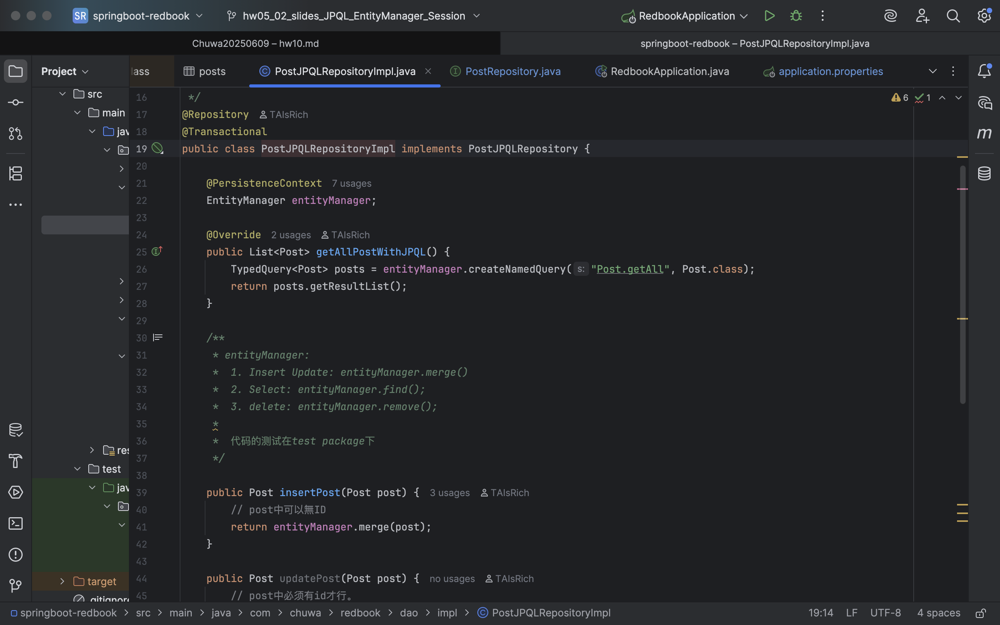


- `SessionFactory` + `Session` (Hibernate)
    - Hibernate-native API – outside JPA spec.
    - Offers explicit, low-level control over sessions, transactions, and flush behavior.
    - `SessionFactory` is thread-safe, `Session` is not.
    - More verbose, but enables advanced Hibernate features.
    - Tightly coupled to Hibernate (not portable to other JPA providers).
      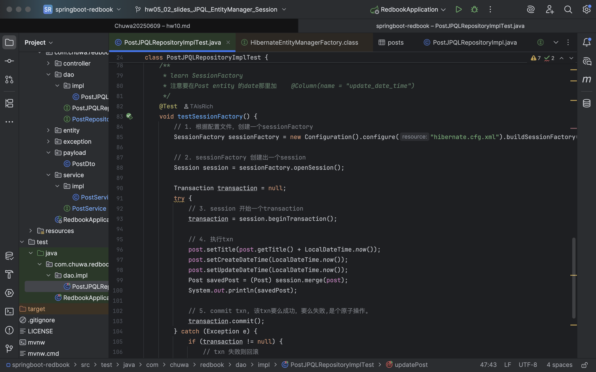

#### Key Differences

| Aspect         | `EntityManager` (JPA)  | `SessionFactory` (Hibernate)   |
|----------------|------------------------|--------------------------------|
| API            | Standard JPA API       | Hibernate-specific API         |
| Unit of Work   | `EntityManager`        | `Session`                      |
| Factory Object | `EntityManagerFactory` | `SessionFactory`               |
| Thread-safe    | ❌ No                   | ✅ Yes (`SessionFactory`)       |
| Use in Spring  | ✅ Preferred            | Used only for low-level access |

---

### 12. SessionFactory vs Session

#### Explain the role of Session and how it differs from SessionFactory.

- What is `SessionFactory`?
    - A **singleton factory object** that creates and manages `Session` instances in Hibernate.
    - Role:
        - Reads the Hibernate configuration (e.g., `hibernate.cfg.xml`)
        - Caches metadata (mappings, entity classes)
        - **Heavyweight and thread-safe** — created once and reused
        - Used throughout the app to open `Session`s

- What is `Session`?
    - A **lightweight**, non-thread-safe object used for a single **unit of work** (typically one DB transaction).
    - Role:
        - Used to **create, read, update, delete** entities
        - Represents a **persistence context** (similar to `EntityManager`)
        - Manages first-level cache
        - Typically short-lived (one transaction)

```java
SessionFactory sessionFactory = ...; // usually auto-configured
Session session = sessionFactory.openSession();

Transaction tx = session.beginTransaction();

User user = session.get(User.class, 1L); // fetch user
session.

save(newUser);                  // insert user

tx.

commit();
session.

close();
```

- Differences:

|                   | `SessionFactory`              | `Session`                              |
|-------------------|-------------------------------|----------------------------------------|
| Role              | Factory for `Session` objects | Represents a DB session (unit of work) |
| Lifetime          | Long-lived (singleton)        | Short-lived (per transaction/request)  |
| Thread-safe       | ✅ Yes                         | ❌ No                                   |
| Usage count       | Created once, reused          | Created per transaction                |
| Equivalent in JPA | `EntityManagerFactory`        | `EntityManager`                        |

---

## Part 6: Database Fundamentals

### 13. SQL Transactions

#### Explain what a transaction is in the context of relational databases, and how Spring/Hibernate manage transactions.

- A transaction is a sequence of one or more SQL operations that are executed as a single unit of work.
- Either all operations succeed, or none take effect

| Property        | Meaning                                                           |
|-----------------|-------------------------------------------------------------------|
| **Atomicity**   | All operations succeed or all fail (no partial updates)           |
| **Consistency** | DB remains valid before and after the transaction                 |
| **Isolation**   | Concurrent transactions don’t interfere with each other           |
| **Durability**  | Once committed, data is permanently saved even after system crash |

- Example in SQL:

```sql
BEGIN;

UPDATE accounts
SET balance = balance - 100
WHERE id = 1;
UPDATE accounts
SET balance = balance + 100
WHERE id = 2;

COMMIT;

```

#### How Spring & Hibernate Manage Transactions

- Spring:
    - Declarative Transactions with `@Transactional`
    - Spring opens a transaction automatically when the method starts.
    - If any exception occurs → it rolls back.
    - If the method completes → it commits.

```java

@Service
public class TransferService {

    @Transactional
    public void transfer(Long fromId, Long toId, int amount) {
        accountRepository.debit(fromId, amount);
        accountRepository.credit(toId, amount);
    }
}

```

- Hibernate: Programmatic Transaction Management with Session and Transaction.

```java
Session session = sessionFactory.openSession();
Transaction tx = session.beginTransaction();

try{
        session.

save(entity);
    tx.

commit(); // 🔄 commit to DB
}catch(
Exception e){
        tx.

rollback(); // ❌ revert changes
}


```

---

### 14. Hibernate Caching

#### Explain Hibernate’s caching mechanisms.

- Hibernate caching reduces the number of expensive SQL queries by temporarily storing entities and their state in
  memory.
- Hibernate provides a multi-level caching mechanism to improve performance by minimizing database access.
    - First-Level Cache – per session (mandatory)
    - Second-Level Cache – shared across sessions (optional)

#### Compare: First-Level Cache (session scope) and Second-Level Cache (shared/global scope)

- Comparison:

|                     | First-Level Cache       | Second-Level Cache                  |
|---------------------|-------------------------|-------------------------------------|
| Scope               | Per `Session`           | Global (across sessions)            |
| Enabled by default? | ✅ Yes                   | ❌ No                                |
| Configuration       | ❌ No                    | ✅ Yes                               |
| Use case            | In-request reuse        | Cross-request caching               |
| Lifetime            | Until `session.close()` | Until eviction (e.g., time-to-live) |
| Typical use case    | In-request reuse        | Cross-request performance           |
| Stored where        | In session memory       | External cache (Ehcache, etc.)      |

- First-Level Cache Example:

```java
Session session = sessionFactory.openSession();
Post post1 = session.get(Post.class, 1L); // Hits DB
Post post2 = session.get(Post.class, 1L); // Returns from cache (same session)

```

- Second-Level Cache Example:

```java

@Entity
@Cacheable
@org.hibernate.annotations.Cache(usage = CacheConcurrencyStrategy.READ_WRITE)
public class Product { ...
}

```

```properties
# application.properties (Spring Boot)
spring.jpa.properties.hibernate.cache.use_second_level_cache=true
spring.jpa.properties.hibernate.cache.region.factory_class=org.hibernate.cache.jcache.JCacheRegionFactory

```