# HW10 - Hands-on Project Work

### Part 1: Annotation & Syntax Reference

##### 1. Spring Annotation Cheatsheet

List all of the annotations you’ve learned from class and homework in a file named annotations.md. This will serve as your Spring annotation reference.

[annotations.md](annotations.md)


------


### Part 2: Hands-on Project Work

##### 2. Setup Starter Project & Test APIs

- Clone the following repository: https://github.com/CTYue/springboot-redbook/tree/05_02_slides_JPQL_EntityManager_Session
- Make the necessary code/configuration changes to bring up the application.
- Test each controller using Postman and take screenshots.

**Screenshots**:

1. POST createPost

   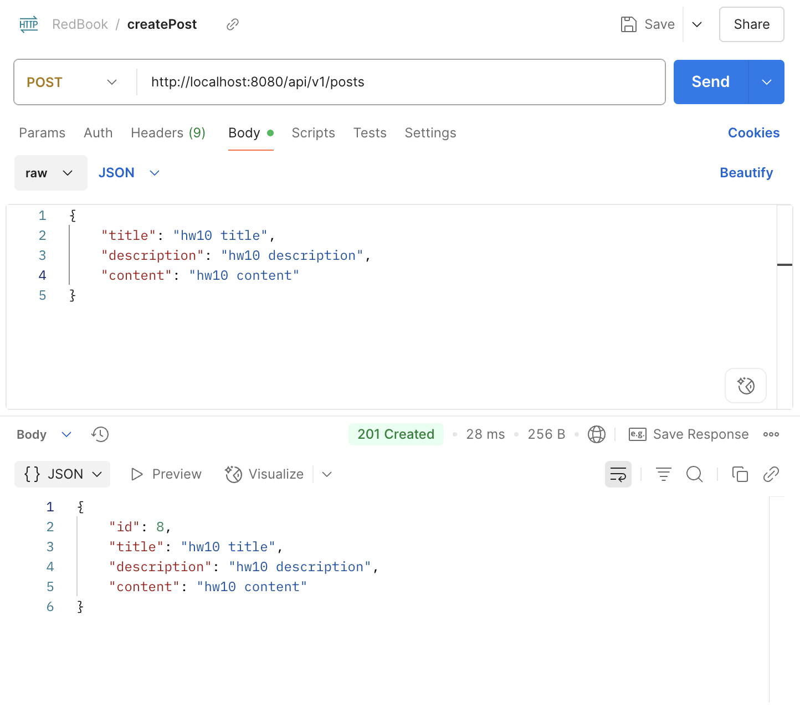

2. GET getAllPosts

   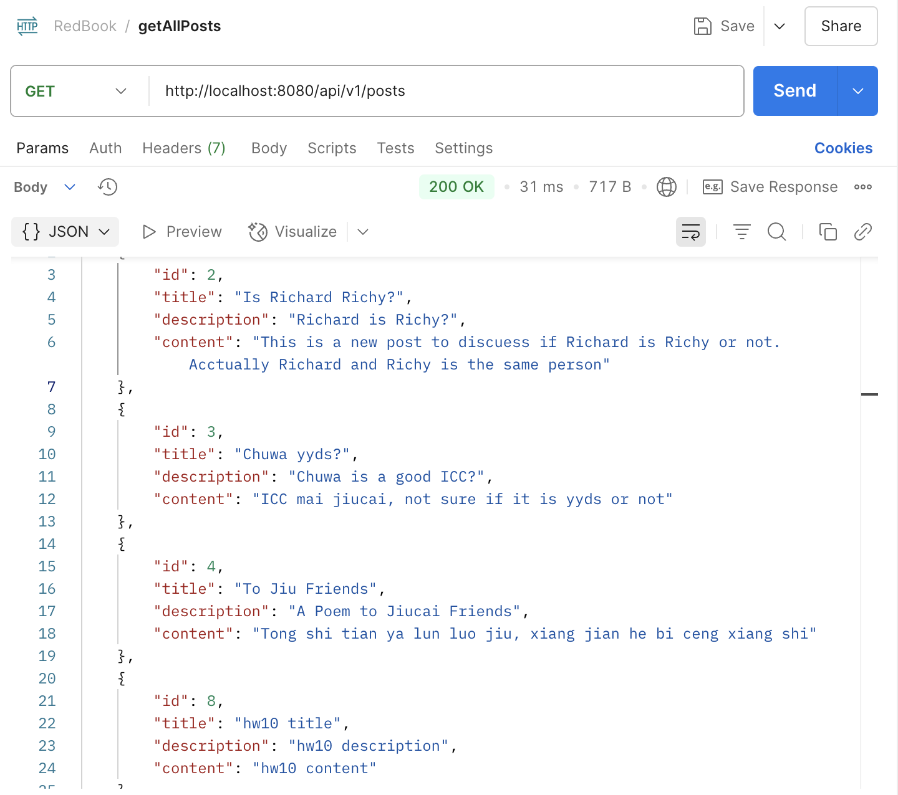

3. GET getPostById

   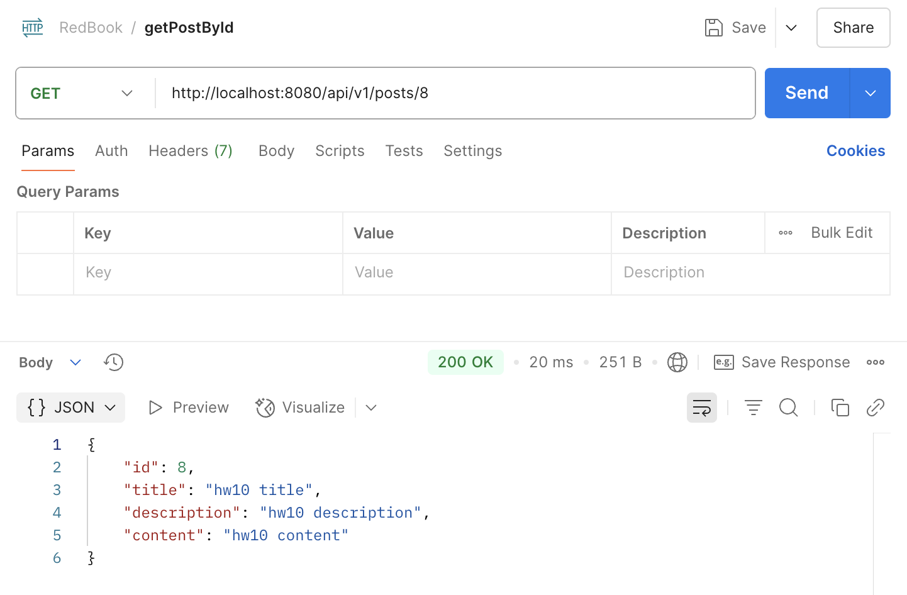

4. GET getAllPostsJPQL

   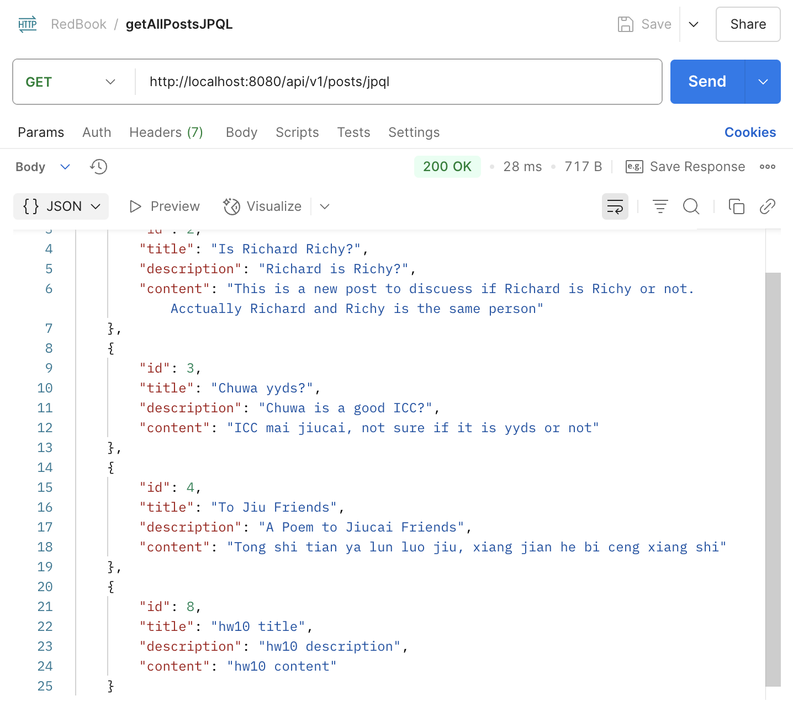

5. GET getPostByIdOrTitleJPQLIndex

   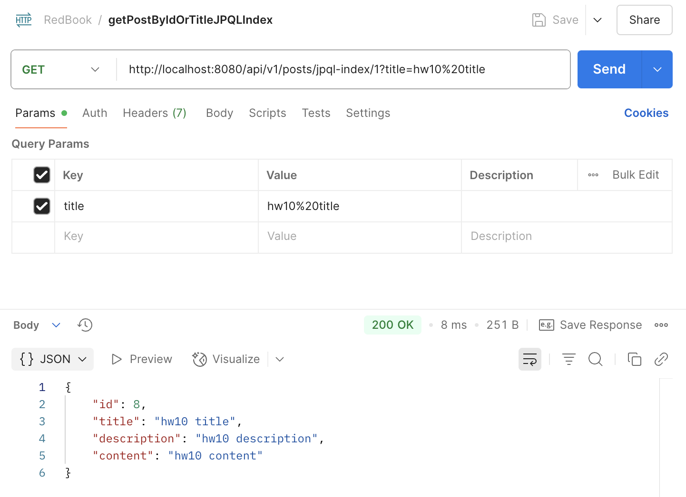

6. GET getPostByIdOrTitleJPQLNamed

   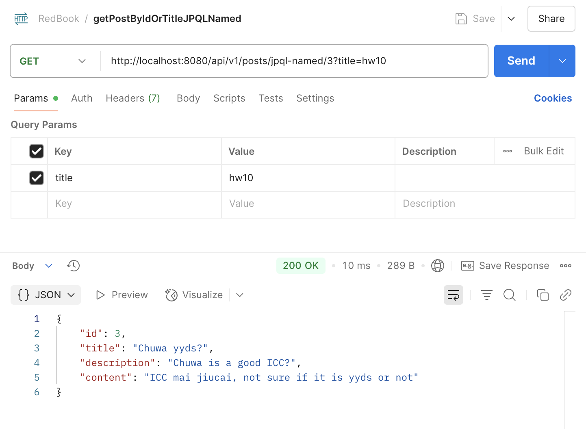

7. GET getPostByIdOrTitleSQLIndex

   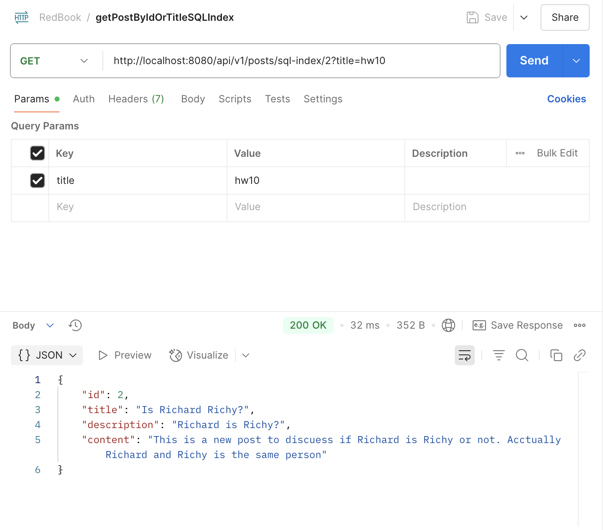

8. GET getPostByIdOrTitleSQLParameter

   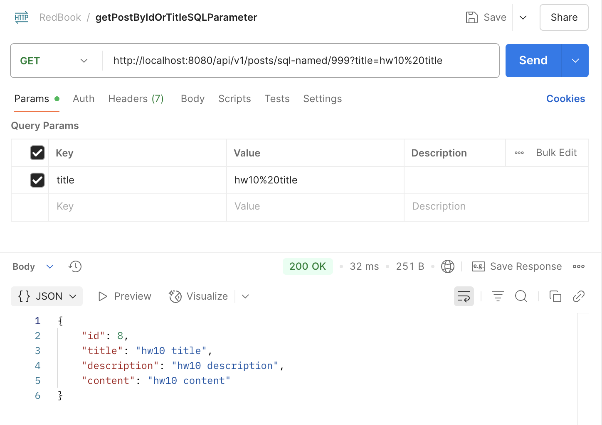

9. PUT updatePostById

   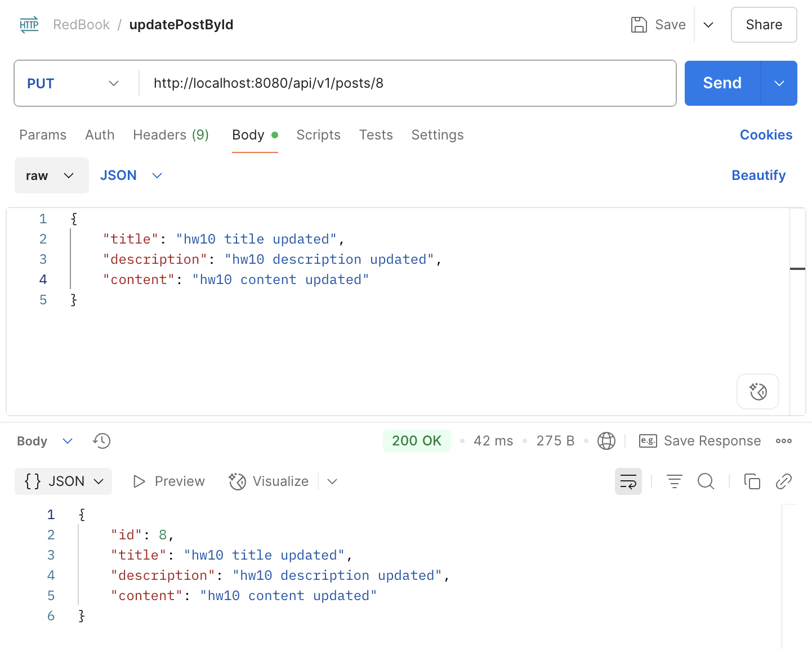

10. DELETE deletePost

    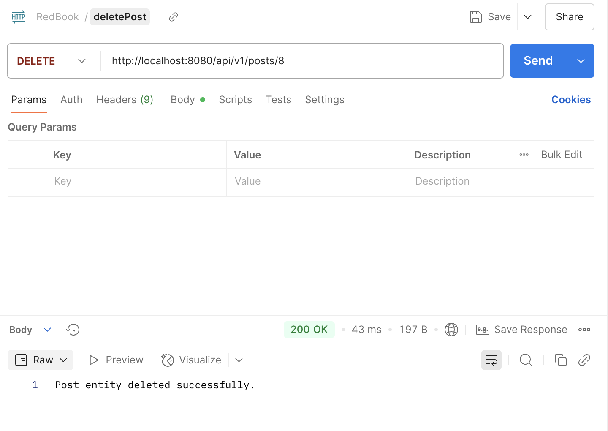


##### 3. Write Custom JPA Methods and Validate Syntax

Based on the codebase from Task 2:

- Write custom JPA methods using Spring Data JPA naming conventions.
- Demonstrate how JPA performs compile-time syntax checks on method names.

I wrote 2 custom JPA methods:

- `Post findByTitleIgnoreCase(String title);`

- `List<Post> findByAuthor(String author);`

The first is to get a post by its title. It works well with the proper updates in the service and controller layer:

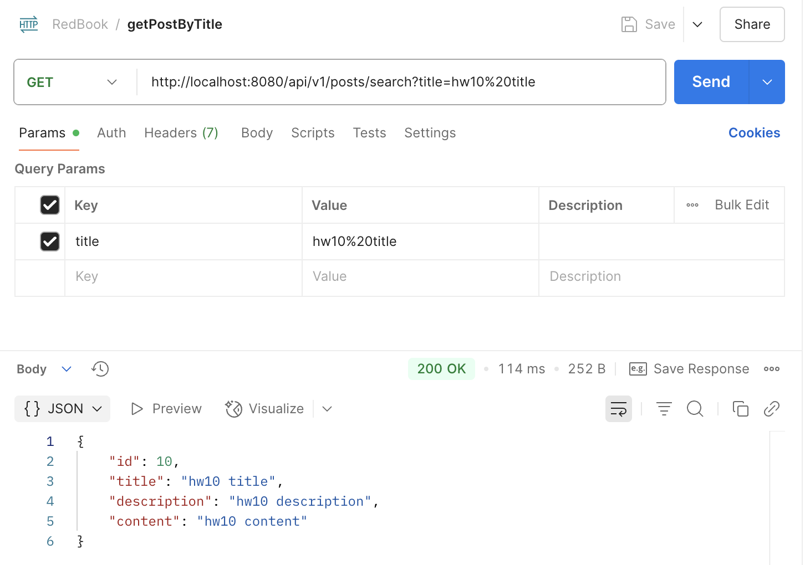

The second fails at the compile time, because post has no field "author". Spring scans the repository interface during compilation. When it parses the method names (`findByAuthor`), it will check if `Post.author` exists. It only generates implementation for valid methods to avoid wrong SQL queries.

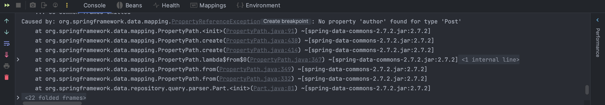


##### 4. Implement JPQL and Native SQL Queries

- In your repository interface, add:
  - One JPQL query using the @Query annotation
  - One native SQL query using @Query(nativeQuery = true)
- Update your service layer to use these queries.
- Test both using Postman and capture screenshots.

**Screenshots:**

1. JPQL query: getPostByKeywordJPQL

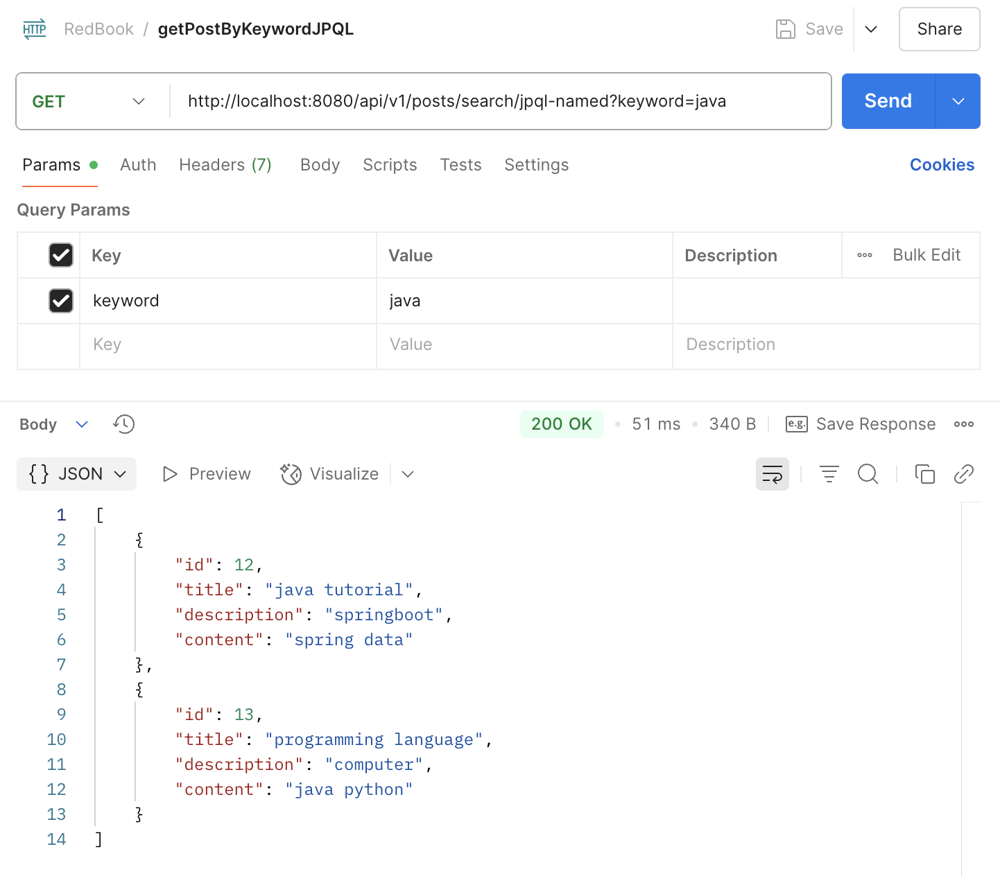

2. Native SQL query: getPostByKeywordSQL

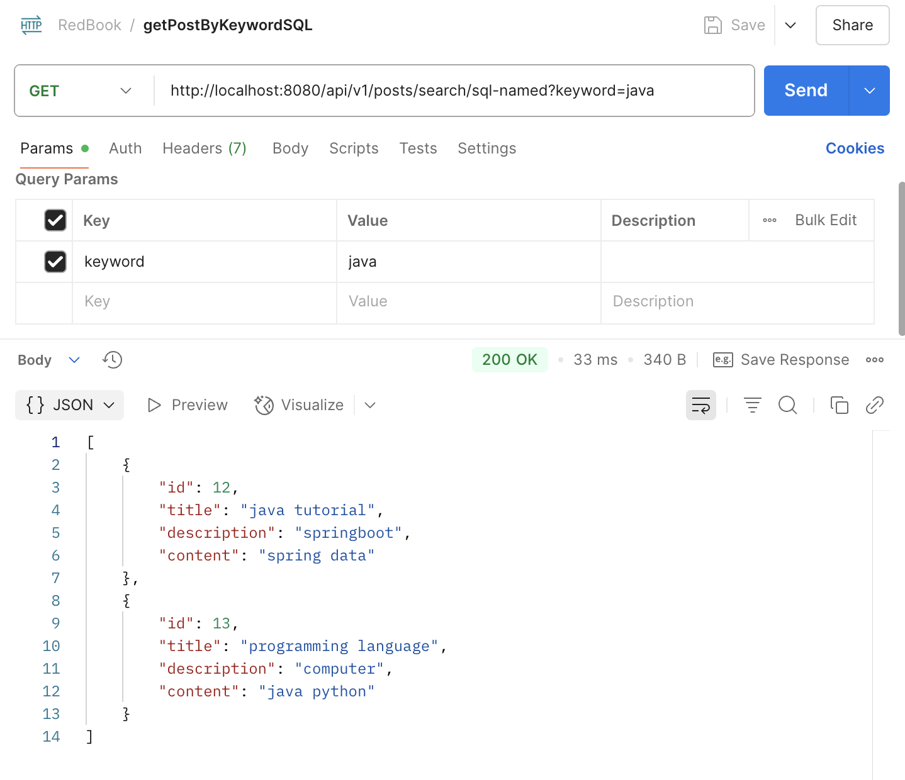


------


### Part 3: Core Conceptual Understanding

##### 5. Technology Comparison

Explain the differences and relationships among:

- **JDBC**

  JDBC (Java Database Connectivity) is the lowest-level API that enables Java programs to connect to a database. It allows us to establish connections, write and execute SQL statements, and manually handle result sets. However, working with JDBC often requires a lot of boilerplate code, such as opening/closing connections, preparing statements, and parsing results.

  To simplify this process, we can use **JPA** (Java Persistence API). JPA is a specification that defines how Java objects should be mapped to database tables. It allows developers to interact with databases using Java classes instead of writing raw SQL, making the code more object-oriented, cleaner, and easier to maintain.

- **Hibernate**

  Hibernate is the actual implementation of JPA. It is an Object-Relational Mapping (ORM) framework which lets us save and query Java objects in a database without writing SQL. It provides all the method implementation defined in JPA, and many powerful features such as caching, dirty checking, and automatic schema generation.

- **Spring Data JPA**

  Spring Data JPA is part of Spring Data, and it is built as an high-level abstraction layer over the JPA and Hibernate. It provides **repository interfaces** extending `JpaRepository` (or `CrudRepository`), which will automatically provide basic CRUD operations, and **query method naming** which is to create custom queries by simply defining methods with specific naming conventions (`findByLastNameAndFirstName`).

- **HikariCP**

  HikariCP is the default JDBC connection pool used by Spring Boot. It efficiently manages database connections by reusing them instead of constantly opening and closing new ones.

  ```
  Spring Data JPA (interface-based data access)
       ↓
  JPA (standard for ORM)
       ↓
  Hibernate (JPA implementation)
       ↓
  JDBC (low-level DB connection)
       ↓
  HikariCP (efficient JDBC connection pool)
       ↓
  Database (MySQL, PostgreSQL, etc.)
  ```

  

##### 6. JPA Relationships

Explain the following annotations with examples. Also describe and explain the configuration properties inside each, such as mappedBy, cascade, and fetch.

- **@OneToMany**: One entity relates to many others.

- **@ManyToOne**: Many entities belong to one entity.

  A user can have many posts. Many posts can belong to one user.

  ```java
  @Entity
  public class User {
      @Id
      private Long id;
  
      @OneToMany(mappedBy = "user", cascade = CascadeType.ALL, fetch = FetchType.LAZY)
      private List<Post> posts = new ArrayList<>();
  }
  
  ```

  ```java
  @Entity
  public class Post {
      @Id
      private Long id;
  
      @ManyToOne(fetch = FetchType.EAGER)
      @JoinColumn(name = "user_id")
      private User user;
  }
  
  ```

  - `mappedBy = "user"`: The `Post` entity **owns** the relationship (The owning side is usually defined on the many side of the relationship. It’s usually the side that owns the foreign key). 
  - `cascade = CascadeType.ALL`: When saving or deleting a `User`, its `posts` will be automatically saved/deleted.
  - `fetch = FetchType.LAZY`: Default for `@OneToMany`. Related posts are **loaded only when accessed**.
  - `fetch = FetchType.EAGER`: Default for `@ManyToOne`.  JPA loads the related `User` **immediately** when a `Post` is fetched.
  - `@JoinColumn(name = "user_id")`: Tells JPA which column in the `Post` table holds the **foreign key** to the `User`.

- **@ManyToMany**: Many entities can relate to many others.

  Students can enroll in many courses, and courses can have many students.

  ```java
  @Entity
  public class Student {
      @Id
      private Long id;
  
      @ManyToMany(cascade = CascadeType.ALL, fetch = FetchType.LAZY)
      @JoinTable(
          name = "student_course",
          joinColumns = @JoinColumn(name = "student_id"),
          inverseJoinColumns = @JoinColumn(name = "course_id")
      )
      private Set<Course> courses = new HashSet<>();
  }
  ```

  ```java
  @Entity
  public class Course {
      @Id
      private Long id;
  
      @ManyToMany(mappedBy = "courses")
      private Set<Student> students = new HashSet<>();
  }
  ```

  - `@JoinTable`: Defines the **join table** (used by owning side).

    - `name = "student_course"`: This is the name of the **intermediate table** in the database. It will have 2 foreign key columns: `student_id` and `course_id`.

    - `joinColumns = @JoinColumn(name = "student_id")`: This defines the foreign key column that links to the **owning entity**, which is `Student` in this case.

    - `inverseJoinColumns = @JoinColumn(name = "course_id")`: This defines the foreign key column that links to the **inverse entity**, which is `Course`.

      

##### 7. Cascade Options in JPA

Explain cascade = CascadeType.ALL and orphanRemoval = true. Also describe all other CascadeType values.

`orphanRemoval = true`: It is used to automatically deletes these orphaned child entities from the database.  An **orphan** is a child entity that is no longer attached by its parent.

```java
@Entity
public class Department {
    @OneToMany(mappedBy = "department", orphanRemoval = true)
    private List<Employee> employees;
}
```

In this example, if an employee is removed from the department's employee list, it becomes an "orphan". So JPA will automatically delete that employee from the database.

**Cascading** means that operations performed on a parent entity are automatically applied to its related child entities. `cascade = CascadeType.ALL` applies all cascade operations below.

- PERSIST:  When we **save** a parent entity, any new child entities will be saved automatically,

- MERGE: When we **update** or merge a detached parent entity, the changes to its child entities will be merged automatically as well.

- REMOVE: When the parent entity is **deleted**, all its child entities are also deleted.

- DETACH: When the parent entity is **detached from the persistence context**, the child entities are detached too.

- REFRESH: When the parent entity is **refreshed** from the database, the child entities are also refreshed.

  

##### 8. Fetch Types in JPA

Explain FetchType.LAZY and FetchType.EAGER, and describe when to use each.

`FetchType.LAZY`: 

- Data is loaded only when accessed. Like the 1:m data relationship example above, the posts are loaded only when accessed.
- Default for @OneToMany and @ManyToMany
- When to Use:
  - When the related data is not always needed
  - When dealing with large collections or deeply nested relationships which needs a better performance

`FetchType.EAGER`: 

- Data is loaded immediately with with the owning entity. Like the 1:m data relationship example above, when loading a post, the user will be loaded at the same time.

- Default for @ManyToOneand @OneToOne

- When to Use:

  - When the relationship is always needed

  - When dealing with simple, non-collection relationships

    

------


### Part 4: Querying and Data Access

##### 9. JPQL Overview

Explain what JPQL is and how it differs from SQL. Include examples.

JPQL (Java Persistence Query Language) is **query language** as part of JPA. It's used to query and manipulate data stored in relational databases through **entity objects** rather than directly interacting with database tables.

**JPQL VS SQL:** 

- JPQL:

  - Operates on **entity objects** and returns objects or object fields
  - database independent (can interact with many db)
- SQL:

  - Operates on **database tables** and columns and returns rows
- database specific (can only interact with relational databases)

For example, we have the following entities:

```java
@Entity
public class Student {
    @Id
    private Long id;
    
    private String name;

    @ManyToOne
    private Major major;
}

@Entity
public class Major {
    @Id
    private Long id;
    
    private String name;
}

```

JPQL:

```java
String jpql = "SELECT s FROM Student s WHERE s.major.name = 'Computer Science'";
List<Student> result = entityManager.createQuery(jpql, Student.class).getResultList();

```

`Student` and `Major` are Java entities. `s.major.name` navigates the object relationship.

SQL:

```sql
SELECT s.*
FROM student s
JOIN major m ON s.major_id = m.id
WHERE m.name = 'Computer Science';
```

SQL works on table(student, major) and columns(s.major_id, m.id) and need to write the `JOIN` manually.


##### 10. Using the @Query Annotation

Explain what the @Query annotation does, where it is used, and how to use it for both JPQL and native queries.

The `@Query` annotation allows to **define custom queries** directly on the **repository interfaces** — either using JPQL or native SQL. With using it, JPA will use that **specified query** instead of generating one automatically from method names.

Used on repository interface:

```java
public interface StudentRepository extends JpaRepository<Student, Long> {
    // index parameters JPQL
    // Use ?1, ?2, ... for each parameter, where the number matches the method argument order (1-based index)
    @Query("SELECT s FROM Student s WHERE s.name = ?1")
    List<Student> findByNameJPQLIndex(String name);
    
    // named parameters JPQL
    // Use :name in the query, and bind it with @Param("name")
    @Query("SELECT s FROM Student s WHERE s.name = :name")
    List<Student> findByNameJPQLNamed(@Param("name") String name);
    
    // index parameters SQL
    @Query("SELECT * FROM student s WHERE s.name = ?1", nativeQuery = true)
    List<Student> findByNameSQLIndex(String name);
    
    // named parameters SQL
    @Query("SELECT * FROM student s WHERE s.name = :name", nativeQuery = true)
    List<Student> findByNameSQLNamed(@Param("name") String name);

}

```


------


### Part 5: Hibernate and Entity Management

##### 11. EntityManager vs SessionFactory

Compare EntityManager and SessionFactory. Include screenshots from the codebase to illustrate their relationship.

- EntityManager

  - Part of JPA: an interface that manages the lifecycle of entity objects.

  - Typically injected and managed by the container.

  - Each EntityManager is associated with a **persistence context**, which is a set of entity instances that the EntityManager manages.

    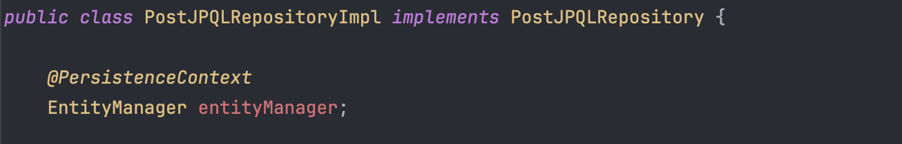

  - Provides **methods for creating (persisting), reading (finding), updating, and deleting entity data** in the database.

    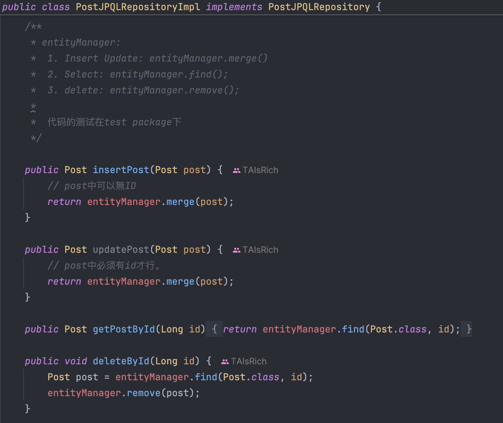

  - EntityManager instances are **not thread-safe** and should be used within a specific thread or transaction scope. 

- SessionFactory
  - Part of Hibernate’s native API: A Hibernate-specific interface for managing the persistence process. 
  
  - It creates and manages **Session instances**.
  
    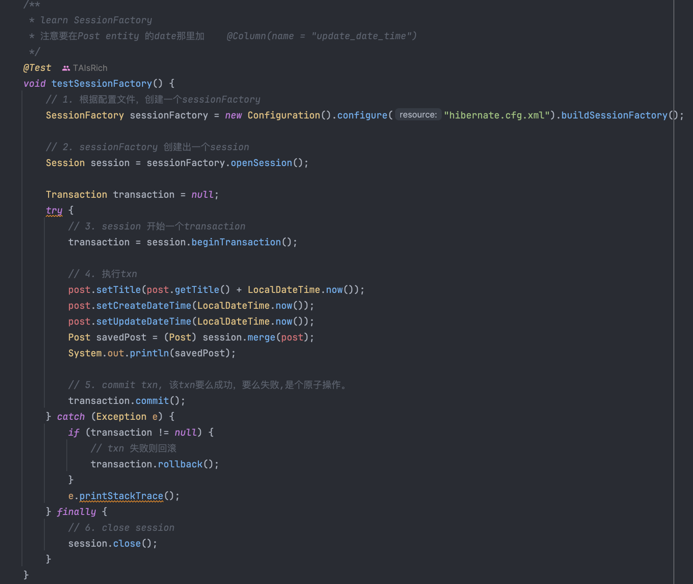
  
  - Configured through `hibernate.cfg.xml` or programmatically.
  
    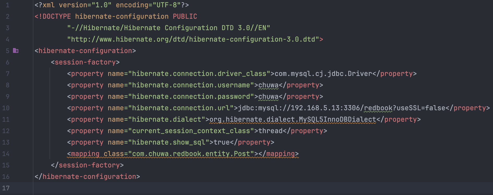
  
  - SessionFactory is thread-safe.
  
  **Relationship**:
  
  ```
  EntityManager (JPA Interface)
      ↓ (implements)
  Hibernate EntityManager Implementation
      ↓ (wraps)
  SessionFactory
      ↓ (creates)
  Session
      ↓ (performs)
  Database Operations
  ```
  
  When using Hibernate as JPA provider, EntityManager is essentially a wrapper around SessionFactory/Session, providing standardized access to Hibernate's powerful features while maintaining portability and simplicity.

##### 12. SessionFactory vs Session

Explain the role of Session and how it differs from SessionFactory.

**Session:**

- A single unit of interaction with the database — like a conversation

- Lifecycle: Lives for single transaction

- It is used to:

  - Perform CRUD operations (`save`, `update`, `delete`, `get`, `load`)

  - Create queries (HQL, native SQL)

  - Manage the first-level cache (session-scoped)

  - Handle transactions** (often with `beginTransaction` / `commit`)

- Cost: Cheap to create, used intensively

- Not thread-safe

**SessionFactory**:

- Factory for session objects: creates and manages session instances
- Lifecycle: Created once,  lives for entire application
- Cost: Expensive to create
- Thread-safe

------


### Part 6: Database Fundamentals

##### 13. SQL Transactions

Explain what a transaction is in the context of relational databases, and how Spring/Hibernate manage transactions.

A **transaction** is a logical unit of work that contains one or more SQL statements. It represents a single, indivisible operation that either succeeds completely or fails completely.

It follows ACID Properties:

- **Atomicity**: All operations succeed or all fail (all-or-nothing)
- **Consistency**: Database remains in valid state before and after transaction
- **Isolation**: Concurrent transactions don't interfere with each other
- **Durability**: Committed changes persist even after system failure

**Spring transactions magagement:**  

- Declarative: use `@Transactional` on methods / classes
- Spring handles **begin, commit, rollback** automatically.

```java
@Repository
@Transactional  // ← Spring manages transaction boundaries
public class PostJPQLRepositoryImpl implements PostJPQLRepository {

    @PersistenceContext
    EntityManager entityManager;

    public Post insertPost(Post post) {
        return entityManager.merge(post);  // ← Executed within transaction
    }
    
    public void deleteById(Long id) {
        Post post = entityManager.find(Post.class, id);
        entityManager.remove(post);        // ← Both operations in same transaction
    }
}
```

**Hibernate transactions magagement:** 

- Programmatic: manually start, commit, or roll back a transaction

```java
@Test
void testSessionFactory() {
    SessionFactory sessionFactory = new Configuration()
            .configure("hibernate.cfg.xml")
            .buildSessionFactory();

    Session session = sessionFactory.openSession();
    Transaction transaction = null;  // ← Manual transaction management
    
    try {
        transaction = session.beginTransaction();  // ← Start transaction
        
        // All operations within transaction boundary
        post.setTitle(post.getTitle() + LocalDateTime.now());
        post.setCreateDateTime(LocalDateTime.now());
        post.setUpdateDateTime(LocalDateTime.now());
        
        Post savedPost = (Post) session.merge(post);
        
        transaction.commit();  // ← Commit all changes
        
    } catch (Exception e) {
        if (transaction != null) {
            transaction.rollback();  // ← Rollback on error
        }
        e.printStackTrace();
    } finally {
        session.close();
    }
}
```


##### 14. Hibernate Caching

Explain Hibernate’s caching mechanisms.

Compare:

- First-Level Cache (session scope)
  - Scope: Only works within a single Session/EntityManager.Objects cached in session will NOT be visible to other sessions.
  - Lifecycle: Lives with the session
  - Thread Safety: Not thread-safe (per session)
  - Mandatory: Enabled by default, cannot be disabled
  - Storage: Memory within the Hibernate session. Entity instances stored in a session can be considered as "cached" inside the session object.
- Second-Level Cache (shared/global scope)
  - Scope: Entire SessionFactory (application-wide)
  - Lifecycle: Lives with the application
  - Thread Safety: Thread-safe (shared across sessions)
  - Optional: Must be explicitly configured and enabled
  - Storage: Hibernate itself does NOT implement second-level cache, instead, it relies on third party caching providers such as Redis, Ehcache, etc.