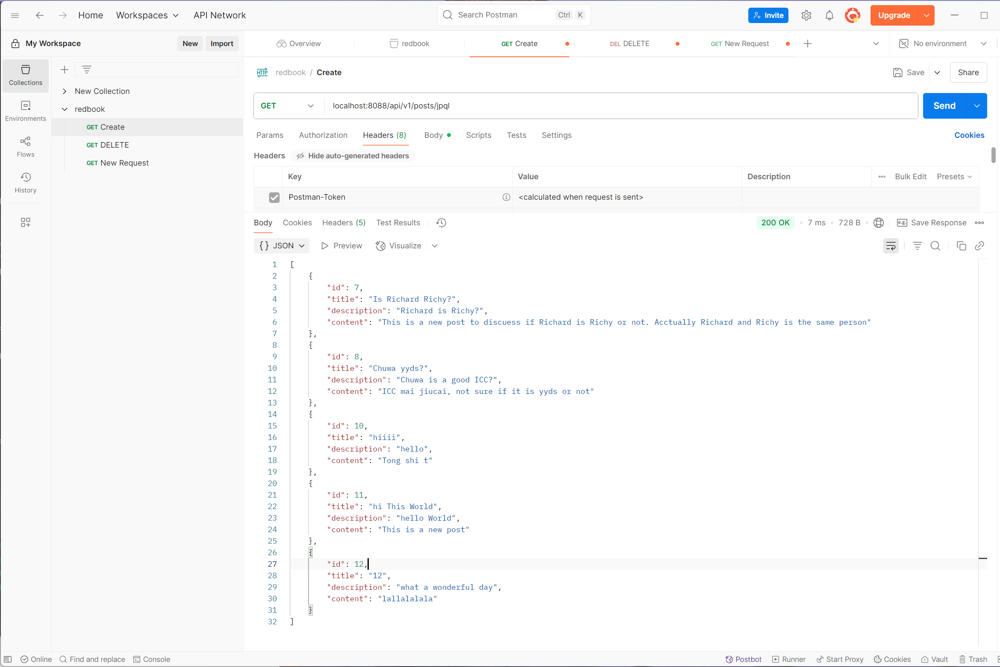
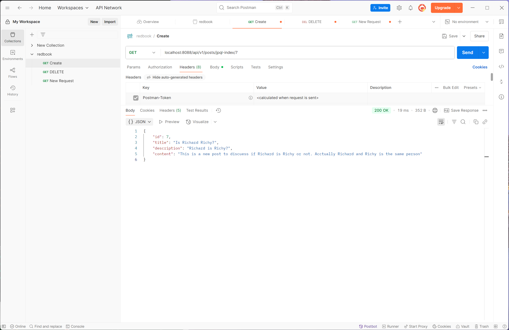
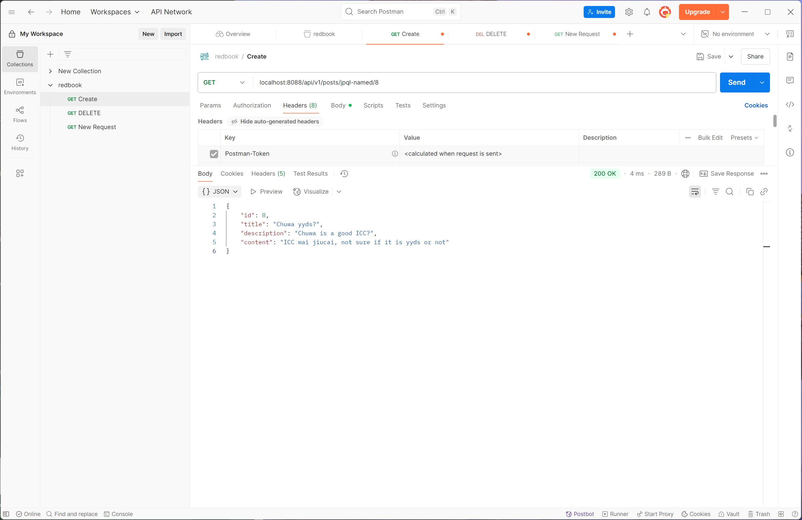
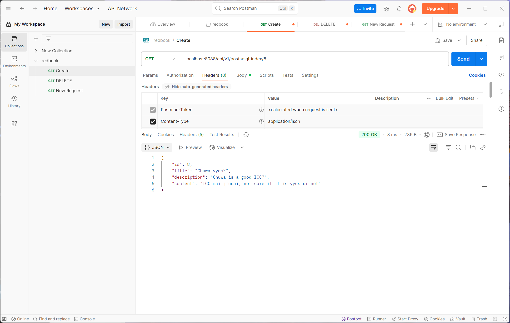
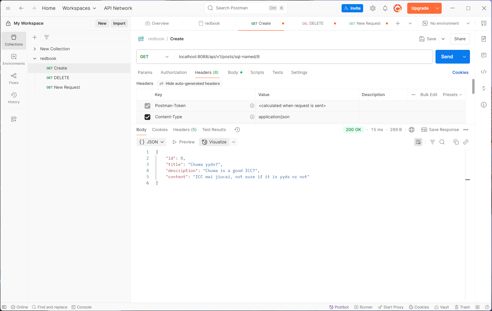
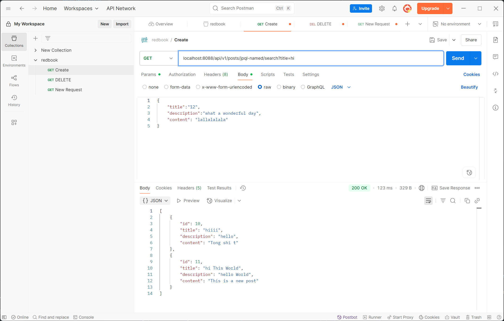
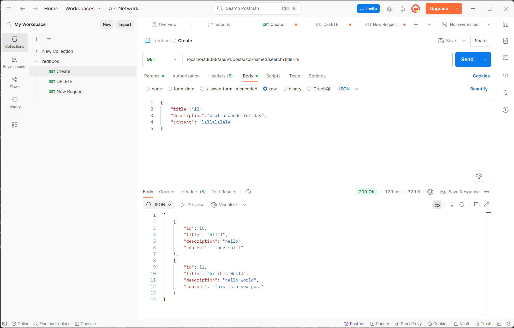

## Part 2:
### 2. Setup Starter Project
* jpql: get all records


* jpql-index: get the index = 7

* jpql-named: get the index = 8

* sql-index: get the index = 7

* sql-named: get the index = 7


### 3. Write Custom JPA Methods and Validate Syntax


`List<Post> findByTitleContainingIgnoreCase(String keyword);` in extending `JpaRepository<Post, Long>`

Spring Data JPA checks your method names at compile-time. If the method name does not match any existing field in the entity, you'll get an immediate compile-time error or sometimes a runtime startup error.


### 4. Implement JPQL and Native SQL Queries


* JPQL QUERY
`@Query("select p from Post p where p.title LIKE %:title%")
    List<Post> getByTitleWithJPQL(@Param("title") String title);`


* SQL QUERY
`    @Query(value = "select * from posts p where p.title LIKE %:title%", nativeQuery = true)
    List<Post> getByTitleWithSQL(@Param("title") String title);`



## Part 3:

### Technology Comparison
Explain the differences and relationships among:

Spring Data JPA
Hibernate
HikariCP
JDBC
1. JDBC (Java Database Connectivity)
What it is:
The lowest-level Java API for interacting directly with relational databases (like MySQL, PostgreSQL).

    What it does:
Allows you to write raw SQL queries, manage database connections, execute statements, and process results.

2. Hibernate
What it is:
A popular ORM (Object-Relational Mapping) framework that abstracts away most of the raw SQL and JDBC complexity.

    What it does:
Maps Java objects (entities) to database tables and handles database operations automatically.
Hibernate is a JPA (Java Persistence API) implementation.

3. Spring Data JPA
What it is:
A Spring framework module that simplifies the use of JPA by reducing boilerplate code.

    What it does:
Automatically provides CRUD and query methods using naming conventions or JPQL.

4. HikariCP
What it is:
A high-performance JDBC connection pool.
A connection pool is essential for managing and reusing database connections efficiently.

    What it does:
Manages the creation, reuse, and disposal of JDBC connections to minimize latency and resource usage.
HikariCP makes JDBC connection management fast and efficient behind the scenes.

6. JPA Relationships

Explain the following annotations with examples:

* @OneToMany

    Meaning:
One entity is related to many instances of another entity.

    Example:
One Department → Many Employees.


```
@Entity

public class Department {

    @Id
    private Long id;

    @OneToMany(mappedBy = "department", cascade = CascadeType.ALL, fetch = FetchType.LAZY)
    private List<Employee> employees;
}

@Entity
public class Employee {
    @Id
    private Long id;

    @ManyToOne
    @JoinColumn(name = "department_id")
    private Department department;
}
```


* @ManyToOne

    Meaning:
Many entities share the same one entity.

    Example:
Many Employee → One Department.
```
    @ManyToOne
    @JoinColumn(name = "department_id")
    private Department department;
```
* @ManyToMany

    Meaning:
Many entities are related to many other entities.

    Example:
    A student can take many courses; a course can have many students.

```
@Entity
public class Student {
    @Id
    private Long id;

    @ManyToMany(cascade = CascadeType.ALL, fetch = FetchType.LAZY)
    @JoinTable(
        name = "student_course",
        joinColumns = @JoinColumn(name = "student_id"),
        inverseJoinColumns = @JoinColumn(name = "course_id")
    )
    private List<Course> courses;
}

@Entity
public class Course {
    @Id
    private Long id;

    @ManyToMany(mappedBy = "courses")
    private List<Student> students;
}

```
* mappedBy:
MappedBy signals hibernate that the key for the relationship is on the other side.

* cascade:
Without cascade, if you save or delete a parent entity, you’d have to manually save or delete every related child entity.
With cascade, JPA automatically handles this for you.

* fetch
The fetch property in JPA defines when and how related entities are loaded from the database when you access a parent entity.

7. Cascade Options in JPA
* cascade = CascadeType.ALL 
It means: Apply all types of operations (PERSIST, MERGE, REMOVE, REFRESH, DETACH) to the child when you do them on the parent.


* orphanRemoval = true:
Automatically deletes a child from the database if it is removed from the parent's collection.


* PERSIST:
When the parent is saved (persist), the child is saved too
* MERGE: 
When parent is merged (merge), child is merged too
* REMOVE: 
When parent is deleted (remove), child is deleted too
* DETACH: 
When parent is detached from persistence context, so is child
* REFRESH: 
When parent is refreshed, child is refreshed too


8. FETACH Type in JPA:

    EAGER: Can cause performance problems if you load unnecessary data.Child is loaded immediately together with the parent.

    When to Use:

    * Need the child entity when you load the parent.
    * The child data is small and unlikely to cause performance issues.

    LAZY: Child is not loaded immediately. It's loaded only when you first access it in your code.

    When to Use:

    * The child data is large or optional.
    * Don't always need the child when working with the parent.
    * Improves performance and reduces unnecessary database load.


## Part4: Querying and Data Access

9. JPQL Overview
Explain what JPQL is and how it differs from SQL. Include examples.

    JPQL = Java Persistence Query Language

    It is an object-oriented query language used in JPA to query entities (Java classes), not tables.

    JPQL: Entities (Java objects)

    SQL:Tables and columns

    JPQL Example:
    `@Query("SELECT e FROM Employee e WHERE e.department.id = :deptId")
    List<Employee> findByDepartmentId(@Param("deptId") Long deptId);`

10. Using the @Query Annotation

Explain what the @Query annotation does, where it is used, and how to use it for both JPQL and native queries.

What is @Query?

The @Query annotation is used to write custom database queries directly inside a Spring Data JPA repository interface.

Where is @Query Used?

It is used inside a Repository interface (typically an interface that extends JpaRepository).

how to use:

* Using @Query with JPQL (Default)
* Using @Query with Native SQL


## Part5: Hibernate and Entity Management

11. EntityManager vs SessionFactory

EntityManager: 	JPA standard interface used to:

* Persist (save) entities

* Find entities

* Remove entities

* Execute JPQL queries
```
@PersistenceContext
private EntityManager entityManager;

public Employee findEmployee(Long id) {
    return entityManager.find(Employee.class, id);
}
```

SessionFactory: Hibernate-specific

Hibernate-native factory used to create Session objects.

Session is Hibernate's own version of EntityManager.

This is not JPA-it is Hibernate-only.
```
SessionFactory sessionFactory = new Configuration().configure().buildSessionFactory();
Session session = sessionFactory.openSession();
Employee emp = session.get(Employee.class, 1L);
session.close();
```
Their relationship:
```
// Spring Boot JPA setup (JPA Standard)
@Autowired
private EntityManager entityManager;

public void demo() {
    // JPA way
    Employee emp = entityManager.find(Employee.class, 1L);

    // Accessing Hibernate native Session
    Session session = entityManager.unwrap(Session.class);

    // Optional: Accessing SessionFactory
    SessionFactory factory = session.getSessionFactory();
}

```

12. SessionFactory vs Session
Explain the role of Session and how it differs from SessionFactory.


SessionFactory is a heavyweight, thread-safe object that:

* Creates Session objects (like a factory).

Session:

* Represents a single unit of work with the database (like a database connection).
* Is not thread-safe each thread or transaction should use its own Session.


## Part 6:

13. SQL Transactions
Explain what a transaction is in the context of relational databases. 

A transaction is a set of one or more SQL operations that are treated as a single unit of work.

Key Properties (ACID):

* A Atomicity: 	All steps succeed or none at all (no partial changes)
* C Consistency: Database moves from one valid state to another
* I Isolation:	Transactions don't interfere with each other
* D Durability: Once committed, changes are permanent, even if the system crashes

How Spring/Hibernate manage transactions?
In Spring Boot (with Hibernate as JPA provider):

* Don't manually start or commit transactions.

* Spring provides automatic transaction management using the @Transactional annotation.

Spring opens a transaction automatically when the method starts.

If the method completes without error ➔ COMMIT.

If an exception is thrown ➔ ROLLBACK.

14. Hibernate Caching

Hibernate caching is a mechanism that helps reduce the number of direct database calls by temporarily storing data in memory.


Without caching:

* Every time you call .get() or .find(), Hibernate queries the database.

With caching:

* Hibernate can remember frequently used data and reuse it without hitting the database again.

First-Level Cache (session scope):
Built into every Hibernate Session (or JPA EntityManager).


Second-Level Cache (shared/global scope):
Works across multiple Sessions.


