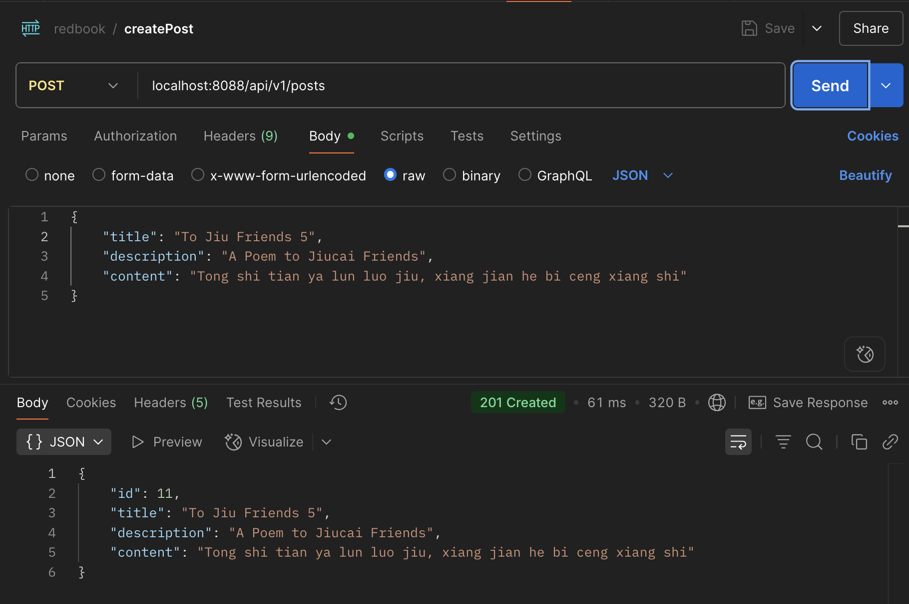
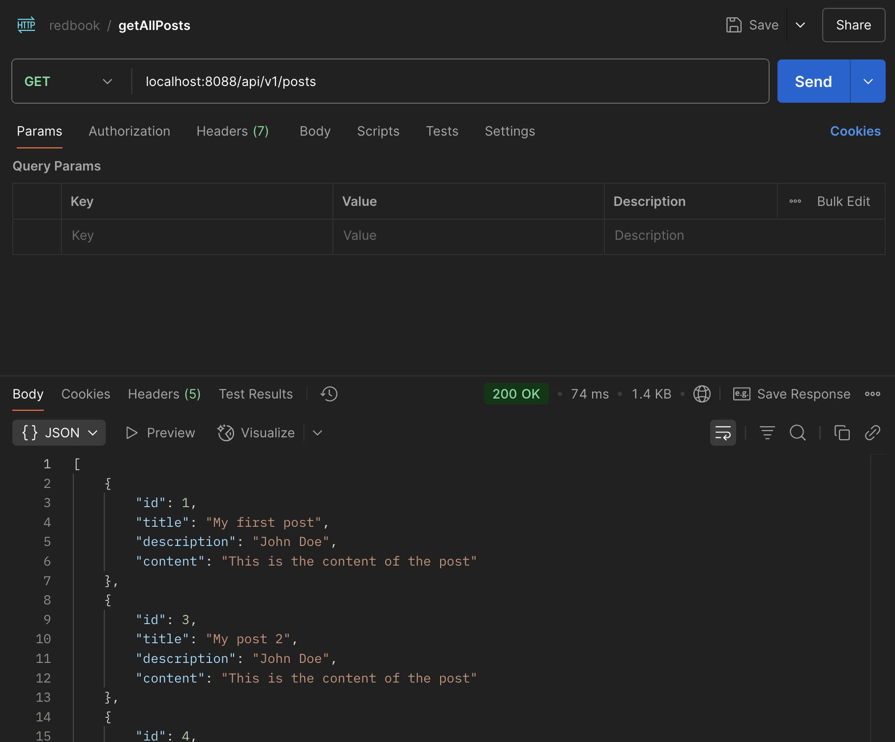
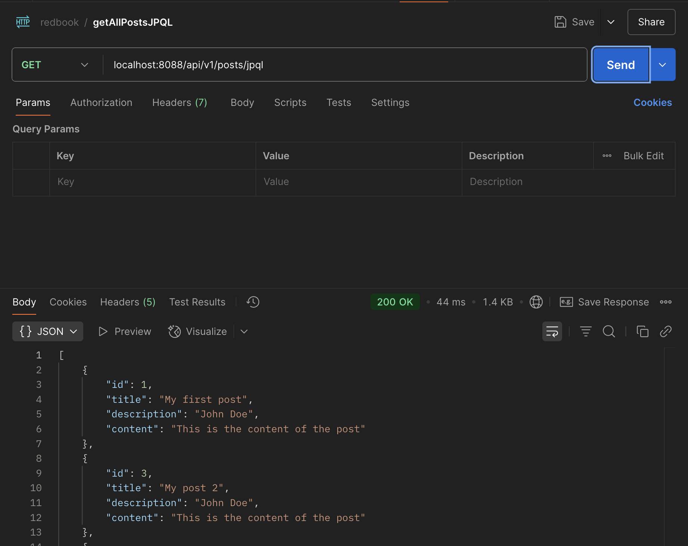
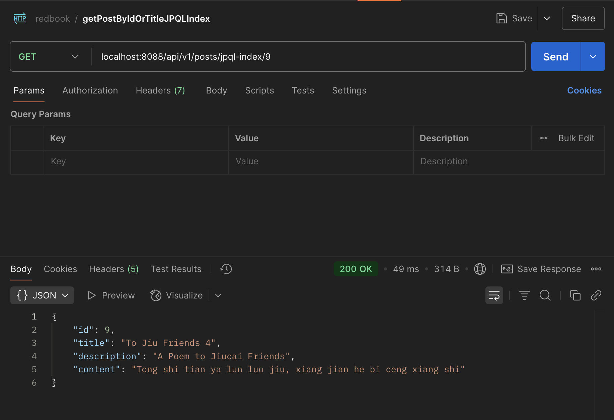
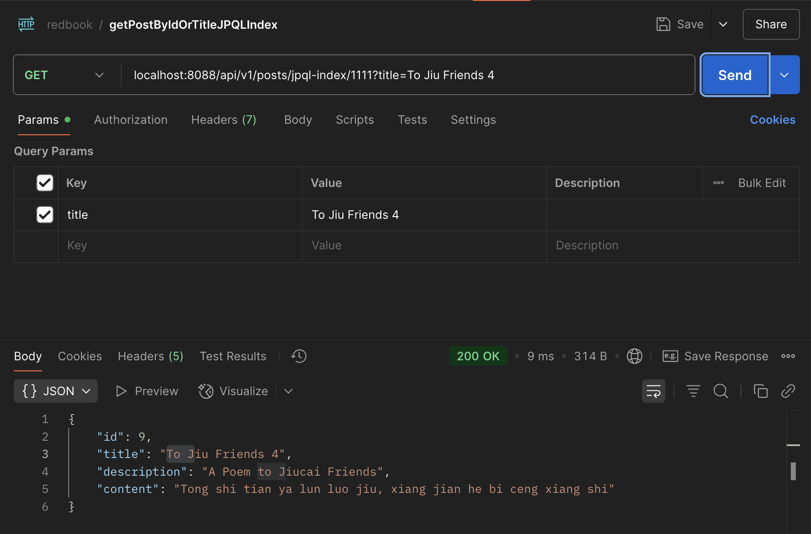
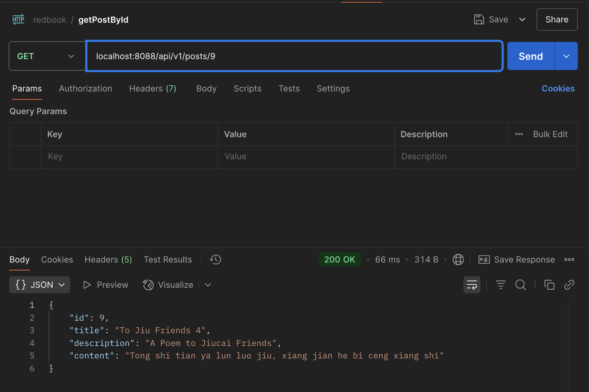
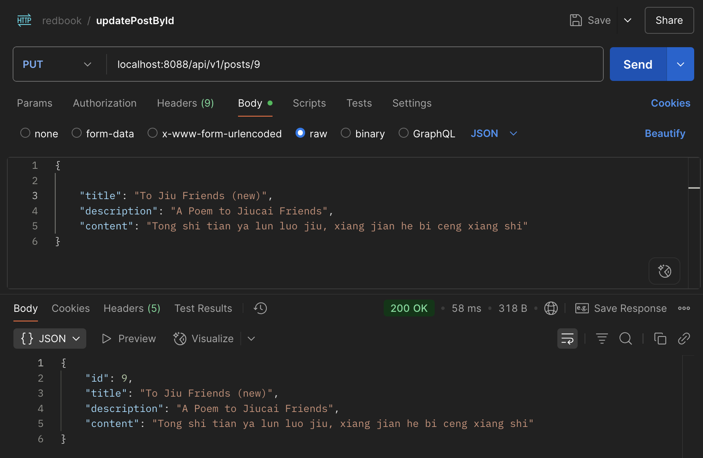
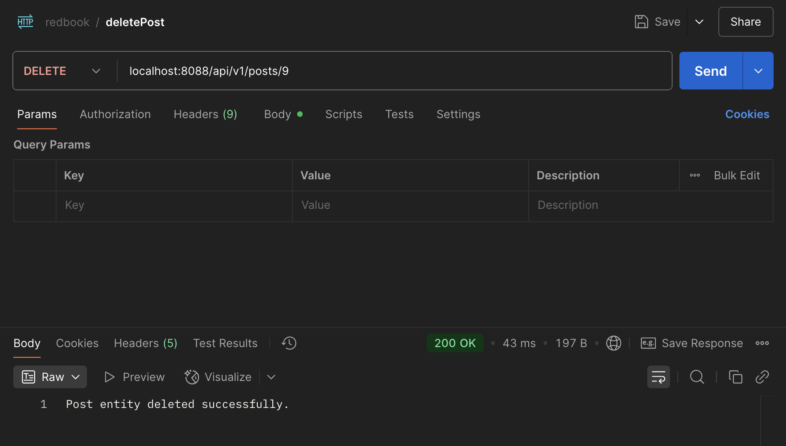
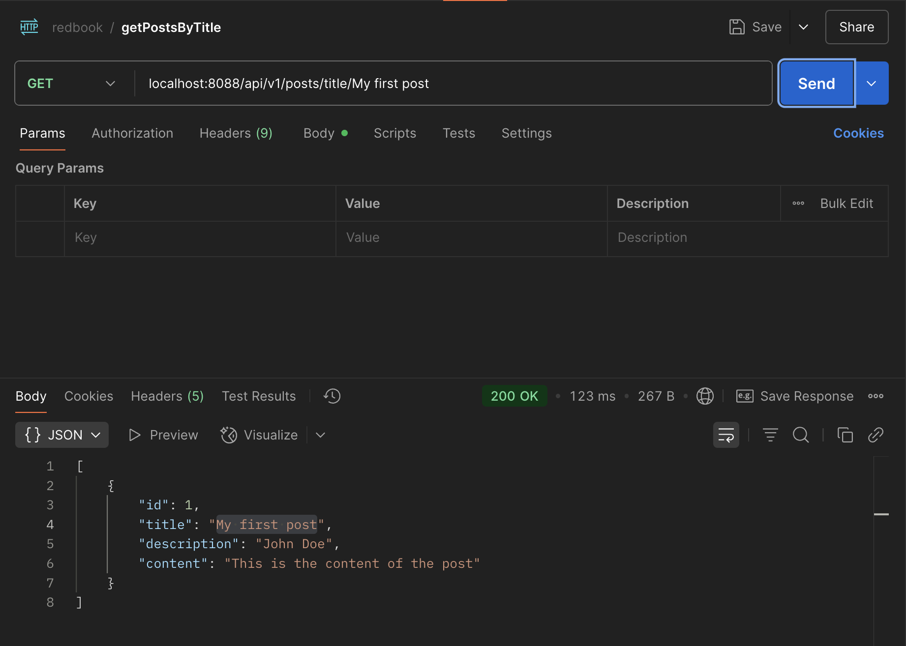
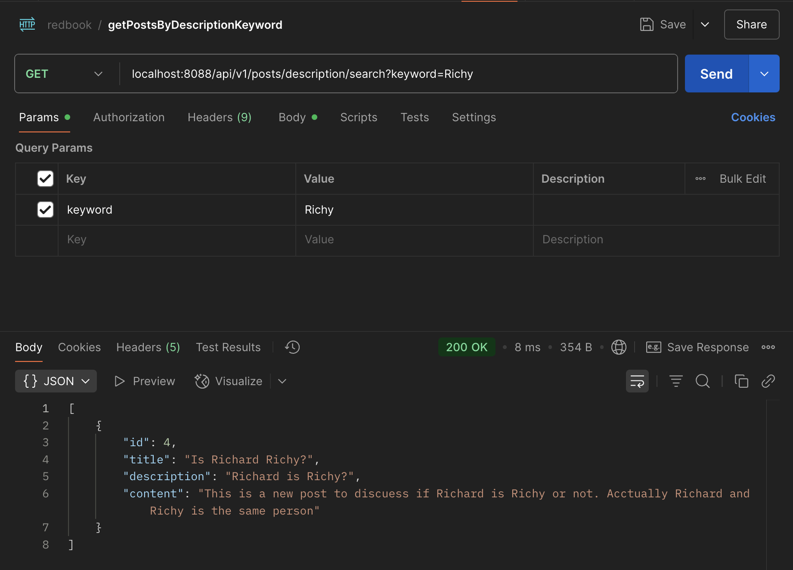

### 2. Setup Starter Project & Test APIs
- Clone the following [repository](https://github.com/CTYue/springboot-redbook/tree/05_02_slides_JPQL_EntityManager_Session)  
- Make the necessary code/configuration changes to bring up the application.  
  - set up server.port in `application.properties`
  - set up mysql username/password in `application.properties`
- Test each controller using Postman and take screenshots.
  - createPost


  - getAllPosts


  - getAllPostsJPQL


  - getPostByIdOrTitleJPQLIndex / getPostByIdOrTitleJPQLNamed / getPostByIdOrTitleSQLIndex / getPostByIdOrTitleSQLParameter  
**see difference**: [src/main/java/com/chuwa/redbook/dao/PostRepository.java]() 



  - getPostById


  - updatePostById


  - deletePost



### 3. Write Custom JPA Methods and Validate Syntax
- Write custom JPA methods using Spring Data JPA naming conventions.  
- Demonstrate how JPA performs compile-time syntax checks on method names.

```java
    // Find by multiple fields with AND
    List<Post> findByTitleAndDescription(String title, String description);
    
    List<Post> findByTitleAndContent(String title, String content);
    
    List<Post> findByDescriptionAndContent(String description, String content);
    
    // Find by multiple fields with OR
    List<Post> findByTitleOrDescription(String title, String description);
    
    List<Post> findByTitleOrContent(String title, String content);
    
    // String operations
    List<Post> findByTitleContaining(String titleKeyword);
    
    List<Post> findByDescriptionContaining(String descriptionKeyword);
    
    List<Post> findByContentContaining(String contentKeyword);
    
    List<Post> findByTitleContainingIgnoreCase(String titleKeyword);
    
    List<Post> findByTitleStartingWith(String titlePrefix);
    
    List<Post> findByTitleEndingWith(String titleSuffix);
    
    // Date/Time operations
    List<Post> findByCreateDateTimeAfter(LocalDateTime dateTime);
    
    List<Post> findByCreateDateTimeBefore(LocalDateTime dateTime);
    
    List<Post> findByCreateDateTimeBetween(LocalDateTime startTime, LocalDateTime endTime);
    
    List<Post> findByUpdateDateTimeAfter(LocalDateTime dateTime);
    
    List<Post> findByUpdateDateTimeBefore(LocalDateTime dateTime);
    
    List<Post> findByUpdateDateTimeBetween(LocalDateTime startTime, LocalDateTime endTime);
    
    // Null checks
    List<Post> findByCreateDateTimeIsNull();
    
    List<Post> findByCreateDateTimeIsNotNull();
    
    List<Post> findByDescriptionIsNull();
    
    List<Post> findByDescriptionIsNotNull();

```
Spring Data JPA uses method naming conventions to derive queries at runtime. It parses method names using predefined patterns like findBy, countBy, deleteBy, followed by entity field names. The syntax is validated during application startup—Spring checks that field names exist in the entity class and match the expected format. If not, it throws an IllegalArgumentException.


### 4. Implement JPQL and Native SQL Queries  
- In your repository interface, add:  
  - One JPQL query using the @Query annotation  
  - One native SQL query using @Query(nativeQuery = true)  
- Update your service layer to use these queries.  
- Test both using Postman and capture screenshots.
  - getPostsByTitle


  - getPostsByDescriptionKeyword



