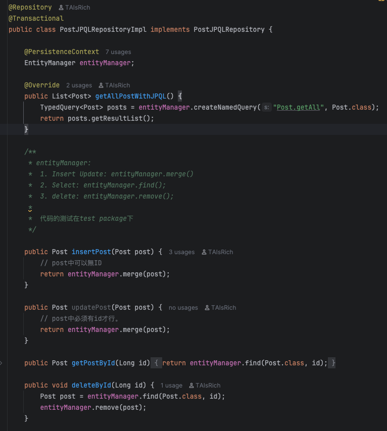
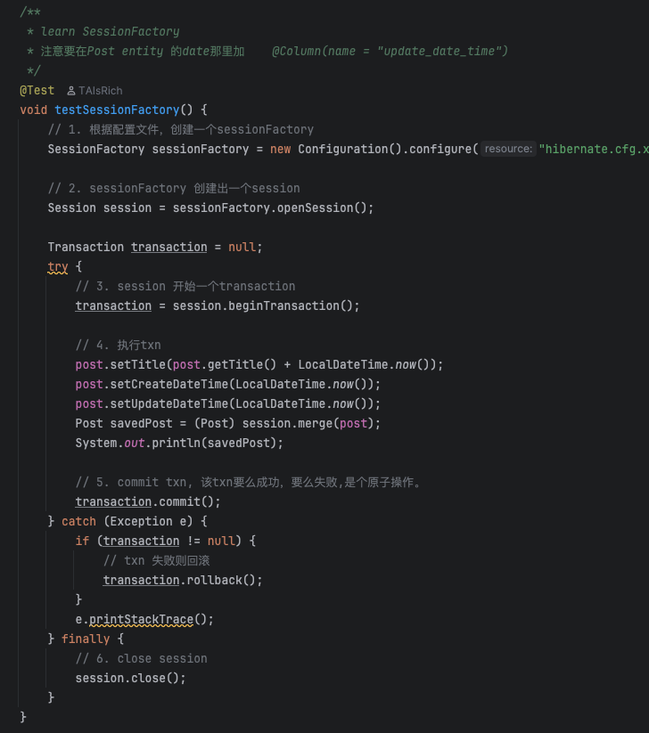

## Part 3: Core Conceptual

### 5. Explain the differences and relationships among:  
- Spring Data JPA  
- Hibernate  
- HikariCP  
- JDBC


* **JDBC (Java Database Connectivity)** is the core Java API for interacting with relational databases. It provides low-level APIs to execute SQL queries and manage connections. All higher-level persistence frameworks ultimately rely on JDBC under the hood.

* **Hibernate** is an Object-Relational Mapping (ORM) framework that abstracts JDBC and handles object-to-database mapping. It provides features like lazy loading, caching, and transaction management, simplifying data persistence for developers.

* **Spring Data JPA** is a Spring-based abstraction over JPA (Java Persistence API) that significantly reduces boilerplate code. It builds on top of JPA implementations like Hibernate and provides repository interfaces, query derivation, and pagination support out of the box.

* **HikariCP** is a high-performance JDBC connection pool. It manages and optimizes database connections efficiently and is the default connection pool used by Spring Boot due to its speed and low overhead.

**Relationships:**

* Spring Data JPA → uses JPA → commonly backed by Hibernate
* Hibernate → abstracts JDBC
* HikariCP → manages JDBC connections


### 6. [JPA Relationships] Explain the following annotations with examples:  
- @OneToMany  
- @ManyToOne  
- @ManyToMany  
(Also describe and explain the configuration properties inside each, such as mappedBy, cascade,  and fetch.)
Certainly. Here's a concise, technically accurate explanation suitable for a Java engineering interview:


####  `@OneToMany`

Defines a one-to-many relationship where one entity has a collection of another entity.


```java
@Entity
public class Department {
    @OneToMany(mappedBy = "department", cascade = CascadeType.ALL, fetch = FetchType.LAZY)
    private List<Employee> employees;
}
```

* `mappedBy`: Indicates that the relationship is bidirectional and that the `Employee` entity owns the relationship via its `department` field.
* `cascade`: Propagates operations like `PERSIST`, `MERGE`, `REMOVE`, etc., from `Department` to its `employees`.
* `fetch`: `LAZY` means employees are loaded on-demand. `EAGER` would load them immediately.


#### `@ManyToOne`

Defines a many-to-one relationship, often the owning side of a `@OneToMany`.


```java
@Entity
public class Employee {
    @ManyToOne(fetch = FetchType.LAZY)
    @JoinColumn(name = "department_id")
    private Department department;
}
```

* `@JoinColumn`: Specifies the foreign key column.
* `fetch`: Typically `LAZY` to avoid unnecessary loading of the associated entity.


####   `@ManyToMany`

Defines a many-to-many relationship where both entities can have multiple associations with each other.


```java
@Entity
public class Student {
    @ManyToMany
    @JoinTable(
        name = "student_course",
        joinColumns = @JoinColumn(name = "student_id"),
        inverseJoinColumns = @JoinColumn(name = "course_id")
    )
    private Set<Course> courses;
}
```

* `@JoinTable`: Defines the join table name and its foreign key mappings.
* `cascade`: Optional. Controls whether operations cascade to associated entities.
* `fetch`: Default is `LAZY`.


### 7. [Cascade Options in JPA]  
- Explain cascade = CascadeType.ALL and orphanRemoval = true.  
- Also describe all other CascadeType values:  PERSIST  MERGE  REMOVE  DETACH  REFRESH  

In JPA, **`cascade = CascadeType.ALL`** means that all cascade operations (PERSIST, MERGE, REMOVE, REFRESH, DETACH) will be applied from the parent entity to the associated child entities. It ensures that changes to the parent are automatically propagated to its children.

**`orphanRemoval = true`** indicates that if a child entity is removed from the association (e.g., removed from a collection), it will also be deleted from the database. This is particularly useful in `@OneToMany` and `@OneToOne` relationships where entity lifecycle should be tightly coupled.

**CascadeType Enum Values:**

* **PERSIST**: Automatically saves child when parent is saved. Use when child is new.

* **MERGE**: Updates child when parent is updated. Use when child changes with parent.

* **REMOVE**: Deletes child when parent is deleted. Only use if child should not exist alone.

* **REFRESH**: Refreshes child from DB when parent is refreshed. Rarely used.

* **DETACH**: Detaches child from persistence context when parent is detached. Rare.


### 8. [Fetch Types in JPA]  Explain FetchType.LAZY and FetchType.EAGER, and describe when to use each.


* **`FetchType.LAZY`** means the association is loaded **on demand**, i.e., only when it's explicitly accessed. It improves performance and reduces memory usage by avoiding unnecessary data loading. It's the **default for `@OneToMany` and `@ManyToMany`** associations.

* **`FetchType.EAGER`** means the association is loaded **immediately**, along with the parent entity. It's the **default for `@ManyToOne` and `@OneToOne`** associations.

**When to use:**

* Use `LAZY` when:

  * The associated data is not always needed.
  * You're working with large datasets or collections.
  * You want better control over performance.

* Use `EAGER` when:

  * The relationship is essential to the logic and always required.
  * The associated entity is small and won’t impact performance.


## Part 4: Querying and Data Access

### 9.  Explain what JPQL is and how it differs from SQL. Include examples.


**JPQL (Java Persistence Query Language)** is an object-oriented query language used in JPA (Java Persistence API) to perform database operations on entity objects, rather than directly on database tables.

 Key Differences Between JPQL and SQL:

1. **Entity-Based vs Table-Based**:

   * **JPQL** queries operate on **Java entity objects and their attributes**.
   * **SQL** operates directly on **database tables and columns**.

2. **Syntax & Semantics**:

   * JPQL uses **entity names** and **Java field names**.
   * SQL uses **table names** and **column names**.

3. **Object Navigation**:

   * JPQL supports **navigation through object relationships** (e.g., `e.department.name`).
   * SQL requires explicit **JOINs** using foreign keys.


 Example:


```java
@Entity
public class Employee {
    @Id
    private Long id;
    private String name;

    @ManyToOne
    private Department department;
}
```

**JPQL Query:**

```java
String jpql = "SELECT e FROM Employee e WHERE e.department.name = 'Sales'";
```


**Equivalent SQL Query:**

```sql
SELECT e.*
FROM Employee e
JOIN Department d ON e.department_id = d.id
WHERE d.name = 'Sales';
```


### 10. Explain what the @Query annotation does, where it is used, and how to use it for both JPQL and native  queries.
The `@Query` annotation is used in Spring Data JPA to define custom queries directly on repository methods. 

It allows developers to write either JPQL (Java Persistence Query Language) or native SQL queries when the method name conventions provided by Spring Data are **insufficient**. (It is used on repository interface methods, typically extending `JpaRepository`)


**JPQL Example:**

```java
@Query("SELECT u FROM User u WHERE u.email = :email")
User findByEmail(@Param("email") String email);
```


**Native SQL Example:**

```java
@Query(value = "SELECT * FROM users WHERE email = :email", nativeQuery = true)
User findByEmailNative(@Param("email") String email);
```

* Set `nativeQuery = true` to indicate that the query is raw SQL.
* Here, table and column names are used as defined in the database.


## Part 5:  Hibernate and Entity Management  

### 11. [EntityManager vs SessionFactory]  Compare EntityManager and SessionFactory.  (Include screenshots from the codebase to illustrate their relationship.  )
- **EntityManager** (JPA Standard)
  - Specification: JPA (Java Persistence API) standard (vendor-neutral)
  - Injection: Uses @`PersistenceContext` for dependency injection
  - Transaction Management: Integrates with Spring's @`Transactional`
  - Abstraction Level: Higher-level, more standardized
  - Use when: Building Spring Boot applications; Want standardized JPA approach; Need automatic transaction management


- **SessionFactory** (Hibernate Native)
  - Specification: Hibernate-specific (not JPA standard)
  - Configuration: Requires manual configuration (hibernate.cfg.xml)
  - Transaction Management: Manual transaction handling: transaction.begin(), commit(), rollback()
  - Abstraction Level: Lower-level, more control
  - Use when: Need fine-grained control over transactions; Building non-Spring applications
- Relationship: EntityManager is actually implemented by Hibernate's SessionFactory under the hood in this codebase. The EntityManager provides a JPA-standard interface, while SessionFactory gives direct access to Hibernate's native capabilities. 

codebase: PostJPQLRepositoryImpl.java


codebase: PostJPQLRepositoryImplTest.java



### 12. [SessionFactory vs Session]  Explain the role of Session and how it differs from SessionFactory.
SessionFactory is a heavyweight, thread-safe object used to create Session instances. It is typically created once during application initialization and is designed to be shared across the application. It holds the metadata and configuration details, such as mappings and connection settings.

Session, on the other hand, is a lightweight, non-thread-safe object that represents a single unit of work with the database. It provides methods for CRUD operations, transaction management, and query execution. A Session is typically short-lived and created per request or transaction.


## Part 6:  Database Fundamentals  

### 13. [SQL Transactions]  Explain what a transaction is in the context of relational databases, and how Spring/Hibernate  manage  transactions. 

A transaction in the context of relational databases is a sequence of one or more SQL operations that are executed as a single logical unit of work. Transactions ensure the ACID properties — Atomicity, Consistency, Isolation, and Durability — meaning either all operations within the transaction succeed and are committed, or all are rolled back in case of failure, leaving the database in a consistent state.

In Spring and Hibernate, transaction management is typically abstracted and declarative. Spring provides the `@Transactional` annotation to demarcate transactional boundaries. Behind the scenes, Spring uses `PlatformTransactionManager` to manage the transaction lifecycle, delegating to the appropriate resource (like JDBC or JPA) depending on the configuration.

Hibernate integrates with this mechanism and handles transaction boundaries using its own `Transaction` API internally when working natively. When used within Spring, Hibernate's session is bound to the transactional context, allowing Spring to manage commit, rollback, and session flushing transparently.

Spring supports both programmatic and declarative transaction management, but declarative is preferred for cleaner, more maintainable code.


### 14. [Hibernate Caching] Explain Hibernate’s caching mechanisms.  Compare:  First-Level Cache (session scope)  and Second-Level Cache (shared/global scope)

Hibernate provides two main caching mechanisms to optimize performance by reducing database access:

1. **First-Level Cache (Session Scope):**

   * It is the default cache in Hibernate.
   * Associated with the `Session` object; scoped to a single session.
   * Every entity loaded within a session is cached, so repeated access to the same entity doesn't hit the database.
   * Cache is cleared when the session is closed or cleared explicitly.
   * Cannot be shared across sessions.

2. **Second-Level Cache (Shared/Global Scope):**

   * Optional and must be configured explicitly using a provider (e.g., Ehcache, Infinispan).
   * Scoped to the `SessionFactory`; shared across multiple sessions.
   * Caches entities, collections, and queries at the process level.
   * Useful for read-mostly or rarely-changing data across users.
   * Supports different cache strategies (read-only, non-strict read-write, etc.).


In summary, First-Level Cache is session-local and always enabled, while Second-Level Cache provides broader optimization and requires deliberate configuration.
