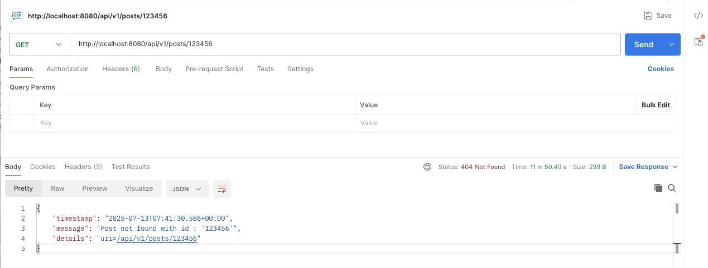
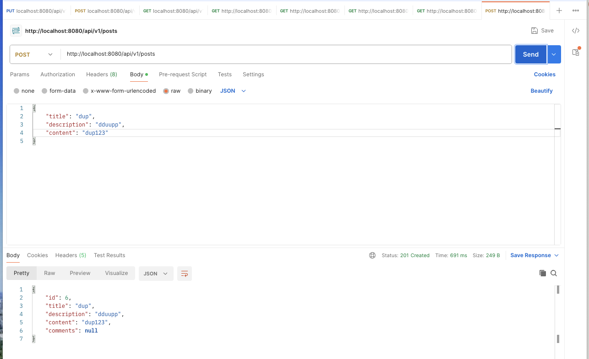
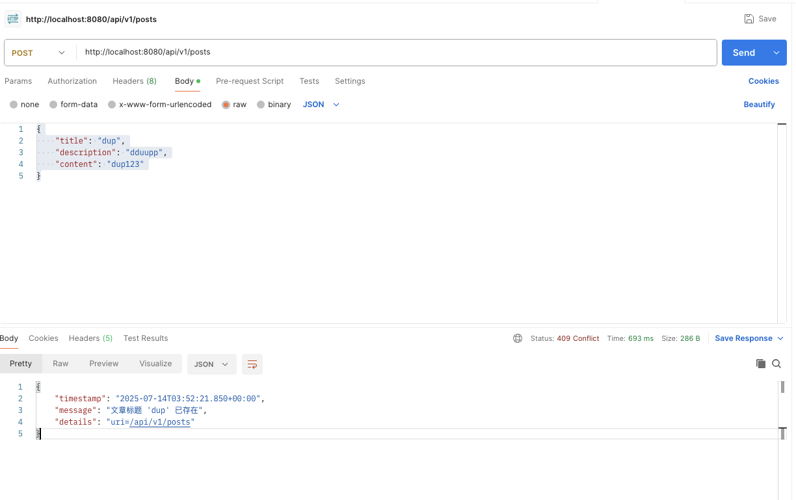
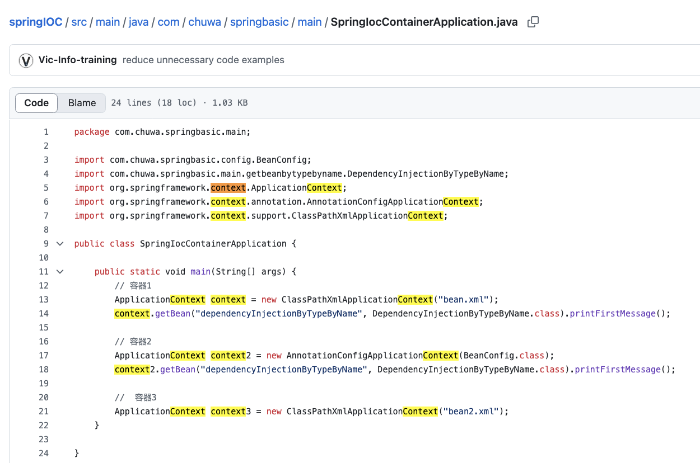
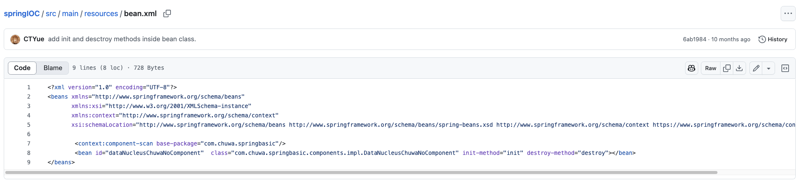
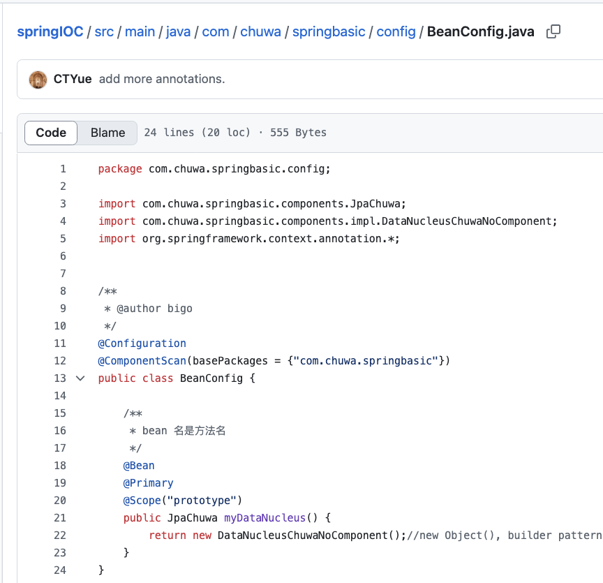
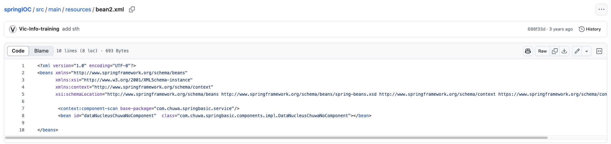

## HW11

### 2. Walk through sample codes under https://github.com/CTYue/springboot-redbook/commits/06_mapper-exception, you are supposed to bring up the application on your local.

I modified the application.properties file to set the server port to be 8080, and also configurated my own database.  
Then I test three Exception Handlers in GlobalExceptionHandler class. Here is one example of them:  

Testing handleResourceNotFoundException:   
I sent the GET request to http://localhost:8080/api/v1/posts/123456, which has an id number, 123456, that not been added.  
Then, according to ResourceNotFoundException class, the error message should be in this format: "%s not found with %s : '%s'", resourceName, fieldName, fieldValue.

Exception-throwing location: PostServiceImpl class:Post post = postRepository.findById(id).orElseThrow(() -> new ResourceNotFoundException("Post", "id", id));
Status: 404 Not Found: This is from GlobalExceptionHandler.java 'return new ResponseEntity<>(errorDetails, HttpStatus.NOT_FOUND);'
```java
    @ExceptionHandler(ResourceNotFoundException.class)
    public ResponseEntity<ErrorDetails> handleResourceNotFoundException(ResourceNotFoundException exception,
                                                                        WebRequest webRequest) {
        ErrorDetails errorDetails = new ErrorDetails(new Date(), exception.getMessage(),
                webRequest.getDescription(false));

        return new ResponseEntity<>(errorDetails, HttpStatus.NOT_FOUND);
    }
```
Postman shows me the error message which is just as I expected:


Then, in GlobalExceptionHandler.java, when handling a ResourceNotFoundException, it aggregates and enriches the exception’s details and then returns a ResponseEntity to the Controller layer.  
The Controller in turn forwards that ResponseEntity back to the front-end client (e.g. Postman, browser, etc.).


### 3. Explain why do we need model mappers in Spring, and in what scenarios we need it.
Function of model mappers in Spring: In Spring, Model Mapper can automatically do conversions between Entities and DTOs, streamlines mapping logic, eliminates boilerplate code, and controls which fields are exposed.

Scenarios:  
- DTO → Entity: automatically mapping incoming DTOs into JPA/domain entities for create/update operations.  
- Entity → DTO: converting persisted entities into DTOs for REST responses, hiding sensitive fields and avoiding lazy‐loading issues.


### 4. Provide 3 examples in which model mapper will NOT map successfully, explain why.
1. Mismatched property names: Model Mapper matches by convention (field/getter names). Since firstName ≠ givenName, nothing gets copied unless you add an explicit mapping rule.  
```java
class UserEntity { private String firstName; /*…*/ }
class UserDTO    { private String givenName; /*…*/ }
```

2. Incompatible types without a converter: A String→LocalDate conversion isn’t built in. Without registering a Converter<String, LocalDate>, the mapper can’t know how to turn that string into a date object.  
```java
class OrderEntity { private String orderDate; /* e.g. "2025-07-13" */ }
class OrderDTO    { private LocalDate orderDate; }
```

3. No accessible setter / immutable target: Model Mapper instantiates the target class then calls its setters. If there’s no no-arg constructor or no public setter for street, it has **nowhere to write** the value, so mapping silently skips it (or throws, depending on configuration).  
```java
class AddressDTO {
  private final String street;
  public AddressDTO(String street) { this.street = street; }
  // no setStreet(...) method
}

```


### 5. Explain how model mapper cast different data types between source object and target class.
When ModelMapper encounters a source property whose type Source doesn’t exactly match the destination property type Destination, it follows this process:

1. Enter the conversion phase  
Once a getter→setter pair has been matched by name and configuration, ModelMapper checks whether the getter’s return type (S) differs from the setter’s parameter type (D). If so, it proceeds to convert.

2. Look up the Converter registry  
Internally, ModelMapper checks its ConverterRegistry for a converter registered to handle an (S → D) conversion (or a more generic GenericConverter).

3. Apply a built-in converter if available
Out of the box, ModelMapper provides converters for common type pairs:
- Identity (same type)  
- Primitives ↔ wrappers (int↔Integer)
- Numbers ↔ Numbers (Double↔Long)  
- String ↔ Enum
- String ↔ Number  
- Date ↔ String  
- Arrays ↔ Iterables    
If no built-in converter handles (S→D), mapping either skips that property or throws (based on your configuration).

4. Perform the conversion and invoke the setter
Once a converter is found, ModelMapper does:
   (In below, MappingContext carries the source value, source and destination types, property metadata, etc.)
```java
Object converted = converter.convert(new MappingContext(sourceValue, …));
destinationSetter.invoke(targetObject, converted);
```

5. Extend with a custom converter(For step 2)
We can register our own converter to handle any (Source to Destination) pair in those 3 ways:
- Global registration  
```java
modelMapper.addConverter(myConverter);
```
- Property level  
```java
typeMap.addMappings(m -> m
  .using(myConverter)
  .map(src -> src.getFoo(), Dest::setBar));
```
- TypeMap level  
```java
typeMap.setConverter(myConverter);
```


### 6. Add your own API exceptions so that when something wrong happens in service layer, your rest API will return your customized response and status code.

Add my own API exceptions: DuplicateResourceException.  
changes and code in coding folder  
Test in postman:  
  


### 7. Explain how ControllerAdvices work, is there any other approach to do same/similar global API exception handling?
1. Component registration
   Spring’s component scan picks up any class annotated with @ControllerAdvice or @RestControllerAdvice  
and registers it as a global advice bean.
```java
@ControllerAdvice    // or @RestControllerAdvice
public class GlobalExceptionHandler { … }
```

2. Exception dispatch  
   Whenever a controller method (in any @Controller or @RestController) throws an exception, Spring MVC will:  
First look for an @ExceptionHandler in the same controller.  
If none matches, search all @ControllerAdvice beans for a matching @ExceptionHandler method.  

3. Handler matching  
   Spring matches the thrown exception’s type (or its superclass) against each @ExceptionHandler’s argument. The best match is invoked.  
    eg: `@ExceptionHandler(ResourceNotFoundException.class)`
4. Response generation  
An @ExceptionHandler method can return:  
- ResponseEntity<…> (status + body)  
- OR a domain object (with @ResponseBody / in @RestControllerAdvice)  
- OR a ModelAndView (for MVC views)

5. Defining and Handling Custom Exceptions(eg: ResourceNotFoundException, BlogAPIException in Redbook Project)  
   To make your global handler more expressive, define business-specific exception classes and then write dedicated handlers.


Summary:
1. Define custom exception classes (in the exceptions package)
In ResourceNotFoundException.java, BlogAPIException.java, etc., extend RuntimeException and include fields such as HTTP status and error message.

2. Register the global exception handler (GlobalExceptionHandler.java)
In a class annotated with @RestControllerAdvice (or @ControllerAdvice), Spring will automatically scan for and register it.

3. Add handler methods (also in GlobalExceptionHandler.java)
Write an @ExceptionHandler(YourException.class) method for each custom exception, returning a ResponseEntity<ErrorDetails>.
Add an @ExceptionHandler(Exception.class) method as a fallback.

4. Throw exceptions in your business code (in @RestController / @Service classes) `throw new ResourceNotFoundException("Post", "id", id);`


###### Alternative Global-Exception-Handling Approaches
1. Extend ResponseEntityExceptionHandler override its protected handlers for common MVC exceptions.   
2. Implement HandlerExceptionResolver interface for full control over exception→response mapping at the servlet level.  
3. Use Spring AOP (@Aspect) on controller methods to catch and handle exceptions.  
4. override /error handling by providing our own ErrorController bean.


### 8. What's the difference between throwing a regular exception and a customized API exception that will be eventually thrown to Controller Advice codes? Please provide screenshots to explain your findings.

1. Semantics & Intent
- Plain exception:(RuntimeException, IllegalArgumentException, etc.)  
No domain-specific meaning  
Handled only by the catch-all @ExceptionHandler(Exception.class)  
Always maps to the status coded in that generic handler (often 500)  

- Custom exception:  
Conveys specific error scenarios (not found, validation failure, business rule conflict)    
Matched by dedicated @ExceptionHandler(YourException.class) methods:  `@ExceptionHandler(ResourceNotFoundException.class)`  
Can carry its own HttpStatus or error code, so don’t need to inspect the message to decide between 404, 400, etc.  

2. HTTP Status Control
- Plain exception: Requires hard-coding the status in your generic handler  

- Custom exception: 
Can use @ResponseStatus or include a HttpStatus field. eg:`@ResponseStatus(HttpStatus.NOT_FOUND)`  
Controller advice will automatically read and return the correct status without extra if/instanceof logic


3. Error Payload & Metadata  
- Plain exception:  
Usually only a message and stack trace  
Cannot attach business-specific fields  

- Custom exception:  
Can include any fields you need (e.g. resourceName, fieldName, fieldValue, errorCode)  
ErrorDetails JSON can include precise business information to help clients diagnose  


4. Maintainability & Extensibility
- Plain exception:  
  All errors funnel into one “bucket”; as the API grows, the generic handler becomes cluttered with if (ex instanceof X) checks or duplicate logic  

- Custom exception:
New error scenario → new exception class + new @ExceptionHandler method  
Handlers remain small and focused; adding a new business error never requires touching the fallback logic


### 9. Write some regular expression to restrict the value of attributes that your Post or Comment can have. You may use https://regex101.com/ to construct and test/validate your regular expression.

```java
    // Title validation: Non-empty, length constraints, safe characters only
    @NotBlank(message = "Post title is required")
    @Size(min = 5, max = 150, message = "Title must be between 5 and 150 characters")
    @Pattern(regexp = "^[a-zA-Z0-9\\s.,'\"!?:;\\-_()]+$", 
             message = "Title contains invalid characters")
    @Column(name = "title", nullable = false, unique = true)
    private String title;
    
    // Content validation: Required, reasonable length limits
    @NotBlank(message = "Post content is required")
    @Size(min = 20, max = 10000, message = "Content must be between 20 and 10000 characters")
    @Column(name = "content", nullable = false, columnDefinition = "TEXT")
    private String content;
    
    // Author email validation
    @NotBlank(message = "Author email is required")
    @Email(message = "Please provide a valid email address")
    @Pattern(regexp = "^[a-zA-Z0-9._%+-]+@[a-zA-Z0-9.-]+\\.[a-zA-Z]{2,}$", 
             message = "Invalid email format")
    @Size(max = 100, message = "Email cannot exceed 100 characters")
    @Column(name = "author_email")
    private String authorEmail;
    
    // Phone number validation
    @Pattern(regexp = "^\\+?1?[-.\\s]?\\(?([0-9]{3})\\)?[-.\\s]?([0-9]{3})[-.\\s]?([0-9]{4})$", 
             message = "Invalid North American phone number format")
    @Column(name = "author_phone")
    private String authorPhone;
```

### 10. Explain Spring framework fundamental principles. And how can they help build business applications?

IoC & DI: The container manages object instantiation and wiring, so your business code focuses solely on core logic.  
AOP: It isolates cross-cutting concerns like logging and transactions from business code, enhancing maintainability via dynamic weaving.  
Layering: Clearly separated presentation, service, and persistence layers ensure high cohesion and loose coupling.  
Template Programming: Encapsulates boilerplate resource handling and exception translation so developers focus on business operations.  
Declarative Transactions: A single @Transactional annotation defines transaction boundaries without explicit begin/commit/rollback code.  
Abstraction over Technologies: Provides common interfaces that hide implementation details, enabling easy swapping of back-end technologies.  

### 11. Explain different types of dependency injection, explain their suitable use cases, and why field injection is not recommended in general. Please provide necessary code snippets and screenshots if possible.
3 types of dependency:
1. Constructor Injection:  
   The Spring container creates the OrderService bean by locating the constructor annotated with @Autowired and supplying a matching PaymentService bean as the parameter, guaranteeing that OrderService is fully initialized with its mandatory, immutable dependency.  
```java
@Component
public class OrderService {
    // The constructor parameter paymentService is just a local variable
    // if you don’t assign it to a member field, you won’t be able to access that reference once the constructor finishes.
    private final PaymentService paymentService;

    // Spring injects PaymentService via this constructor
    @Autowired
    public OrderService(PaymentService paymentService) {
        this.paymentService = paymentService;
    }

    public void placeOrder(Order order) {
        paymentService.charge(order);
    }
}

```

2. Setter Injection  
Spring first instantiates ReportGenerator via its no-arg constructor,  
and then calls the @Autowired setter method setDataSource(...), injecting a DataSource bean into the private field;  
if no bean is available, the field remains at its default, making this approach ideal for optional or configurable dependencies.  
```java
@Component
public class ReportGenerator {
    private DataSource dataSource;

    // Spring calls this setter to inject DataSource
    @Autowired
    public void setDataSource(DataSource dataSource) {
        this.dataSource = dataSource;
    }

    public Report generateReport() throws SQLException {
        try (Connection conn = dataSource.getConnection()) {
            // ... generate report ...
        }
        return new Report();
    }
}

```

3. Field Injection  
After instantiating the NotificationService bean, Spring uses reflection to set the @Autowired-annotated private field emailSender directly.  
Eliminating constructor or setter boilerplate but **hiding the injection point** and preventing the field from being final.  
Trade-off: often reserved for quick prototypes or legacy code.


```java
@Component
public class NotificationService {
    // Spring uses reflection to inject the EmailSender bean directly into this field
    @Autowired
    private EmailSender emailSender;

    public void notifyUser(String userId, String message) {
        emailSender.sendEmail(userId, message);
    }
}

```


###### Why field injection is not recommended in general？[ref](https://www.baeldung.com/java-spring-field-injection-cons#:~:text=Using%20the%20field%20injection%2C%20we%20are%20unable%20to%20create%20immutable,final%20fields%20using%20field%20injection.)
Hidden Dependencies: Injected fields don’t appear in the constructor or setter signatures, so reading the class API doesn’t reveal what it needs to function.

Broken Encapsulation: Spring uses reflection to write private fields directly, bypassing any public interface and weakening your class’s encapsulation.

Immutable Safety Lost: You can’t declare @Autowired fields as final, so your object’s required collaborators aren’t guaranteed to be set at construction time.

Testing Difficulties: To inject mocks you must either start a Spring context or use reflection in your tests—unit testing becomes more cumbersome compared to constructor or setter injection.

Runtime Failures: Missing or misconfigured dependencies only surface at runtime (when Spring fails to inject), instead of being caught by the compiler as they would with constructor injection.

### 12. Explain different types of application context in Spring framework, with screenshots. You may take https:// github.com/CTYue/springIOC for reference.
  
1. ClassPathXmlApplicationContext -- Pure XML Configuration  
   
   Uses ClassPathXmlApplicationContext to load all <bean> definitions from bean.xml and completes injection via <property> tags for setter injection or <constructor-arg> tags for constructor injection.    
   

2. AnnotationConfigApplicationContext -- Java-Config (Annotation-Based)  

   Uses AnnotationConfigApplicationContext to read @Configuration classes (with @Bean methods and @ComponentScan), and performs type-safe injection through @Bean method parameters or via @Autowired on constructors, setters, or fields.  
   


3. ClassPathXmlApplicationContext -- XML with Annotation Scanning  
   ClassPathXmlApplicationContext("bean2.xml")  

   Uses ClassPathXmlApplicationContext to load bean2.xml containing <context:component-scan> and <context:annotation-config>, automatically detects @Component-annotated classes, and injects dependencies via @Autowired on fields, setters, or constructors.    
   

   

### 13. Compare @Component and @Bean and in which scenario they should be used.  

@Component is a **class**-level stereotype that lets Spring’s component scan automatically detect and register your own beans, ideal for application-owned components.  

@Bean is a **method**-level declaration inside a @Configuration class that manually constructs and registers beans—perfect for **third-party classes or beans** requiring custom setup.  
With a @Bean factory method, we can write arbitrary Java code in any Spring-managed **component class**.   
**Calling parameterized constructors, encapsulating multi-step initialization logic, using conditional statements, catching exceptions, or even creating multiple instances in a loop to produce and register beans.**


```java
@Configuration
public class AppConfig {

    // 1. Third-party library bean (no @Component on its class)
    @Bean
    public ObjectMapper objectMapper() {
        // Jackson’s ObjectMapper isn’t annotated with @Component,
        // so we register and customize it manually.
        return new ObjectMapper()
            .registerModule(new JavaTimeModule())
            .disable(SerializationFeature.WRITE_DATES_AS_TIMESTAMPS);
    }

    // 2. Bean requiring complex construction logic
    @Bean
    public RestTemplate restTemplate() {
        // Suppose we need a RestTemplate with custom timeouts and interceptors.
        HttpClient httpClient = HttpClient.create()
            .option(ChannelOption.CONNECT_TIMEOUT_MILLIS, 5000)
            .responseTimeout(Duration.ofSeconds(3));

        ClientHttpConnector connector = new ReactorClientHttpConnector(httpClient);
        RestTemplate tpl = new RestTemplate(new HttpComponentsClientHttpRequestFactory());
        tpl.setRequestFactory(connector);
        tpl.setErrorHandler(new MyCustomErrorHandler());
        return tpl;
    }
}

```

### 14. Explain Spring bean scopes and how to pick the correct bean scope.
In Spring, a bean’s **scope** defines **when** the bean instance is created in the container, **how long** it lives, and **which requests or sessions** can see it:

- Singleton  
  Only one shared instance exists per `ApplicationContext`; every injection or lookup returns the same object.

- Prototype  
  A new instance is created each time the bean is requested or injected; its lifecycle ends immediately after injection or retrieval.  
  Whenever we call getBean() or inject a prototype-scoped bean, the Spring container creates a brand-new instance, performs dependency injection and any initialization callbacks;  
  once that is done, the instance is no longer managed by the container—the container neither holds a reference to it nor invokes any destruction callbacks. In other words, the container only “builds” and “wires” the bean, and thereafter its usage and cleanup are entirely the caller’s responsibility.
- Request *(Web only)*  
  A new bean instance is created for each HTTP request and destroyed when the request completes.

- Session *(Web only)*  
  One bean instance is maintained per user session and destroyed when that session ends.

- Application *(Web only)*  
  A single instance is shared across the entire `ServletContext`, similar to singleton but limited to the current web application.

- WebSocket  
  One bean instance is created per WebSocket session, living for the duration of that connection.

By choosing the appropriate scope, you control a bean’s **number of instances**, **lifecycle**, and **visibility**, enabling support for stateless services, per-operation objects, per-request data, or session-specific state as needed.


### 15. Explain the difference between bean id and bean class.

```xml
<bean id="userService" class="com.example.UserServiceImpl"/>
```
id="userService" is how other beans or your code will refer to it.  
class="com.example.UserServiceImpl" is the concrete class Spring instantiates.  

In general:
A bean id is the unique identifier you assign to a bean definition in the Spring container. The handle you use to look up or reference that bean (for wiring, getBean(...), or as a dependency).

A bean class is the actual Java type that Spring will instantiate for that bean.  


### 16. Explain that when a bean has multiple alternative implementations, how will Spring decide which bean implementation to inject/autowire?

1. **Type Matching**: First, find all candidate beans whose types match the injection point (field or constructor parameter).
2. **@Primary**: If one of those candidates is annotated with `@Primary`, inject it.
3. **Name Matching**: If there is no `@Primary`, compare the injection point’s name (field name or method parameter name) with each candidate’s bean ID or alias; the matching one is injected.
4. **@Qualifier / @Resource**: At the injection point, use `@Qualifier("beanName")` or JSR-250’s `@Resource(name="beanName")` to explicitly select which bean to inject.
5. **Exception**: If none of the above yields a unique bean, Spring throws `NoUniqueBeanDefinitionException`, indicating multiple matches with no clear choice.

###### Spring’s Resolution Process for Multiple Implementations

Assume we have two beans implementing `DiscountService`:

```markdown
@Component("percentageDiscountService")
public class PercentageDiscountService implements DiscountService { … }

@Component("fixedDiscountService")
@Primary
public class FixedDiscountService implements DiscountService { … }
```

Step 1. Type Matching: Spring finds two candidates (percentageDiscountService, fixedDiscountService) by type and cannot yet choose one.    
```java
@Component
public class TypeMatchService {
    @Autowired
    private DiscountService discountService;
}

```

Step 2. @Primary: With @Primary on FixedDiscountService, Spring injects FixedDiscountService here.      
```java 
@Component
public class BillingService {
    @Autowired
    private DiscountService discountService;
}

```

Step 3. Name Matching: Remove @Primary from both beans.  
No @Primary, so Spring compares the field name fixedDiscountService to bean IDs and injects FixedDiscountService.    
```java
@Component("percentageDiscountService")
public class PercentageDiscountService implements DiscountService { … }

@Component("fixedDiscountService")
public class FixedDiscountService implements DiscountService { … }

```
```java
@Component
public class BillingServiceByNameMatch {
    @Autowired
    private DiscountService fixedDiscountService;
}

```

Step 4. @Qualifier / @Resource:  @Qualifier forces Spring to inject PercentageDiscountService, ignoring any @Primary.  
```java
@Component
public class SpecialBillingService {
    @Autowired
    @Qualifier("percentageDiscountService")
    private DiscountService discountService;
}

```

Step 5. Exception: No @Primary, field name discountService matches neither ID, and no @Qualifier is given, so Spring throws:  
```java
@Component
public class AmbiguousService {
    @Autowired
    private DiscountService discountService;
}

```


```java
```