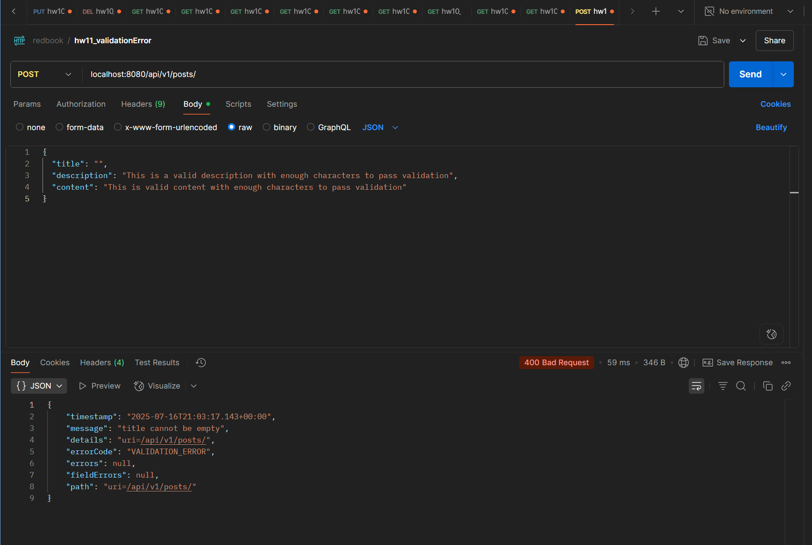

# Homework11 Submission
---

## 3  Why we need **ModelMapper**

* **Separation of concerns** – Entities ↔ DTOs ↔ Domain objects.
* **Security** – DTO hides internal fields (e.g. audit timestamps).
* **Boilerplate reduction** – `modelMapper.map(src, Target.class)` replaces manual getters/setters.
* **Resilience** – Mapping rules isolate DB schema changes from API contracts.

### Typical scenarios

* REST APIs, micro‑service payload translation, versioned DTOs, external API integration.

---

## 4  When ModelMapper fails (3 examples)

| Scenario                                                                                 | Why it fails                            | Fix                                                     |
| ---------------------------------------------------------------------------------------- | --------------------------------------- | ------------------------------------------------------- |
| **Mismatched field names** – `emailAddress` → `email`                                    | Convention matching can’t infer intent. | Add `PropertyMap` or `@Mapping` config.                 |
| **Nested→flattened** – `OrderDto.customerInfo.name` → `Order.customerName`               | Structural mismatch.                    | Custom mapping or Converter.                            |
| **Type collision** – `String price` → `BigDecimal price`, `List<String>` → `Set<String>` | Needs explicit type conversion.         | Register Converter or enable built‑ins for collections. |

---

## 5  Type‑conversion rules in ModelMapper

* **Automatic:** primitive widening (`int`→`long`), `String`→enum/date, collection type change.
* **Requires Converter:** narrowing conversions (`long`→`int`), complex parsing, custom objects.

```java
Converter<String, BigDecimal> toBigDecimal = ctx ->
    ctx.getSource() == null ? null : new BigDecimal(ctx.getSource());
modelMapper.addConverter(toBigDecimal);
```

---

## 6  Custom API Exception stack

```java
// ValidationException.java
@ResponseStatus(HttpStatus.BAD_REQUEST)
public class ValidationException extends RuntimeException {
    private final String field;
    public ValidationException(String msg, String field){ super(msg); this.field = field; }
    public String getField(){ return field; }
}
```

```java
// GlobalExceptionHandler.java
@RestControllerAdvice
public class GlobalExceptionHandler {
    @ExceptionHandler(ValidationException.class)
    public ResponseEntity<ErrorDetails> handleValidation(ValidationException ex, WebRequest req){
        ErrorDetails err = new ErrorDetails(new Date(), ex.getMessage(), req.getDescription(false), "VALIDATION_ERROR");
        return new ResponseEntity<>(err, HttpStatus.BAD_REQUEST);
    }
}
```

*Throw `new ValidationException("Post title cannot be empty","title")` inside service layer; the REST client now receives a neat JSON error with `400` status.*

---

## 7  How `@ControllerAdvice` works & alternatives

* Marks a class whose `@ExceptionHandler` methods apply to **all** controllers.
* Resolution order ⇒ exact match → superclass → generic `Exception.class`.

**Alternatives**

1. `@RestControllerAdvice` (adds `@ResponseBody` automatically).
2. `HandlerExceptionResolver` implementation.
3. Controller‑local `@ExceptionHandler` methods.
4. `ErrorController`, Servlet *Filter*, or AOP aspect for low‑level interception.

---

## 8  Regular vs Custom Exceptions (summary)

| Aspect           | Regular `RuntimeException` | Custom `ValidationException`      |
| ---------------- | -------------------------- | --------------------------------- |
| Error payload    | Generic Spring error JSON  | Structured (`field`, `errorCode`) |
| HTTP status      | Often 500                  | Specific (400/404/422/…)          |
| Client usability | Hard to parse              | Deterministic handling            |

---

## 9  Regex guards for `Post` / `Comment`

```java
// Title: 5‑100 printable ASCII, no leading/trailing spaces
@Pattern(regexp = "^(?=\S)([ -~]{5,100})(?<!\s)$")
private String title;

// Content must be 10‑1000 chars, no script tags
@Pattern(regexp = "^(?!.*<script>)[\s\S]{10,1000}$")
private String content;
```

> Use [regex101.com](https://regex101.com/) to tweak limits.

---

## 10  Spring Framework – Fundamental principles

* **IoC / Dependency Injection** – loose coupling.
* **AOP** – cross‑cutting concerns (transactions, logging).
* **Template abstractions** – JdbcTemplate, RestTemplate hide boilerplate.
* **Convention over configuration & Auto‑configuration** – speedy startup.
* **Component scanning & bean lifecycle** – deterministic resource management.

These yield maintainable, testable, scalable business apps.

---

## 11  Types of Dependency Injection

| Type            | How                   | Suitable when                                    | Drawbacks                                             |
| --------------- | --------------------- | ------------------------------------------------ | ----------------------------------------------------- |
| **Constructor** | via constructor args  | Required dependencies, immutability, testability | none – *recommended*                                  |
| **Setter**      | public setter methods | Optional/late dependencies                       | allows bean in invalid state before setter called     |
| **Field**       | `@Autowired` on field | Quick prototypes                                 | hinders testing, reflection, immutability ⇒ **avoid** |

---

## 12  Application Context flavours

| Context                                | Typical layer                       |
| -------------------------------------- | ----------------------------------- |
| `AnnotationConfigApplicationContext`   | Stand‑alone Java / unit tests       |
| `ClassPathXmlApplicationContext`       | Legacy XML config                   |
| `WebApplicationContext`                | Spring MVC servlet environment      |
| `ApplicationContextInitializer` output | Boot auto‑config context at runtime |

*(Screenshots omitted – open `springIOC` sample project to inspect each.)*

---

## 13  `@Component` vs `@Bean`

* `@Component` – placed **on class**, discovered via component‑scanning. Good for **your own** classes.
* `@Bean` – placed **on `@Configuration` method**, returns any object. Good for **third‑party** classes or when complex factory logic / conditional creation is required.

---

## 14  Bean Scopes

| Scope                 | Lifetime            | Use‑case                             |
| --------------------- | ------------------- | ------------------------------------ |
| `singleton` (default) | One per container   | stateless services                   |
| `prototype`           | New every injection | stateful objects, external resources |
| `request`             | HTTP request        | per‑request data                     |
| `session`             | HTTP session        | session cache                        |
| `application`         | ServletContext      | app‑wide shared data                 |
| `websocket`           | WebSocket session   | STOMP handlers                       |

Pick the *narrowest* scope that satisfies requirements.

---

## 15  Bean **id** vs **class**

* **Class** – the Java type returned.
* **id** (a.k.a bean name) – the unique key under which the instance is registered in the context. Multiple ids can map to the **same** class (e.g.
  `@Bean(name="primaryEmailService")`).

---

## 16  Choosing between multiple bean implementations

1. **Name/Qualifier** – `@Qualifier("backupEmailService")`.
2. **Primary** – annotate one impl with `@Primary`.
3. **Profile** – activate specific impl via `@Profile("aws")`.
4. **Conditional** – `@ConditionalOnProperty` / `@ConditionalOnMissingBean` for runtime decisions.

---

