For all following coding questions, please provide code snippets in your markdown submission file, AND take
screenshots, AND submit an executable Spring project which contains your code (this project can be a clone of
Springboot-Redbook, as long as it has your own code.).

# 1. Add newly learned annotations to your previous cheatsheet, add explainations for these annotations.
## Spring Bean Annotations:

The bean.xml file  is a Spring configuration file that serves several important purposes:

1. **Bean Definition and Configuration:** This XML file defines Spring beans (Java objects managed by the Spring IoC container). In your file, there's a bean defined with id "dataNucleusChuwaNoComponent" and class "com.chuwa.springbasic.components.impl.DataNucleusChuwaNoComponent".

2. **Lifecycle Management:** The bean definition includes lifecycle callbacks:

- init-method="init": Specifies a method to be called after the bean is instantiated
- destroy-method="destroy": Specifies a method to be called when the bean is being destroyed
3. **Component Scanning:** The `<context:component-scan>` element tells Spring to scan the package "com.chuwa.springbasic" and its sub-packages for components annotated with stereotypes like @Component, @Service, @Repository, and @Controller.

4. **XML Schema Definitions:** The file includes XML namespace declarations and schema locations that define the structure and validation rules for the Spring configuration elements.

This configuration approach is part of Spring's Dependency Injection mechanism, allowing you to externalize the configuration of application components and their dependencies outside of your Java code. When a Spring application starts, it reads this XML file to understand which objects to create, how to configure them, and how to wire them together.

While modern Spring applications often use Java-based configuration with annotations, XML configuration like this is still used, especially in legacy applications or when explicit external configuration is preferred.


Java-based configuration with annotations is a modern approach to configuring Spring applications that reduces or eliminates the need for XML configuration files like bean.xml. Let me explain this approach in more detail:

**Java-based Configuration with Annotations**
Java-based configuration uses Java classes and annotations instead of XML to define beans and configure the Spring application context. Here's how it works:

**Core Components:**
### 1. **@Configuration Classes** 
These are Java classes annotated with @Configuration that serve as a replacement for XML configuration files.

```java
@Configuration
public class AppConfig {
    // Bean definitions go here
}
```
### 2. **@Bean Methods** 
Methods within @Configuration classes that are annotated with @Bean define beans to be managed by Spring.

```java
@Configuration
public class AppConfig {
    @Bean
    public DataNucleusChuwaNoComponent dataNucleusComponent() {
        return new DataNucleusChuwaNoComponent();
    }
    
    @Bean(initMethod = "init", destroyMethod = "destroy")
    public DataNucleusChuwaNoComponent dataNucleusComponentWithLifecycle() {
        return new DataNucleusChuwaNoComponent();
    }
}
```
### 3. **Component Scanning** 
@ComponentScan replaces the XML <context:component-scan> element:

```java
@Configuration
@ComponentScan(basePackages = "com.chuwa.springbasic")
public class AppConfig {
    // Configuration code
}
```

### 4. **Stereotype Annotations** 
Classes can be automatically registered as beans using annotations like:

- @Component: Generic component
- @Service: Business service layer
- @Repository: Data access layer
- @Controller: Web controller
- @RestController: REST API controller

### 5. **Dependency Injection Annotations**

- @Autowired: Injects dependencies
- @Qualifier: Specifies which bean to inject when multiple candidates exist
- @Value: Injects property values

### 6. **Lifecycle Annotations**

- @PostConstruct: Method to call after bean initialization
- @PreDestroy: Method to call before bean destruction

### Example 1
For your specific DataNucleusChuwaNoComponent class, the Java-based configuration equivalent to your XML would be:

```java
@Configuration
@ComponentScan(basePackages = "com.chuwa.springbasic")
public class AppConfig {
    
    @Bean(name = "myName", initMethod = "init", destroyMethod = "destroy")
    @Primary
    public JpaChuwa dataNucleusChuwaNoComponent() {
        return new DataNucleusChuwaNoComponent();
    }
}
```
```java
import com.chuwa.springbasic.components.JpaChuwa;
import org.springframework.beans.factory.annotation.Autowired;
import org.springframework.beans.factory.annotation.Qualifier;
import org.springframework.stereotype.Component;

@Component
public class DependencyInjectionByTypeByName {

//    Doesn't work because [myName] must be a valid Java class or interface
//    @Autowired
//    private myName byType;
    
	@Autowired
    private JpaChuwa myName;
    
    @Autowired
    @Qualifier("myName")
    private JpaChuwa jpaChuwaQualifier;
}
```

### Example 2
#### XML approach:

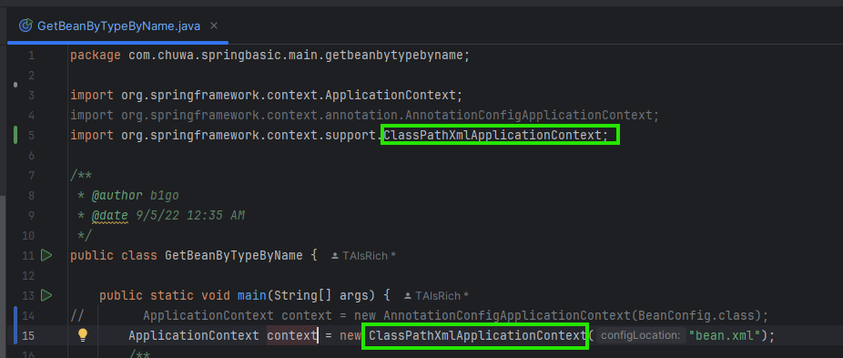
`@Component` class:
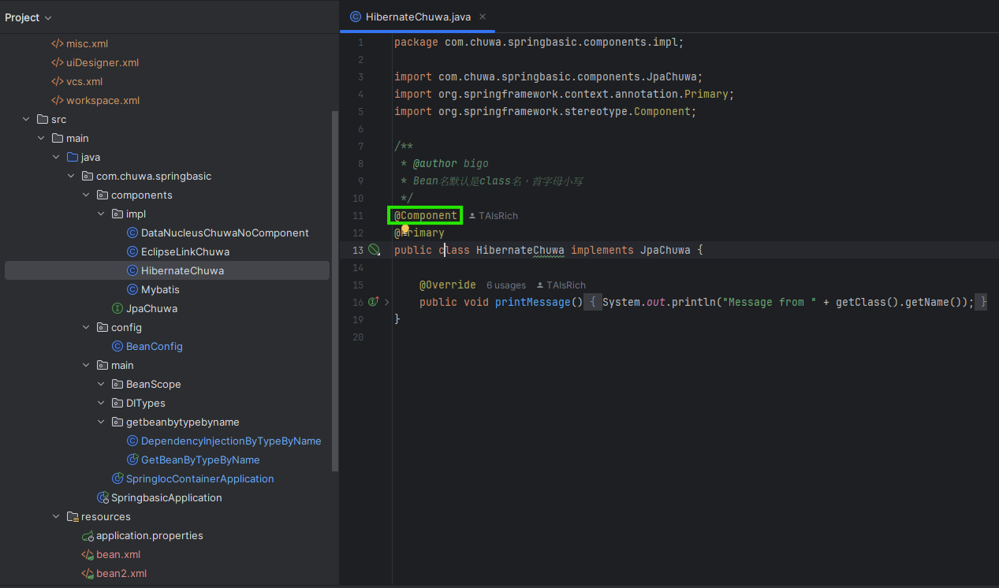
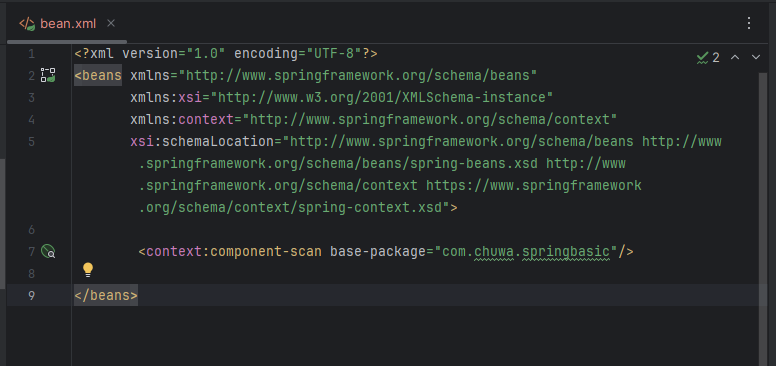
no `@Component` on class:
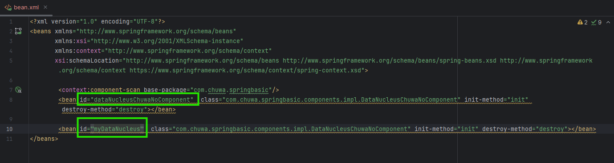

#### Annotation approach:

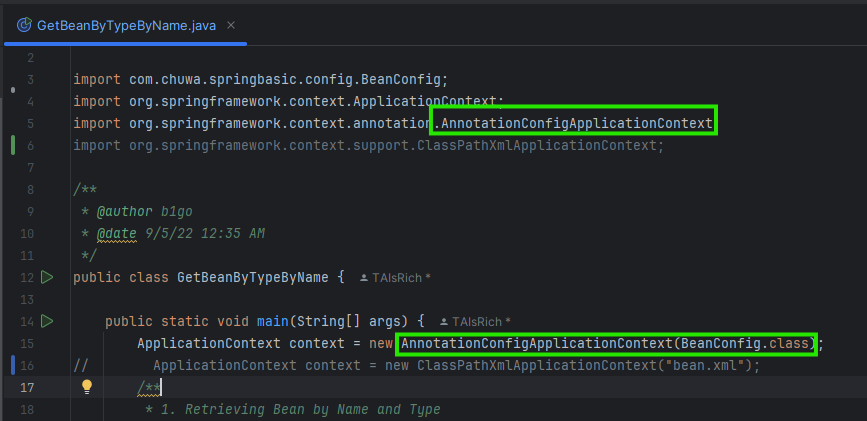
`@Component` class:

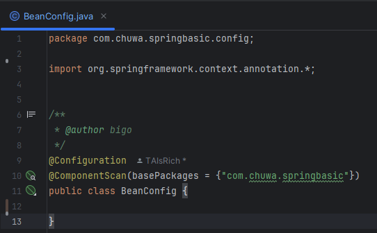
no `@Component` on class:
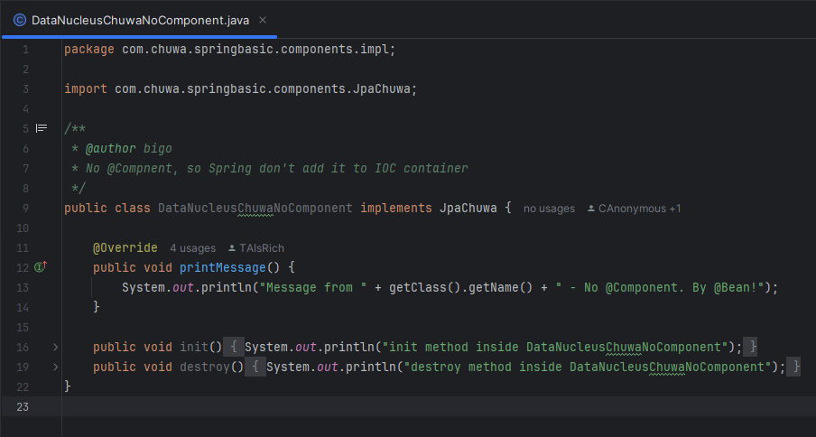
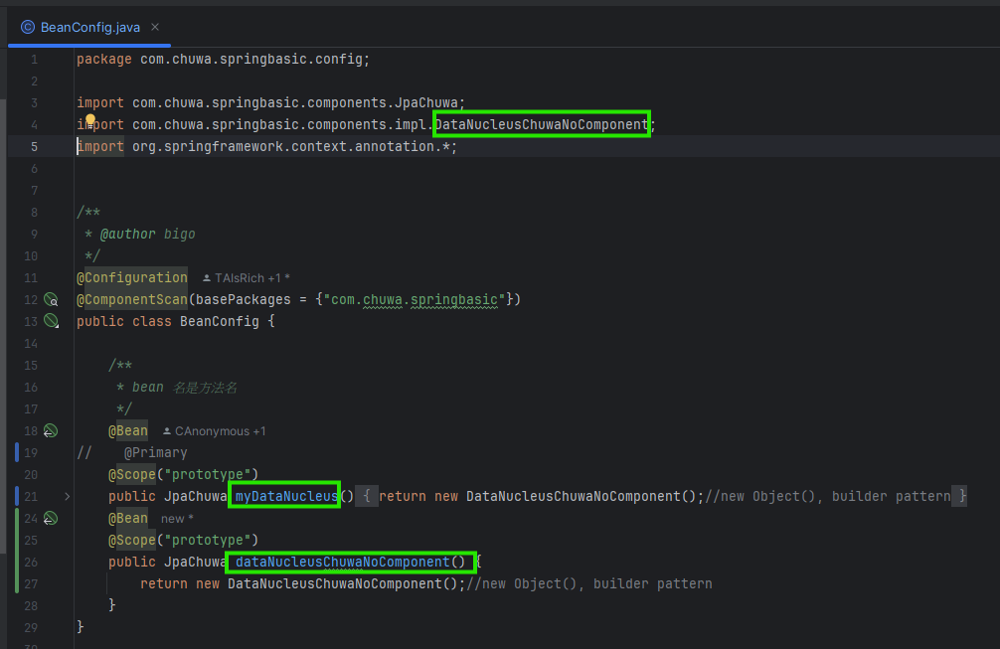


**Advantages of Java-based Configuration:**

1. Type safety - Compile-time checking catches errors earlier
2. Better refactoring support - IDE tools work better with Java code than XML
3. Improved testability - Easier to unit test configuration
4. More powerful - Full power of Java language for configuring beans
5. Centralized configuration - Configuration logic in Java classes instead of scattered XML files
Most modern Spring applications use a mix of annotation-based configuration and minimal XML, or eliminate XML entirely in favor of Java configuration. Spring Boot, which builds on top of Spring, takes this approach even further with convention-over-configuration and auto-configuration capabilities.


## Annotations on input validattion
### Javax
#### @NotEmpty
#### @Size
#### @Pattern

```java
import javax.validation.constraints.NotEmpty;
import javax.validation.constraints.Pattern;
import javax.validation.constraints.Size;

public class PostDto {
    private Long id;
    @NotEmpty
    @Size(min = 10, message = "Post description should have at least 10 characters")
    private String description;

    @NotEmpty
    @Pattern(
            regexp = "^(?=.*[0-9])(?=.*[a-z])(?=.*[A-Z])(?=.*[!@#$%^&+=])(?=\\S+$).{8,}$",
            message = "Password must contain at least one digit, one lowercase letter, one uppercase letter, one special character, and be at least 8 characters long"
    )
}
```
#### @Valid
```java
@RestController
@RequestMapping("/api/v1/posts")
public class PostController {

    @Autowired
    private PostService postService;

    @PostMapping()
    public ResponseEntity<PostDto> createPost(@Valid @RequestBody PostDto postDto) {
        PostDto postResponse = postService.createPost(postDto);
        return new ResponseEntity<>(postResponse, HttpStatus.CREATED);
    }
}
```
#### @ControllerAdvice
```java
@ControllerAdvice
public class GlobalExceptionHandler extends ResponseEntityExceptionHandler {

    /**
     * Validation,
     * if invalid, then throw back exceptions/errors
     * 1. payload -> Rule
     * 2. @Valid -> where apply Rule, if, invalid, throw exception
     * 3. global exception -> accept and handle
     */
    @Override
    protected ResponseEntity<Object> handleMethodArgumentNotValid(MethodArgumentNotValidException ex,
                                                                  HttpHeaders headers,
                                                                  HttpStatus status,
                                                                  WebRequest request) {
        Map<String, String> errors = new HashMap<>();
        ex.getBindingResult().getAllErrors().forEach((error) -> {
            String fieldName = ((FieldError) error).getField();
            String message = error.getDefaultMessage();
            errors.put(fieldName, message);
        });
        return new ResponseEntity<>(errors, HttpStatus.BAD_REQUEST);
    }
}
```


### jakarta
In Spring Boot, **input validation** for controller methods is typically done using **Java Bean Validation (JSR-380)** annotations from the `javax.validation` or `jakarta.validation` package.  
These annotations ensure that incoming request data (usually in DTOs) meets defined constraints **before reaching your business logic**.

---


#### **DTO (Data Transfer Object)**
##### @NotBlank
```java
import jakarta.validation.constraints.*;

public class PostDTO {

    @NotBlank(message = "Title cannot be blank")
    @Size(max = 100, message = "Title cannot exceed 100 characters")
    private String title;

    @Pattern(regexp = "^[a-zA-Z0-9 .,!?-]{10,500}$", 
             message = "Content must be 10–500 characters, only letters, digits, and punctuation allowed")
    private String content;

    @Positive(message = "User ID must be positive")
    private Long userId;

    // getters and setters
}
```

#### **Controller**
##### @Validated
```java
import org.springframework.web.bind.annotation.*;
import org.springframework.validation.annotation.Validated;
import org.springframework.http.ResponseEntity;

@RestController
@RequestMapping("/api/posts")
public class PostController {

    @PostMapping
    public ResponseEntity<String> createPost(@Validated @RequestBody PostDTO postDTO) {
        return ResponseEntity.ok("Post created successfully!");
    }
}
```

If a request fails validation, Spring automatically throws a `MethodArgumentNotValidException`, which can be handled globally using your `@ControllerAdvice`.

---

### 🧠 **2\. How It Works**

-   When you annotate a DTO with `@Validated` or `@Valid`, Spring Boot:
    
    1.  Checks incoming request JSON against all validation annotations.
        
    2.  If any field fails, it **stops the request** before calling the controller method.
        
    3.  A default 400 Bad Request is returned with details about which field failed.
        


# 2. Walkthrough sample codes under https://github.com/CTYue/springboot-redbook/commits/06_mapper-exception, you are supposed to bring up the application on your local.
# 3. Explain why do we need model mappers in Spring, and in what scanrios we need it.

A:
#### **Purpose of Model Mapper**

A **ModelMapper** is a library used in Spring Boot to automatically map data between **objects** — typically between **DTOs (Data Transfer Objects)** and **Entities (JPA objects)**. 
It reduces the need for writing repetitive and error-prone manual getter/setter code.

#### **Why we need it**

-   **Simplifies object conversions**: When transferring data between layers (Controller ↔ Service ↔ Repository), different object representations are used (e.g., `UserEntity` vs. `UserDTO`).
    
-   **Ensures clean architecture**: Keeps domain models isolated from API or database representations.
    
-   **Reduces boilerplate**: No need for manual field-by-field assignments.
    
-   **Improves maintainability**: When models evolve, fewer changes are needed in mapping logic.

#### **Typical Scenarios**

1.  **DTO ↔ Entity mapping**
    
    -   Example: converting a `PostDTO` received from a REST API into a `PostEntity` before saving to DB.
        
    
    ```java
    Post post = modelMapper.map(postDto, Post.class);
    ```
    
2.  **Entity ↔ DTO mapping**
    
    -   When returning data from database entities to the frontend without exposing internal fields.
        
    
    ```java
    PostDto response = modelMapper.map(post, PostDto.class);
    ```
    
3.  **Complex nested object transformation**
    
    -   For example, when an entity contains nested relationships (`User` contains `Address`), ModelMapper can handle deep mappings with minimal configuration.
        

# 4. Provide 3 examples in which model mapper will NOT map succesfully, explain why.

A:
| **Case** | **Example** | **Why Mapping Fails** |
| --- | --- | --- |
| **1\. Field names don’t match** | `UserDTO { private String firstName; }` vs. `UserEntity { private String fname; }` | ModelMapper relies on matching field names by default. Mismatched names cause `fname` to stay `null`. |
| **2\. Type mismatch without converter** | `PostDTO { private String id; }` vs. `PostEntity { private Long id; }` | ModelMapper cannot implicitly convert incompatible data types (String → Long) unless a custom converter is defined. |
| **3\. Nested property not initialized** | `OrderDTO { private CustomerDTO customer; }` vs. `OrderEntity { private CustomerEntity customer; }` but `customer` is `null` | When a nested source object is `null`, ModelMapper won’t initialize and map its fields unless explicitly configured. |

#### **Other common mapping issues**

-   Collections (`List`, `Set`) where the element types differ.
    
-   Mapping to immutable target objects (no default constructor).
    
-   Ambiguous property paths or circular references.
    

# 5. Explain how model mapper cast different data types between source object and target class.

A:
#### **Automatic Type Conversion**

ModelMapper performs **automatic type conversion** for **compatible and standard Java types** using its **Converter** and **PropertyMap** mechanisms.

Example conversions that **work automatically**:

-   `int` ↔ `Integer`
    
-   `double` ↔ `BigDecimal`
    
-   `Date` ↔ `String` (if format is ISO standard)
    
-   `Enum` ↔ `String` (based on `Enum.name()`)
    

```java
UserDTO dto = new UserDTO();
dto.setAge("25");

User user = modelMapper.map(dto, User.class); // age becomes int 25
```

#### **Custom Converters**

For **non-standard** conversions (e.g., `String → LocalDate`), you must define a custom converter:

```java
ModelMapper modelMapper = new ModelMapper();
Converter<String, LocalDate> toLocalDate = ctx ->
    ctx.getSource() == null ? null : LocalDate.parse(ctx.getSource());

modelMapper.addConverter(toLocalDate);
```

#### **Property Mapping**

When source and target differ structurally, you can define a `PropertyMap`:

```java
modelMapper.addMappings(new PropertyMap<UserDTO, User>() {
    @Override
    protected void configure() {
        map().setFullName(source.getFirstName() + " " + source.getLastName());
    }
});
```

---

✅ **Summary Table**

| Feature | Automatic | Custom Required |
| --- | --- | --- |
| Primitive ↔ Wrapper | ✅ | ❌ |
| String ↔ Number | ⚠️ sometimes | ✅ often |
| String ↔ Enum | ✅ | ❌ |
| String ↔ LocalDate | ❌ | ✅ |
| Complex / Nested object | ❌ | ✅ |

# 6. Add your own API exceptions so that when something wrong happens in service layer, your rest API will return your customized response and status code.

I added an Exception to check if the newly created post have duplicated title with existing posts.

Here is the posts in the database:
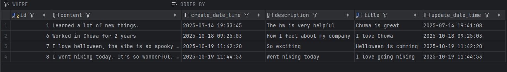

If we add post with title 'Helloween is comming' which conflicts with existing post:
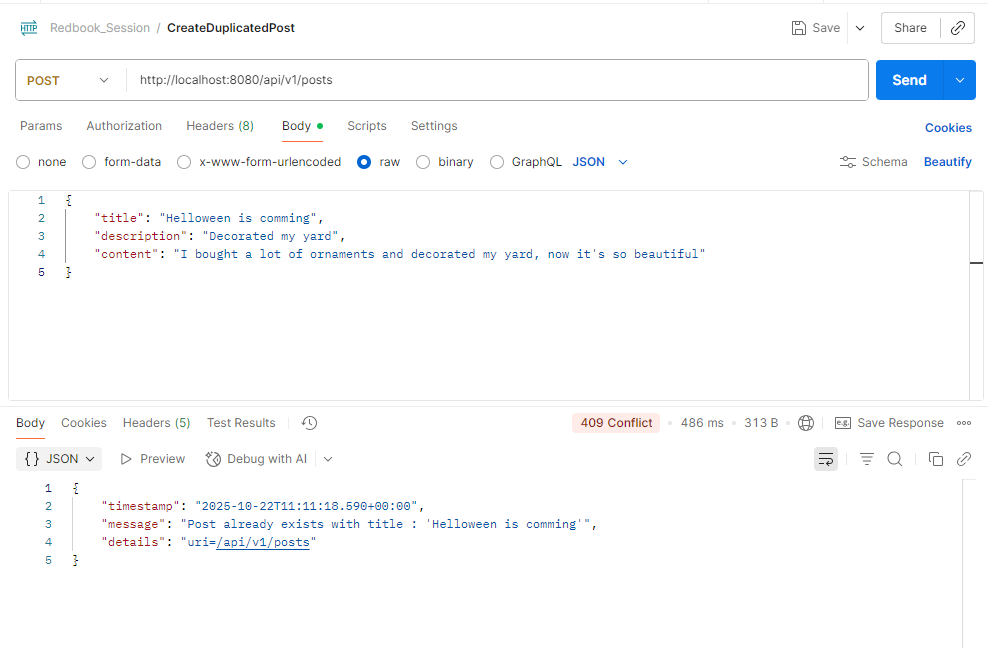

The error message would say the title conflicted.

Here is how I did that:


## Step 1: Create a new exception class
For example, let's create a DuplicateResourceException:
```java
package com.chuwa.redbook.exception;

import org.springframework.http.HttpStatus;
import org.springframework.web.bind.annotation.ResponseStatus;

@ResponseStatus(value = HttpStatus.CONFLICT)
public class DuplicateResourceException extends RuntimeException {
    private String resourceName;
    private String fieldName;
    private String fieldValue;

    public DuplicateResourceException(String resourceName, String fieldName, String fieldValue) {
        super(String.format("%s already exists with %s : '%s'", resourceName, fieldName, fieldValue));
        this.resourceName = resourceName;
        this.fieldName = fieldName;
        this.fieldValue = fieldValue;
    }

    public String getResourceName() {
        return resourceName;
    }

    public String getFieldName() {
        return fieldName;
    }

    public String getFieldValue() {
        return fieldValue;
    }
}
```

## Step 2: Add a handler method in GlobalExceptionHandler
Update your `GlobalExceptionHandler` class to handle the new exception:

```java
package com.chuwa.redbook.exception;

import com.chuwa.redbook.payload.ErrorDetails;
import org.springframework.http.HttpStatus;
import org.springframework.http.ResponseEntity;
import org.springframework.web.bind.annotation.ControllerAdvice;
import org.springframework.web.bind.annotation.ExceptionHandler;
import org.springframework.web.context.request.WebRequest;

import java.util.Date;

@ControllerAdvice
public class GlobalExceptionHandler {

    /**
     * handler specific exceptions
     * @param exception
     * @param webRequest
     * @return
     */
    @ExceptionHandler(ResourceNotFoundException.class)
    public ResponseEntity<ErrorDetails> handleResourceNotFoundException(ResourceNotFoundException exception,
                                                                        WebRequest webRequest) {
        ErrorDetails errorDetails = new ErrorDetails(new Date(), exception.getMessage(),
                webRequest.getDescription(false));

        return new ResponseEntity<>(errorDetails, HttpStatus.NOT_FOUND);
    }

    @ExceptionHandler(BlogAPIException.class)
    public ResponseEntity<ErrorDetails> handleBlogAPIException(BlogAPIException exception,
                                                                        WebRequest webRequest) {
        ErrorDetails errorDetails = new ErrorDetails(new Date(), exception.getMessage(),
                webRequest.getDescription(false));

        return new ResponseEntity<>(errorDetails, HttpStatus.BAD_REQUEST);
    }

    /**
     * Handle duplicate resource exception
     * @param exception
     * @param webRequest
     * @return
     */
    @ExceptionHandler(DuplicateResourceException.class)
    public ResponseEntity<ErrorDetails> handleDuplicateResourceException(DuplicateResourceException exception,
                                                                        WebRequest webRequest) {
        ErrorDetails errorDetails = new ErrorDetails(new Date(), exception.getMessage(),
                webRequest.getDescription(false));

        return new ResponseEntity<>(errorDetails, HttpStatus.CONFLICT);
    }

    /**
     * global exceptions
     * @param exception
     * @param webRequest
     * @return
     */
    @ExceptionHandler(Exception.class)
    public ResponseEntity<ErrorDetails> handleGlobalException(Exception exception,
                                                              WebRequest webRequest) {
        ErrorDetails errorDetails = new ErrorDetails(new Date(), exception.getMessage(),
                webRequest.getDescription(false));

        return new ResponseEntity<>(errorDetails, HttpStatus.INTERNAL_SERVER_ERROR);
    }
}
```

## Step 3: Use the exception in your service layer
Now you can throw your custom exception from your service layer when appropriate:

```java
// Example usage in a service method
public PostDto createPost(PostDto postDto) {
    // Check if a post with the same title already exists
    if (postRepository.existsByTitle(postDto.getTitle())) {
        throw new DuplicateResourceException("Post", "title", postDto.getTitle());
    }
    
    // Continue with post creation...
    Post post = mapToEntity(postDto);
    Post newPost = postRepository.save(post);
    return mapToDTO(newPost);
}
```

## Additional Custom Exceptions You Might Want to Add:
1. ValidationException: For handling validation errors

```java
@ResponseStatus(HttpStatus.BAD_REQUEST)
public class ValidationException extends RuntimeException {
    private List<String> errors;
    
    public ValidationException(List<String> errors) {
        super("Validation failed: " + String.join(", ", errors));
        this.errors = errors;
    }
    
    public List<String> getErrors() {
        return errors;
    }
}
```
2. UnauthorizedException: For handling authentication/authorization issues

```java
@ResponseStatus(HttpStatus.UNAUTHORIZED)
public class UnauthorizedException extends RuntimeException {
    public UnauthorizedException(String message) {
        super(message);
    }
}
```

3. ServiceUnavailableException: For handling external service failures

```java
@ResponseStatus(HttpStatus.SERVICE_UNAVAILABLE)
public class ServiceUnavailableException extends RuntimeException {
    private String serviceName;
    
    public ServiceUnavailableException(String serviceName, String message) {
        super(String.format("Service %s is unavailable: %s", serviceName, message));
        this.serviceName = serviceName;
    }
    
    public String getServiceName() {
        return serviceName;
    }
}
```

## Customizing Error Response Format
If you want to modify the error response format, you can update the ErrorDetails class. For example, to add more fields:

```java
package com.chuwa.redbook.payload;

import java.util.Date;

public class ErrorDetails {
    private Date timestamp;
    private String message;
    private String details;
    private int errorCode;
    private String documentation;

    public ErrorDetails(Date timestamp, String message, String details, int errorCode, String documentation) {
        this.timestamp = timestamp;
        this.message = message;
        this.details = details;
        this.errorCode = errorCode;
        this.documentation = documentation;
    }

    // Constructors, getters and setters
    // ...
}
```

Then update your exception handlers to use the new format.

This approach gives you a flexible and consistent way to handle exceptions across your API, providing clear error messages and appropriate HTTP status codes to your API consumers.


# 7. Explain how Controller Advices work, is there any other approach to do same/similar global API exception handling?

A:
### **What is a Controller Advice**

`@ControllerAdvice` is a **Spring annotation** used to handle exceptions **globally** across the entire application rather than on a per-controller basis.  
It works together with the `@ExceptionHandler` annotation to define how specific exceptions should be transformed into HTTP responses.

In short:

> `@ControllerAdvice` acts as a **global interceptor** that watches all controllers for exceptions and converts them into meaningful responses.

---

### **How it Works**

When a controller throws an exception (e.g., `NullPointerException`, `EntityNotFoundException`), Spring:

1.  Looks for a matching `@ExceptionHandler` method in the same controller.
    
2.  If not found, looks in any class annotated with `@ControllerAdvice`.
    
3.  Executes that handler to build and return a **ResponseEntity** with a status code and body.
    

---

### **Example**

```java
@ControllerAdvice
public class GlobalExceptionHandler {

    @ExceptionHandler(ResourceNotFoundException.class)
    public ResponseEntity<ApiError> handleResourceNotFound(ResourceNotFoundException ex) {
        ApiError error = new ApiError(HttpStatus.NOT_FOUND, ex.getMessage(), LocalDateTime.now());
        return new ResponseEntity<>(error, HttpStatus.NOT_FOUND);
    }

    @ExceptionHandler(Exception.class)
    public ResponseEntity<ApiError> handleGeneralException(Exception ex) {
        ApiError error = new ApiError(HttpStatus.INTERNAL_SERVER_ERROR, "Unexpected error", LocalDateTime.now());
        return new ResponseEntity<>(error, HttpStatus.INTERNAL_SERVER_ERROR);
    }
}
```

```java
@Data
@AllArgsConstructor
public class ApiError {
    private HttpStatus status;
    private String message;
    private LocalDateTime timestamp;
}
```

If a service throws:

```java
throw new ResourceNotFoundException("Post not found!");
```

then the above handler automatically produces:

```json
{
  "status": "NOT_FOUND",
  "message": "Post not found!",
  "timestamp": "2025-10-23T23:14:05"
}
```

---

### **Advantages**

-   Centralized and clean exception handling.
    
-   Consistent API responses.
    
-   Avoids duplicating `try-catch` blocks in every controller.
    

---

### **Alternative Approaches**

1.  **`@RestControllerAdvice`**
    
    -   A variant of `@ControllerAdvice` that implicitly adds `@ResponseBody`.
        
    -   Recommended for REST APIs (no need to wrap responses manually).
        
    
    ```java
    @RestControllerAdvice
    public class RestExceptionHandler { ... }
    ```
    
2.  **`HandlerExceptionResolver` Interface**
    
    -   A lower-level mechanism; can override how exceptions are processed globally.
        
    -   Used for more fine-grained control over the `DispatcherServlet` exception flow.
    
3.  **`ResponseEntityExceptionHandler` Base Class**
    
    -   Extend this Spring class and override its methods to customize error handling.
        
    
    ```java
    @ControllerAdvice
    public class CustomResponseHandler extends ResponseEntityExceptionHandler {
        @Override
        protected ResponseEntity<Object> handleMethodArgumentNotValid(
                MethodArgumentNotValidException ex, HttpHeaders headers,
                HttpStatus status, WebRequest request) {
            ...
        }
    }
    ```
    
4.  **AOP (Aspect-Oriented Programming)**
    
    -   Define cross-cutting exception handling via `@Aspect` and `@Around` advice.
        
    -   Less common but powerful for logging and metrics.
        

---

✅ **Summary Table**

| **Approach** | **Scope** | **Recommended for** |
| --- | --- | --- |
| `@ControllerAdvice` | Global | MVC controllers |
| `@RestControllerAdvice` | Global (REST APIs) | RESTful services |
| `ResponseEntityExceptionHandler` | Global (extendable) | Advanced custom responses |
| `HandlerExceptionResolver` | Framework-level | Low-level customization |
| `AOP @Aspect` | Cross-cutting | Logging, metrics, or security |

# 8. What's the difference between throwing a regular exception and a customized API exception that will be eventually thrown to Controller Advice codes? Please provide screenshots to explain your findings.

A:

We can see in database there is no post with id 5. So if we call API GetPostByID and provide id 5, it would be an Exception.

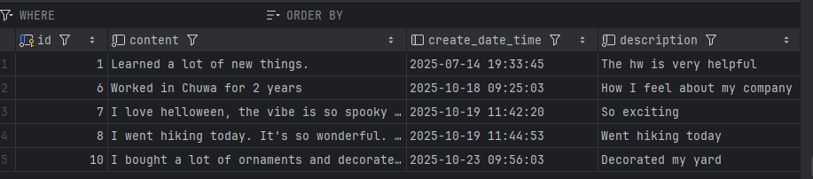

Exception Handled by GlobalExceptionHandler.java:

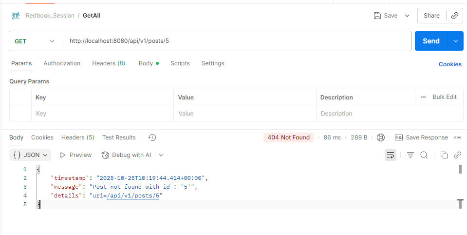

If we remove Java file `GlobalExceptionHandler`but keep the customed Exception ResourceNotFoundException:

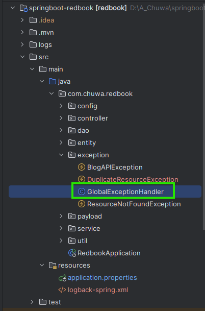

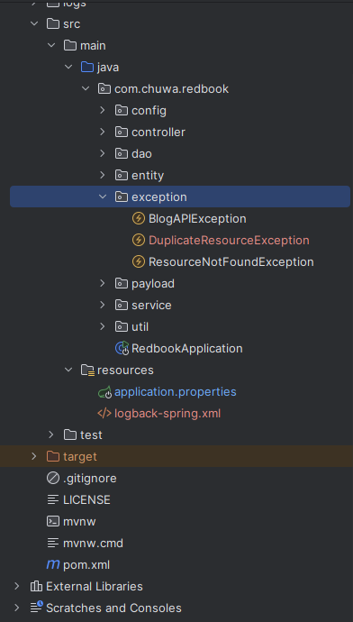

The Exception would be:

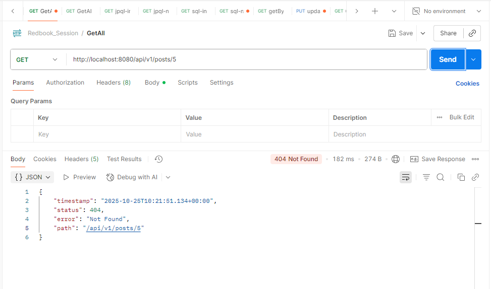

If we remove Option and throw Runtime Exception, leave that Exception unhandled:

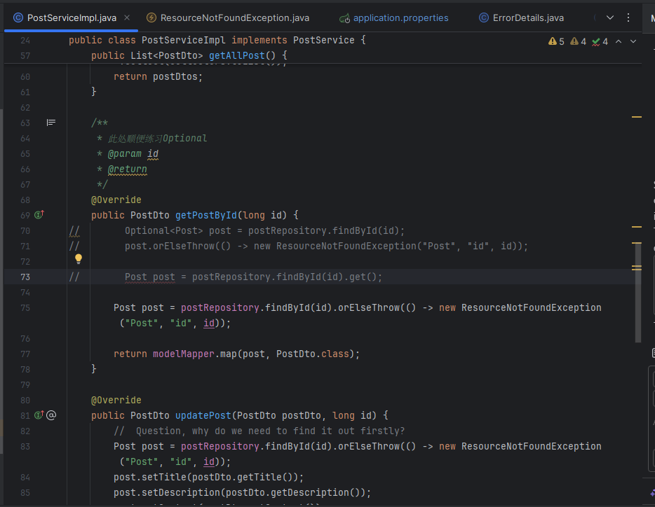

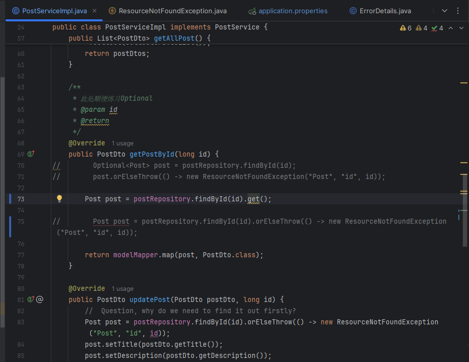

The Error becomes internal error (with error code 500):

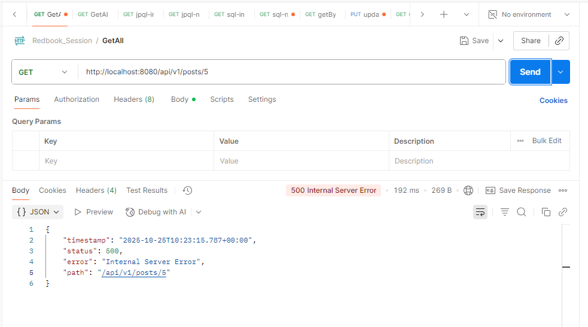

The logger would have error message and says there is an Exception called 

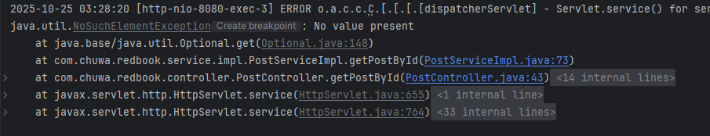

| **Aspect** | **Regular Exception** | **Customized API Exception** |
| --- | --- | --- |
| **Definition** | A built-in Java or Spring exception (`NullPointerException`, `IllegalArgumentException`, etc.) | A user-defined exception class extending `RuntimeException` (e.g., `ApiException`, `ResourceNotFoundException`) |
| **Purpose** | Represents a general programming or runtime error | Represents a **business-level** or **application-specific** error |
| **Response to Client** | Usually causes a 500 Internal Server Error (unhandled) | Mapped to a meaningful HTTP status and custom message via `@ControllerAdvice` |
| **Handled by ControllerAdvice?** | Only if you explicitly catch it with a matching `@ExceptionHandler` | Automatically handled through a designated `@ExceptionHandler(ApiException.class)` |
| **Information Included** | Usually minimal stack trace or generic message | Can include error code, timestamp, user-friendly message, and developer message |
| **Example** | `throw new NullPointerException("User is null");` | `throw new ResourceNotFoundException("User not found with id=10");` |
| **ControllerAdvice Output** | May return raw 500 error | Returns a formatted JSON response like:  
`json { "status": "NOT_FOUND", "message": "User not found with id=10" } ` |

---

### **Illustrative Example**

#### **Regular Exception**

```java
@GetMapping("/user/{id}")
public User getUser(@PathVariable Long id) {
    return userService.findById(id).orElseThrow(() -> new NullPointerException("User not found"));
}
```

➡ Output: **HTTP 500 Internal Server Error**  
Unstructured response, not user-friendly.

---

#### **Custom API Exception + ControllerAdvice**

```java
// Custom Exception
public class ResourceNotFoundException extends RuntimeException {
    public ResourceNotFoundException(String message) { super(message); }
}
```

```java
// In Service Layer
if (user == null) throw new ResourceNotFoundException("User with ID " + id + " not found");
```

```java
// In Global Exception Handler
@ExceptionHandler(ResourceNotFoundException.class)
public ResponseEntity<ApiError> handleNotFound(ResourceNotFoundException ex) {
    ApiError error = new ApiError(HttpStatus.NOT_FOUND, ex.getMessage(), LocalDateTime.now());
    return new ResponseEntity<>(error, HttpStatus.NOT_FOUND);
}
```

➡ Output: **HTTP 404 Not Found** with clean JSON:

```json
{
  "status": "NOT_FOUND",
  "message": "User with ID 10 not found",
  "timestamp": "2025-10-23T23:18:00"
}
```

---

✅ **Summary:**

-   Regular exceptions = unhandled, generic, often return 500.
    
-   Custom API exceptions = meaningful, structured, globally managed.
    
-   Controller Advice bridges service-layer exceptions to HTTP responses cleanly and consistently.

# 9. Write some regular expression to restrict the value of attributes that your Post or Comment can have. You may use https://regex101.com/ to construct and test/validate your regular expression.

A:
Before adding any constraint to post content field, the post creation looks like this:

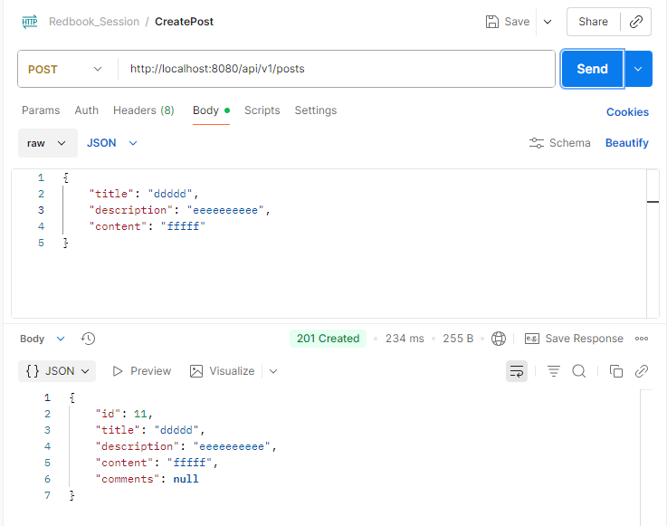

After adding `@Pattern()` to constraint that the content must contains at least one digit, one lowercase letter, one uppercase letter, one special character and be at least 8 characters long:

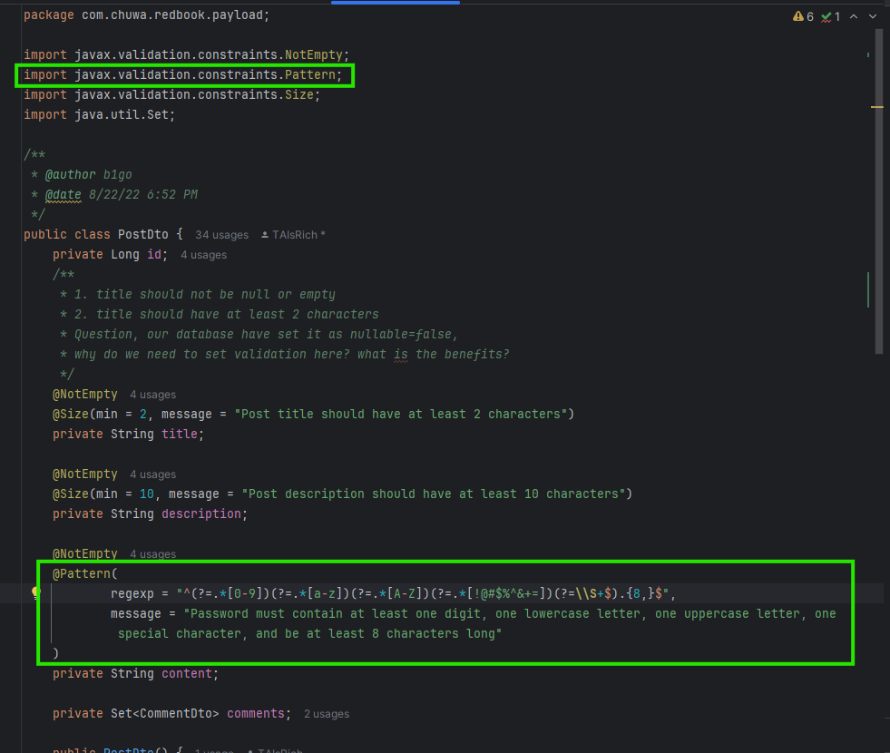

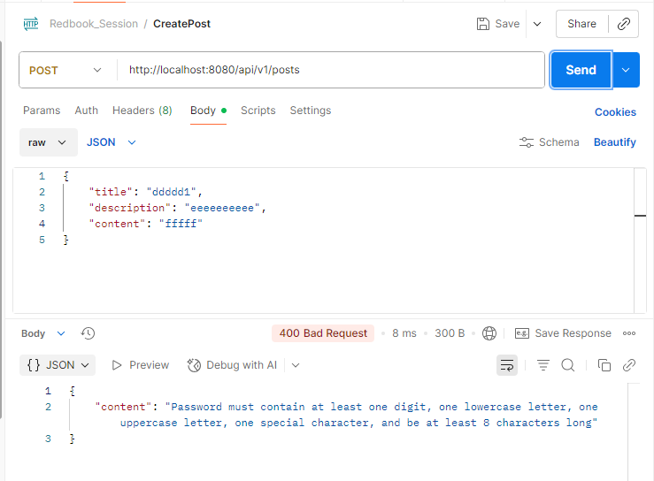

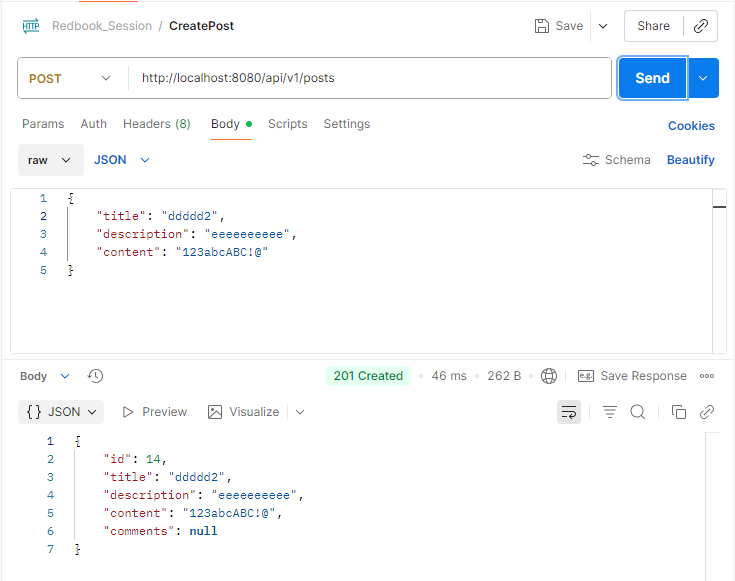


## Input Validation Annotations in Java
The syntax you're asking about refers to Bean Validation (also known as JSR-380) annotations that are commonly used in Java applications, particularly with frameworks like Spring Boot. Let me explain the available validation annotations and how to set specific rules for password complexity.

### Common Validation Annotations
Here are the most commonly used validation annotations:

#### 1. Basic Constraints:

- `@NotNull`: Value must not be null
- `@NotEmpty`: Value must not be null or empty (for String, Collection, Map, Array)
- `@NotBlank`: Value must not be null and must contain at least one non-whitespace character (for String)
- `@Size(min=x, max=y)`: Size must be between min and max (for String, Collection, Map, Array)
#### 2. String-specific Constraints:

- `@Pattern(regexp="...")`: Must match the specified regular expression
- `@Email`: Must be a well-formed email address
- `@Min(value)`: Must be a number whose value is higher or equal to the specified minimum
- `@Max(value)`: Must be a number whose value is lower or equal to the specified maximum
### Password Complexity Rules
For password complexity requirements (containing lowercase, uppercase, numbers, and special characters), you would typically use the `@Pattern` annotation with a regular expression:

```java
@Pattern(
    regexp = "^(?=.*[0-9])(?=.*[a-z])(?=.*[A-Z])(?=.*[@#$%^&+=])(?=\\S+$).{8,}$",
    message = "Password must contain at least one digit, one lowercase letter, one uppercase letter, one special character, and be at least 8 characters long"
)
private String password;
```
Breaking down this regex:

- `^` - start of string
- `(?=.*[0-9])` - at least one digit
- `(?=.*[a-z])` - at least one lowercase letter
- `(?=.*[A-Z])` - at least one uppercase letter
- `(?=.*[@#$%^&+=])` - at least one special character
- `(?=\\S+$)` - no whitespace allowed
- `.{8,}$` - at least 8 characters
### Custom Validation
For more complex validation requirements, you can create custom validators:

1. Create a custom annotation:
```java
@Documented
@Constraint(validatedBy = PasswordConstraintValidator.class)
@Target({ ElementType.FIELD, ElementType.ANNOTATION_TYPE })
@Retention(RetentionPolicy.RUNTIME)
public @interface ValidPassword {
    String message() default "Invalid Password";
    Class<?>[] groups() default {};
    Class<? extends Payload>[] payload() default {};
}
```
2. Implement the validator:
```java
public class PasswordConstraintValidator implements ConstraintValidator<ValidPassword, String> {
    @Override
    public boolean isValid(String password, ConstraintValidatorContext context) {
        // Implement your custom validation logic here
        boolean hasUppercase = !password.equals(password.toLowerCase());
        boolean hasLowercase = !password.equals(password.toUpperCase());
        boolean hasDigit = password.matches(".*\\d.*");
        boolean hasSpecialChar = password.matches(".*[!@#$%^&*()_+\\-=\\[\\]{};':\"\\\\|,.<>/?].*");
        boolean isLongEnough = password.length() >= 8;
        
        return hasUppercase && hasLowercase && hasDigit && hasSpecialChar && isLongEnough;
    }
}
```
3. Use your custom annotation:
```java
@ValidPassword
private String password;
```
This approach allows for more readable code and more detailed error messages than a single regex pattern.


# 10. Explain Spring framework fundamental principles. And how can they help build business applications?

A:

### **1️⃣ Core Principles of the Spring Framework**

| **Principle** | **Description** | **Benefit for Business Applications** |
| --- | --- | --- |
| **Inversion of Control (IoC)** | The framework, not the developer, controls the creation and management of objects (beans). | Simplifies dependency management and decouples components. |
| **Dependency Injection (DI)** | Objects are given their dependencies externally (via constructors, setters, etc.) instead of creating them internally. | Promotes modularity, testability, and flexibility. |
| **Aspect-Oriented Programming (AOP)** | Separates cross-cutting concerns like logging, security, or transactions into reusable aspects. | Cleaner code, separation of concerns, and reduced duplication. |
| **Transaction Management** | Provides a consistent programming model for database transactions across different APIs (JPA, JDBC, etc.) | Ensures data integrity and easier rollback management. |
| **Spring MVC (Model-View-Controller)** | A structured pattern to separate input logic, business logic, and UI logic. | Encourages maintainable and scalable web applications. |
| **Convention over Configuration** | Provides sensible defaults to reduce boilerplate XML or annotations. | Faster development and easier configuration. |
| **Lightweight and Modular Architecture** | You can use only the modules you need (e.g., Spring Data, Spring Security, etc.). | Improves performance and minimizes complexity. |

---

### **2️⃣ How These Help in Building Business Applications**

-   **Decoupled Architecture:** Business logic, persistence, and presentation layers are separated → easier maintenance.
    
-   **Rapid Development:** Pre-built integrations with JPA, REST, and Security reduce development time.
    
-   **Easy Testing:** DI allows injecting mock dependencies → easier unit testing.
    
-   **Enterprise Readiness:** Built-in transaction management, caching, and security help in real-world enterprise-grade systems.
    
-   **Scalability:** Spring Boot auto-configuration enables microservice-based architecture.
    

---

✅ **In short:**  
Spring’s core ideas (IoC, DI, AOP) make business applications **modular, maintainable, and testable**, while its ecosystem (Spring Boot, Spring Data, Spring Security) accelerates development and ensures reliability.

# 11. Explain different types of dependency injection, explain their suitable use cases, and why fielde injection is not recommended in general. Please provide necessary code snippets and screenshots if possible.

A:
## **1️⃣ Types of Dependency Injection in Spring**

**Syntax Example**
1. **Constructor Injection**
```java 
@Service 
class OrderService { 
	private final UserRepository userRepo; 
    
	@Autowired 
	public OrderService(UserRepository userRepo) { 
		this.userRepo = userRepo; 
	} 
} 
```
2. **Setter Injection**
```java 
@Service 
class OrderService { 
    private PaymentService paymentService;  
    
    @Autowired 
    public void setPaymentService(PaymentService paymentService) { 
    	this.paymentService = paymentService; 
    } 
} 
```
3. **Field Injection (Not Recommended)**
```java 
@Service 
class OrderService { 
	@Autowired 
	private UserRepository userRepo; 
} 
```
## **2️⃣ Why Field Injection is Not Recommended**

Dependency Injection (DI) is a design pattern that allows for the creation of dependent objects outside of a class and provides those objects to a class. This promotes loose coupling and improves testability. Constructor, setter, and field injection are three common ways to achieve DI.
依赖注入（DI）是一种设计模式，它允许在类外部创建依赖对象，并将这些对象提供给类。 这有助于降低耦合度并提高可测试性。 构造函数注入、setter注入和字段注入是实现依赖注入的三种常见方法。
### 1. Constructor Injection
- Mechanism: Dependencies are provided as arguments to the class's constructor. The IoC container (e.g., Spring) calls the constructor and passes the required dependencies.
依赖项作为参数传递给类的构造函数。IoC 容器（例如 Spring）调用构造函数并传递所需的依赖项。
- Characteristics:
    - Ensures that an object is created in a fully initialized and valid state, as all required dependencies must be provided during construction.
    确保创建的对象处于完全初始化和有效状态，因为所有必需的依赖项都必须在构造过程中提供。
    - Promotes immutability of dependencies if they are declared as `final` fields.
    如果依赖项被声明为`final`字段，则促进其不可变性。
    - Makes dependencies explicit and visible in the class's API.
    使依赖关系在类的 API 中明确可见。
    - Generally considered the preferred method for required dependencies.
    通常被认为是处理所需依赖项的首选方法。
### 2. Setter Injection
- **Mechanism:** Dependencies are provided through public setter methods after the object has been instantiated (usually with a no-argument constructor). The IoC container calls these setter methods to inject the dependencies.
依赖项在对象实例化之后（通常使用无参构造函数）通过​​公共 setter 方法提供。IoC 容器调用这些 setter 方法来注入依赖项。
- **Characteristics:**
    - Allows for optional dependencies, as not all setters need to be called.
    允许可选依赖项，因为并非所有设置器都需要调用。
    - Provides flexibility to change dependencies after object creation.
    允许在对象创建后灵活地更改依赖项。
    - Can lead to an object being in an invalid or incomplete state if required setters are not called.
    如果未调用必要的设置器，则可能导致对象处于无效或不完整状态。
    - Often used for optional dependencies or when dealing with circular dependencies (though constructor injection is often preferred to avoid circular dependencies in the first place).
    通常用于可选依赖项或处理循环依赖项（尽管通常最好首先避免循环依赖项，即构造函数注入）。
### 3. Field Injection
- **Mechanism:** Dependencies are injected directly into private fields of the class using annotations (e.g., `@Autowired` in Spring). This typically involves reflection to bypass access restrictions.
依赖项通过注解直接注入到类的私有字段中（例如，`@Autowired`在 Spring 中）。 这通常需要使用反射来绕过访问限制。
- **Characteristics:**
    - Requires no public constructor or setter methods for the dependencies, leading to more concise code.
    不需要为依赖项编写公共构造函数或设置器方法，从而可以编写更简洁的代码。
    - Can hide dependencies, making it less clear what an object needs to function.
    可以隐藏依赖关系，使对象运行所需的条件变得不那么清晰。
    - Makes unit testing more difficult as it often requires a DI framework or reflection to inject mocks.
    这使得单元测试更加困难，因为它通常需要依赖注入框架或反射来注入模拟对象。
    - Violates the principle of encapsulation by directly manipulating private fields.
    直接操作私有字段，违反了封装原则。
    - Generally discouraged in favor of constructor or setter injection due to its drawbacks in testability and design principles. 
    由于在可测试性和设计原则方面存在缺陷，一般不建议使用构造函数或设置器注入

In summary: Constructor injection is favored for required dependencies due to its emphasis on object validity and immutability. Setter injection offers flexibility for optional dependencies. Field injection, while concise, often compromises testability and design principles, making it the least recommended approach for most scenarios.
综上所述：构造函数注入因其强调对象的有效性和不可变性，而成为必需依赖项的首选方法 。Setter 注入则为可选依赖项提供了灵活性。 字段注入虽然简洁，但往往会损害可测试性和设计原则，因此在大多数情况下是最不推荐的方法。
## **3️⃣ Recommended Approach**

✅ **Constructor Injection** (most preferred):

-   Makes dependencies **explicit**.
    
-   Enables **immutability**.
    
-   Easy to test using mocks.
    

Example with Lombok:

```java
@Service
@RequiredArgsConstructor
public class PostService {
    private final PostRepository postRepository; // automatically injected via constructor
}
```

# 12. Explain different types of application context in Spring framework, with screenshots. You may take https://github.com/CTYue/springIOC for reference.

A:
## **1️⃣ What is ApplicationContext?**

`ApplicationContext` is the **central interface** in Spring for providing configuration information to the application.  
It:

-   Manages beans’ lifecycle.
    
-   Handles dependency injection.
    
-   Publishes and listens to events.
    
-   Provides message resource handling.
    

---

## **2️⃣ Major Types of ApplicationContext**

| **ApplicationContext Type** | **Class** | **Use Case** |
| --- | --- | --- |
| **AnnotationConfigApplicationContext** | `AnnotationConfigApplicationContext.class` | Used in modern Spring apps with `@Configuration` and annotations (no XML). |
| **ClassPathXmlApplicationContext** | `ClassPathXmlApplicationContext.class` | Used when Spring configuration is defined in XML under `src/main/resources`. |
| **FileSystemXmlApplicationContext** | `FileSystemXmlApplicationContext.class` | Loads XML configuration from an absolute or relative file system path. |
| **WebApplicationContext** | `AnnotationConfigWebApplicationContext.class` or `XmlWebApplicationContext.class` | Used in Spring MVC web applications. Integrated with `DispatcherServlet`. |

---

## **3️⃣ Examples**

### **Annotation-based Context**

```java
@Configuration
@ComponentScan("com.example")
public class AppConfig {
    @Bean
    public UserService userService() { return new UserServiceImpl(); }
}

public class Main {
    public static void main(String[] args) {
        ApplicationContext context = new AnnotationConfigApplicationContext(AppConfig.class);
        UserService userService = context.getBean(UserService.class);
        userService.processUser();
    }
}
```

### **XML-based Context**
#### Example 1:

```xml
<!-- applicationContext.xml -->
<beans>
    <bean id="userService" class="com.example.UserServiceImpl"/>
</beans>
```

```java
ApplicationContext context = new ClassPathXmlApplicationContext("applicationContext.xml");
UserService service = (UserService) context.getBean("userService");
```
#### Example 2:

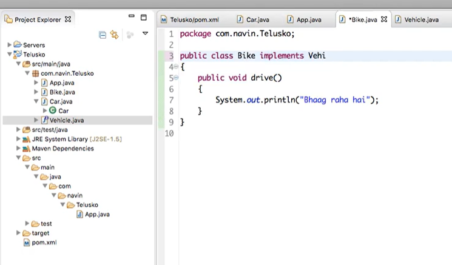
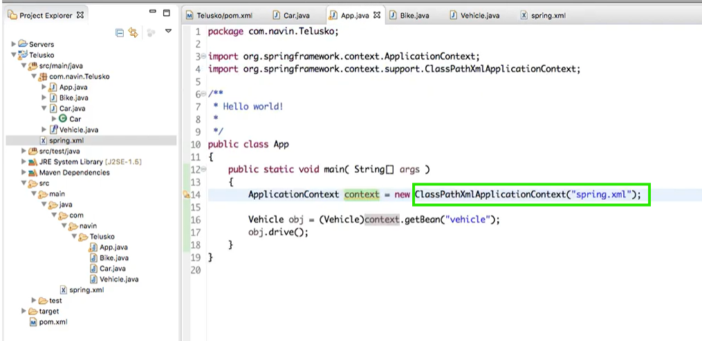
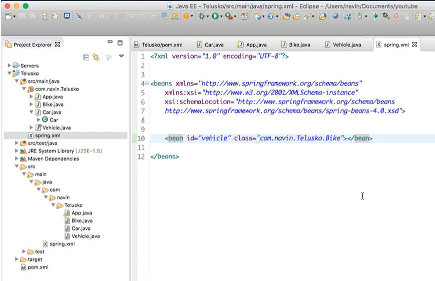

### **Web Context (Spring MVC)**

`WebApplicationContext` is created automatically by `DispatcherServlet`:

```java
public class WebAppInitializer implements WebApplicationInitializer {
    @Override
    public void onStartup(ServletContext servletContext) {
        AnnotationConfigWebApplicationContext context = new AnnotationConfigWebApplicationContext();
        context.register(WebConfig.class);
        servletContext.addListener(new ContextLoaderListener(context));
    }
}
```

---

## **4️⃣ Differences Summary**

| **Context** | **Configuration Type** | **Environment** |
| --- | --- | --- |
| `AnnotationConfigApplicationContext` | Java-based (`@Configuration`, `@Bean`) | Standalone app |
| `ClassPathXmlApplicationContext` | XML in classpath | Legacy/standalone app |
| `FileSystemXmlApplicationContext` | XML in filesystem | Externalized config |
| `WebApplicationContext` | Java or XML | Web application (Spring MVC) |

---

✅ **Summary:**

-   `ApplicationContext` manages beans and DI lifecycle.
    
-   Choose **AnnotationConfigApplicationContext** for modern Spring Boot applications.
    
-   Choose **WebApplicationContext** for MVC-based web apps.


## BeanFactory vs ApplicationContext

`BeanFactory` is a basic IoC container with lazy initialization, while `ApplicationContext` is an advanced container built on top of `BeanFactory` that provides additional enterprise features like event propagation, AOP support, and internationalization, and typically uses eager initialization for singleton beans. `ApplicationContext` is generally recommended for most applications, especially enterprise and web-based ones, while `BeanFactory` is better suited for lightweight or memory-constrained standalone applications and testing scenarios.
`BeanFactory`是一个基础的 IoC 容器，采用延迟初始化；而`ApplicationContext`是一个基于`BeanFactory`构建的高级容器，提供事件传播、AOP 支持和国际化等企业级功能，通常对单例 bean 使用即时初始化。 `ApplicationContext`一般建议大多数应用程序使用 ，尤其是企业级和 Web 应用程序；而`BeanFactory`更适合轻量级或内存受限的独立应用程序和测试场景。 

### BeanFactory
- **Functionality:** Provides the most basic support for Inversion of Control (IoC) and dependency injection. 
功能： 提供对控制反转（IoC）和依赖注入的最基本支持。 
- **Initialization:** Uses lazy initialization, meaning beans are created only when they are first requested. 
初始化： 使用延迟初始化，这意味着只有在首次请求时才会创建 bean。
- **Features:** Lacks features like event propagation, AOP support, and internationalization by default. 
特征： 默认情况下缺少事件传播、AOP 支持和国际化等功能。 
- **Use Cases:** Suitable for small, standalone applications or testing environments where a lighter footprint is needed. 
使用案例： 适用于小型独立应用或需要轻量级占用空间的测试环境。 
- **Resource Usage:** Consumes less memory. 
资源使用情况： 占用内存更少。 
### ApplicationContext
- **Functionality:** Extends `BeanFactory` and is an superset of its features. 
功能：扩展了其`BeanFactory`功能，并且是其功能的超集。 
- **Initialization:** Typically uses eager initialization, creating all singleton beans when the context is started. 
初始化： 通常使用即时初始化，在上下文启动时创建所有单例 bean。 
- **Features:** Supports advanced features like event propagation, internationalization, and automatic `BeanPostProcessor` registration. 
功能：支持事件传播、国际化和自动`BeanPostProcessor`注册等高级功能。
- **Use Cases:** The standard choice for enterprise and web applications due to its advanced capabilities. 
 使用案例： 由于其先进的功能，是企业和 Web 应用程序的标准选择。 
- **Resource Usage:** Requires more memory than `BeanFactory`. 


# 13. Compare @Component and @Bean and in which scenario they should be used.

A:
`@Component` and `@Bean` are both Spring annotations used to define and manage beans within the Spring application context, but they serve different purposes and are used in distinct scenarios.
@Component和@Bean都是 Spring 注解，用于在 Spring 应用程序上下文中定义和管理 bean，但它们用途不同，使用场景也不同。

## @Component


- **Usage:** Class-level annotation. It marks a class as a Spring-managed component, making it eligible for component scanning. Spring automatically detects and registers these classes as beans.
用法： 类级注解。 它将类标记为 Spring 管理的组件，使其可以被组件扫描。Spring 会自动检测这些类并将其注册为 bean。
- **Specializations:** `@Service`, `@Repository`, and `@Controller` are specialized forms of `@Component`, providing semantic clarity and sometimes additional features for specific layers of an application.
专业方向： @Service、@Repository和@Controller是@Component的特殊形式，为应用程序的特定层提供语义清晰度，有时还提供额外的功能。
- **Scenario:** Use `@Component` (or its specializations) when you are writing your own classes (e.g., services, repositories, controllers) and want Spring to automatically manage their lifecycle and dependencies through component scanning. This is the preferred approach for most of your application's own components.
设想： 当您编写自己的类（例如服务、存储库、控制器）并希望 Spring 通过组件扫描自动管理它们的生命周期和依赖项时，请使用`@Component`（或其特化版本） 。对于应用程序的大多数自定义组件而言，这是首选方法。
## @Bean

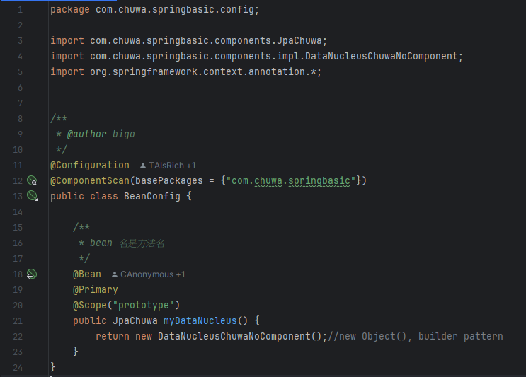

- **Usage:** Method-level annotation, typically placed within a `@Configuration` class. It explicitly declares a method as a bean producer, meaning the object returned by the method will be registered as a Spring bean.
用法： 方法级注解，通常位于@Configuration类中。 它显式地将方法声明为 bean 生产者，这意味着该方法返回的对象将被注册为 Spring bean。
- **Control:** Offers fine-grained control over the bean's creation, configuration, and lifecycle.
控制： 提供对 bean 的创建、配置和生命周期的精细控制。
- **Scenario:** Use `@Bean` when:
    - You need to instantiate and configure a third-party class that you cannot modify or annotate with `@Component`.
    您需要实例化并配置一个您无法修改或注解的第三方类@Component。
    - The bean's creation requires complex logic, conditional instantiation, or configuration values that are determined at runtime.
    创建 bean 需要复杂的逻辑、条件实例化或在运行时确定的配置值。
    - You need to define multiple instances of the same class with different configurations.
    你需要定义同一个类的多个实例，并赋予它们不同的配置。
    - You want to explicitly name the bean or define custom lifecycle hooks (e.g., `initMethod`, `destroyMethod`).
    你想明确地命名 bean 或定义自定义生命周期钩子（例如，，initMethod, destroyMethod）。
## Key Differences and When to Use Which:
- **Scope:** `@Component` is class-level; `@Bean` is method-level.
范围： @Component是类级别的； @Bean是方法级别的。
- **Automation vs. Explicit Declaration:** `@Component` relies on component scanning for automatic bean discovery; `@Bean` explicitly declares a bean through a method's return value.
自动化与显式声明： @Component依靠组件扫描进行自动 bean 发现； @Bean通过方法的返回值显式声明 bean。
- **Control:** `@Bean` provides more control over the bean's instantiation and configuration, particularly useful for third-party libraries or complex setups. `@Component` is simpler for standard application components.
控制： `@Bean`提供了对 bean 实例化和配置的更多控制，这对于第三方库或复杂的设置尤其有用。 `@Component`对于标准应用程序组件来说则更简单。
- **Location:** `@Component` is used directly on the class itself. `@Bean` methods are typically placed within a `@Configuration` class.
位置：`@Component`直接对类本身使用。 `@Bean`方法通常放在`@Configuration`类内部。

In essence, use `@Component` for your own, well-structured application components that can be automatically detected. Use `@Bean` when you need more control over the bean's creation process, especially for external libraries or intricate bean configurations.
本质上，`@Component`适用于您自己构建的、结构良好的应用程序组件，这些组件可以被自动检测。 当您需要对 bean 的创建过程进行更多控制时，尤其是在使用外部库或复杂的 bean 配置时，请使用`@Bean`.
# 14. Explain Spring bean scopes and how to pick the correct bean scope.
A:

Spring bean scopes define the lifecycle and visibility of bean instances within the Spring IoC container. They determine how many instances of a bean are created and how they are shared.
Spring Bean 作用域定义了 Spring IoC 容器内 Bean 实例的生命周期和可见性。 它们决定了 Bean 实例的创建数量以及它们的共享方式。
## Spring Bean Scopes:
### Singleton (Default):
- One instance of the bean is created per Spring IoC container.
每个 Spring IoC 容器都会创建一个 bean 实例。
- This single instance is shared across all requests for that bean.
该 bean 的所有请求都共享同一个实例。
- Suitable for stateless components or components where a single instance is sufficient.
适用于无状态组件或单个实例就足够的情况。
### Prototype:
- A new instance of the bean is created every time it is requested.
每次请求该 bean 时，都会创建一个新的实例。
- Suitable for stateful components or when each client needs its own independent instance.
适用于有状态组件或每个客户端都需要独立实例的情况。
### Request (Web-aware only):
- A new instance of the bean is created for each HTTP request.
每个 HTTP 请求都会创建一个新的 bean 实例。  
- Suitable for web-specific components that hold request-specific data.
适用于保存请求特定数据的 Web 专用组件。
### Session (Web-aware only):
- A new instance of the bean is created for each HTTP session. 
每个 HTTP 会话都会创建一个新的 bean 实例。 
- Suitable for web-specific components that hold session-specific data.
适用于保存会话特定数据的 Web 特定组件。
### Application (Web-aware only):
- A single instance of the bean is created for the entire web application's ServletContext. 
为整个 Web 应用程序的`ServletContext`创建一个 bean 的单个实例。
- Suitable for application-wide data or constants.
适用于应用程序范围的数据或常量。
### WebSocket (Web-aware only):
- A new instance of the bean is created for each WebSocket session. 
每个 WebSocket 会话都会创建一个新的 bean 实例
## How to Pick the Correct Bean Scope:
Choosing the right bean scope depends on the bean's statefulness and its intended usage:
选择合适的 bean 作用域取决于 bean 的状态性和其预期用途：
- **Stateless components or shared resources:** Use Singleton. This is the most common and efficient choice when the bean doesn't maintain any specific state per user or request.
无状态组件或共享资源： 使用单例模式。 当 bean 不为每个用户或请求维护任何特定状态时，这是最常用且最高效的选择。
- **Stateful components where each consumer needs an independent instance:** Use Prototype. This ensures data isolation and prevents unintended side effects from shared state.
对于每个消费者都需要独立实例的有状态组件： 请使用原型。 这可以确保数据隔离，并防止共享状态带来的意外副作用。
- **Web-specific components holding data for a single HTTP request:** Use Request. Examples include forms or filters that process request-specific information.
用于存储单个 HTTP 请求数据的 Web 特定组件： 使用 Request 组件。 例如，处理请求特定信息的表单或过滤器。
- **Web-specific components holding data for a user's entire session:** Use Session. Examples include user authentication details or shopping cart contents.
用于存储用户整个会话期间数据的 Web 特定组件： 使用 Session。 例如，用户身份验证详细信息或购物车内容。
- **Application-wide resources or configuration in a web application:** Use Application.
Web 应用程序中的应用程序级资源或配置： 使用应用程序。
- **Components specific to a WebSocket session:** Use WebSocket.
WebSocket 会话特有的组件： 使用 WebSocket。
**Defining Bean Scope:**
You can define a bean's scope using the `@Scope` annotation in Java configuration or the `scope` attribute in XML configuration. For example:
您可以使用Java 配置中的`@Scope`注解或XML 配置中的`scope`属性来定义 bean 的作用域。 例如：

## Define Bean Scope with Annotation Example
```java
/**
 * Bean名默认是class名，首字母小写
 */
@Component
@Primary
@Scope("prototype")
public class MyPrototypeBean {
    // ...
}
```

```java
@Configuration
@ComponentScan(basePackages = {"com.chuwa.springbasic"})
public class BeanConfig {

    /**
     * bean 名是方法名
     */
    @Bean
    @Primary
    @Scope("prototype")
    public JpaChuwa myDataNucleus() {
        return new DataNucleusChuwaNoComponent();//new Object(), builder pattern
    }
}
```
## Define Bean Scope with XML Example

Define the bean scope using the scope attribute within the <bean> tag in your XML configuration file.

```xml
<?xml version="1.0" encoding="UTF-8"?>
<beans xmlns="http://www.springframework.org/schema/beans"
       xmlns:xsi="http://www.w3.org/2001/XMLSchema-instance"
       xsi:schemaLocation="http://www.springframework.org/schema/beans
                           http://www.springframework.org/schema/beans/spring-beans.xsd">

    <!-- Singleton Scope (default) -->
    <bean id="singletonBean" class="com.example.SingletonClass"/>

    <!-- Prototype Scope -->
    <bean id="prototypeBean" class="com.example.PrototypeClass" scope="prototype"/>

    <!-- Request Scope (for web applications) -->
    <bean id="requestBean" class="com.example.RequestClass" scope="request"/>

    <!-- Session Scope (for web applications) -->
    <bean id="sessionBean" class="com.example.SessionClass" scope="session"/>

    <!-- Global Session Scope (for web applications, typically Portlet contexts) -->
    <bean id="globalSessionBean" class="com.example.GlobalSessionClass" scope="globalSession"/>

</beans>
```

### Explanation of Scopes:
- `singleton` (Default): This is the default scope. The Spring container creates only one instance of the bean, and all requests for that bean will return a shared reference to the same instance. 
singleton（默认）： 这是默认作用域。Spring 容器只会创建一个 bean 实例，所有对该 bean 的请求都会返回对同一个实例的共享引用。 
- `prototype`: A new instance of the bean is created each time it is requested from the Spring container. 
prototype： 每次从 Spring 容器请求 bean 时，都会创建一个新的 bean 实例。 
- `request`: (Web-aware contexts only) A new instance of the bean is created for each HTTP request. All HTTP requests within a single request lifetime will have access to the same single bean instance in that request scope. 
request： （仅限 Web 感知上下文）每个 HTTP 请求都会创建一个新的 bean 实例。 在单个请求生命周期内，所有 HTTP 请求都将访问该请求范围内的同一个 bean 实例
- `session`: (Web-aware contexts only) A new instance of the bean is created for each HTTP session. All HTTP requests within a single session lifetime will have access to the same single bean instance in that session scope. 
session： （仅限 Web 感知上下文）每个 HTTP 会话都会创建一个新的 bean 实例。 在单个会话生命周期内，所有 HTTP 请求都将访问该会话范围内的同一个 bean 实例
- `globalSession`: (Web-aware contexts only, typically Portlet contexts) This scope is similar to the session scope but applies to a global HTTP session, usually in a portlet environment.
globalSession： （仅限 Web 感知上下文，通常是 Portlet 上下文）此范围类似于会话范围，但适用于全局 HTTP 会话，通常在 portlet 环境中。
### To use XML-defined beans in a Spring Boot application:
要在 Spring Boot 应用程序中使用 XML 定义的 bean：
You need to import your XML configuration file into your Spring Boot application's context, typically by adding the `@ImportResource` annotation to your main application class or a configuration class:
您需要将 XML 配置文件导入到 Spring Boot 应用程序的上下文中，通常是通过将`@ImportResource`注解添加到主应用程序类或配置类中来实现：

```java
import org.springframework.boot.SpringApplication;
import org.springframework.boot.autoconfigure.SpringBootApplication;
import org.springframework.context.annotation.ImportResource;

@SpringBootApplication
@ImportResource("classpath:applicationContext.xml") // Assuming your XML is named applicationContext.xml
public class MySpringBootApplication {

    public static void main(String[] args) {
        SpringApplication.run(MySpringBootApplication.class, args);
    }
}
```

# 15. Explain the difference between bean id and bean class.

A:
In Spring Boot, the bean ID and bean class serve distinct but related purposes in defining and managing objects within the Spring IoC container.
在 Spring Boot 中，bean ID 和 bean 类在定义和管理 Spring IoC 容器中的对象方面具有不同但相关的用途。
- **Bean Class:**
    - The bean class refers to the actual Java class whose instances are to be managed by the Spring container as beans.
    bean 类指的是实际的 Java 类，其实例将由 Spring 容器作为 bean 进行管理。
    - It defines the blueprint for the bean, including its properties, methods, and behavior.
    它定义了 bean 的蓝图，包括其属性、方法和行为。
    - When you define a bean, you specify the fully qualified name of its class, either implicitly (e.g., when using `@Component`, `@Service`, etc., where Spring infers the class) or explicitly (e.g., in XML configuration using the `class` attribute).
    定义 bean 时，您可以指定其类的完全限定名称，可以是隐式的（例如，在使用 ` @Component`、`@Service`等时，Spring 会推断类），也可以是显式的（例如，在 XML 配置中使用 ` class` 属性）。

```java
    // Example of a bean class
    public class MyService {
        // ...
    }
```
- **Bean ID (or Name):**
    - The bean ID is a unique identifier assigned to a specific instance of a bean within the Spring container.
    bean ID 是分配给 Spring 容器中 bean 的特定实例的唯一标识符。
    - It acts as a reference point to retrieve or inject that particular bean instance into other components.
    它充当参考点，用于检索或将该特定 bean 实例注入到其他组件中。
    - You can explicitly define a bean ID using annotations like `@Component("myCustomService")` or `@Bean("myBeanId")`, or in XML configuration using the `id` or `name` attribute. If not explicitly provided, Spring generates a default ID (typically the class name with the first letter lowercased).
    您可以使用注解（例如`@Component("myCustomService")` 或 `@Bean("myBeanId")`）显式定义 bean ID，也可以在 XML 配置中使用 `id` 或`name`属性。 如果未显式提供，Spring 会生成一个默认 ID（通常是类名首字母小写）。


```java
    // Example defining a bean with a specific ID using @Component
    @Component("myCustomService")
    public class MyService {
        // ...
    }

    // Example defining a bean with a specific ID using @Bean
    @Configuration
    public class AppConfig {
        @Bean("myBeanId")
        public MyService myService() {
            return new MyService();
        }
    }
```

**In summary:**
- The bean class tells Spring what kind of object to create and manage.
bean 类告诉 Spring 要创建和管理哪种类型的对象。
- The bean ID provides a unique name to identify and refer to a specific instance of that class within the container.
bean ID 提供了一个唯一的名称，用于识别和引用容器内该类的特定实例。

You can have multiple beans of the same class, each with a different ID, allowing for distinct configurations or instances of the same type. Conversely, a single bean ID will always refer to one specific instance of a particular class (unless aliasing is used).
您可以拥有同一类的多个 bean，每个 bean 都可以拥有不同的 ID，从而实现不同的配置或同一类型的不同实例。 相反，单个 bean ID 始终指向特定类的一个特定实例（除非使用了别名）。

# 16. Explain that when a bean has multiple alternative implementations, how will Spring decide which bean implementation to inject/autowire?


 * 1. 如果只有一个impl,则默认用这个impl
 * 2. 如果有多个impl, 则查看是否有@Qualifier
 * 3. 如果有多个impl, 且无@Qualifier, 则查看是否有@Primary (因为这个是type level的)
 * 4. 如果有多个impl, 且无@Qualifier, 且無@Primary, 按变量名(By Name)确定用哪一个
 * 5. 如果依然不能确定用哪一个，则报错(NoUniqueBeanDefinitionException)

Take the code in https://github.com/CTYue/springboot-redbook/commits/06_mapper-exception for example, 
For dependency injected to the 4 instances of JpaChuwa in class `DependencyInjectionByTypeByName`,

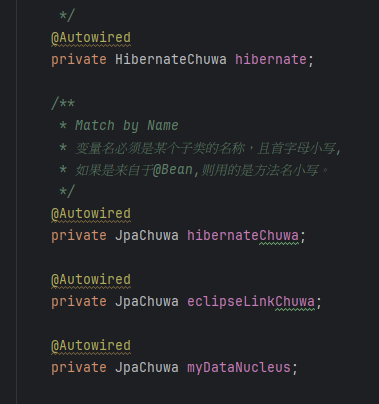
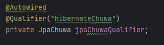

If we have no `@Primary` on each Implementations, the result would be:

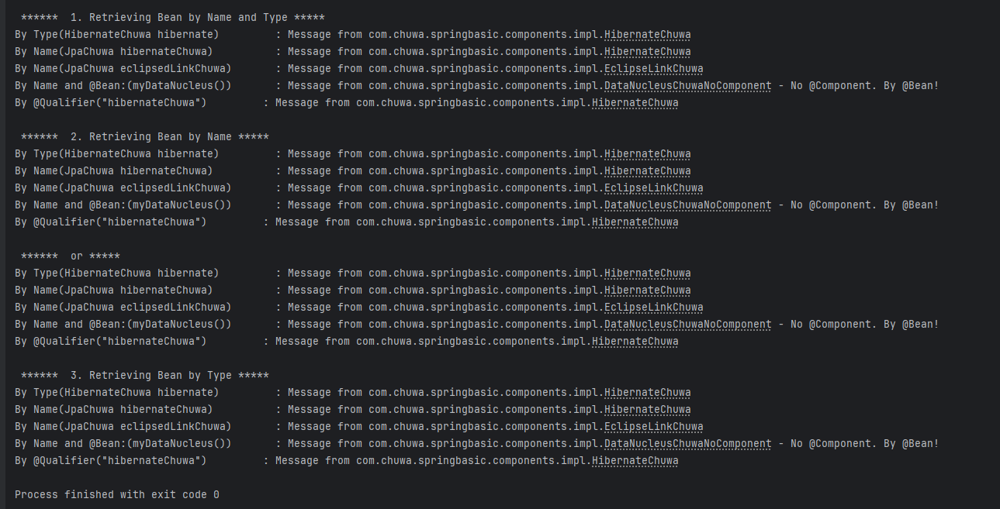


For jpaChuwaQualifier (with @Qualifier), it will use HibernateChuwa as explicitly specified, regardless of any @Primary annotations elsewhere.

For other injections like myDataNucleus, hibernateChuwa and eclipseLinkChuwa, they're matched by name, so the specific named beans are injected.

If we have `@Primary` on any of these 4 implementations, except for the initiation with specific type or with `@Qualifier`, would all be the primary implementation:

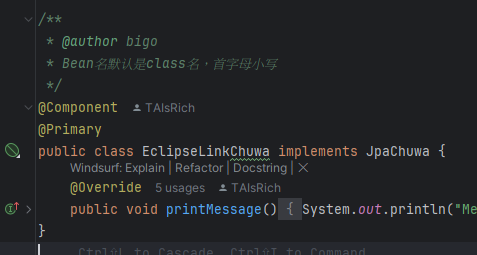
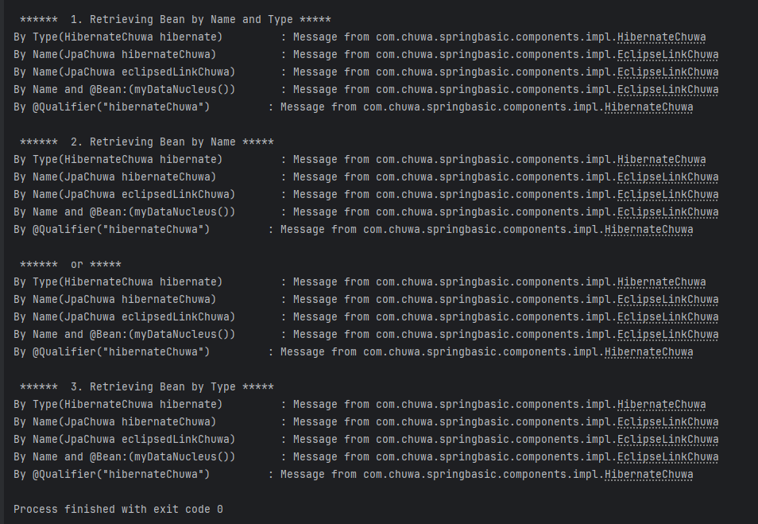

This demonstrates how Spring resolves dependencies using a hierarchy of rules:

1. Type matching
2. Explicit qualifiers (`@Qualifier`)
3. Primary beans (`@Primary`)
4. Matching by name
