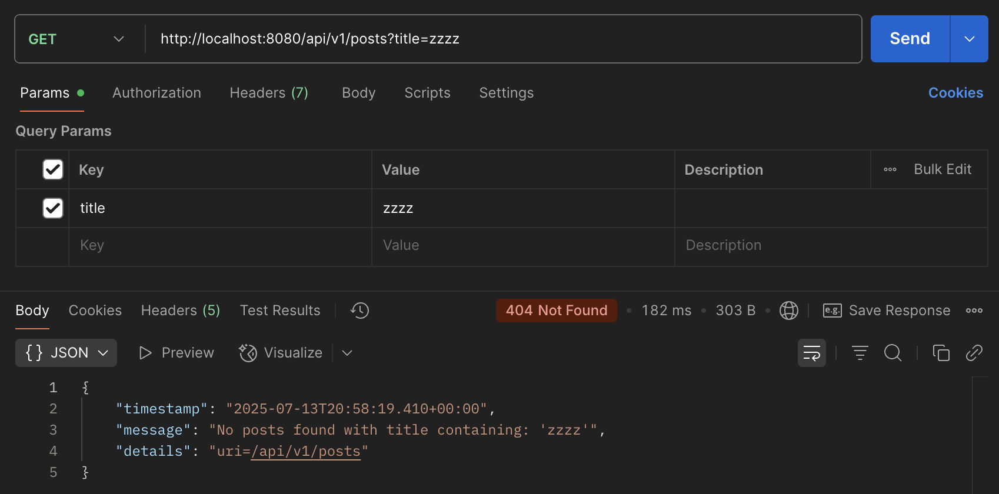
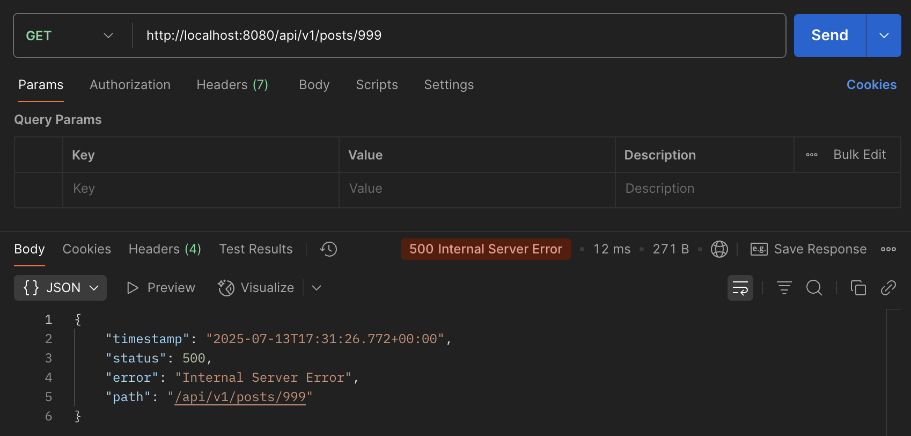
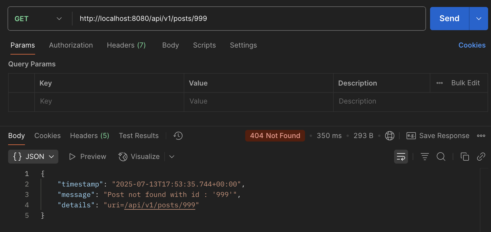
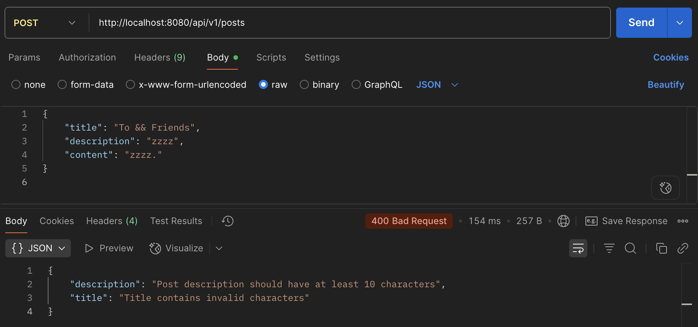
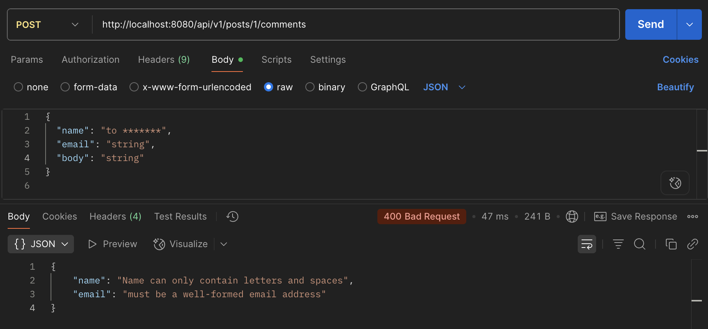
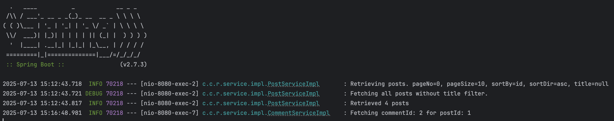
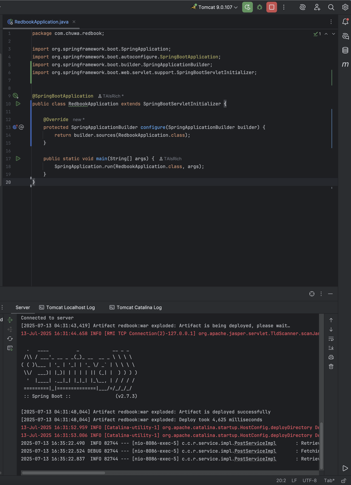
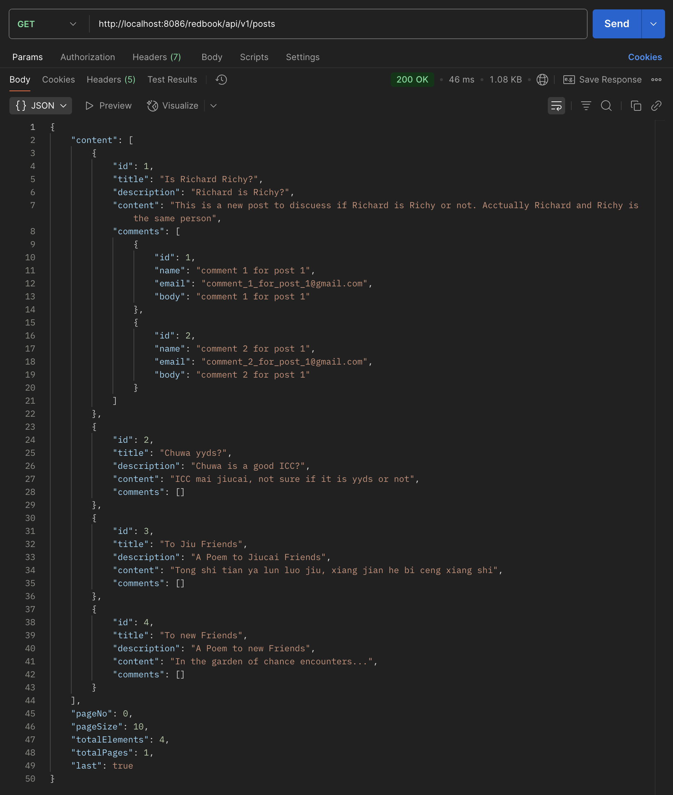

### hw 11

---
#### 1. Spring Annotation Cheatsheet
See file in path: `Short Questions/annotations.md`


---
#### 2. Code is in:  
> https://github.com/ariannalangwang/springboot-redbook/tree/hw11_06_mapper-exception


---
#### 3.  Explain why we need `model mapper` in Spring. In what scenarios do we need it?
`ModelMapper` simplifies the conversion between **Entity** and **DTO** objects in a Spring application.

Scenarios Where It's Needed:
- Converts internal Entity objects to DTOs to avoid exposing database structure to clients.
- Maps incoming request DTOs to Entity classes before persisting to DB.
- Keeps service layers code clean by offloading repetitive mapping logic.
- Testing: Easier to test DTOs independently of Entity logic.
 


---
#### 4. Provide 3 examples in which `model mapper` will NOT map successfully. Explain why.

1. Field Names Do Not Match.
```java
class User {
    private String fullName;
}

class UserDto {
    private String name;
}
```
ModelMapper relies on matching field names. Here, `fullName` ≠ `name`.    


2. Nested Objects Not Configured.
```java
class Order {
    private Customer customer;
}

class OrderDto {
    private String customerName;
}
```
ModelMapper does not automatically flatten nested objects like `customer.getName()` into `customerName` unless explicitly configured.  


3. Collections with Type Mismatch
```java
class Product {
    private List<Tag> tags;
}

class ProductDto {
    private List<String> tags;
}
```
ModelMapper cannot convert complex collection types such as `List<Tag>` to `List<String>` without custom converters.

**Summary:**   
ModelMapper fails when:
- Field names differ
- Nested mappings aren't configured.
- Collection element types mismatch.


---
#### 5. Explain how `model mapper` casts different data types between `source object` and `target class`.
ModelMapper does not automatically cast between different data types.  

It maps fields only when types are compatible or implicitly convertible via standard Java Bean conventions:
- Same type → Mapped directly.
- Compatible types → Java auto-boxing works (e.g., `int` ↔ `Integer`).
- Incompatible types → Mapping fails or throws exception.

Example – Will Fail:
```java
class Source {
    private String age; // "25"
}

class Target {
    private int age;
}
```
This fails unless you register a custom converter.


**Custom Type Conversion:**  
To support cross-type mapping, use:
```java
modelMapper.addConverter(new Converter<String, Integer>() {
    public Integer convert(MappingContext<String, Integer> context) {
        return Integer.parseInt(context.getSource());
    }
});
```


---
#### 6. Add your own API exceptions so that when something wrong happens in service layer, your rest API will return your customized response and status code.

PostServiceImpl - throw new `TitleNotFoundException`
```java
@Override
public PostResponse getAllPost(int pageNo, int pageSize, String sortBy, String sortDir, String title) {
  Sort sort = sortDir.equalsIgnoreCase(Sort.Direction.ASC.name())
          ? Sort.by(sortBy).ascending()
          : Sort.by(sortBy).descending();

  Pageable pageable = PageRequest.of(pageNo, pageSize, sort);
  Page<Post> pagePosts;

  if (title != null && !title.isEmpty()) {
      pagePosts = postRepository.findByTitleContainingIgnoreCase(title, pageable);
      if (pagePosts.isEmpty()) {
          throw new TitleNotFoundException(title);
      }
  } else {
      pagePosts = postRepository.findAll(pageable);
  }

  List<PostDto> postDtos = pagePosts.getContent()
          .stream()
          .map(post -> modelMapper.map(post, PostDto.class))
          .collect(Collectors.toList());

  PostResponse postResponse = new PostResponse();
  postResponse.setContent(postDtos);
  postResponse.setPageNo(pagePosts.getNumber());
  postResponse.setPageSize(pagePosts.getSize());
  postResponse.setTotalElements(pagePosts.getTotalElements());
  postResponse.setTotalPages(pagePosts.getTotalPages());
  postResponse.setLast(pagePosts.isLast());

  return postResponse;
}
```

TitleNotFoundException:
```java
@ResponseStatus(value = HttpStatus.NOT_FOUND)
public class TitleNotFoundException extends RuntimeException {
    public TitleNotFoundException(String title) {
        super(String.format("No posts found with title containing: '%s'", title));
    }
}
```

GlobalExceptionHandler:
```java
@ExceptionHandler(TitleNotFoundException.class)
public ResponseEntity<ErrorDetails> handleTitleNotFoundException(TitleNotFoundException exception,
                                                               WebRequest webRequest) {
  ErrorDetails errorDetails = new ErrorDetails(
          new Date(),
          exception.getMessage(),
          webRequest.getDescription(false)
  );
  return new ResponseEntity<>(errorDetails, HttpStatus.NOT_FOUND);
}
```


Response in Postman:



---
#### 7. Explain how `Controller Advices` work. Is there any other approach to do same/similar global API exception handling?
`ControllerAdvice` is used to **handle exceptions globally** across all controllers in a Spring Boot application.

**How It Works:**
- Annotate a class with `@ControllerAdvice`.
- Use `@ExceptionHandler` methods to catch specific exceptions.
- This applies to all `@Controller` and `@RestController` classes automatically.

**Alternative Approaches:**
1. Handle exceptions locally using `try-catch` blocks in the service layer.
2. Use @ExceptionHandler locally inside a controller class.

Both alternative approaches are not reusable; leads to code duplication.

**Similar Global API Exception Handlers:**
1. `@RestControllerAdvice`: Same as `@ControllerAdvice` but tailored for REST APIs (adds `@ResponseBody` automatically).


2. `ResponseEntityExceptionHandler`: A Spring-provided abstract class that contains default implementations for handling common Spring MVC exceptions.   
    - Extend this class in your `@ControllerAdvice` to override default handlers (e.g., for `MethodArgumentNotValidException`).

   ```java
   @ControllerAdvice
   public class GlobalExceptionHandler extends ResponseEntityExceptionHandler {
   
       @Override
       protected ResponseEntity<Object> handleMethodArgumentNotValid(
           MethodArgumentNotValidException ex,
           HttpHeaders headers,
           HttpStatus status,
           WebRequest request) {
   
           Map<String, String> errors = new HashMap<>();
   
           ex.getBindingResult().getFieldErrors().forEach(error -> {
               String fieldName = error.getField();
               String errorMessage = error.getDefaultMessage();
               errors.put(fieldName, errorMessage);
           });
   
           return new ResponseEntity<>(errors, HttpStatus.BAD_REQUEST);
       }
   }
   ```


---
#### 8. What's the difference between throwing a regular exception and a customized API exception that will be eventually thrown to `Controller Advice` codes? Please provide screenshots to explain your findings.

|            | Regular Exception                       | Custom API Exception                       |
|------------|-----------------------------------------|--------------------------------------------|
| **Error Response** | Generic or inconsistent HTTP response   | Consistent and meaningful HTTP response    |
| **Control** | Limited control over message and format | Full control over error message and format |

**Conclusion:**  
Custom exceptions provide better control and consistent error handling for API responses.

**My Experiment:**
**1. Throwing a regular exception:**  

PostServiceImpl:
```java
@Override
public PostDto getPostById(Long id) {
    Post post =  postRepository.findById(id).orElseThrow(() -> new RuntimeException("Post not found with id: " + id));
    return mapToDTO(post);
}
```

Response in Postman:



**2. Throwing a customized exception that will be eventually thrown to `Controller Advice`:**  

PostServiceImpl:
```java
@Override
public PostDto getPostById(long id) {
   Post post = postRepository.findById(id).orElseThrow(() -> new ResourceNotFoundException("Post", "id", id));
   return modelMapper.map(post, PostDto.class);
}
```

@ControllerAdvice
```java
@ExceptionHandler(ResourceNotFoundException.class)
public ResponseEntity<ErrorDetails> handleResourceNotFoundException(ResourceNotFoundException exception,
                                                                    WebRequest webRequest) {
   ErrorDetails errorDetails = new ErrorDetails(new Date(), exception.getMessage(),
           webRequest.getDescription(false));

   return new ResponseEntity<>(errorDetails, HttpStatus.NOT_FOUND);
}
```

Response in Postman:



---
#### 9. Write some regular expression to restrict the value of attributes that your Post or Comment can have. 
#### You may use https://regex101.com/ to construct and test/validate your regular expression.

PostDto
```java
public class PostDto {
    private Long id;

    @NotEmpty
    @Size(min = 2, message = "Post title should have at least 2 characters")
    @Pattern(regexp = "^[A-Za-z0-9 ,.!?'-]+$", message = "Title contains invalid characters")
    private String title;

    @NotEmpty
    @Size(min = 10, message = "Post description should have at least 10 characters")
    private String description;

    private String content;
    private Set<CommentDto> comments;
    
   ...
```

CommentDto:
```java
public class CommentDto {

   private long id;

   @NotEmpty(message = "Name should not be null or empty")
   @Pattern(regexp = "^[A-Za-z ]+$", message = "Name can only contain letters and spaces")
   private String name;

   @NotEmpty(message = "Email should not be null or empty")
   @Email
   private String email;

   @NotEmpty
   @Size(min = 5, message = "Comment body must be minimum 5 characters")
   private String body;

   ...
```

Responses in Postman:




---
#### 10. Explain Spring framework fundamental principles. And how can they help build business applications?

>1. Inversion of Control (IoC):  
IoC is a design principle where control of object creation and dependency management is inverted from the application code to a container (Spring IoC container).

Spring Usage:
- Objects (beans) are created, managed, and injected by Spring.
- You define what dependencies are needed; Spring injects them.


>2. Dependency Injection (DI):  
DI is a specific implementation of IoC where an object’s dependencies are "injected" by the container instead of the object creating them itself.

Spring DI Methods:
- Constructor Injection
- Setter Injection
- Field Injection (not recommended for testing)


>Benefits for Business Applications:

| Benefit                | Explanation                                                                 |
|-----------------------|-----------------------------------------------------------------------------|
| Decoupling            | Components don’t instantiate dependencies themselves, promoting loose coupling. |
| Testability           | Easy to mock dependencies during unit testing.                             |
| Reusability & Maintainability | Components are easier to reuse and maintain.                                |


**Summary:**
- IoC = Spring manages object lifecycles.
- DI = Spring injects dependencies into objects.
- Helps build modular, testable, and maintainable business apps.


---
#### 11. Explain different types of dependency injection. Explain their suitable use cases, and why `field injection` is not recommended in general. 
#### Provide necessary code snippets.

1. Constructor Injection:  
- Dependencies are passed via constructor parameters.
- Recommended when dependencies are required and must not be null.
- Promotes immutability and is ideal for unit testing.

```java
@Component
public class OrderService {
    private final PaymentService paymentService;

    @Autowired
    public OrderService(PaymentService paymentService) {
        this.paymentService = paymentService;
    }
}
```

2. Setter Injection:
- Dependencies are passed via setter methods.
- Recommended when dependencies are optional or need to be changed after object creation.

```java
@Component
public class OrderService {
    private PaymentService paymentService;

    @Autowired
    public void setPaymentService(PaymentService paymentService) {
        this.paymentService = paymentService;
    }
}
```


3. Field Injection (Not Recommended):
- Dependencies are injected directly into fields using `@Autowired`.
- Not recommended:  
a. Poor testability - hard to write unit tests due to private field injection.   
b. No immutability – fields cannot be marked `final`, so object state can change after creation. Immutable objects are thread-safe.  
c. Initialization risk - there is a risk of using the object before all dependencies are injected, leading to `NullPointerException`.
```java
@Component
public class OrderService {
    @Autowired
    private PaymentService paymentService;
}
```


---
#### 12. Explain different types of `application context` in Spring framework, with code snippets. 
#### You may take https://github.com/CTYue/springIOC for reference.

1. `ClassPathXmlApplicationContext`:
   - Loads Spring beans defined in an XML configuration file (e.g., `bean.xml`) from the classpath.
   - Traditional approach (used before annotations became popular).

```java
ApplicationContext context = new ClassPathXmlApplicationContext("bean.xml");
context.getBean("dependencyInjectionByTypeByName", DependencyInjectionByTypeByName.class).printFirstMessage();
```

bean.xml:
```xml
<beans xmlns="http://www.springframework.org/schema/beans"
       xmlns:xsi="http://www.w3.org/2001/XMLSchema-instance"
       xsi:schemaLocation="
         http://www.springframework.org/schema/beans
         http://www.springframework.org/schema/beans/spring-beans.xsd">

    <bean id="dependencyInjectionByTypeByName" class="com.example.DependencyInjectionByTypeByName" />
</beans>
```

2. `AnnotationConfigApplicationContext`:
   - Loads Spring beans from a Java configuration class annotated with `@Configuration`.
   - Modern approach preferred in most Spring Boot projects.

```java
ApplicationContext context2 = new AnnotationConfigApplicationContext(BeanConfig.class);
context2.getBean("dependencyInjectionByTypeByName", DependencyInjectionByTypeByName.class).printFirstMessage();
```

BeanConfig.java:
```java
@Configuration
public class BeanConfig {

    @Bean
    public DependencyInjectionByTypeByName dependencyInjectionByTypeByName() {
        return new DependencyInjectionByTypeByName();
    }
}
```

**Summary Table:**

| **ApplicationContext Type**            | **Configuration Style** | **Use Case**         | **Recommended** |
|----------------------------------------|--------------------------|----------------------|------------------|
| `ClassPathXmlApplicationContext`       | XML (`bean.xml`)         | Legacy codebases     | ❌               |
| `AnnotationConfigApplicationContext`   | Java config class        | Modern Spring apps   | ✅               |


---
#### 13. Compare `@Component` and `@Bean` and in which scenario they should be used.

1. `@Component`:
- Marks a class as a Spring-managed bean.
- Spring automatically detects and registers it during component scanning.

```java
@Component
public class MyService {
  public void serve() {
    System.out.println("Serving...");
  }
}
```

2. `@Bean`:
- Declares a bean explicitly inside a `@Configuration` class.

```java
@Configuration
public class AppConfig {
    @Bean
    public MyBean myBean() {
        return new MyBean();
    }
}

ApplicationContext context = new AnnotationConfigApplicationContext(AppConfig.class);
MyBean myBean = context.getBean(MyBean.class);
```

**When to use which?**
- Use `@Component` when you have control over the source code. Suitable for your own defined classes.
- Use `@Bean` when you don’t own the class (e.g., from a third-party library).


---
#### 14. Explain Spring bean scopes and how to pick the correct bean scope.

| **Scope**     | **Description**                                                                 | **Use Case**                            |
|---------------|----------------------------------------------------------------------------------|------------------------------------------|
| `singleton`   | (Default) Single instance per Spring container.                                 | Stateless services, shared configs       |
| `prototype`   | New instance every time it's requested.                                         | Stateful objects, request-specific logic |
| `request`     | One instance per HTTP request (Web only).                                       | Web controllers, request-bound beans     |
| `session`     | One instance per HTTP session (Web only).                                       | Session-scoped user data                 |
| `application` | One instance per ServletContext (Web only).                                     | Application-wide beans                   |
| `websocket`   | One instance per WebSocket connection (Web only).                               | WebSocket session data                   |


**How to Pick the Right Scope:**
- Use `singleton` by default (stateless, thread-safe).
- Use `prototype` for stateful or non-thread-safe beans.
- Use `request`, `session`, etc. for web-specific use cases.
- Avoid `prototype` for Spring-managed dependencies unless you manually manage lifecycle.

Example: 
```java
@Component
@Scope("prototype")
public class MyBean {
    // New instance every time
}
```


---
#### 15. Explain the difference between bean id and bean class.

- **Bean `id`**: The unique name used to reference the bean within the Spring container.
- **Bean `class`**: The Java class that defines the actual implementation of the bean.

Example in XML Configuration:
```xml
<bean id="myService" class="com.example.MyService" />
```
- id = "myService" - name to reference the bean.  
- class = "com.example.MyService" - actual implementation to instantiate.


Example in Java-Based Configuration:
```java
@Configuration
public class BeanConfig {

    @Bean
    public MyService myService() {
        return new MyService();
    }
}
```
- id = "myService" - Bean name defaults to method name `myService()`.
- class = "com.example.MyService" - The actual class being instantiated and returned by the method.


---
#### 16. Explain that when a bean has multiple alternative implementations, how will Spring decide which bean implementation to inject/autowire?

When multiple beans implement the same interface, Spring cannot decide which one to inject automatically.  
Default Behavior: Spring throws `NoUniqueBeanDefinitionException` if multiple candidates exist.  

Ways to Resolve:  
1. `@Primary` (Default preference)
```java
@Component
@Primary
public class EmailService implements MessageService {}
```

```java
@Autowired
private MessageService messageService; // Injects EmailService
```

2. @Qualifier (Explicit selection)
```java
@Autowired
@Qualifier("smsService")
private MessageService messageService;
```

3. Name-based injection (if field name matches bean name)
```java
@Autowired
private SmsService smsService; // Matches by field name and bean name
```

**Summary:**

|         | **Description**                            | **Use When**                          |
|---------|---------------------------------------------|----------------------------------------|
| `@Primary` | Marks one bean as the default               | One bean should act as the default     |
| `@Qualifier` | Specifies which exact bean to inject        | Fine-grained control is needed         |
| Field name match | Spring resolves bean by matching field name | Bean name and field name are the same  |


---
#### 17. For code in https://github.com/CTYue/springboot-redbook/commits/06_mapper-exception:
#### Add proper logging statements - use slf4j as your logger. Set up proper logging level. Take screenshots.

Code is in: https://github.com/ariannalangwang/springboot-redbook/tree/hw11_06_mapper-exception

I added proper logging statements in both `PostServiceImpl.java` and `CommentServiceImpl.java`.

Set up proper logging level:
```properties
logging.level.root=ERROR
logging.level.com.chuwa.redbook.service.impl=DEBUG
```

Result:



---
#### 18. Instead of using embedded Tomcat, set up an external Tomcat server to bring up the above application. Take screenshots.

Tomcat server runs successfully now:


Try a postman request:



