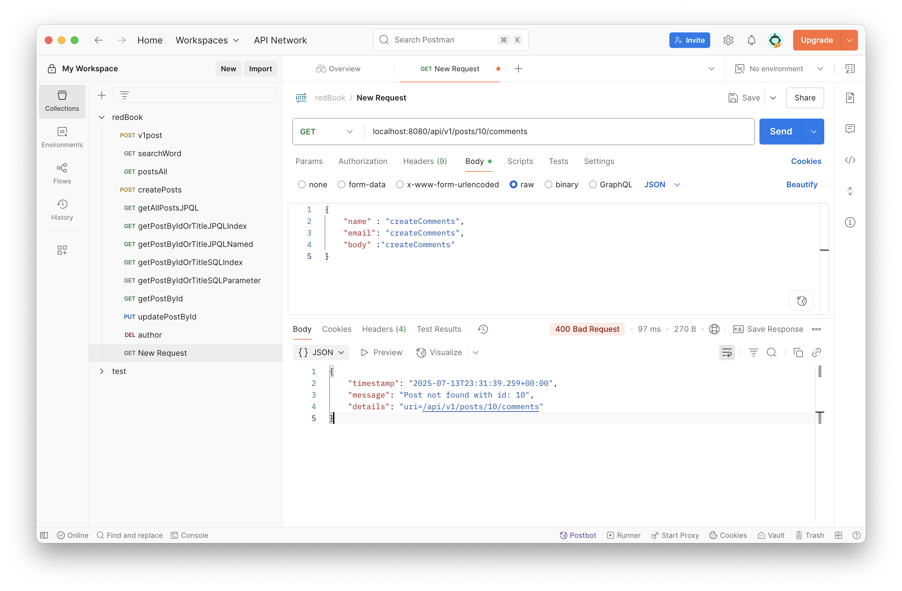
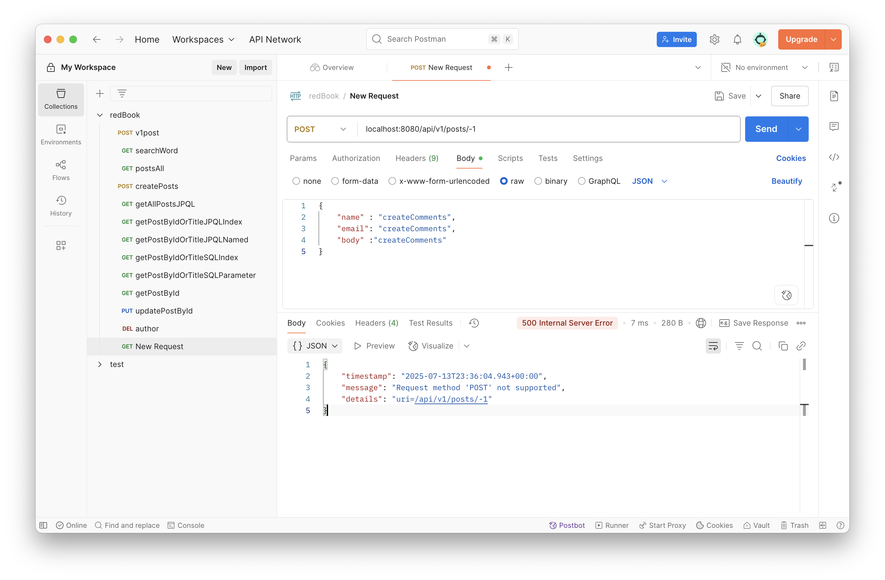

# Spring Assignment: Coding Questions

---

### 1. Add newly learned annotations to your previous cheatsheet, add explanations for these annotations.
- [annotations.md](annotations.md)
---

### 2. Walkthrough sample codes under [springboot-redbook commits](https://github.com/CTYue/springboot-redbook/commits/06_mapper-exception), you are supposed to bring up the application on your local.

---

### 3. Explain why do we need model mappers in Spring, and in what scenarios we need it.

ModelMapper simplifies mapping between DTOs (Data Transfer Objects) and entities.  
It is useful when:
- Transforming request payloads (DTO → Entity) for service logic.
- Transforming service results (Entity → DTO) for API responses.
- Avoiding repetitive and error-prone manual mapping.

---

### 4. Provide 3 examples in which model mapper will NOT map successfully, explain why.

1. **Different field names**: Source and target classes have mismatched field names.
2. **Nested objects**: Complex nested structures not properly configured in the mapper.
3. **Type mismatch**: Source and target fields are of incompatible types (e.g., String to Date).

Solution: Use `PropertyMap` or custom converters.

---

### 5. Explain how model mapper cast different data types between source object and target class.

ModelMapper uses built-in type converters for common conversions (e.g., String ↔ Integer). For complex types, custom converters or property mappings must be defined to handle data transformation.

---

### 6. Add your own API exceptions so that when something wrong happens in service layer, your REST API will return your customized response and status code.
```java
    @ExceptionHandler(PostNotFoundException.class)
    public ResponseEntity<ErrorDetails> handlePostNotFoundException(PostNotFoundException exception,
                                                               WebRequest webRequest) {
        ErrorDetails errorDetails = new ErrorDetails(new Date(), exception.getMessage(),
                webRequest.getDescription(false));

        return new ResponseEntity<>(errorDetails, HttpStatus.BAD_REQUEST);
    }
    
package com.chuwa.redbook.exception;

import org.springframework.http.HttpStatus;

public class PostNotFoundException extends RuntimeException {
  private final HttpStatus httpStatus;

  public PostNotFoundException(Long postId) {
    super("Post not found with id: " + postId); // 传给父类 RuntimeException
    this.httpStatus = HttpStatus.NOT_FOUND;
  }

  public HttpStatus getHttpStatus() {
    return httpStatus;
  }
}

//response body if request a postid not exist
{
        "timestamp": "2025-07-13T23:31:39.259+00:00",
        "message": "Post not found with id: 10",
        "details": "uri=/api/v1/posts/10/comments"
        }
        
```

---

### 7. Explain how Controller Advices work, is there any other approach to do same/similar global API exception handling?

- `@ControllerAdvice`: Intercepts exceptions thrown by controller methods and allows centralized handling.
- Alternative: Implement `HandlerExceptionResolver` or use `Filter`/`Interceptor` for exception handling. However, `@ControllerAdvice` is preferred for its simplicity and tight integration with Spring MVC.

---

### 8. What's the difference between throwing a regular exception and a customized API exception that will be eventually thrown to Controller Advice codes? Provide screenshots to explain your findings.

- **Regular exception**: Typically returns a generic 500 error without details.
- **Custom API exception**: Allows control over response structure and HTTP status. Useful for REST APIs to send meaningful error responses.
- 
- 
---

### 9. Write some regular expressions to restrict the value of attributes that your Post or Comment can have. You may use [https://regex101.com/](https://regex101.com/) to construct and test/validate your regular expression.

- **Post title (alphanumeric + spaces, 5–50 chars):**
  ```
  ^[A-Za-z0-9 ]{5,50}$
  ```
- **Comment (no special characters, max 200 chars):**
  ```
  ^[A-Za-z0-9 .,!?]{1,200}$
  ```

---

### 10. Explain Spring framework fundamental principles. And how can they help build business applications?

- **Dependency Injection (DI):** Decouples components, making code easier to test and maintain.
- **Aspect-Oriented Programming (AOP):** Handles cross-cutting concerns like logging and transactions.
- **Inversion of Control (IoC):** Framework manages object creation and wiring.
- **Bean lifecycle management:** Provides hooks for initialization and destruction.  
  These principles enable scalable and maintainable business applications.

---

### 11. Explain different types of dependency injection, explain their suitable use cases, and why field injection is not recommended in general. Provide necessary code snippets and screenshots if possible.

Constructor DI: public Service(UserRepository repo)   /Recommended for immutability       
Setter DI     : setUserRepository(UserRepository repo) /Optional dependencies              
Field DI      : @Autowired private UserRepository repo /Not recommended (hard to test/mock)

---

### 12. Explain different types of application context in Spring framework, with screenshots. You may take [springIOC](https://github.com/CTYue/springIOC) for reference.

- **AnnotationConfigApplicationContext:** Loads configuration from annotated classes.
- **ClassPathXmlApplicationContext:** Loads bean definitions from XML in classpath.
- **WebApplicationContext:** Specialized for web applications.


---

### 13. Compare `@Component` and `@Bean` and in which scenario they should be used.

@Component: Annotate classes for auto-detection
@Bean: Declare beans in `@Configuration` classes

Use `@Component` for self-contained classes. Use `@Bean` when you need more control over instantiation (e.g., from third-party libraries).

---

### 14. Explain Spring bean scopes and how to pick the correct bean scope.

Singleton: One instance per Spring container / Services, controllers    
Prototype: New instance per injection        / Stateful beans           
Request  : One per HTTP request              / Web request scoped beans 
Session  : One per HTTP session              / User session data        

---

### 15. Explain the difference between bean id and bean class.

- **Bean ID:** Unique name of the bean in the Spring container.
- **Bean Class:** The Java class that the bean represents.  
  You can have multiple beans of the same class with different IDs.

---

### 16. Explain that when a bean has multiple alternative implementations, how will Spring decide which bean implementation to inject/autowire?

- Spring uses `@Primary` annotation to select a default implementation.
- Alternatively, use `@Qualifier("beanName")` to specify the desired bean explicitly.

---