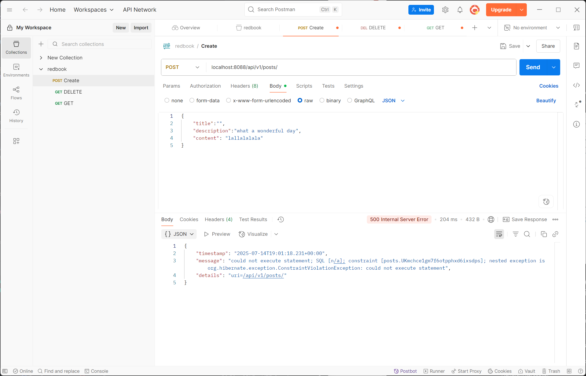
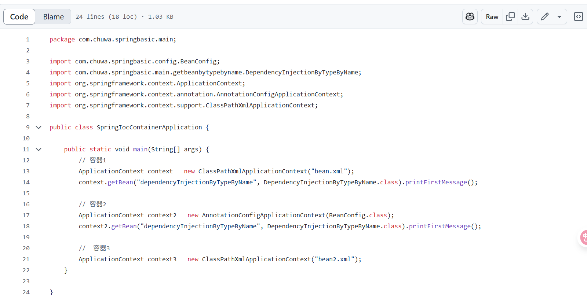
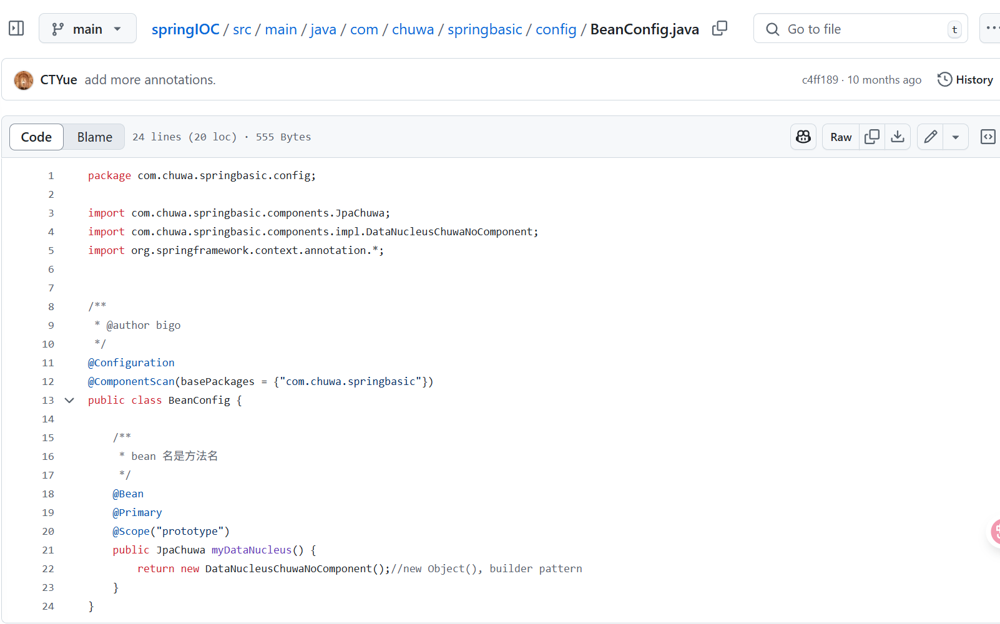

## 3. Explain why need model mappers in Spring, and in what scanrios we need it.

The goal of ModelMapper is to make object mapping easy, by automatically determining how one object model maps to another, based on conventions, in the same way that a human would - while providing a simple, refactoring-safe API for handling specific use cases.


Model Mappers are used to convert data between different object models, typically between:

* Entity classes (used in the persistence layer)

* DTO (Data Transfer Object) classes (used for data exchange, especially over APIs)

* View Models (used for presentation in the UI)

## 4. Provide 3 examples in which model mapper will NOT map succesfully, explain why.

* Mismatched Property Names:

Since firstName ≠ givenName and lastName ≠ familyName, no automatic mapping occurs.

```
public class UserEntity {
    private String firstName;
    private String lastName;
}

public class UserDTO {
    private String givenName;
    private String familyName;
}
```


* Complex Nested Objects or Collections:

ModelMapper doesn’t know how to extract nested values like customer.
getName() and assign it to a simple String field customerName.

```
public class OrderEntity {
    private CustomerEntity customer;
}

public class OrderDTO {
    private String customerName;
}
```

* Different Data Types:

ModelMapper can’t automatically convert between incompatible types (BigDecimal ↔ String).

```
public class ProductEntity {
    private BigDecimal price;
}

public class ProductDTO {
    private String price;  // wants price as String for display
}

```

## 5. Explain how model mapper cast different data types between source object and target class.

ModelMapper automatically maps properties between source and target objects based on their names and structure. When it comes to casting or converting between different data types, ModelMapper uses converters and type mappings to handle the differences. 
* Built-in Type Conversion
* Custom Converters (When Automatic Fails)
* TypeMap for More Complex Mapping

## 6. Add your own API exceptions so that when something wrong happens in service layer, your rest API will return your customized response and status code.
Code block
```
Post existingPost = postRepository.findByTitle(post.getTitle());
        if (existingPost != null) {
            throw new DuplicateTitleException("Post", "title", post.getTitle());
        }
```

When creating a new post, if the title already exists in the database, return a 409 Conflict error instead of 500 Internal Server Error, with the message: "Title already exists in the database."


## 7. Explain how Controller Advices work, is there any other approach to do same/similar global API exception handling?

@ControllerAdvice is a specialized component in Spring that allows you to handle exceptions, bind request/response bodies, and add model attributes across all controllers globally — instead of duplicating code in each controller.

Other approaches to global exception handling:
* @RestControllerAdvice (shorthand for @ControllerAdvice + @ResponseBody)

* HandlerInterceptor

* Extending ResponseEntityExceptionHandler


## 8. What's the difference between throwing a regular exception and a customized API exception that will be eventually thrown to Controller Advice codes? Please provide screenshots to explain your findings.

Regular Exception: Often 500 (Internal Server Error)

Debugging Ease: Harder

Clarity: Poor - often vague



Custom API Exception: Customizable (e.g. 409 Conflict)

Debugging Ease: Easier (explicit class name + message)

Clarity: Clear, descriptive messages


## 9. Write some regular expression to restrict the value of attributes that your Post or Comment can have. You may use https://regex101.com/ to construct and test/validate your regular expression.

regex for title  Letters, numbers, spaces, and punctuation only (1–100 characters), cannot be empty: `^[A-Za-z0-9 ,.!?'":;\-]{1,100}$`

## 10. Explain Spring framework fundamental principles. And how can they help build business applications?

*  Inversion of control (IoC)
    * Principle: Instead of an object being responsible for creating and managing its dependencies, the Spring IoC container handles the object creation, configuration, and lifecycle management.
    * How it helps business applications:
        * Loose coupling and modularity: IoC promotes creating loosely coupled components, making the application more flexible and easier to modify or extend.
        * Reduced boilerplate code: Developers can focus on business logic, as Spring handles the infrastructure concerns like object instantiation and dependency resolution.
        * Enhanced testability: Loosely coupled components are easier to test independently, improving code quality and speeding up development. 
* Dependency injection (DI)
    * Principle: DI is a pattern that implements IoC. It involves providing (injecting) dependencies into a class from an external source, rather than the class creating them itself. Spring achieves this through constructor injection, setter injection, or field injection.
    * How it helps business applications:
        * Decoupled architecture: DI reduces direct dependencies between classes, leading to a more modular and adaptable design.
        * Simplified configuration and management: Spring's IoC container automatically injects the necessary dependencies, removing the burden of manual dependency management from the developer.
        * Easier testing with mocks: Mock objects can be easily injected for testing purposes, making unit and integration testing more efficient and effective. 
3. Aspect-oriented programming (AOP)
    * Principle: AOP allows developers to modularize cross-cutting concerns, such as logging, security, and transaction management, which cut across multiple modules or layers of an application. Instead of scattering these concerns throughout the code, AOP enables their centralized definition and application, typically using aspects, join points, and advice.
    * How it helps business applications:
        * Cleaner and more maintainable code: Separating cross-cutting concerns from business logic results in a clearer and more organized codebase.
        * Reduced code duplication: Common functionalities like logging or transaction management can be reused across different parts of the application, eliminating redundant code.
        * Improved modularity: AOP enhances the modularity of the application by allowing the independent development and deployment of concerns like security or logging.
        * Easier modification and evolution: Changes to cross-cutting concerns can be made in one place (the aspect) without impacting the core business logic, simplifying application maintenance and evolution. 

## 11. Explain different types of dependency injection, explain their suitable use cases, and why fielde injection is not recommended in general. Please provide necessary code snippets and screenshots if possible.

1. Constructor Injection 

Best for: Required dependencies, immutability, unit testing.

Advantages:

* Makes dependencies explicit

* Supports final fields (immutability)

* Better for unit testing (easy to mock)

* Enforced at object creation

```
@Service
public class PostService {

    private final PostRepository postRepository;

    @Autowired
    public PostService(PostRepository postRepository) {
        this.postRepository = postRepository;
    }
}

```


2. Setter Injection

Best for: Optional or late-bound dependencies

Use when:

* The dependency is optional

* You may need to re-set the dependency later (e.g., testing, dynamic wiring)
```
@Service
public class NotificationService {

    private EmailSender emailSender;

    @Autowired
    public void setEmailSender(EmailSender emailSender) {
        this.emailSender = emailSender;
    }
}


```


3. Field Injection

* Hard to test (can't mock easily without reflection)

* Can lead to NullPointerException in some lifecycle scenarios 
```
@Service
public class UserService {

    @Autowired
    private UserRepository userRepository;
}


```
## 12. Explain different types of application context in Spring framework, with screenshots. You may take https://github.com/CTYue/springIOC for reference.

reference: https://www.baeldung.com/spring-application-context

* What is an ApplicationContext?
ApplicationContext is the central interface for Spring’s IoC container. It:

    * Loads bean definitions

    * Instantiates and wires beans

    * Provides access to Spring-managed beans



1. AnnotationConfigApplicationContext



2. AnnotationConfigWebApplicationContext
3. XmlWebApplicationContext
4. FileSystemXMLApplicationContext
5. ClassPathXmlApplicationContext

## 13. Compare @Component and @Bean and in which scenario they should be used.

* Use @Component for regular classes you write yourself and want to autodetect.

* Use @Bean when:

    * fine-grained control over instantiation

    * dealing with external classes (libraries, legacy)


## 14. Explain Spring bean scopes and how to pick the correct bean scope.

* Singleton (default — no need to specify): A single instance of the bean is created and shared throughout the entire Spring container's lifecycle. It's suitable for stateless services, utility classes, or configurations where only one instance is needed. 
* Prototype: A new instance each time the bean is requested
* Request Scope (in web apps only): One instance per HTTP request (only in web apps)
* Session: A single bean instance is created for the duration of an HTTP session.
* Application: A single instance is shared across the entire web application (ServletContext). 
* Websocket: A new bean instance is created for each WebSocket connection. 


## 15. Explain the difference between bean id and bean class.

* Bean ID: The name or identifier of the bean inside the Spring container. It's how you refer to or retrieve the bean.

* Bean class: 	The Java class that Spring will instantiate and manage as a bean. It tells Spring what type of object to create.


## 16. Explain that when a bean has multiple alternative implementations, how will Spring decide which bean implementation to inject/autowire?

* @Primary (Preferred by default)
* @Qualifier("beanName") (Explicit selection)
* Naming the @Bean method (Java Config)
