# HW11 - Hands-on Project Work

For all following coding questions, please provide code snippets in your markdown submission file, AND take screenshots, AND submit an executable Spring project which contains your code (this project can be a clone of Springboot-Redbook, as long as it has your own code.).

My forked repo link: https://github.com/hululu9/springboot-redbook/tree/06_mapper-exception

1. Add newly learned annotations to your previous cheatsheet, add explainations for these annotations.

   Updated in the branch hw10.

   

2. Walkthrough sample codes under https://github.com/CTYue/springboot-redbook/commits/06_mapper-exception, you are supposed to bring up the application on your local.

   **Screenshot for new added API endpoints testing:**

   **getAllPosts - pagination**

   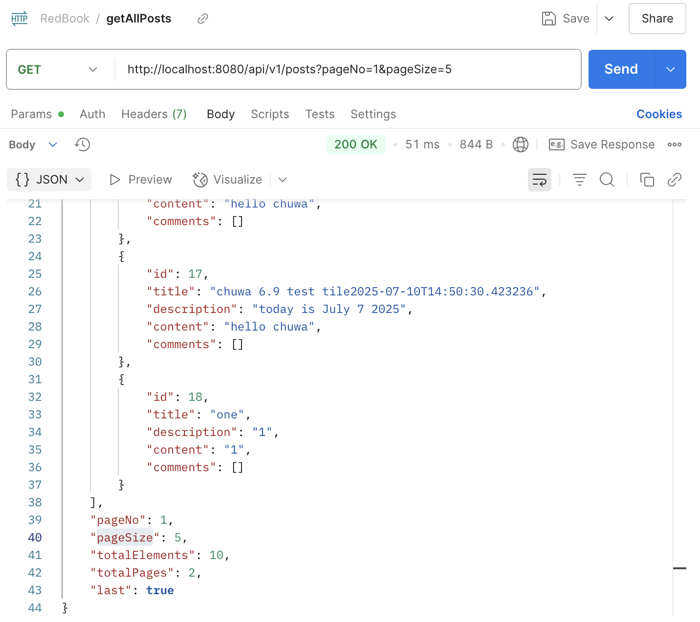

   **createComment**

   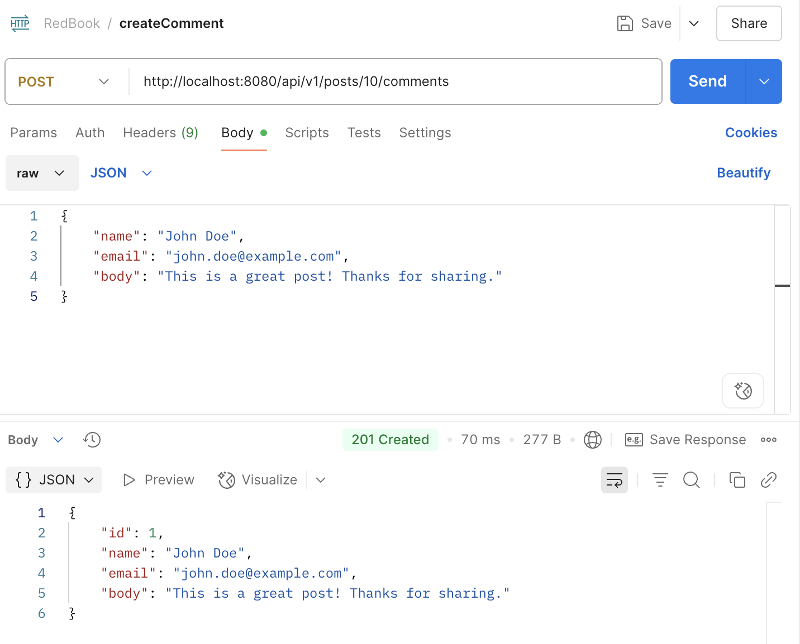

   **getCommentsByPostId**

   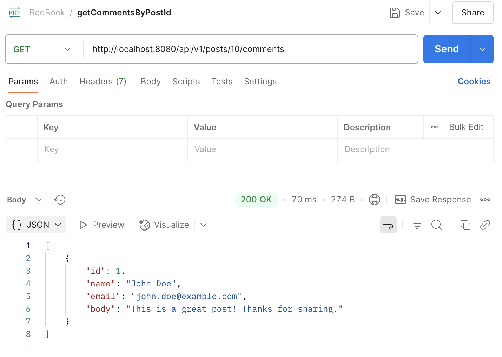

   **getCommentsById**

   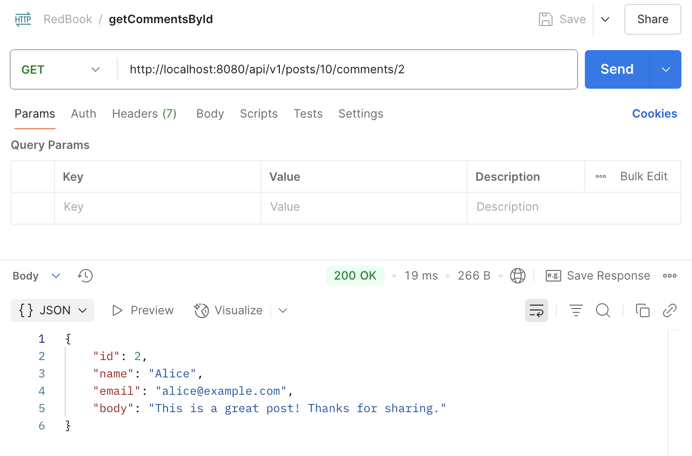

   **updateComment**

   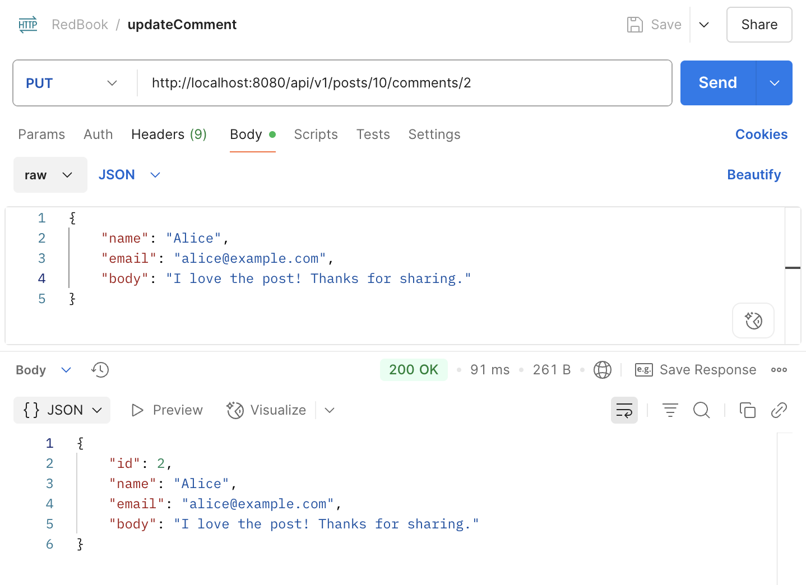

   **deleteComment**

   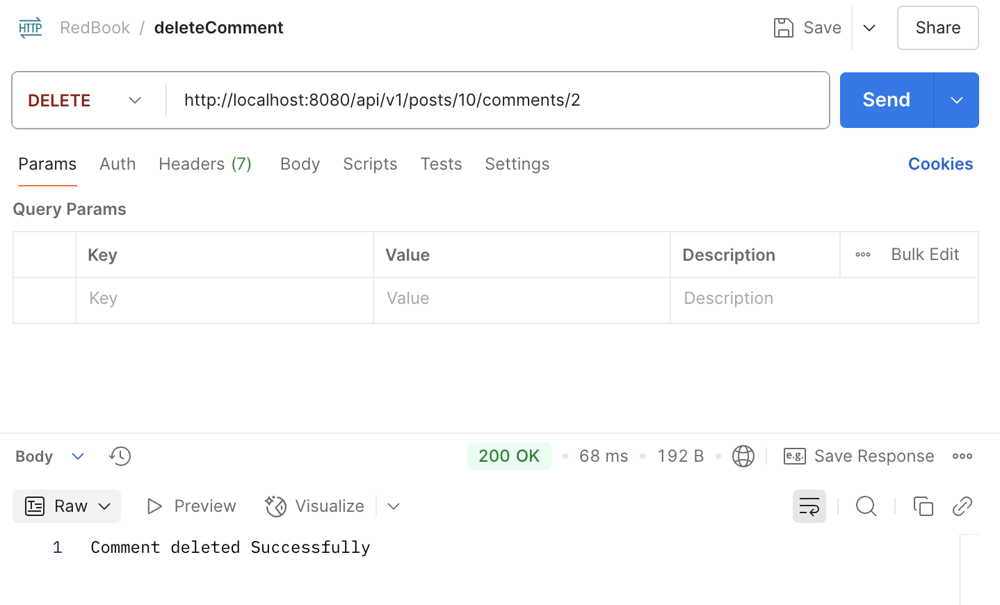

   

3. Explain why do we need model mappers in Spring, and in what scanrios we need it.

   Model mappers are used to automate the mapping between different object models (**DTOs and Entities**). We need that because we want to keep API data (DTOs) seperate from business/data layer models (Entities) in different layers. This prevents exposing the internal data and business logic to the front-end clients. And with it, we can reduce the boilerplate code compared to manually mapping.

   What scanrios we need:

   - Entity-DTO Mapping: transferring data between different layers
   - View Model Mapping (in UI Frameworks): convert backend data into View Models for presentation
   - Microservices Communication: transform internal domain models to API-specific formats when sending/receiving data from other services

   

4. Provide 3 examples in which model mapper will NOT map succesfully, explain why.

   - Field **types** don't match

     - Incompatible field types

       ```java
       public class UserDTO {
           private String birth; 
       }
       
       public class User {
           private Date birth; // custom date format: "2025-07-12"
       }
       ```

       Model mappers does not know how to parse the `String` into a `java.util.Date` using the correct format (`"yyyy-MM-dd"`).

     - Collections with different types

       ```java
       public class OrderDTO {
           private List<String> itemNames; // e.g., ["Apple", "Orange"]
       }
       
       public class Order {
           private List<Item> items;
       }
       
       public class Item {
           private String name;
       }
       ```

       Model mappers cannot map a `List<String>` into a `List<Item>` unless they know how to convert each `String` into an `Item` object.

   - Field **names** don't match

     ```java
     public class UserDTO {
         private int ege; // typo
     }
     
     public class User {
         private int age;
     }
     ```

     Model mappers cannot map the mismatched field name.

   - Mapping bewteen flat object and nested/embedded objects without flattening or expansion instructions

     ```java
     // mapping from a DTO with flat fields into an entity with nested/embedded objects
     public class UserDTO {
         private String street;
         private String city;
     }
     
     public class User {
         @Embedded
         private Address address;
     }
     
     @Embeddable
     public class Address {
         private String street;
         private String city;
     }
     ```

     Model mappers don't know how to compose `Address` from the flat fields, unless you tell it explicitly. Using custom mapping to fix it:

     ```java
     @Mapping(target = "address.street", source = "street")
     @Mapping(target = "address.city", source = "city")
     User toEntity(UserDTO dto);
     ```

     

5. Explain how model mapper cast different data types between source object and target class.

   When mapping, model mapper:

   1. Scans matching fields by name (or with custom configuration).

   2. Checks type compatibility:

      - If assignable: direct copy
      - If convertible: uses built-in (basic type casting)  or custom `Converters` to handle 
      - If not: fails or skips

   3. When model mapper can't handle type casting automatically:

      - Applies conversion logic using its internal `Converter<S, D>` interface

      In the case of String and Date type mapping above:

      ```java
      Converter<String, Date> stringToDate = new Converter<String, Date>() {
          public Date convert(MappingContext<String, Date> context) {
              try {
                  return new SimpleDateFormat("yyyy-MM-dd").parse(context.getSource());
              } catch (Exception e) {
                  return null; // or throw a custom error
              }
          }
      };
      
      // Register it in the configuration
      ModelMapper modelMapper = new ModelMapper();
      modelMapper.addConverter(stringToDate);
      
      ```

      - Use mapping expressions
      - Preprocess data before mapping

   

6. Add your own API exceptions so that when something wrong happens in service layer, your rest API will return your customized response and status code.

   Updates in *DuplicateTitleException*

   ```java
   @ResponseStatus(value = HttpStatus.CONFLICT)
   public class DuplicateTitleException extends RuntimeException {
       public DuplicateTitleException(String title) {
           super(String.format("Post with title '%s' already exists", title));
       }
   }
   ```

   Updates in *GlobalExceptionHandler*

   ```java
   @ExceptionHandler(DuplicateTitleException.class)
   public ResponseEntity<ErrorDetails> handleDuplicateTitleException(DuplicateTitleException exception,
                                                                     WebRequest webRequest) {
       ErrorDetails errorDetails = new ErrorDetails(new Date(), exception.getMessage(),
               webRequest.getDescription(false));
       return new ResponseEntity<>(errorDetails, HttpStatus.CONFLICT);
   }
   ```

   Updates in *PostRepository* (add method to check title existence)

   ```java
   @Repository
   public interface PostRepository extends JpaRepository<Post, Long> {
       // Check if title exists
       boolean existsByTitle(String title);
   }
   ```

   Updates in *PostServiceImpl*

   ```java
   @Override
   public PostDto createPost(PostDto postDto) {
       // Check for duplicate title
       if (postRepository.existsByTitle(postDto.getTitle())) {
           throw new DuplicateTitleException(postDto.getTitle());
       }
   
       Post post = modelMapper.map(postDto, Post.class);
   
       Post savedPost = postRepository.save(post);
   
       return modelMapper.map(savedPost, PostDto.class);
   }
   ```

   Testing in Postman:

   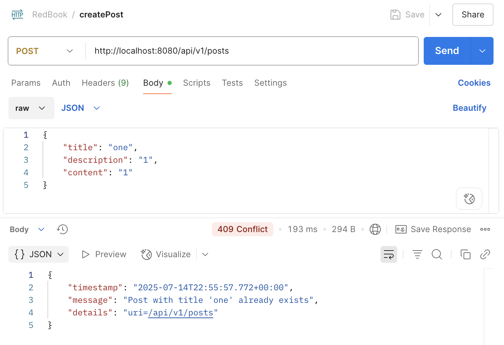

   

7. Explain how Controller Advices work, is there any other approach to do same/similar global API exception handling?

   `@ControllerAdvice` allows handling exceptions across the whole application, not just to an individual controller. It often used with `GlobalExceptionHandler` class to do the centralized exception handlings.

   How it works:

   1. Spring catches exceptions thrown from any controller method.
   2. It checks all registered `@ControllerAdvice` classes (*GlobalExceptionHandler*).
   3. Checks if an `@ExceptionHandler` method in the class matches the exception type. If yes, it executes that method and returns the response.
   4. Spring handles the HTTP status code based on`@ResponseStatus `or the returned `ResponseEntity`

   Other alternative approach：

   1. Using `@ExceptionHandler` locally in each controller or try-catch block. But it's not reusable.

      ```java
      @RestController
      @RequestMapping("/api/v1/posts")
      public class PostController {
      
      	@ExceptionHandler(ResourceNotFoundException.class)
          public ResponseEntity<ErrorDetails> handleResourceNotFoundException(ResourceNotFoundException exception,
                                                                              WebRequest webRequest) {
              ErrorDetails errorDetails = new ErrorDetails(new Date(), exception.getMessage(),
                      webRequest.getDescription(false));
      
              return new ResponseEntity<>(errorDetails, HttpStatus.NOT_FOUND);
          }
      }
      
      ```

   2. Implementing `HandlerExceptionResolver` Interface: A low-level interface that gives full control over how exceptions are resolved.

   3. Using `Filter` or `OncePerRequestFilter`: A servlet-level component that intercepts all HTTP requests before they hit Spring controllers.

   4. Custom `ResponseEntityExceptionHandler` Subclass: `ResponseEntityExceptionHandler` is an abstract class that provides methods for handling various exceptions. Methods can be overridden to customize the error response for specific exceptions.

      

8. What's the difference between throwing a regular exception and a customized API exception that will be eventually thrown to Controller Advice codes? Please provide screenshots to explain your findings.

   A regular exception:  

   - Cannot set proper HTTP status, just a general one (500 Internal Server Error)

   - No structured error response by default (e.g., stack trace in response)

   A customized API exception:

   - Return a meaningful HTTP status and structured error response

   - Can fully control over error message and format

     ```java
     // Check for duplicate title using a regular exception handler
     if (postRepository.existsByTitle(postDto.getTitle())) {
         throw new IllegalArgumentException("Post title already exists: " + postDto.getTitle());
     }
     ```

     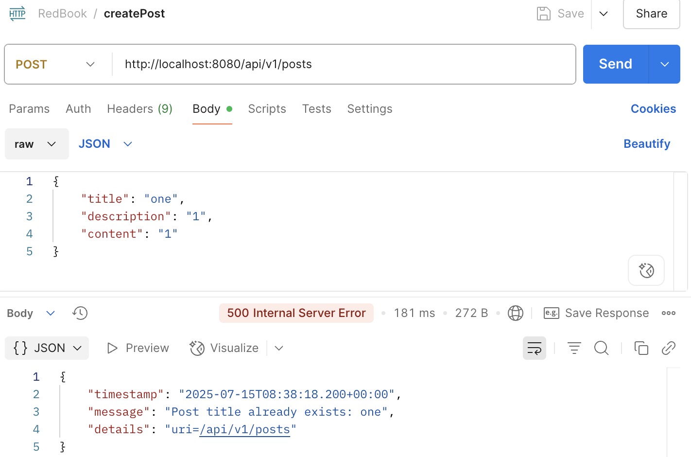

     ```java
     // Check for duplicate title using a custom API exception handler
     if (postRepository.existsByTitle(postDto.getTitle())) {
         throw new DuplicateTitleException(postDto.getTitle());
     }
     ```

     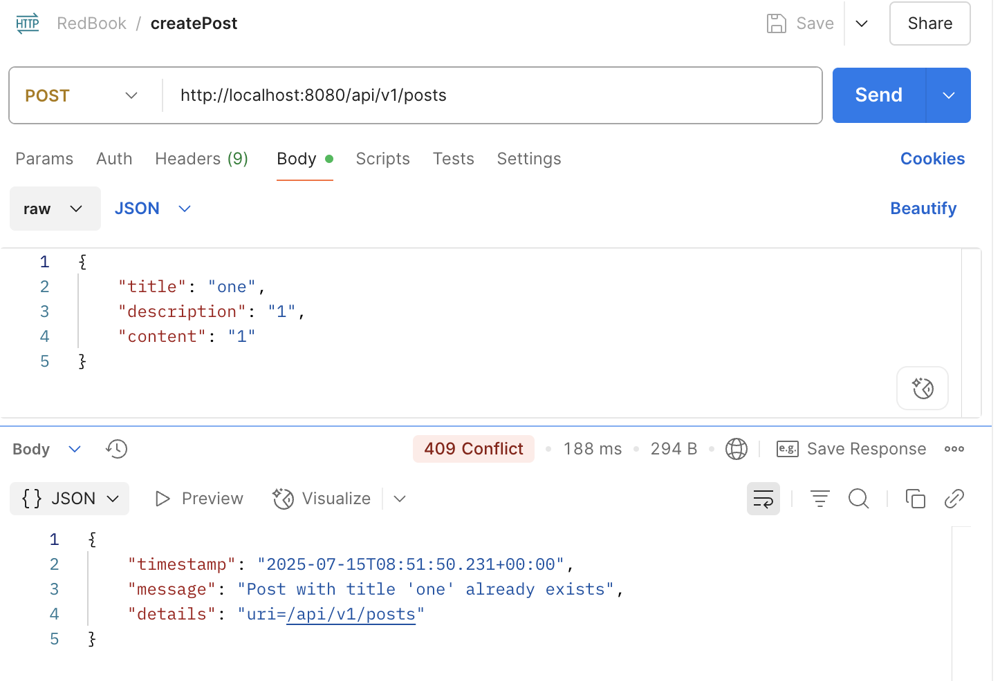

   

9. Write some regular expression to restrict the value of attributes that your Post or Comment can have. You may use https://regex101.com/ to construct and test/validate your regular expression.

   Regular expressions validation on *CommentDto*:

   ```java
   public class CommentDto {
   
       private long id;
       @NotEmpty(message = "Name should not be null or empty")
       @Pattern(
               regexp = "^[a-zA-Z0-9_-]{3,20}$",
               message = "Name must be 3–20 characters long and can only contain letters, numbers, underscores, and hyphens"
       )
       private String name;
       @NotEmpty(message = "Email should not be null or empty")
       @Pattern(
               regexp = "^[a-zA-Z0-9._%+-]+@[a-zA-Z0-9.-]+\\.[a-zA-Z]{2,}$",
               message = "Email format is invalid"
       )
       private String email;
       @NotEmpty
       @Size(min = 5, message = "Comment body must be minimum 5 characters")
       private String body;
       
       // ... 
   ```

   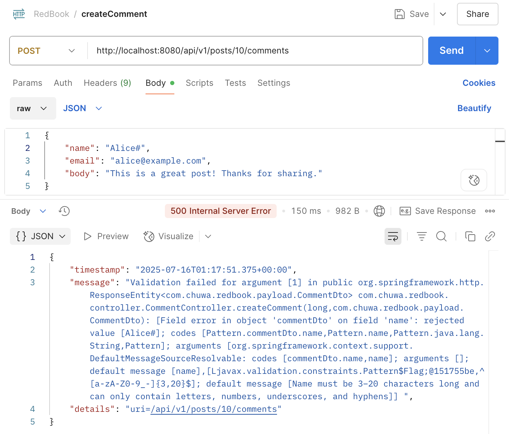

   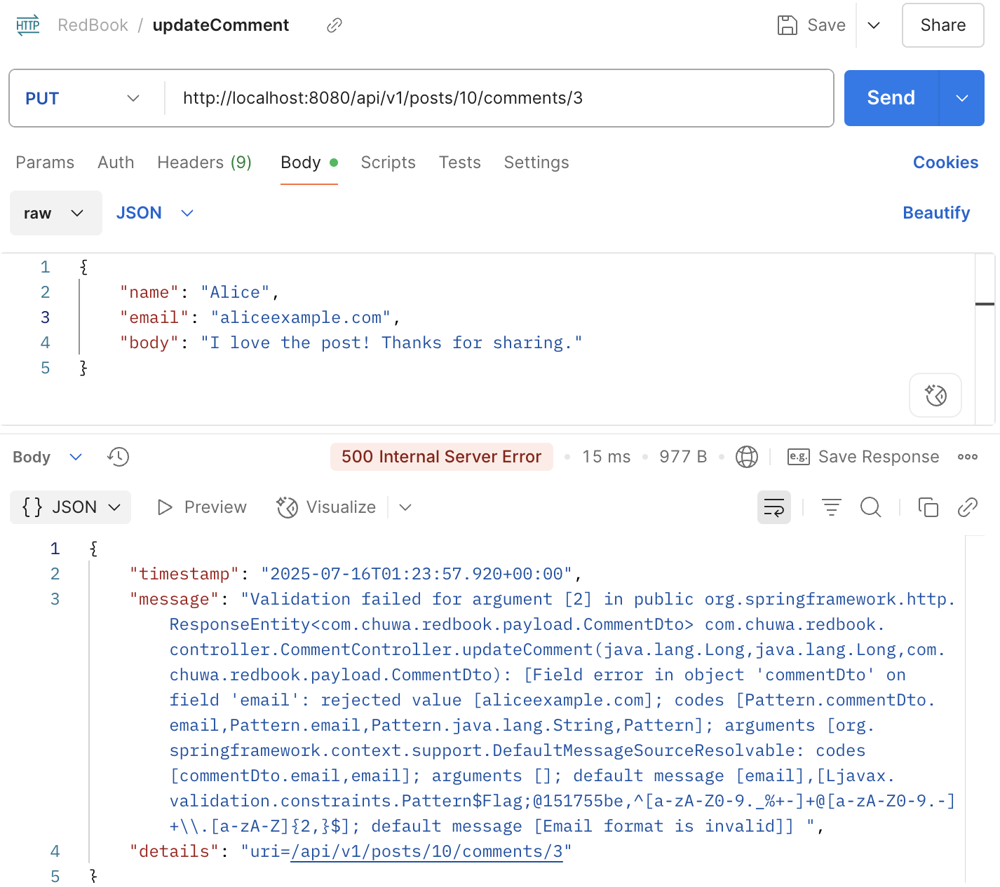

   

10. Explain Spring framework fundamental principles. And how can they help build business applications?

    - **IoC(Inversion of Control)**

      The control of objects (beans) creation and their dependencies is shifted from the application code to Spring container. Spring can create, configure, manage the lifecycle of beans.

    - **DI(Dependency Injection)**

      The specific way of implementing IoC which means providing an object's dependencies from the outside (using `@Autowired` to inject) rather than creating them internally (too much manually "new").	

    **How help:**

    - Promotes loose coupling: they decouples the application components from their implementation logic

    - Easier testing: dependencies can be easily mocked or stubbed in tests

    - Flexible configuration: beans can be configured through annotations or external files (e.g., YAML, XML)

      

11. Explain different types of dependency injection, explain their suitable use cases, and why field injection is not recommended in general. Please provide necessary code snippets and screenshots if possible.

    - Constructor-based(preferred)

      - Dependencies are injected via constructor parameters
      - Used when the dependencies are **mandatory** (required at compile-time) or **immutable** (can marked `final`)

      ```java
      @RestController
      public class UserController {
          // can set final to constructor parameters 
      	private final UserService userService;
      	
      	@Autowired
      	public UserController(UserService userService) {
              this.userService = userService;
          }        
      }
      ```

    - Setter-based

      - Dependencies are injected via setter methods, clear and visible (can be easily searched in IDE)
      - Used when the dependency is **optional** and need to be **changed ** after injection

      ```java
      @RestController
      public class UserController {
      	private UserService userService;
      	
      	@Autowired
      	public void setUserService(UserService userService) {
              this.userService = userService;
          }        
      }
      ```

    - Field-based(not recommended)

      - Dependencies are injected directly into fields
      - **Not recommend:**
        - Hard to determine when the dependency is injected
        - Hard to test: requires reflection or Spring context
        - No immutability: actullay Spring sets the field **after** the object is created, final means the field can't be assigned, so final field is not allowed

      ```java
      @RestController
      public class UserController {
      	@Autowired
      	private UserService userService;    
      }
      ```

      

12. Explain different types of application context in Spring framework, with screenshots. You may take https://github.com/CTYue/springIOC for reference.

    `ApplicationContext` is the **central interface** that represents the Spring IoC container, which is responsible for managing the creation, configuration, and lifecycle of beans. 

    Different types:

    - `ClassPathXmlApplicationContext`:

      - Loads bean definitions from XML files located in the application's classpath
      - Used in traditional Spring apps

      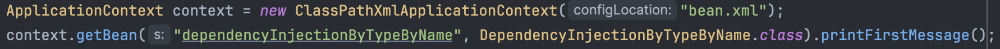

      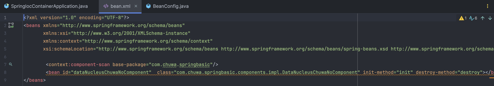

    - `FileSystemXmlApplicationContext`:

      - Loads bean definitions from XML files located on the file system, requiring a full path to the configuration file

      ```java
      ApplicationContext context = new FileSystemXmlApplicationContext("/configs/app-beans.xml");
      ```

    - `AnnotationConfigApplicationContext`:

      - Loads bean definitions from Java configuration classes annotated with `@Configuration`
      - Commonly used in modern Spring applications

      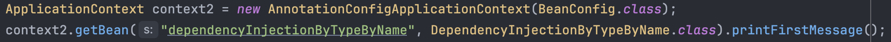

      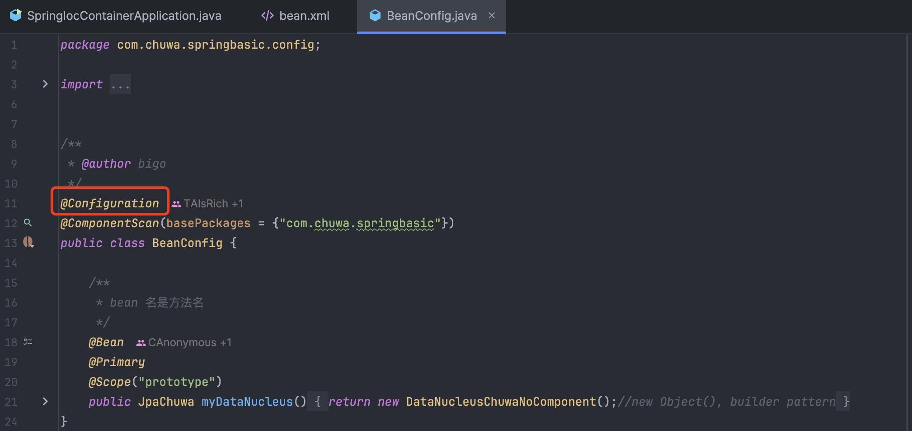

      

13. Compare @Component and @Bean and in which scenario they should be used.

    @Component

    - Used on a **class**: marks the class as a Spring-managed bean

    - Spring automatically detect it through **component scanning**

      ```java
      @ComponentScan(basePackages = {"com.chuwa.springbasic"})
      ```

    - Use it on **your own classes** you have control

    @Bean

    - Used on a **method**: declares a bean from a method in `@Configuration` class

    - Registered via **explicit configuration**

    - Use it on a **third-party class** which is not annotated with `@Component` and need some **customize construction logic**

      

14. Explain Spring bean scopes and how to pick the correct bean scope.

    Bean scope defines the lifecycle and visibility of a bean within the Spring container.

    | Scope         | Description                                                  | Lifetime         | Usage                                        |
    | ------------- | ------------------------------------------------------------ | ---------------- | -------------------------------------------- |
    | **singleton** | A single Bean instance per Spring container **(default) **   | Entire app       | Stateless, reusable components               |
    | **prototype** | A new bean instance is created **every time** it’s requested through a `getBean()` method call on the container | Per request      | Stateful components needing unique instances |
    | request       | One instance per HTTP request (web only)                     | Per HTTP request | Web applications for request-specific data   |
    | session       | One instance per HTTP session (web only)                     | Per session      | Web applications for session-specific data   |
    | application   | One instance per ServletContext (web only)                   | Per app context  | Global shared components                     |
    | websocket     | One instance per WebSocket                                   | Per connection   | WebSocket session data                       |

    

15. Explain the difference between bean id and bean class.

    **Bean id**: a unique identifier for the bean within the container

    **Bean class**: the actual Java class used to create the bean instance (return new ...)

    Spring needs the bean class to know how to create the bean and to perform type-based dependency injection. It needs the bean ID to uniquely identify the bean when multiple candidates exist or when need to retrieve it by name.

    XML configuration:

    Bean id  = "dataNucleusChuwaNoComponent"; Bean class =  *DataNucleusChuwaNoComponent*

    ```java
    <bean id="dataNucleusChuwaNoComponent"  class="com.chuwa.springbasic.components.impl.DataNucleusChuwaNoComponent" init-method="init" destroy-method="destroy"></bean>
    ```

    BeanConfig.java:

    Bean id  = "myDataNucleus"; Bean class = *DataNucleusChuwaNoComponent*

    ```java
    @Configuration
    @ComponentScan(basePackages = {"com.chuwa.springbasic"})
    public class BeanConfig {
        @Bean
        @Primary
        @Scope("prototype")
        public JpaChuwa myDataNucleus() {
            return new DataNucleusChuwaNoComponent();//new Object(), builder pattern
        }
    }
    ```

    

16. Explain that when a bean has multiple alternative implementations, how will Spring decide which bean implementation to inject/autowire?

    Spring performs **type-based injection** by default. If there’s **only one bean** of the required type, Spring injects it automatically.

    However, if there are **multiple implementations** of the interface:

    ```java
    public interface PaymentService {
        void pay();
    }
    // multiple alternative implementations
    @Component
    public class CreditCardPaymentService implements PaymentService {
        public void pay() { /* ... */ }
    }
    
    @Component
    public class PayPalPaymentService implements PaymentService {
        public void pay() { /* ... */ }
    }
    
    // when try to inject a bean:
    @Autowired
    private PaymentService paymentService;
    
    ```

    Priority: @Qualifier > @Primary > byName 

     1. @Qualifier: check there is @Qualifier. If yes, use this exact bean ("payPalPaymentService"), even there is another bean annotated by @Primary.

        ```java
        @Autowired
        @Qualifier("payPalPaymentService") // Bean ID = class name by default
        private PaymentService paymentService;
        ```

    2. @Primary: If no @Qualifier, but there is @Primary, use this bean by default.

       ```java
       @Component
       @Primary
       public class CreditCardPaymentService implements PaymentService { 
           public void pay() { /* ... */ }
       }
       ```

     3. If no @Qualifier or @Primary, and if the injected field name matches a bean ID, use this bean.

        ```java
        @Autowired
        private CreditCardPaymentService creditCardPaymentService; 
        ```

	4. If none of the above, will throw an exception (`NoUniqueBeanDefinitionException`).