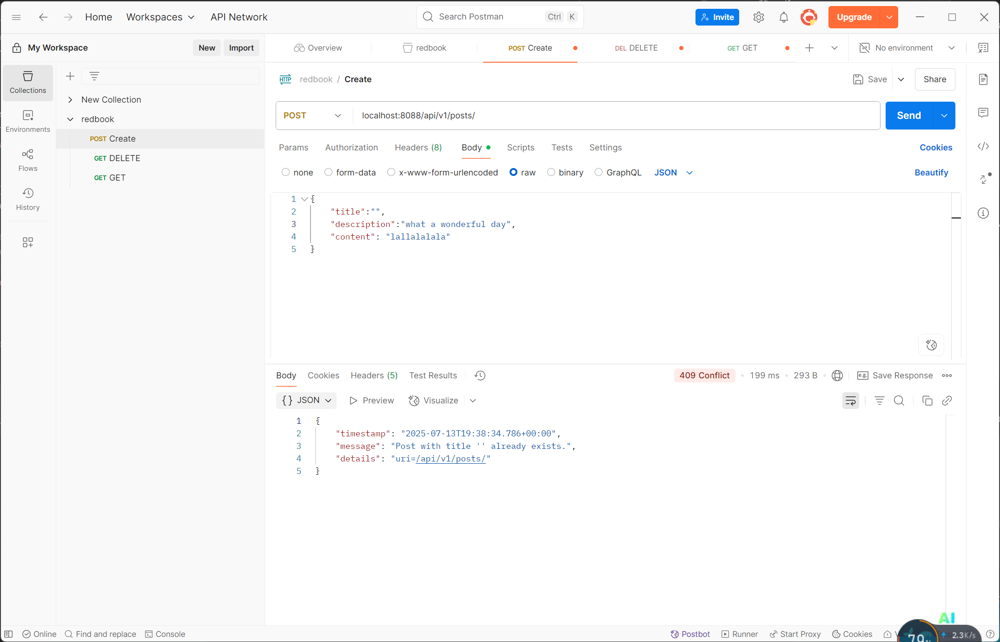

## 3. Explain why need model mappers in Spring, and in what scanrios we need it.

The goal of ModelMapper is to make object mapping easy, by automatically determining how one object model maps to another, based on conventions, in the same way that a human would - while providing a simple, refactoring-safe API for handling specific use cases.


Model Mappers are used to convert data between different object models, typically between:

* Entity classes (used in the persistence layer)

* DTO (Data Transfer Object) classes (used for data exchange, especially over APIs)

* View Models (used for presentation in the UI)

## 4. Provide 3 examples in which model mapper will NOT map succesfully, explain why.

* Mismatched Property Names:

Since firstName ≠ givenName and lastName ≠ familyName, no automatic mapping occurs.

```
public class UserEntity {
    private String firstName;
    private String lastName;
}

public class UserDTO {
    private String givenName;
    private String familyName;
}
```


* Complex Nested Objects or Collections:

ModelMapper doesn’t know how to extract nested values like customer.
getName() and assign it to a simple String field customerName.

```
public class OrderEntity {
    private CustomerEntity customer;
}

public class OrderDTO {
    private String customerName;
}
```

* Different Data Types:

ModelMapper can’t automatically convert between incompatible types (BigDecimal ↔ String).

```
public class ProductEntity {
    private BigDecimal price;
}

public class ProductDTO {
    private String price;  // wants price as String for display
}

```

## 5. Explain how model mapper cast different data types between source object and target class.

ModelMapper automatically maps properties between source and target objects based on their names and structure. When it comes to casting or converting between different data types, ModelMapper uses converters and type mappings to handle the differences. 
* Built-in Type Conversion
* Custom Converters (When Automatic Fails)
* TypeMap for More Complex Mapping

## 6. Add your own API exceptions so that when something wrong happens in service layer, your rest API will return your customized response and status code.
Code block
```
Post existingPost = postRepository.findByTitle(post.getTitle());
        if (existingPost != null) {
            throw new DuplicateTitleException("Post", "title", post.getTitle());
        }
```

When creating a new post, if the title already exists in the database, return a 409 Conflict error instead of 500 Internal Server Error, with the message: "Title already exists in the database."




