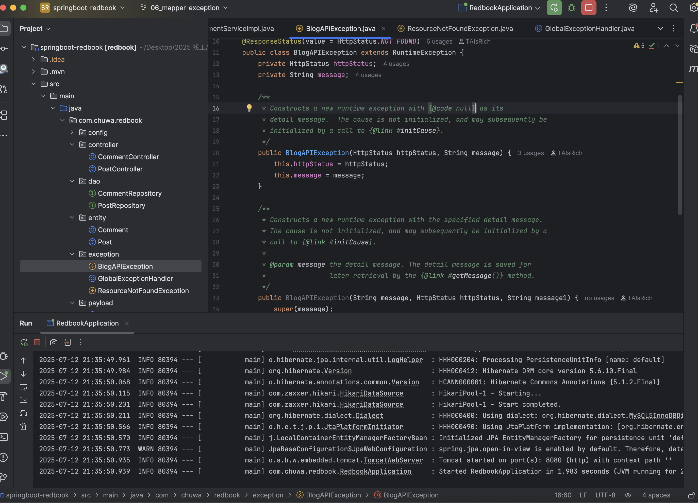
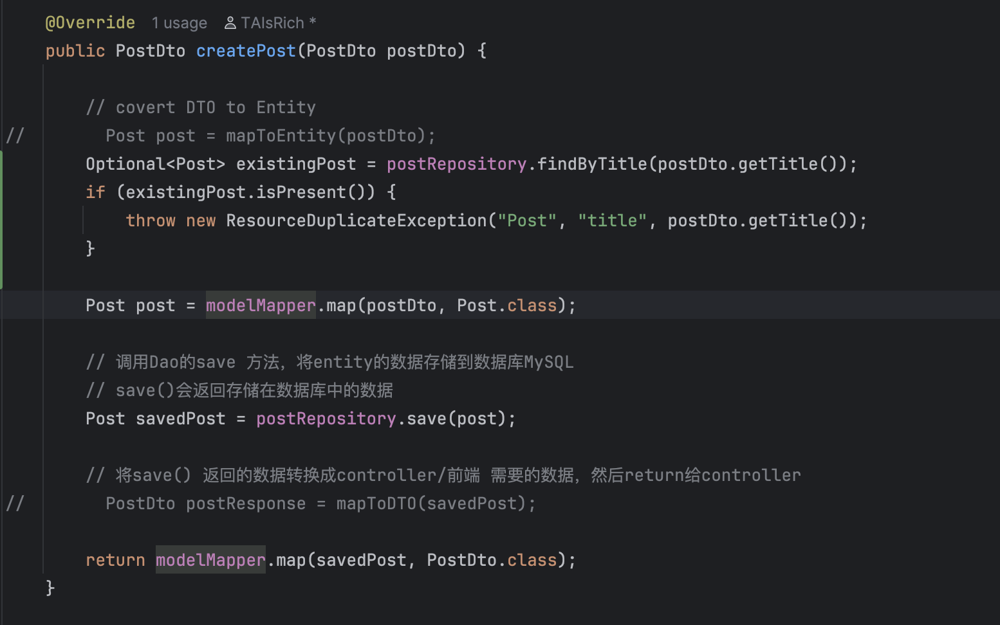
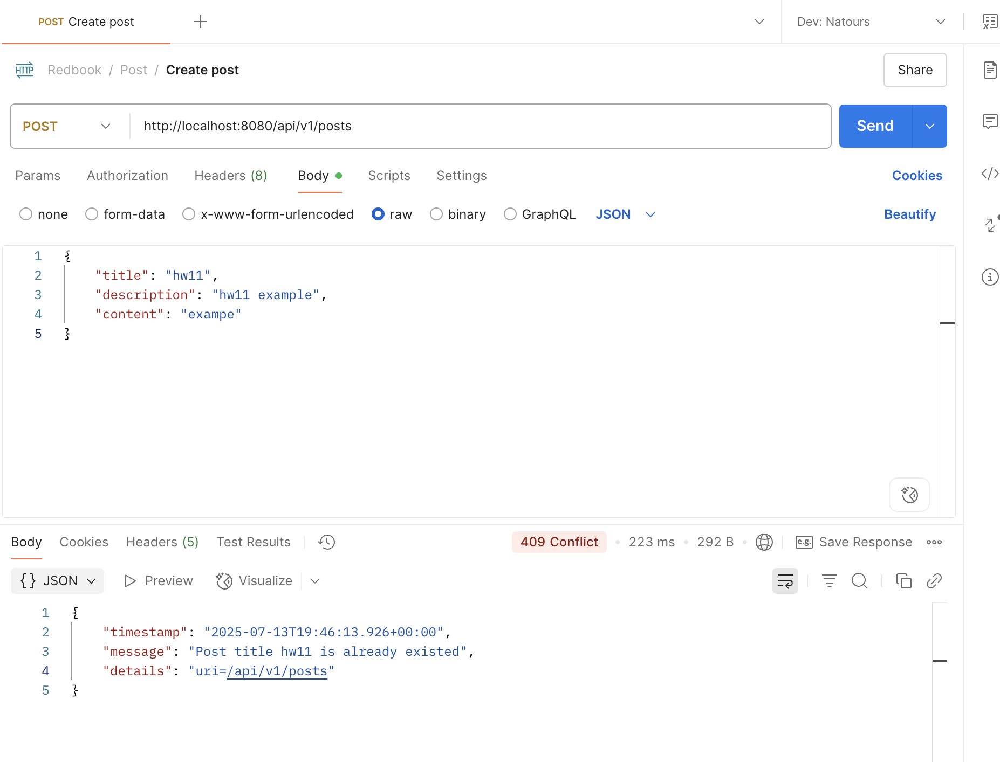
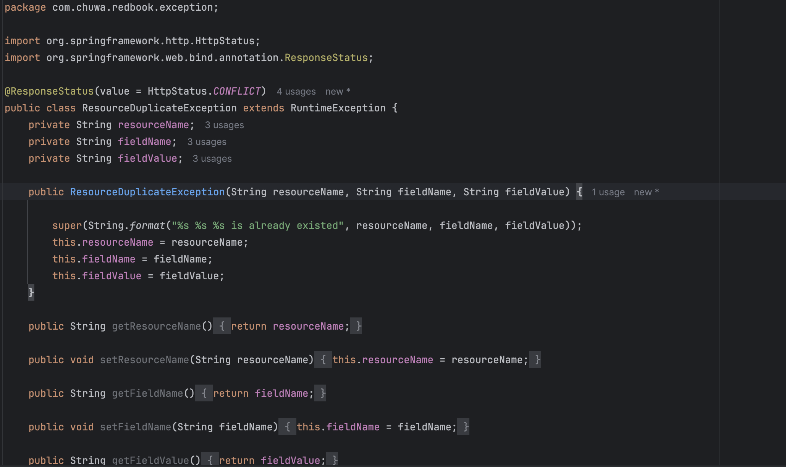
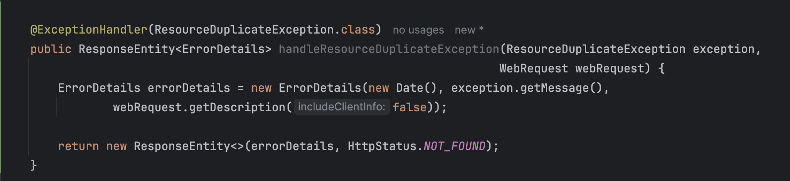
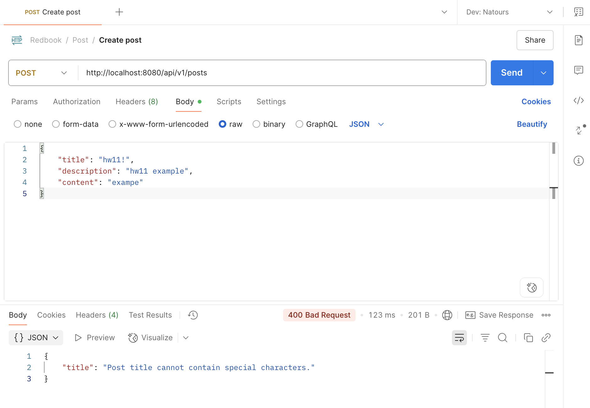

<p> 1. Add newly learned annotations to your previous cheatsheet, add explanations for these annotations. </p>

<p> 2. Walkthrough sample codes under https://github.com/CTYue/springboot-redbook/commits/06_mapper-exception, 
you are supposed to bring up the application on your local. </p>

<p> 3. Explain why do we need model mappers in Spring, and in what scenarios we need it. </p>
Map one object model to another. Mapping between DTO and Entity helps keep data models clean, secure, and decoupled.
This mapping occurs between entity class and dto class. 
```
modelMapper.map(commentDto, Comment.class)
```
<p> 4. Provide 3 examples in which model mapper will NOT map successfully, explain why. </p>
When field name does not match, model mapper will NOT map successfully.
```
public class UserDto {
    private String fullName;
}
public class User {
    private String name;
}
```
When collections have field name that does not match, model mapper will NOT map successfully.
```
public class PostDto {
    private List<CommentDto> comments;
}
public class Post {
    private List<Comment> comments;
}
```

When nested field name does not match, model mapper will NOT map successfully.
```
public class OrderDto {
    private String customerName;
}
public class Order {
    private Customer customer;
}
public class Customer {
    private String name;
}
```

<p> 5. Explain how model mapper cast different data types between source object and target class. </p>

```
Source	     Target
String    →  Integer	
int       →  String	
Date      →  String	
Enum      →  String	
String    →  Boolean	
```

<p> 6. Add your own API exceptions so that when something wrong happens in service layer, your rest API will
   return your customized response and status code. </p>



<p> 7. Explain how Controller Advices work, is there any other approach to do same/similar global API exception
   handling? </p>
It's class level handler. Within the class, define methods annotated with @ExceptionHandler to specify which types of exceptions 
should be handled globally. 

<p> 8. What's the difference between throwing a regular exception and a customized API exception that will be
   eventually thrown to Controller Advice codes? Please provide screenshots to explain your findings. </p>
A customized API exception allows developers to hide some information and expose certain messages to the clients and 
throw more accurate status code to the clients. 
A regular exception contains the full exception stack trace and 500 error will be thrown. 



<p> 9. Write some regular expression to restrict the value of attributes that your Post or Comment can have. You
   may use https://regex101.com/ to construct and test/validate your regular expression. </p>
Add regular expression to restrict the title to have special characters


<p> 10. Explain Spring framework fundamental principles. And how can they help build business applications? </p>
<p> IoC(Inversion of control): objects/instances are managed by Spring framework.  </p>
<p> Dependency Injection: an object receives its dependencies from an external source rather than creating them internally</p>
They offers loose coupling which means components do not rely on concrete implementations, changes in implementations
do not affect the other components. 

<p> 11. Explain different types of dependency injection, explain their suitable use cases, and why field injection
    is not recommended in general. Please provide necessary code snippets and screenshots if possible. </p>
Constructor injection
```
@Autowired
public DependencyInjectionTypesConstructor(JpaICC jpaICC) {
    this.jpaICC = jpaICC;
}
```
Setter injection
```
@Autowired
public void setJpaICC(JpaICC jpaICC) {
    this.jpaICC = jpaICC;
}
```

Field injection(not recommended) because it cannot provide immutability, may lead to dependencies being unsatisfied 
at runtime, make test code more complex, cause circular dependencies.
```
@Autowired
private JpaICC jpaICC;
```

<p> 12. Explain different types of application context in Spring framework, with screenshots. You may take https://
    github.com/CTYue/springIOC for reference. </p>
Loading bean definitions from an XML file on the classpath
```
ApplicationContext context = new ClassPathXmlApplicationContext("bean.xml");
DataNucleusChuwaNoComponent dataNucleusChuwaNoComponent = context.getBean("dataNucleusChuwaNoComponent", com.chuwa.springbasic.components.impl.DataNucleusChuwaNoComponent.class);
```

AnnotationConfigApplicationContext is a standalone application context which accepts annotated classes as input. 
```
ApplicationContext context2 = new AnnotationConfigApplicationContext(BeanConfig.class);
context2.getBean("dependencyInjectionByTypeByName", DependencyInjectionByTypeByName.class).printFirstMessage();
```

<p> 13. Compare @Component and @Bean and in which scenario they should be used. </p>
@Component on top of the class to register it as a Bean.
```
@Component
public class HibernateChuwa implements JpaChuwa {
    @Override
    public void printMessage() {
        System.out.println("Message from " + getClass().getName() + this.hashCode());
    }
}
```
@Bean on top of a method that returns a new instance of that type. 
```
@Bean
@Primary
@Scope("prototype")
public JpaChuwa myDataNucleus() {
    return new DataNucleusChuwaNoComponent();
}
```
<p> 14. Explain Spring bean scopes and how to pick the correct bean scope. </p>
```
singleton	Default. Only one shared instance per Spring container	
prototype	New instance every time it's requested	
request	    One bean per HTTP request (Spring Web only)	
session	    One bean per HTTP session	
application	One bean per ServletContext
websocket	One bean per WebSocket session 
```

<p> 15. Explain the difference between bean id and bean class. </p>
The bean ID is the unique identifier for the bean in the Spring container. The bean Id is used to identify which bean 
is used.
The bean class is the Java class whose object will be created and managed as a bean. It's the type of the bean.

<p> 16. Explain that when a bean has multiple alternative implementations, how will Spring decide which bean
    implementation to inject/autowire? </p>
<p> @Primary Mark one bean as the default </p>
<p> @Qualifier Specify which bean to inject using a name</p>
