# HW11 Mapper, Exception, Validation, SpringBasics

---

## 1. Add newly learned annotations to your previous cheatsheet, add explanations for these annotations.

[annotations.md](annotations.md)

---

## 2. Walkthrough sample codes under https://github.com/CTYue/springboot-redbook/commits/06_mapper-exception, you are supposed to bring up the application on your local.

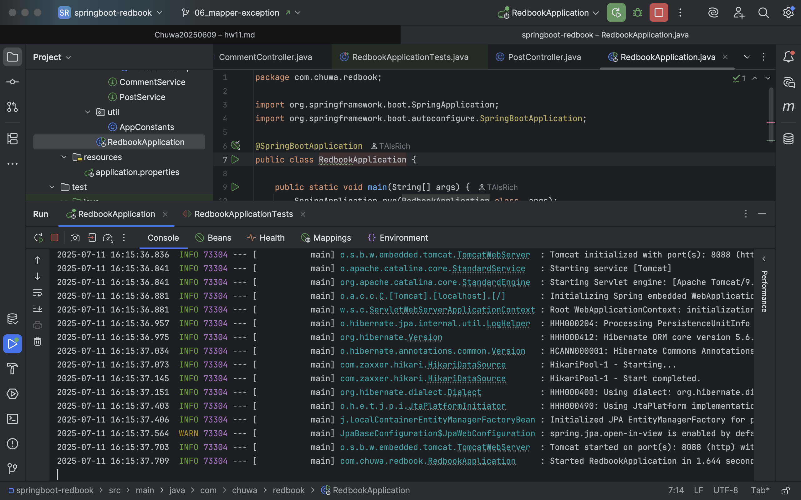

---

## 3. Explain why do we need model mappers in Spring, and in what scenarios we need it.

### Why Do We Need Model Mappers in Spring?

In Spring applications—especially those following layered architectures (Controller → Service → Repository)—**Model
Mappers** are used to **convert between different object models**, most commonly:

- **Entity ↔ DTO (Data Transfer Object)**

- **Response DTO ↔ Entity**

#### Key Reasons for Using Model Mappers:

1. **Separation of Concerns**  
   DTOs often contain only the data relevant for the client, while entities contain all fields used internally (e.g.,
   IDs, timestamps, relationships). Mapping helps separate these concerns.

2. **Security and Encapsulation**  
   You don’t want to expose your entire entity structure (e.g., passwords, roles, internal IDs) directly to clients. A
   DTO gives you control over what’s exposed.

3. **Data Shaping**  
   You may want to return a flat or simplified structure in your API response, which differs from your entity’s
   structure.

4. **Validation and Input Sanitization**  
   Input DTOs can be validated separately from your business models, allowing better control over request data.

5. **Avoid Tightly Coupling Layers**  
   Directly exposing entities in controllers creates tight coupling between layers, making the app harder to evolve or
   refactor.

---

#### Scenarios Where Model Mappers Are Needed

| Scenario                   | Mapping Direction        | Purpose                          |
|----------------------------|--------------------------|----------------------------------|
| API input                  | DTO → Entity             | Convert client data to model     |
| API response               | Entity → DTO             | Hide internal fields             |
| Data persistence           | DTO → Domain Model       | Prepare for saving to DB         |
| Flatten nested data        | Entity → Flat DTO        | Simplify for frontend            |
| Microservice communication | Model ↔ Public DTO       | Decouple internal structures     |
| Bulk mapping (list/page)   | List<Entity> ↔ List<DTO> | Support pagination, search, etc. |

---

## 4. Provide 3 examples in which model mapper will NOT map successfully, explain why.

- ❌ Example 1: Different Field Names
    - ModelMapper uses field names to map by default. fullName ≠ name, so it won’t map automatically.
    - No matching field names unless explicitly configured (e.g., using .addMappings() or custom PropertyMap).

```java
public class UserDto {
    private String fullName;
}

public class User {
    private String name;
}
```

---

- ❌ Example 2: Incompatible Types
    - ModelMapper doesn't know how to convert a `BookEntity` into a `String`

```java
class BookEntity {
    private String title;
    private String author;
}

class LibraryEntity {
    private List<BookEntity> books;
}

class LibraryDTO {
    private List<String> books;
}

```

---

- ❌ Example 3: Source Object Uses Inheritance and the Field is in a Subclass
    - When mapping from `Animal` to `AnimalDTO`, ModelMapper doesn’t see subclass fields like `breed`.
    - If the source object is declared as `Animal`, ModelMapper won’t introspect into `Dog` unless told explicitly.

```java
class Animal {
    private String species;
}

class Dog extends Animal {
    private String breed;
}

class AnimalDTO {
    private String breed; // expects subclass field
}

```

---

## 5. Explain how model mapper cast different data types between source object and target class.

- By default, ModelMapper uses an internal type conversion system to convert data between source and destination
  fields — if and only if the types are compatible or a converter exists.
- ✅ 1. Automatic Type Conversion (Simple Types)
    - ModelMapper can automatically convert between many basic types when they are logically compatible:

| Source Type | Target Type | Example                                   |
|-------------|-------------|-------------------------------------------|
| `int`       | `Integer`   | primitive → wrapper                       |
| `long`      | `String`    | `123L` → `"123"`                          |
| `String`    | `int`       | `"42"` → `42`                             |
| `Date`      | `String`    | `Date → ISO-8601 String` (via `toString`) |
| `Enum`      | `String`    | `Enum.VALUE → "VALUE"`                    |

- ❌ 2. Fails or Skips If Conversion Logic is Unknown
    - Example: `BigDecimal → LocalDate` has no logical mapping → ModelMapper skips it unless providing a custom
      converter.

| Type Compatibility        | Behavior                         |
|---------------------------|----------------------------------|
| Primitive ↔ Wrapper       | Automatic                        |
| Number ↔ String           | Automatic                        |
| Enum ↔ String             | Automatic                        |
| Custom POJO ↔ Primitive   | ❌ Fails unless custom logic      |
| Incompatible Object Types | ❌ Skipped unless converter added |

- 🛠 3. Custom Type Converters
    - When automatic conversion fails, we need define a Converter as well as using `TypeMap` case by case.

```java
import java.time.LocalDate;

public class UserEntity {
    private String fullName;
    private int age;
    private String birthDate;

    // getters and setters
    public String getFullName() {
        return fullName;
    }

    public void setFullName(String fullName) {
        this.fullName = fullName;
    }

    public int getAge() {
        return age;
    }

    public void setAge(int age) {
        this.age = age;
    }

    public String getBirthDate() {
        return birthDate;
    }

    public void setBirthDate(String birthDate) {
        this.birthDate = birthDate;
    }
}

public class UserDTO {
    private String name;
    private int age;
    private LocalDate birthDate;

    // getters and setters
    public String getName() {
        return name;
    }

    public void setName(String name) {
        this.name = name;
    }

    public int getAge() {
        return age;
    }

    public void setAge(int age) {
        this.age = age;
    }

    public LocalDate getBirthDate() {
        return birthDate;
    }

    public void setBirthDate(LocalDate birthDate) {
        this.birthDate = birthDate;
    }
}

```

```java

ModelMapper modelMapper = new ModelMapper();

// Step 1: 定义 Converter<String, LocalDate>
Converter<String, LocalDate> stringToDate = ctx -> {
    String source = ctx.getSource();
    return (source == null) ? null : LocalDate.parse(source); // Assumes "yyyy-MM-dd"
};


// Step 2: 创建 TypeMap 并添加 Converter
TypeMap<UserEntity, UserDTO> typeMap = modelMapper.createTypeMap(UserEntity.class, UserDTO.class);

typeMap.addMappings(mapper ->{
        mapper.map(UserEntity::getFullName, UserDTO::setName); // fullName → name
        mapper.map(UserEntity::getAge, UserDTO::setAge);       // age → age
        mapper.using(stringToDate)
              .map(UserEntity::getBirthDate, UserDTO::setBirthDate); // birthDate (String → LocalDate)
});

```

- 🔄 4. PropertyMap for Fine-Grained Mapping
    - Use ModelMapper with PropertyMap and a Converter to:
        - Map fullName → name
        - Convert String → LocalDate for birthDate
```java
ModelMapper modelMapper = new ModelMapper();

// 1. Define the String → LocalDate converter
Converter<String, LocalDate> stringToDate = ctx -> {
    String source = ctx.getSource();
    return (source == null) ? null : LocalDate.parse(source); // Assumes "yyyy-MM-dd"
};

// 2. Use PropertyMap to configure fine-grained mapping
PropertyMap<UserEntity, UserDTO> userMap = new PropertyMap<>() {
    @Override
    protected void configure() {
        map().setName(source.getFullName()); // fullName → name
        map().setAge(source.getAge());       // age → age
        using(stringToDate)                  // birthDate (String → LocalDate)
            .map(source.getBirthDate(), destination.getBirthDate());
    }
};

modelMapper.addMappings(userMap);
```


---

## 6. Add your own API exceptions so that when something wrong happens in service layer, your rest API will return your customized response and status code.
- Code Link: https://github.com/WeixinLiu618/springboot-redbook/tree/06_mapper-exception
- Example: `DuplicateResourceException`, if we create a new post with a title which has already existed in db, rest api will return `DuplicateResourceException`.
```java
package com.chuwa.redbook.exception;

import org.springframework.http.HttpStatus;
import org.springframework.web.bind.annotation.ResponseStatus;

@ResponseStatus(HttpStatus.CONFLICT) // 409
public class DuplicateResourceException extends RuntimeException {
    public DuplicateResourceException(String message) {
        super(message);
    }
}

```
In `GlobalExceptionHandler`, add:
```java
  @ExceptionHandler(DuplicateResourceException.class)
    public ResponseEntity<ErrorDetails> handleDuplicateResourceException(DuplicateResourceException exception, WebRequest webRequest) {
        ErrorDetails errorDetails = new ErrorDetails(new Date(), exception.getMessage(),
                webRequest.getDescription(false));
        return new ResponseEntity<>(errorDetails, HttpStatus.CONFLICT);
    }

```
In `PostRepository`, add:
```java
boolean existsByTitle(String title);
```

Change `createPost` in service `PostServiceImpl`:
```java
public PostDto createPost(PostDto postDto) {
    if (postRepository.existsByTitle(postDto.getTitle())) {
        throw new DuplicateResourceException("Post with title '" + postDto.getTitle() + "' already exists");
    }
    
    Post post = modelMapper.map(postDto, Post.class);
    Post savedPost = postRepository.save(post);
    return modelMapper.map(savedPost, PostDto.class);
}
```

postman post api call screenshot: before and after adding customized exception
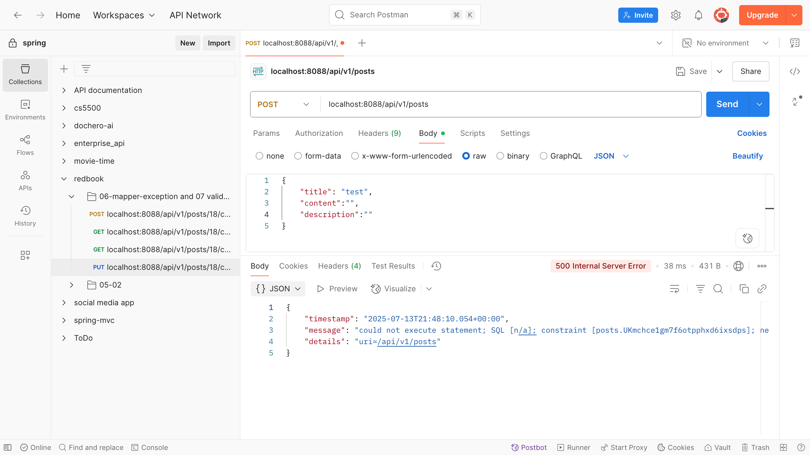
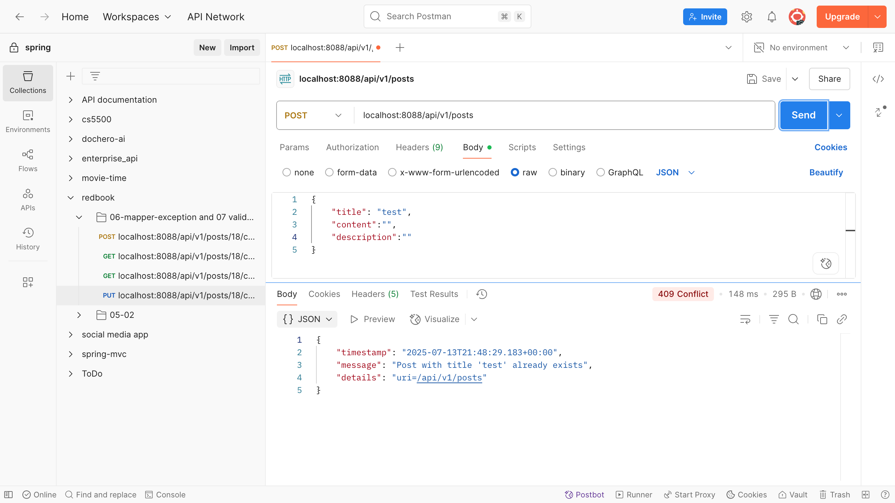

---

## 7. Explain how Controller Advices work, is there any other approach to do same/similar global API exception handling?

- How Controller Advices work?
  - `@ControllerAdvice` is used in Spring to define global logic (usually for exception handling) that applies to all controllers.
  - `@ControllerAdvice` marks a class as a global interceptor for controller logic.
  - Inside this class, we write methods annotated with `@ExceptionHandler(ExceptionType.class)`
  - When any controller throws that exception, Spring routes it to the matching handler method.

- ✅ Alternatives to `@ControllerAdvice` for global API exception handling:

| Approach                                       | Description                                                                                      | Recommendation         |
| ---------------------------------------------- | ------------------------------------------------------------------------------------------------ | ---------------------- |
| **`@ExceptionHandler` inside each controller** | Handle exceptions locally in a specific controller class                                         | 🚫 Too repetitive      |
| **`@ResponseStatus` on custom exceptions**     | Automatically sets status code, but doesn’t support custom response body unless globally handled | ✅ Use for simple cases |
| **`ResponseEntityExceptionHandler` subclass**  | Extend Spring’s default handler and override methods like `handleMethodArgumentNotValid()`       | ✅ Good for validation  |
| **Filter / Interceptor**                       | Low-level control over request/response lifecycle, can be used to catch all unhandled exceptions | ⚠️ More complex        |
| **AOP (`@Around`, `@AfterThrowing`)**          | Can intercept exceptions across methods using aspects                                            | 🔧 Advanced use cases  |

---

## 8. What's the difference between throwing a regular exception and a customized API exception that will be eventually thrown to Controller Advice codes? Please provide screenshots to explain your findings.

| Feature                        | Regular Exception               | Custom API Exception                    |
| ------------------------------ | ------------------------------- | --------------------------------------- |
| Purpose                        | Generic or system-level failure | Business/API-specific failure           |
| HTTP status                    | 500 (unless handled manually)   | Custom (e.g., 404, 400, 409, etc.)      |
| Response body                  | Spring default JSON             | Custom JSON via `@ControllerAdvice`     |
| Meaningful exception name      | ❌ No                            | ✅ Yes (clear, semantic names)           |
| Handled by `@ControllerAdvice` | ❌ Not unless explicitly done    | ✅ Usually matched with specific handler |
| Developer & client friendly    | ❌ Harder to debug/handle        | ✅ Easier to trace and document          |

进一步：Comparison: (Use duplicate title as case)
1. Regular Exception(unchecked error) + without `handleGlobalException` 兜底
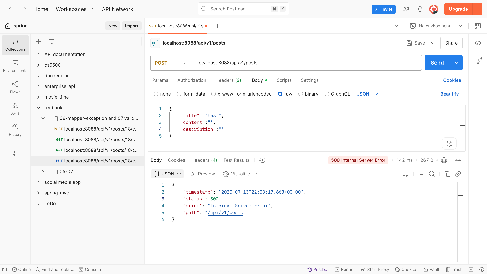

---

2. Regular Exception(unchecked error) + with `handleGlobalException` 兜底
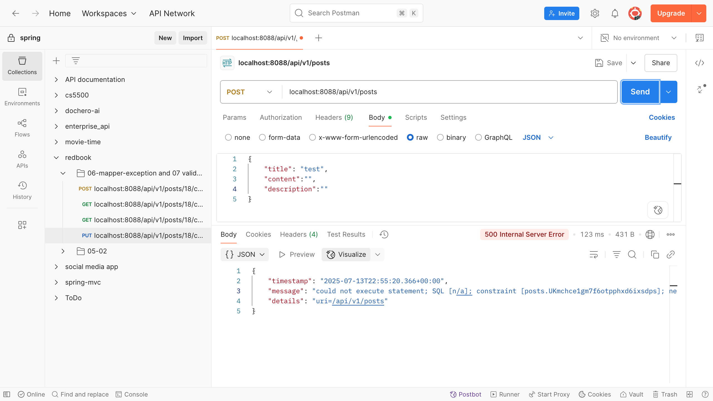

---


3. Custom API Exception(`DuplicateResourceException`) not added in `GlobalExceptionHandler` + without `handleGlobalException` 兜底
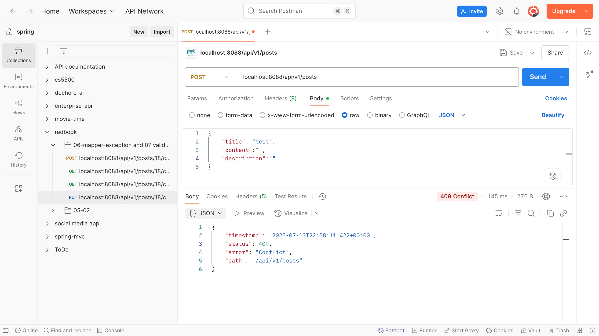

---


4. Custom API Exception(`DuplicateResourceException`) not added in `GlobalExceptionHandler` + with `handleGlobalException`兜底
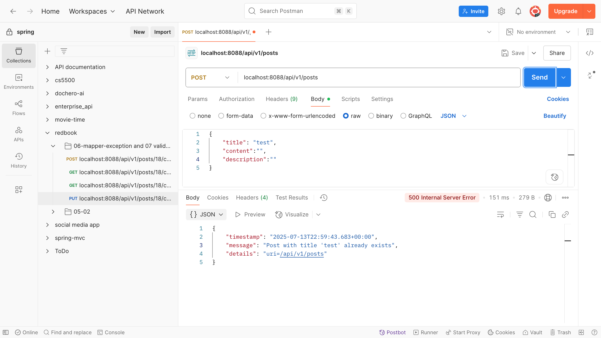

---

5. Custom API Exception(`DuplicateResourceException`) added in `GlobalExceptionHandler` + without `handleGlobalException`兜底


---

6. Custom API Exception(`DuplicateResourceException`) added in `GlobalExceptionHandler` + with `handleGlobalException`兜底


---

| No. | Exception Type                           | In GlobalExceptionHandler | Has Fallback (`Exception.class`) | HTTP Status Returned | Response Body Format    | Notes                                                                  |
| --- | ---------------------------------------- | ------------------------- | -------------------------------- | -------------------- | ----------------------- | ---------------------------------------------------------------------- |
| ①   | Regular Exception                        | ❌ Not handled             | ❌ No fallback                    | **500**              | **Spring default JSON** | Default behavior; Spring doesn't know how to handle it.                |
| ②   | Regular Exception                        | ❌ Not handled             | ✅ Yes fallback                   | **500** or custom    | **Custom JSON**         | `Exception.class` fallback intercepts and returns custom format.       |
| ③   | Custom API Exception (`@ResponseStatus`) | ❌ Not handled             | ❌ No fallback                    | **409**              | **Spring default JSON** | Uses `@ResponseStatus` for HTTP code; default format.                  |
| ④   | Custom API Exception (`@ResponseStatus`) | ❌ Not handled             | ✅ Yes fallback                   | **500**              | **Custom JSON**         | `Exception.class` handler overrides `@ResponseStatus`.                 |
| ⑤   | Custom API Exception                     | ✅ Specific handler exists | ❌ No fallback                    | **409**              | **Custom JSON**         | Best case without fallback: structured response with correct status.   |
| ⑥   | Custom API Exception                     | ✅ Specific handler exists | ✅ Yes fallback                   | **409**              | **Custom JSON**         | Still uses the specific handler; fallback is only used if not matched. |

---

## 9. Write some regular expression to restrict the value of attributes that your Post or Comment can have. You may use https://regex101.com/ to construct and test/validate your regular expression.
- Codebase: https://github.com/WeixinLiu618/springboot-redbook/tree/07_01_validation
- In `CommentDto`
```java
@NotEmpty(message = "Name should not be null or empty")
@Pattern(regexp = "^[A-Za-z ]{2,50}$", message = "Name must contain only letters and spaces, 2–50 characters.")
private String name;
```
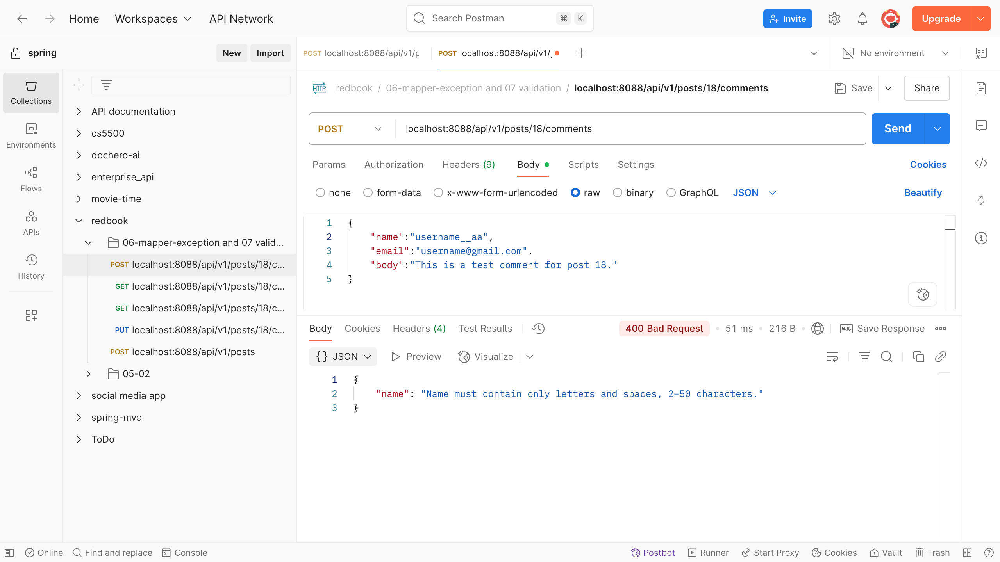

---

- In `PostDto`
```java
@NotEmpty
@Pattern(regexp = "^[\\p{L}0-9 .,'-]{2,100}$", message = "Title must be 2-100 characters and contain only letters, numbers, spaces, or punctuation.")
private String title;
```
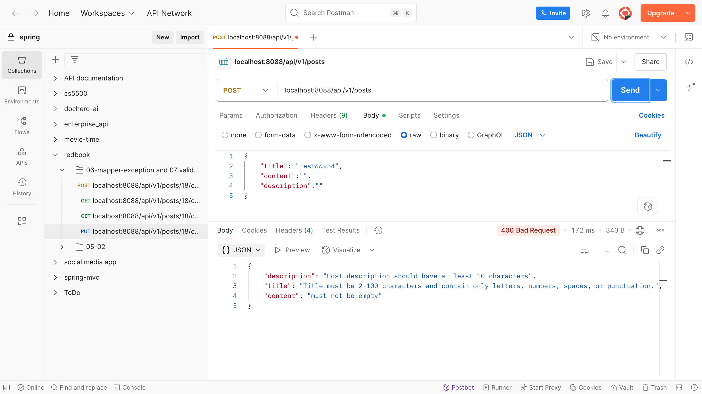

---

## 10. Explain Spring framework fundamental principles. And how can they help build business applications?

1. Dependency Injection (DI)
   - DI means Spring injects objects into your classes, so we don’t need to create them manually.
   - How it helps:
     - Promotes loose coupling
     - Makes testing and refactoring easier

2. Inversion of Control (IoC)
    - IoC is the principle behind DI — it means control of object creation is inverted, i.e., moved from your code to the Spring container.
    - How it helps:
      - Application logic stays focused on what to do
      - Spring handles how objects are created and wired

3. Aspect-Oriented Programming (AOP)
    - AOP lets us separate cross-cutting concerns (e.g., logging, security, transactions) from business logic.
    - How it helps:
      - Keeps code clean
      - No duplication of common functionality

---

## 11. Explain different types of dependency injection, explain their suitable use cases, and why field injection is not recommended in general. Please provide necessary code snippets and screenshots if possible.


1. Constructor Injection ✅ (Recommended)
   - Spring injects dependencies via the class constructor.
   - Use Case:
     - Mandatory dependencies (can’t work without them)
     - Great for immutability (final fields)
     - Testable: we can pass mocks easily in unit tests
     - Works best with @RequiredArgsConstructor (Lombok)
     
```java
@Service
public class PostServiceImpl implements PostService {

    private final PostRepository postRepository;

    // Spring automatically injects PostRepository here
    @Autowired
    public PostServiceImpl(PostRepository postRepository) {
        this.postRepository = postRepository;
    }
}
```
2. Setter Injection
   - Spring injects dependencies via public setter methods.
   - Use Case:
     - Optional dependencies (we can use @Autowired`(required = false)`)
     - When object has reasonable defaults

```java
@Service
public class PostServiceImpl implements PostService {
    private PostRepository postRepository;

    @Autowired
    public void setPostRepository(PostRepository postRepository) {
        this.postRepository = postRepository;
    }
}
```

3. Field Injection ⚠️ (Not Recommended)
   - Spring injects dependencies directly into fields using reflection.

```java
@Service
public class PostServiceImpl implements PostService {

    @Autowired
    private PostRepository postRepository;
}

```
Summary:

| Type        | Recommended? | Use Case                   | Notes                                             |
| ----------- | ------------ | -------------------------- | ------------------------------------------------- |
| Constructor | ✅ Yes        | Required dependencies      | Preferred. Test-friendly, immutable.              |
| Setter      | ⚠️ Sometimes | Optional dependencies      | Use when dependency is not mandatory.             |
| Field       | ❌ No         | Quick & dirty, discouraged | Hard to test, bad design. Use only in rare cases. |


❌ Why Field Injection is Not Recommended:

| Issue                        | Explanation                                                              |
| ---------------------------- |--------------------------------------------------------------------------|
| ❌ Hard to Test               | Can't inject mocks without reflection or frameworks                      |
| ❌ Not Visible in Constructor | Makes dependencies invisible; hard to understand object requirements     |
| ❌ Breaks Immutability        | Field must be `non-final`                                                |
| ❌ Less Flexible              | Can't use constructor-based tools like Lombok `@RequiredArgsConstructor` |

---

## 12. Explain different types of application context in Spring framework, with screenshots. You may take https://github.com/CTYue/springIOC for reference.


### 1\. **ClassPathXmlApplicationContext**
-   Loads configuration from an **XML file on the classpath** (e.g., `beans.xml`)
-   🟡 Used in legacy Spring applications
-   ❌ Not recommended for modern development
-   ❌ Does not support annotations natively
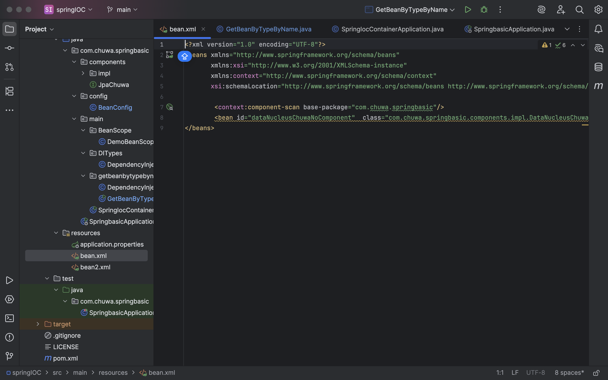

### 2\. **AnnotationConfigApplicationContext**
-   Loads configuration from **Java classes annotated with** `@Configuration`, `@Component`, etc.
-   ✅ Preferred in **modern Java-based Spring applications**
-   Supports component scanning (`@ComponentScan`)
-   Used heavily in Spring Boot apps
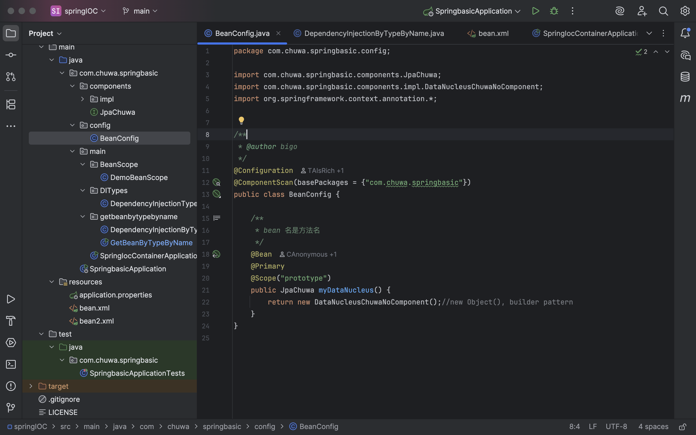

---

- 2 ways of building container
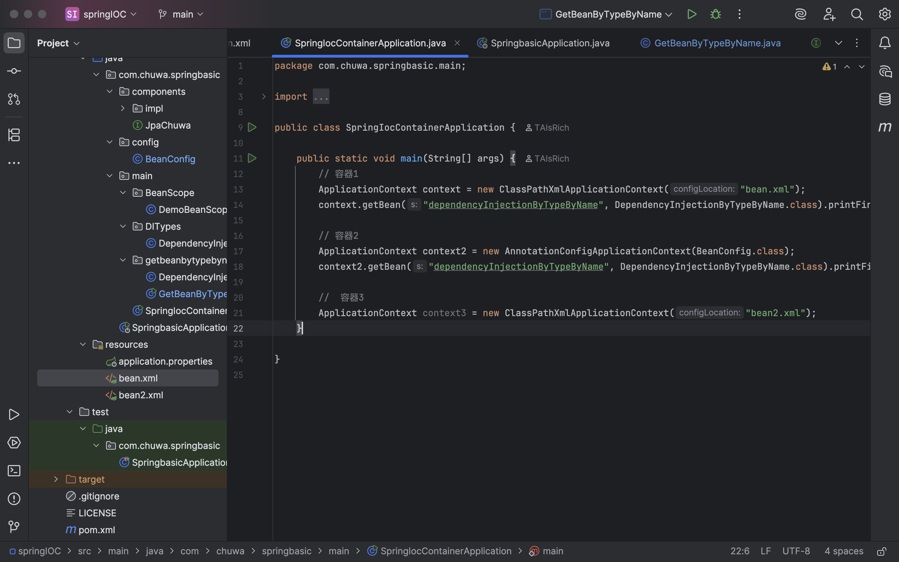


---

## 13. Compare @Component and @Bean and in which scenario they should be used.

| Feature         | `@Component`                               | `@Bean`                                               |
| --------------- | ------------------------------------------ | ----------------------------------------------------- |
| Type            | Class-level annotation                     | Method-level annotation inside `@Configuration` class |
| Auto-detected?  | ✅ Yes (via `@ComponentScan`)               | ❌ No — explicitly declared                            |
| Used for        | Application classes (services, DAOs, etc.) | Third-party classes or manual configuration           |
| Scope control   | Controlled via `@Scope`                    | Also supports `@Scope`                                |
| Lifecycle hooks | Supports `@PostConstruct`, `@PreDestroy`   | Same support                                          |


### When to Use:
- ✅ Use `@Component` when:
  - You own the class (i.e., it's your own source code)
  - You want Spring to auto-discover and register it
  - Common for: 
    - `@Service`
    - `@Repository`
    - `@Controller`
    - Plain components like `@Component("myBean")`

```java
@Component
public class MyService {
    public void doWork() { ... }
}

```

- ✅ Use `@Bean` when:
  - The bean is from a third-party library (you cannot annotate it)
  - You need custom logic to create the bean
  - You want fine control over initialization

```java
@Configuration
public class AppConfig {

    @Bean
    public ModelMapper modelMapper() {
        return new ModelMapper();
    }
}

```

Summary:

| Use `@Component`                     | Use `@Bean`                         |
| ------------------------------------ | ----------------------------------- |
| For your own classes                 | For third-party classes             |
| When using component scanning        | When manually declaring bean logic  |
| When no complex init logic is needed | When bean setup needs customization |


---

## 14. Explain Spring bean scopes and how to pick the correct bean scope.

| Scope         | Description                                                        | Typical Use Case                                         |
| ------------- | ------------------------------------------------------------------ | -------------------------------------------------------- |
| `singleton`   | A **single instance** is created per Spring container (default)    | Shared services like `UserService`, `EmailSender`        |
| `prototype`   | A **new instance** is created **every time** the bean is requested | Stateful or temporary objects (e.g., form backing beans) |
| `request`     | A **new instance per HTTP request** (web only)                     | Request-scoped controllers or DTOs in Spring MVC         |
| `session`     | A **new instance per HTTP session** (web only)                     | Per-user session objects like `ShoppingCart`             |
| `application` | A **single instance per web application**                          | Application-wide caches or resources                     |
| `websocket`   | A **new instance per WebSocket session**                           | WebSocket messaging state                                |

#### ✅ How to Declare Bean Scope
1. **Using `@Scope` with `@Component`**
```java
@Component
@Scope("prototype")
public class NotificationService {
    ...
}
```
2. **Using `@Bean` in `@Configuration`**
```java
@Bean
@Scope("request")
public MyRequestBean myRequestBean() {
    return new MyRequestBean();
}
```

---
#### 🧠 How to Pick the Right Scope

- ✅ Use `singleton` (default) when:
  - The bean is **stateless** and can be shared across the app
  - You want **one instance for performance & consistency**
  - Examples: Services, Repositories, Utility classes
- ✅ Use `prototype` when:
  - The bean **holds state** and should not be reused
  - You need a **new object each time** it’s injected
  - Examples: Temporary forms, objects with runtime configs
- ✅ Use `request` when:
  - You’re building a **web app**
  - You need a **new instance per HTTP request**
  - Examples: Request-specific metadata, form data
- ✅ Use `session` when:
  - You want to **preserve state for a user**
  - Examples: Shopping cart, user preferences
- ✅ Use `application` when:
  - You need a bean tied to the **lifecycle of the ServletContext**
  - Examples: Shared caches, static configuration

#### Summary

| Scope       | Thread-Safe?       | Shared?      | Good For                      |
| ----------- | ------------------ | ------------ | ----------------------------- |
| Singleton   | ❌ (you manage it)  | ✅ Shared     | Stateless services            |
| Prototype   | ✅ (new every time) | ❌ Not Shared | Stateful or per-use objects   |
| Request     | ✅ (per HTTP req)   | ❌ Not Shared | Web request data, controllers |
| Session     | ✅ (per user)       | ❌ Not Shared | Shopping cart, login session  |
| Application | ❌ (global)         | ✅ Shared     | Shared config, global cache   |

---

## 15. Explain the difference between bean id and bean class.
- ✅ Bean ID
  - A unique identifier that you assign to a bean within the Spring container.
  - Used when referencing the bean (especially in XML or programmatically).
  - Optional in annotations (Spring generates a default name if omitted).

- ✅ Bean Class
  - Refers to the Java class of the object you want Spring to manage.
  - Spring uses this class to create the actual bean (using new, reflection, or a factory).
  - Must be a fully-qualified class name if using XML, or just a type reference in annotations.

```xml
<bean id="emailService" class="com.example.EmailService" />
```
-   `id="emailService"` → the **bean ID**
-   `class="com.example.EmailService"` → the **bean class**

- Annotation Example:
```java
@Component("emailService")
public class EmailService { ... }
```

Or, without ID:

```java
@Component  // default ID: emailService (from class name)
public class EmailService { ... }
```

```java
EmailService service = context.getBean("emailService", EmailService.class); // uses bean ID
```

#### Summary:
| Concept    | Bean ID                                  | Bean Class                        |
| ---------- | ---------------------------------------- | --------------------------------- |
| What it is | Identifier for referencing the bean      | The actual Java class of the bean |
| Use        | Lookup or inject specific bean           | To instantiate the bean           |
| Required?  | Optional in annotations, required in XML | Always required                   |

___

## 16. Explain that when a bean has multiple alternative implementations, how will Spring decide which bean implementation to inject/autowire?

- When a bean has multiple alternative implementations, Spring will try to autowire by type — but if it finds more than one candidate, it gets confused unless you tell it which one to pick.

#### Problem Scenario
- Suppose we have this interface:
```java
public interface NotificationService {
    void send(String message);
}

```
- And two implementations:
```java
@Component
public class EmailNotificationService implements NotificationService {
    public void send(String message) { ... }
}

@Component
public class SMSNotificationService implements NotificationService {
    public void send(String message) { ... }
}

```
- Then in the service:
```java
@Autowired
private NotificationService notificationService;  // ❌ Error: No unique bean

```

- Spring will throw:
```java
No qualifying bean of type 'NotificationService' available: expected single matching bean but found 2
```

- ✅ Ways to Resolve Multiple Beans

1. Use `@Primary` 
 - Mark one bean as the default:
```java
@Component
@Primary
public class EmailNotificationService implements NotificationService { ... }

```

2. Use `@Qualifier` 
 - Specify the exact bean by name:
 - Spring matches the name to the bean ID, usually derived from the class name.

```java
@Autowired
@Qualifier("smsNotificationService")
private NotificationService notificationService;

```

3. Use `@Bean` methods with names (Java Config), Then use `@Qualifier("emailService")` or `@Primary` just like before.
 

```java
@Configuration
public class AppConfig {

    @Bean
    @Primary  // Optional: sets this one as default
    public NotificationService emailService() {
        return new EmailNotificationService();
    }

    @Bean
    public NotificationService smsService() {
        return new SMSNotificationService();
    }
}

```

#### Summary
| Strategy        | Annotation               | Purpose                                |
| --------------- | ------------------------ | -------------------------------------- |
| Default choice  | `@Primary`               | Mark one bean as the preferred default |
| Specific choice | `@Qualifier("beanName")` | Tell Spring exactly which to inject    |
| Manual config   | `@Bean` methods          | Define and name beans explicitly       |
