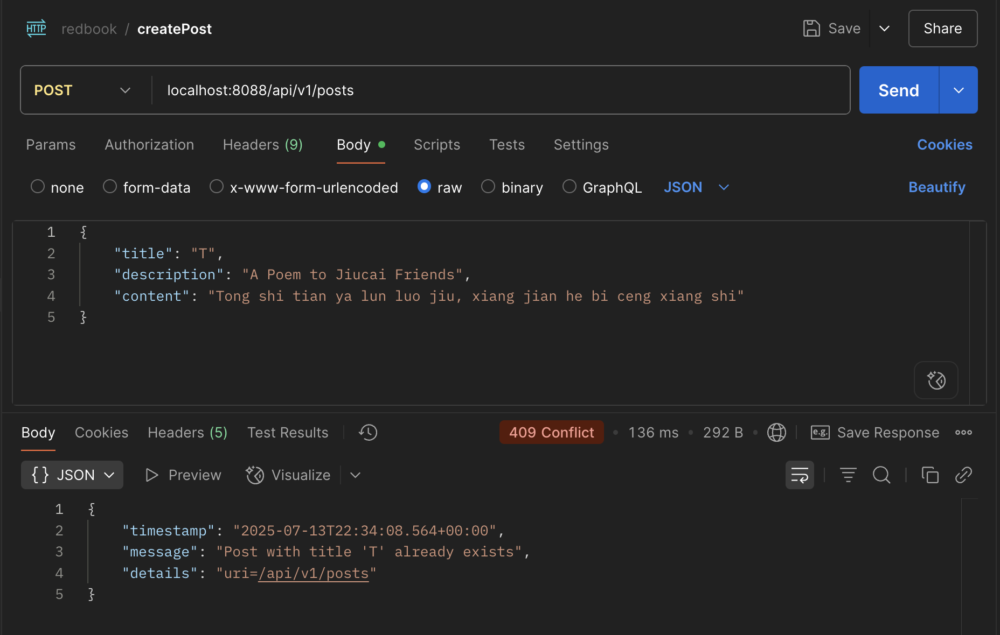
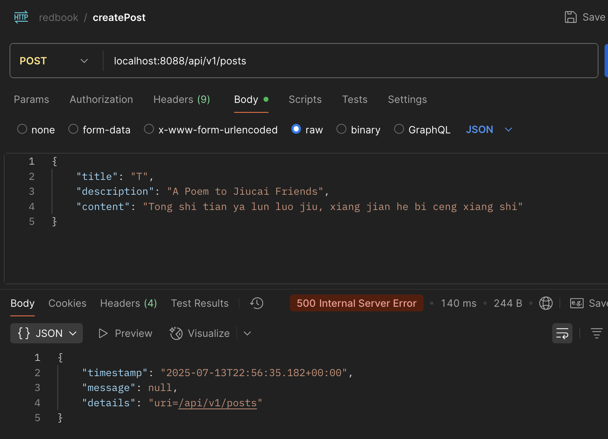

For all following coding questions, please provide code snippets in your markdown submission file, AND take  screenshots, AND submit an executable Spring project which contains your code (this project can be a clone of  Springboot-Redbook, as long as it has your own code.).

**Submitted Repo**: https://github.com/ethannchen/springboot-redbook/tree/06_mapper-exception
### 1. Add newly learned annotations to your previous cheatsheet, add explainations for these annotations.  
see p1_annotation.md

### 2. Walkthrough sample codes under https://github.com/CTYue/springboot-redbook/commits/06_mapper-ex  ception, you are supposed to bring up the application on your local.  
done

### 3. Explain why do we need model mappers in Spring, and in what scenarios we need it.    
ModelMapper is used in Spring to simplify the mapping between DTOs and entities. It's needed when you want to separate your domain model from external data representations (e.g., API payloads) and avoid manual field-by-field mapping. Scenarios include REST APIs, where DTOs are used to control exposed data and maintain encapsulation, or when mapping complex nested structures between layers (manually mapping could be tedious and error-prone).


### 4. Provide 3 examples in which modelmapper will NOT map successfully, explain why.    
1. Mismatched Field Names:
If source and destination classes have different property names (e.g., firstName vs givenName), ModelMapper won't map them unless explicitly configured, as it relies on name matching by default.

2. Nested Objects Without Matching Structure:
If the source has a nested object like address.street but the destination expects a flat structure like street, ModelMapper won’t map it unless custom mappings are defined.

3. Collections with Incompatible Generic Types:
Mapping a `List<String>` to a `List<Integer>` will fail, as ModelMapper cannot convert incompatible generic types without a converter.

### 5. Explain how modelmapper cast different data types between source object and target class.  
ModelMapper uses a **flexible** type conversion mechanism that relies on its internal Converter and Provider interfaces. When mapping between source and target properties with different types, it applies built-in converters or user-defined ones to transform values appropriately. If no converter is found, it attempts implicit type conversion using reflection and the Java Bean property introspection API.

```java
//using custom converter with ModelMapper
ModelMapper modelMapper = new ModelMapper();

// Custom converter: String to Integer
Converter<String, Integer> stringToInteger = ctx -> ctx.getSource() == null ? null : Integer.valueOf(ctx.getSource());

// Register the converter
modelMapper.addConverter(stringToInteger);

// Example mapping
class Source {
    String age;
}

class Target {
    Integer age;
}

Source source = new Source();
source.age = "25";

Target target = modelMapper.map(source, Target.class);
System.out.println(target.age); // Outputs: 25
```


### 6. Add your own API exceptions so that when something wrong happens in service layer, your rest API will  return your customized response and status code.  
```java
// in DuplicateResourceException
package com.chuwa.redbook.exception;

import org.springframework.http.HttpStatus;
import org.springframework.web.bind.annotation.ResponseStatus;

/**
 * Custom exception for handling duplicate resource scenarios
 * This exception is thrown when trying to create a resource that already exists

 */
@ResponseStatus(value = HttpStatus.CONFLICT)
public class DuplicateResourceException extends RuntimeException {

    private String resourceName;
    private String fieldName;
    private Object fieldValue;
    private HttpStatus httpStatus;

    /**
     * Constructor for duplicate resource exception
     *
     * @param resourceName the name of the resource (e.g., "Post", "Comment")
     * @param fieldName the field that caused the duplication (e.g., "title", "email")
     * @param fieldValue the value that already exists
     */
    public DuplicateResourceException(String resourceName, String fieldName, Object fieldValue) {
        // Example: "Post with title 'Spring Boot Guide' already exists"
        super(String.format("%s with %s '%s' already exists", resourceName, fieldName, fieldValue));
        this.resourceName = resourceName;
        this.fieldName = fieldName;
        this.fieldValue = fieldValue;
        this.httpStatus = HttpStatus.CONFLICT;
    }

    /**
     * Constructor with custom message
     *
     * @param message custom error message
     */
    public DuplicateResourceException(String message) {
        super(message);
        this.httpStatus = HttpStatus.CONFLICT;
    }

    /**
     * Constructor with custom message and HTTP status
     *
     * @param message custom error message
     * @param httpStatus HTTP status code
     */
    public DuplicateResourceException(String message, HttpStatus httpStatus) {
        super(message);
        this.httpStatus = httpStatus;
    }

    // Getters and setters
    ...
}
```
```java
//in posPostServiceImpl
@Override
    public PostDto createPost(PostDto postDto) {
        // convert DTO to Entity
        Post post = modelMapper.map(postDto, Post.class);

        try {
            // 调用Dao的save 方法，将entity的数据存储到数据库MySQL
            // save()会返回存储在数据库中的数据
            Post savedPost = postRepository.save(post);

            // 将save() 返回的数据转换成controller/前端 需要的数据，然后return给controller
            return modelMapper.map(savedPost, PostDto.class);

        } catch (DataIntegrityViolationException e) {
            // Handle database constraint violations (e.g., unique constraint on title)
            throw new DuplicateResourceException("Post", "title", postDto.getTitle());
        }
    }
```



### 7. Explain how ControllerAdvices work, is there any other approach to do same/similar global API exception  handling?  
`@ControllerAdvice` in Spring Boot is a specialization of `@Component` that allows centralized exception handling across all `@Controller` classes. It can catch exceptions globally using `@ExceptionHandler` methods, making the code cleaner and more maintainable.

**Alternative approaches: `@ExceptionHandler` in individual controllers** 
You can place @ExceptionHandler inside a specific controller to handle exceptions only for that controller.
```java
@RestController
@RequestMapping("/api/users")
public class UserController {

    @GetMapping("/{id}")
    public User getUser(@PathVariable Long id) {
        throw new ResourceNotFoundException("User not found");
    }

    @ExceptionHandler(ResourceNotFoundException.class)
    public ResponseEntity<ErrorResponse> handleUserNotFound(ResourceNotFoundException ex) {
        ErrorResponse response = new ErrorResponse(ex.getMessage(), "User lookup failed", 404);
        return ResponseEntity.status(HttpStatus.NOT_FOUND).body(response);
    }
}
```
**Alternative approaches: ResponseEntityExceptionHandler** 
Spring provides ResponseEntityExceptionHandler for more fine-grained control over Spring MVC exceptions like validation errors.
```java
@RestControllerAdvice
public class CustomExceptionHandler extends ResponseEntityExceptionHandler {

    @Override
    protected ResponseEntity<Object> handleMethodArgumentNotValid(
            MethodArgumentNotValidException ex,
            HttpHeaders headers,
            HttpStatus status,
            WebRequest request) {

        String errors = ex.getBindingResult().getFieldErrors().stream()
            .map(error -> error.getField() + ": " + error.getDefaultMessage())
            .collect(Collectors.joining(", "));

        ErrorResponse response = new ErrorResponse(errors, "Validation failed", status.value());
        return new ResponseEntity<>(response, status);
    }
}
```


### 8. What's the difference between throwing a regular exception and a customized API exception that will be  eventually thrown to Controller Advice codes? Please provide screenshots to explain your findings.  
Throwing a regular exception provides generic error handling, often lacking context. A customized API exception allows you to encapsulate specific business logic, error codes, and messages, enabling `@ControllerAdvice` to handle and map them to consistent HTTP responses, improving API clarity and maintainability.
| Aspect | Regular Exception | Custom API Exception |
|--------|------------------|---------------------|
| **HTTP Status** | Always 500 Internal Server Error | Proper status (404, 409, 400, etc.) |
| **Error Message** | Generic, unhelpful | Structured, meaningful |
| **Client Experience** | Poor, all errors look the same | Clear, actionable error information |
| **Debugging** | Difficult to trace error types | Easy to identify specific issues |
| **API Design** | Violates REST principles | Follows REST best practices |
- with custom exception:
    
- with regular exception (RuntimeException)
 


### 9. Write some regular expression to restrict the value of attributes that your Post or Comment can have. You  may use https://regex101.com/ to construct and test/validate your regular expression.  
```java
    @NotEmpty
    @Size(min = 2, message = "Post title should have at least 2 characters")
    @Pattern(regexp = "^[a-zA-Z0-9][a-zA-Z0-9\\s.,!?\\-:;]*[a-zA-Z0-9]$|^[a-zA-Z0-9]$",
            message = "Title must start and end with alphanumeric characters, contain only letters, numbers, spaces, " +
                    "and basic punctuation")
    // - Contains only letters, numbers, spaces, and common punctuation (.,!?-:;)
    // - Must start with a letter or number
    // - Cannot have consecutive spaces
    // - Length between 2-100 characters (handled by @Size, but regex ensures quality)
    private String title;


    @NotEmpty(message = "Email should not be null or empty")
    @Email
    @Pattern(regexp = "^[a-zA-Z0-9]([a-zA-Z0-9._-]*[a-zA-Z0-9])?@[a-zA-Z0-9]([a-zA-Z0-9-]*[a-zA-Z0-9])?\\.[a-zA-Z]{2,}$",
            message = "Email must be in valid format (e.g., user@domain.com)")
    // - No special characters except . - _ in local part
    // - Domain must have at least one dot
    // - Domain parts must be 2-63 characters each
    private String email;
```


### 10. Explain Spring framework fundamental principles. And how can they help build business applications?  
Spring Framework is built on key principles like Dependency Injection (DI), Aspect-Oriented Programming (AOP), and modularity via configuration (@Configuration). DI promotes loose coupling and testability by injecting dependencies rather than hardcoding them. AOP separates cross-cutting concerns like logging or security from business logic. These principles enable clean, maintainable, and scalable applications.

For business apps, Spring offers powerful abstractions (like Spring Data, Spring MVC, and Spring Boot) to streamline persistence, RESTful APIs, and rapid deployment—accelerating development while keeping code modular and robust.

### 11. Explain different types of dependency injection, explain their suitable use cases, and why field injection  is not recommended in general. Please provide necessary code snippets and screenshots if possible.  

1. **Constructor Injection**
   *Recommended for mandatory dependencies. Promotes immutability and testability.*

   ```java
    @Component
    public class UserService {
        private final UserRepository userRepository;

        @Autowired
        public UserService(UserRepository userRepository) {
            this.userRepository = userRepository;
        }

        // business methods
    }
   ```

2. **Setter Injection**
   *Used for optional or changeable dependencies.*
   @Autowired(required = false), if Repository bean is not available in the context, Spring will skip the injection without throwing an error.

   ```java
    @Component
    public class UserService {
        private UserRepository userRepository;

        @Autowired
        public void setUserRepository(UserRepository userRepository) {
            this.userRepository = userRepository;
        }

        // business methods
    }
   ```

3. **Field Injection**
   *Not recommended for general use due to testability and encapsulation issues.*

   ```java
   @Component
    public class UserService {
        @Autowired
        private UserRepository userRepository;

        // business methods
    }
   ```
**Why Field Injection is not recommended:**
- Lack of immutability: Fields can’t be final, leading to mutable state.

- Difficult to test: Makes unit testing harder because dependencies are private and not exposed via constructor/setters.

- Hidden dependencies: It’s not clear what the dependencies are just by looking at the constructor or setter.


### 12. Explain different types of application context in Spring framework, with screenshots. You may take https://github.com/CTYue/springIOC for reference.  

1. **ClassPathXmlApplicationContext**
   Loads context definitions from an XML file located in the classpath.
   Use case: Traditional XML-based configuration when XML files are bundled inside the application jar or classpath.

2. **FileSystemXmlApplicationContext**
   Loads context definitions from XML files in the file system, outside of the classpath.
   Use case: When configuration files are externalized and need to be loaded from any file system location.

3. **AnnotationConfigApplicationContext**
   Used for Java-based configuration, loading bean definitions from annotated classes (`@Configuration`).
   Use case: Modern Spring applications using Java config and annotations instead of XML.

4. **WebApplicationContext**
   Specialized ApplicationContext for web applications, extending the regular ApplicationContext to provide web-specific features like access to ServletContext.
   Common implementations include `XmlWebApplicationContext` and `AnnotationConfigWebApplicationContext`.
   Use case: Spring MVC and other web applications.


### 13. Compare @Component and @Bean and in which scenario they should be used.  
@Component is a class-level stereotype annotation used for automatic detection and registration of beans via classpath scanning. It marks a class as a Spring-managed component, typically for service, repository, or controller classes.

@Bean is a method-level annotation used within @Configuration classes to explicitly declare a single bean instance. It is used when you need fine-grained control over the bean creation process or when integrating third-party classes that you cannot annotate with @Component.


### 14. Explain Spring bean scopes and how to pick the correct bean scope.  


1. **Singleton (default)**: Only one shared instance of the bean is created per Spring IoC container. This is suitable for stateless beans or beans where a single shared instance is sufficient.

2. **Prototype**: A new instance is created every time the bean is requested from the container. Use this for stateful beans or when you need independent instances.

3. **Request**: Scoped to an HTTP request — a new bean instance is created for each HTTP request. Relevant in web applications for request-scoped state.

4. **Session**: Scoped to an HTTP session — one bean instance per user session. Used when maintaining user-specific state across multiple requests.

5. **Application**: Scoped to a ServletContext — one bean per web application lifecycle.

6. **WebSocket**: Scoped to a WebSocket lifecycle.


### 15. Explain the difference between bean id and bean class.  
Bean id is the unique identifier or name assigned to a bean in the Spring container. It’s how you reference and retrieve that specific bean within the application context.

Bean class refers to the fully qualified class name that Spring uses to instantiate the bean. It defines the actual implementation type of the bean.

### 16. Explain that when a bean has multiple alternative implementations, how will Spring decide which bean  implementation to inject/autowire?


Suppose you have an interface `PaymentService` with two implementations:

```java
public interface PaymentService {
    void pay();
}

@Component
public class PaypalPaymentService implements PaymentService {
    @Override
    public void pay() {
        System.out.println("Paying with PayPal");
    }
}

@Component
public class StripePaymentService implements PaymentService {
    @Override
    public void pay() {
        System.out.println("Paying with Stripe");
    }
}
```


#### 1. Using `@Primary`
If one of the beans is marked with `@Primary`, Spring will prefer that bean for injection.

Mark one implementation as primary:

```java
@Component
@Primary
public class PaypalPaymentService implements PaymentService {
    // implementation
}
```

Then when you autowire without qualifiers:

```java
@Autowired
private PaymentService paymentService;
```

Spring injects the `PaypalPaymentService` because it is marked `@Primary`.

#### 2. Using `@Qualifier`
If multiple beans exist without a primary, Spring looks for a matching `@Qualifier` annotation on the injection point to determine the specific bean to inject.

If you want to specify which bean to inject explicitly:

```java
@Component("paypalService")
public class PaypalPaymentService implements PaymentService {
    // implementation
}

@Component("stripeService")
public class StripePaymentService implements PaymentService {
    // implementation
}
```

Inject with qualifier:

```java
@Autowired
@Qualifier("stripeService")
private PaymentService paymentService;
```

Spring injects the `StripePaymentService`.

#### 3. By Bean Name (without `@Primary` or `@Qualifier`)
If no `@Primary` or `@Qualifier` is specified, Spring tries to match the bean name with the field or parameter name being injected.

If you have:

```java
@Autowired
private PaymentService paypalPaymentService;
```

Spring will inject the bean named `paypalPaymentService` (if exists), matching the field name.


#### 4. No Disambiguation (Results in Exception)
If ambiguity remains (more than one candidate and no clear indication), Spring throws a `NoUniqueBeanDefinitionException`.

If you autowire:

```java
@Autowired
private PaymentService paymentService;
```

and neither `@Primary` nor `@Qualifier` is used, and multiple beans implement the interface, Spring will throw:

```
NoUniqueBeanDefinitionException: No qualifying bean of type 'PaymentService' available: expected single matching bean but found 2
```
