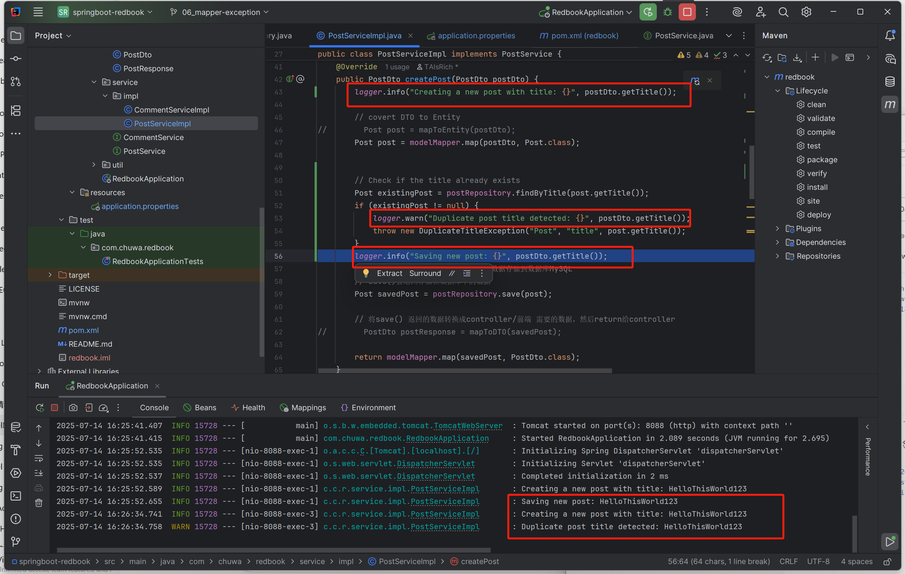
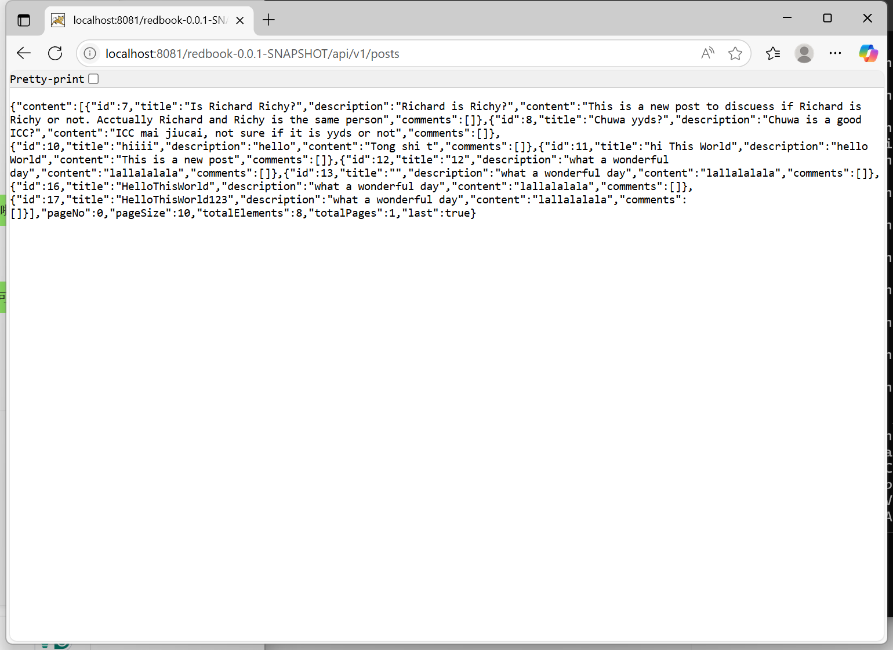

## 1. statements:
```
import org.slf4j.Logger;
import org.slf4j.LoggerFactory;

public class PostServiceImpl {

    private static final Logger logger = LoggerFactory.getLogger(PostServiceImpl.class);

    public PostDto createPost(PostDto postDto) {
        logger.info("Creating a new post with title: {}", postDto.getTitle());
        // other code...
    }
}

```
## 2. set up levels

```
logging.level.root=info
logging.level.com.example.blogapi=debug

```
## Screenshots

## 4.

