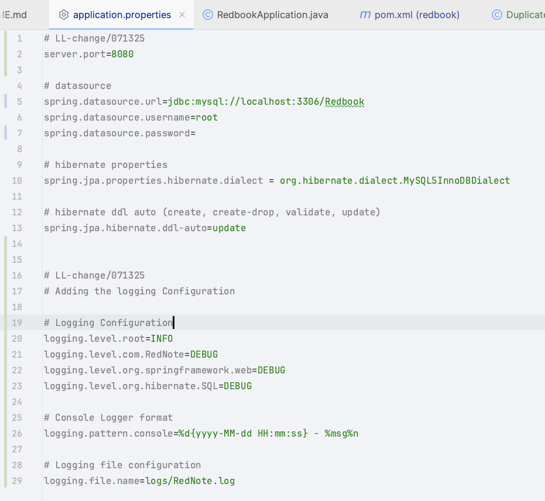
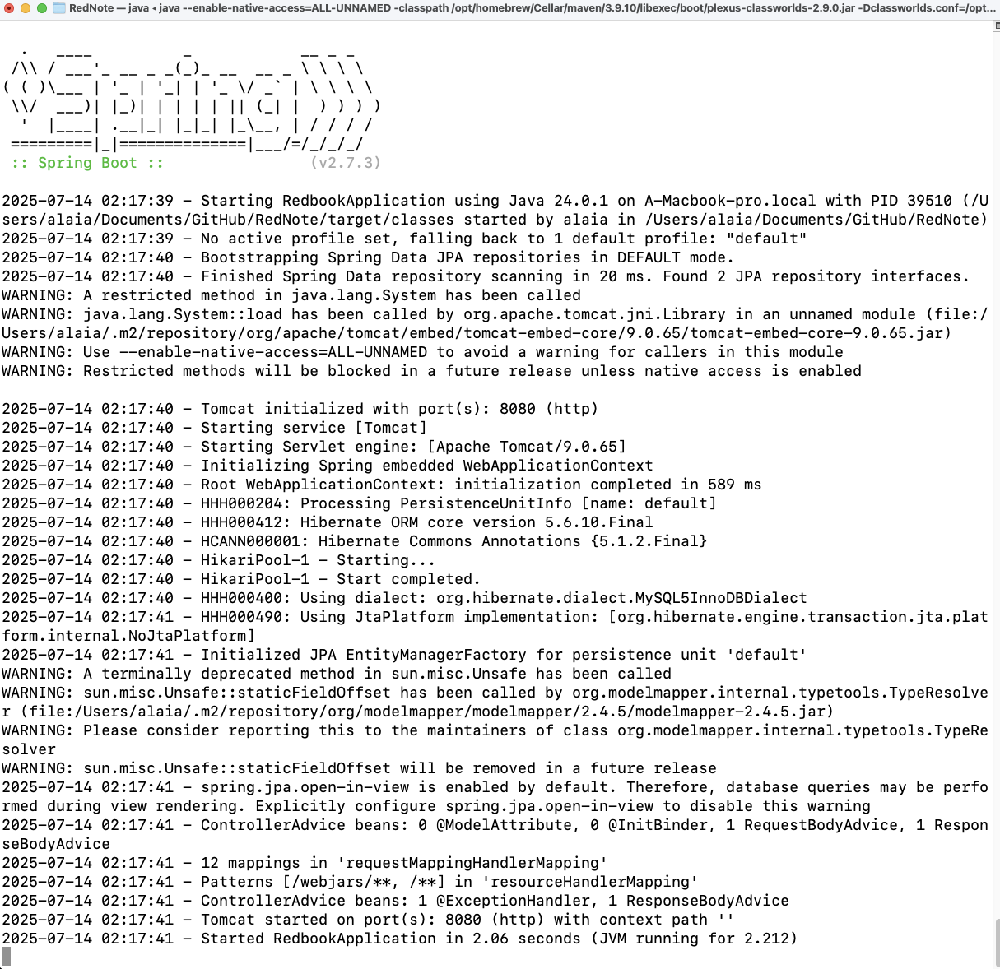
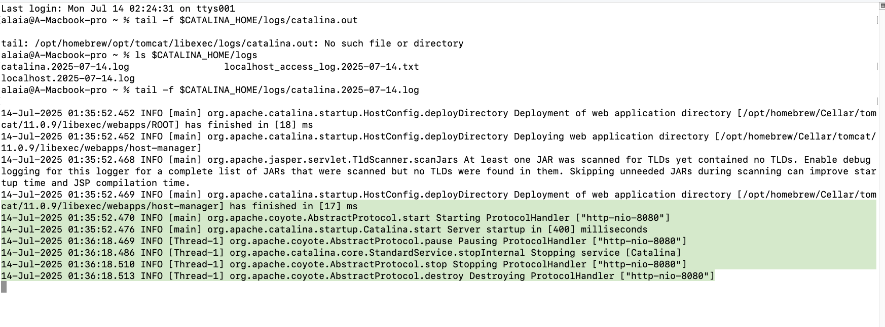

In your last assignment, you have worked on https://github.com/CTYue/springboot-redbook/commits/06_mapper-exception

On top of that, please:

1. Add proper logging statements for this project, please use slf4j as your logger.
2. Set up proper logging level.
3. Take screenshots.
4. Instead of using embedded tomcat, set up an external tomcat server to bring up above application. Take screenshots.

##### Answer:
Check the coding for actual code changes.  
Overall, I made changes in :

(1) pom.xml - Adding logging dependency:SLF4J and Logback  
(2) PostController.java - Adding logging and importing org.slf4j.Logger; and import org.slf4j.LoggerFactory;
```java
    public ResponseEntity<PostDto> createPost(@RequestBody PostDto postDto) {
        logger.info("Creating new post with title: {}", postDto.getTitle());
        PostDto postResponse = postService.createPost(postDto);
        return new ResponseEntity<>(postResponse, HttpStatus.CREATED);
    }
```
(3) made changes in application.properties. Adding logging configuration details  


(4) Using Tomcat to bring the application up.
  

4-1: mvn spring-boot:run in terminal  
4-2: post request in a new terminal window  

curl -X POST http://localhost:8080/api/v1/posts \
-H "Content-Type: application/json" \
-d '{
"title": "Test Post",
"description": "This is a test post",
"content": "Testing logger functionality"
}'

(5) Checking the anticipated logging info.  
Just as what I expected! :)  
    
