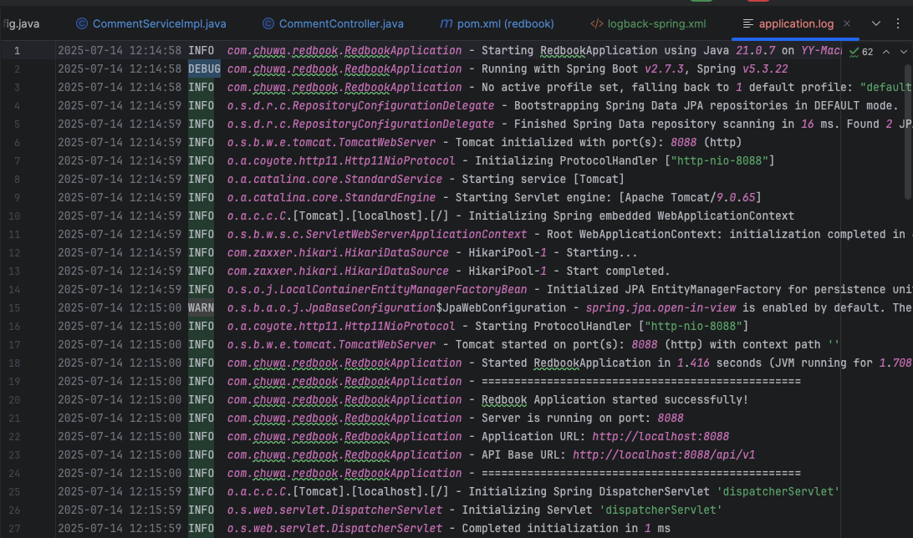
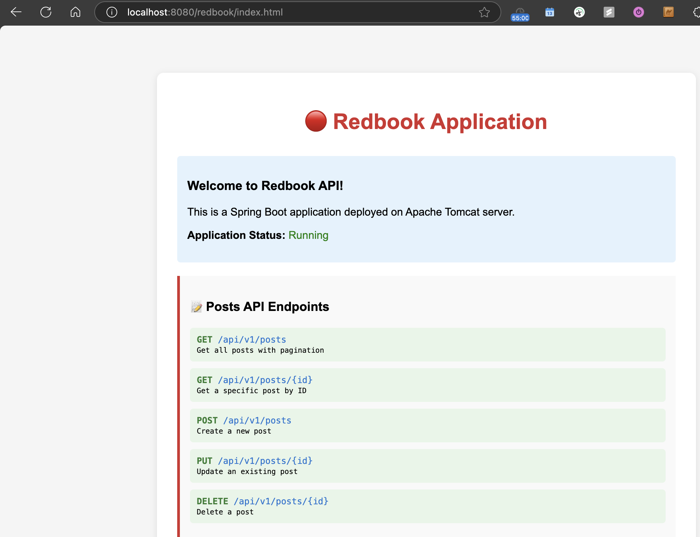

In your last assignment, you have worked on https://github.com/CTYue/springboot-redbook/commits/06_mapper-exception,  on top of that, please  

### 1. Add proper logging statements for this project, please use slf4j as your logger.  Set up proper logging level.  Take screenshots 
 

### 4. Instead of using embedded tomcat, setup an external tomcat server to bring up above application. Take  screenshots.
 

submitted repo: https://github.com/ethannchen/springboot-redbook/tree/06_mapper-exception
